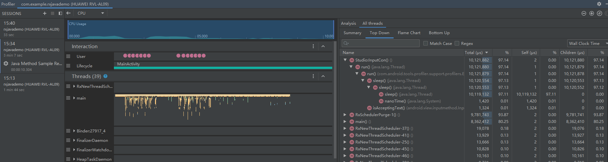
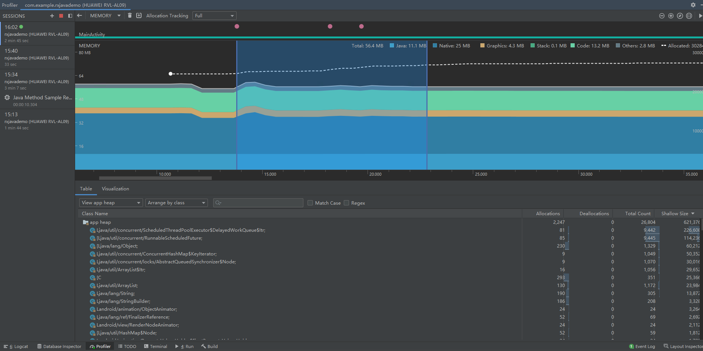
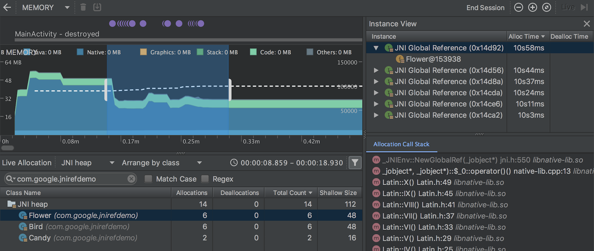

## Profiler 录制

- 打开方式：View > Tool Windows > Profiler 或 工具栏Profiler

## CPU Profiler

由Profiler录制点击可以进入

CPU Profiler 的默认视图包括以下时间轴：

1. **事件时间轴**：显示应用中的 Activity 在其生命周期内不断转换而经历各种不同状态的过程，并指示用户与设备的交互，包括屏幕旋转事件。如需了解如何在搭载 Android 7.1（API 级别 25）及更低版本的设备上启用事件时间轴，请参阅[启用高级分析](https://developer.android.com/studio/profile/android-profiler#advanced-profiling)。

2. **CPU 时间轴**：显示应用的实时 CPU 使用率（以占总可用 CPU 时间的百分比表示）以及应用当前使用的线程总数。 此时间轴还会显示其他进程（如系统进程或其他应用）的 CPU 使用率，以便您可以将其与您应用的 CPU 使用率进行对比。您可以通过沿时间轴的横轴方向移动鼠标来检查历史 CPU 使用率数据。

3. **线程活动时间轴**：列出属于应用进程的每个线程，并使用下面列出的颜色在时间轴上指示它们的活动。记录跟踪数据后，您可以从此时间轴上选择一个线程，以在跟踪数据窗格中检查其数据。

   - **绿色**：表示线程处于活动状态或准备使用 CPU。也就是说，线程处于正在运行或可运行状态。
   - **黄色**：表示线程处于活动状态，但它正在等待一项 I/O 操作（如磁盘或网络 I/O），然后才能完成它的工作。
   - **灰色**：表示线程处于休眠状态并且没有占用任何 CPU 时间。 当线程需要访问尚不可用的资源时，就会出现这种情况。在这种情况下，要么线程主动进入休眠状态，要么内核将线程置于休眠状态，直到所需的资源可用。

   CPU Profiler 还会报告 Android Studio 和 Android 平台添加到应用进程的线程的 CPU 使用率，这些线程包括 `JDWP`、`Profile Saver`、`Studio:VMStats`、`Studio:Perfa` 和 `Studio:Heartbeat` 等（不过，它们在线程活动时间轴上显示的确切名称可能有所不同）。Android Studio 将报告此数据，以便您确定什么时候线程活动和 CPU 使用率实际上是由您的应用的代码引发的。

### 记录跟踪数据

从 CPU Profiler 顶部点击 Record 和 Stop

1. **选定范围**：确定要在跟踪数据窗格中检查所记录时间的哪一部分。当您首次记录跟踪数据时，CPU Profiler 会自动在 CPU 时间轴上选择记录的完整长度。 要仅检查已记录的时间范围中的一部分的跟踪数据，请拖动突出显示区域的边缘。

2. **时间戳**：指示所记录跟踪数据的开始和结束时间（相对于分析器开始收集 CPU 使用率信息的时间）。要选择完整的记录，请点击时间戳。

3. **跟踪数据窗格**：显示您选择的时间范围和线程的跟踪数据。此窗格要在您至少记录一条跟踪数据后才会显示。 在此窗格中，您可以选择如何查看每个堆栈轨迹（使用跟踪数据标签页），以及如何测量执行时间（使用时间参考下拉菜单）。

4. **跟踪数据窗格标签页**：选择如何显示跟踪数据详细信息。如需详细了解各个选项，请参阅[检查跟踪数据](https://developer.android.com/studio/profile/cpu-profiler#inspect-traces)。

5. 时间参考菜单：选择以下选项之一，以确定如何测量每次调用的时间信息：

   - **Wall clock time**：该时间信息表示实际经过的时间。
   - **Thread time**：该时间信息表示实际经过的时间减去线程没有占用 CPU 资源的那部分时间。对于任何给定的调用，其线程时间始终小于或等于其挂钟时间。使用线程时间可以让您更好地了解线程的实际 CPU 使用率中有多少是给定方法或函数占用的。

6. 过滤器：按函数、方法、类或软件包名称过滤跟踪数据。例如，如果您要快速识别与特定调用相关的跟踪数据，请点击 Ctrl + F（在 Mac 上，按 Command + F 键），然后在搜索字段中输入相应的名称。

   - 在**Call chart和Flame chart**标签页中，会突出显示包含符合搜索查询条件的调用、软件包或类的调用堆栈。
   - 在**Top down和Bottom up**标签页中，这些调用堆栈优先于其他跟踪结果。

   您还可以通过勾选搜索字段旁边的相应方框来启用以下选项：

   - **Regex**：要在您的搜索中包含正则表达式，请使用此选项。
   - **Match case**：如果您的搜索区分大小写，请使用此选项

### 选择记录配置

在开始记录跟踪信息之前，请为要捕获的分析信息选择适当的记录配置：

- 对 Java 方法采样

  在应用的 Java 代码执行期间，频繁捕获应用的调用堆栈。分析器会比较捕获的数据集，以推导与应用的 Java 代码执行有关的时间和资源使用信息。

  基于采样的跟踪存在一个固有的问题，那就是如果应用在捕获调用堆栈后进入一个方法并在下次捕获前退出该方法，分析器将不会记录该方法调用。如果您想要跟踪生命周期如此短的方法，应使用检测跟踪。

- 跟踪 Java 方法

  在运行时检测应用，以在每个方法调用开始和结束时记录一个时间戳。系统会收集并比较这些时间戳，以生成方法跟踪数据，包括时间信息和 CPU 使用率。

  请注意，与检测每个方法相关的开销会影响运行时性能，并且可能会影响分析数据；对于生命周期相对较短的方法，这一点更为明显。此外，如果应用在短时间内执行大量方法，则分析器可能很快就会超出其文件大小限制，因而不能再记录更多跟踪数据。

- 对 C/C++ 函数采样

  捕获应用的原生线程的采样跟踪数据。要使用此配置，您必须将应用部署到搭载 Android 8.0（API 级别 26）或更高版本的设备上。

  在内部，此配置使用 `simpleperf` 跟踪应用的原生代码。如果要为 `simpleperf` 指定其他选项，如对特定设备 CPU 采样或指定高精度采样持续时间，您可以[从命令行使用 `simpleperf`](https://developer.android.com/ndk/guides/simpleperf-commands)。

- 跟踪系统调用

  捕获非常翔实的细节，以便您检查应用与系统资源的交互情况。您可以检查线程状态的确切时间和持续时间、直观地查看所有内核的 CPU 瓶颈在何处，并添加要分析的自定义跟踪事件。 当您排查性能问题时，此类信息至关重要。要使用此配置，您必须将应用部署到搭载 Android 7.0（API 级别 24）或更高版本的设备上。

  使用此跟踪配置时，您可以通过检测代码，在分析器时间轴上直观地标记重要的代码例程。要检测 C/C++ 代码，请使用由 `trace.h` 提供的[原生跟踪 API](https://developer.android.com/ndk/guides/tracing)。要检测 Java 代码，请使用 [`Trace`](https://developer.android.com/reference/android/os/Trace) 类。如需了解详情，请参阅[检测您的应用代码](https://developer.android.com/studio/command-line/systrace#app-trace)。

  此跟踪配置在 `systrace` 的基础上构建而成。您可以[使用 `systrace` 命令行实用程序](https://developer.android.com/studio/command-line/systrace)指定除 CPU Profiler 提供的选项之外的其他选项。`systrace` 提供的其他系统级数据可帮助您检查原生系统进程并排查丢帧或帧延迟问题。

### 创建、修改或查看记录配置

您可以在 **CPU Recording Configurations** 对话框中创建、修改和查看记录配置，从 CPU Profiler 顶部的记录配置下拉菜单中选择 **Edit configurations** 即可打开该对话框。

要查看某个现有记录配置的设置，请在 **CPU Recording Configurations** 对话框的左侧窗格中选择该配置。

要创建一个新的记录配置，请执行以下操作：

1. 点击对话框左上角的 **Add** 图标 。这样会创建一个包含一些默认设置的新配置。
2. 为您的配置命名。
3. 选择一种 **Trace Technology**。
4. 对于采样记录配置，以微秒 (μs) 为单位指定 **Sampling interval**。此值表示应用的每个调用堆栈样本的时间间隔。指定的时间间隔越短，达到记录数据的文件大小限制就越快。
5. 对于写入连接设备的记录数据，以兆字节 (MB) 为单位指定 **File size limit**。当您停止记录时，Android Studio 会解析此数据并将其显示在分析器窗口中。因此，如果您提高此限制并记录大量的数据，Android Studio 解析文件所需的时间会大大增加，并且可能会变得无响应。
6. 要接受所做的更改并继续对其他配置进行更改，请点击 **Apply**。要接受进行的所有更改并关闭对话框，请点击 **OK**。

### 在应用启动过程中记录 CPU 活动

要在应用启动过程中自动开始记录 CPU 活动，请执行以下操作：

1. 依次选择 **Run > Edit Configurations**。
2. 在 **Profiling** 标签中，勾选 **Start recording a method trace on startup** 旁边的复选框。
3. 从菜单中选择 CPU 记录配置。
4. 点击 **Apply**。
5. 依次选择 **Run > Profile**，将您的应用部署到搭载 Android 8.0（API 级别 26）或更高版本的设备上

### 导出跟踪数据

使用 CPU Profiler 记录 CPU 活动后，您可以将相应数据导出为 `.trace` 文件，以便与他人共享或日后进行检查。

要从 CPU 时间轴导出跟踪文件，请执行以下操作：

1. 在 CPU 时间轴上，右键点击要导出的记录的方法跟踪数据或系统跟踪数据。
2. 从菜单中选择 **Export trace**。
3. 浏览到要保存文件的目标位置，指定文件名，然后点击 **OK**。

要从 **Sessions** 窗格导出跟踪文件，请执行以下操作：

1. 在 **Sessions** 窗格中，右键点击要导出的记录的跟踪数据。
2. 点击会话条目右侧的 **Export method trace** 或 **Export system trace** 按钮。
3. 浏览到要保存文件的目标位置，指定文件名，然后点击 **OK**。

### 导入跟踪数据

您可以导入使用 [`Debug` API](https://developer.android.com/reference/android/os/Debug) 或 CPU Profiler 创建的 `.trace` 文件。

要导入跟踪文件，请在分析器的 **Sessions** 窗格中点击 **Start new profiler session** 图标 ，然后选择 **Load from file**。

您可以检查导入到 CPU Profiler 中的跟踪数据，就像检查直接在 CPU Profiler 中捕获的跟踪数据一样，但有下面几点不同：

- CPU 活动未显示在 CPU 时间轴上。
- 线程活动时间轴仅指明了可在哪里获取各线程的跟踪数据，而未指明实际线程状态（如运行中、等待中或休眠中）。

### 检查跟踪数据

CPU Profiler 中的跟踪数据窗格提供多个标签页，供您选择如何查看所记录的跟踪数据中的信息。

要查看方法跟踪数据和函数跟踪数据，您可以从 **Call Chart**、**Flame Chart**、**Top Down** 和 **Bottom Up** 标签页中进行选择。要查看系统跟踪数据，您可以从 **Trace Events**、**Flame Chart**、**Top Down** 和 **Bottom Up** 标签页中进行选择。

#### Call Chart

4.x版本看不见了

#### Flame Chart

**Flame Chart** 标签页提供一个倒置的调用图表，用来汇总完全相同的调用堆栈。也就是说，将具有相同调用方顺序的完全相同的方法或函数收集起来，并在火焰图中将它们表示为一个较长的横条（而不是将它们显示为多个较短的横条，如调用图表中所示）。这样更方便您查看哪些方法或函数消耗的时间最多。不过，这也意味着，横轴不代表时间轴，而是表示执行每个方法或函数所需的相对时间。

汇总的调用用于创建火焰图，如图 7 所示。 请注意，对于火焰图中的任何给定调用，占用最多 CPU 时间的被调用方最先显示。

#### Top Down和Bottom Up

**Top Down** 标签提供以下信息来帮助说明在每个调用上所花的 CPU 时间（时间也可表示为在选定范围内占线程总时间的百分比）：

- **Self**：方法或函数调用在执行自己的代码（而非被调用方的代码）上所花的时间，如图 4 中的方法 D 所示。
- **Children**：方法或函数调用在执行它的被调用方（而非自己的代码）上所花的时间，如图 4 中的方法 D 所示。
- **Total**：方法的 **Self** 时间和 **Children** 时间的总和。这表示应用在执行调用时所用的总时间，如图 4 中的方法 D 所示。

**Bottom Up** 标签页用于按照占用的 CPU 时间由多到少（或由少到多）的顺序对方法或函数排序。您可以检查每个节点以确定哪些调用方在调用这些方法或函数上所花的 CPU 时间最多。 与“Top Down”树相比，“Bottom Up”树中每个方法或函数的时间信息参照的是每个树顶部的方法（顶部节点）。 CPU 时间也可表示为在该记录期间占线程总时间的百分比。下表说明了如何解读顶部节点及其调用方（子节点）的时间信息。

|                                           | Self                                                         | Children                                                     | Total                             |
| :---------------------------------------- | :----------------------------------------------------------- | :----------------------------------------------------------- | :-------------------------------- |
| “Bottom Up”树顶部的方法或函数（顶部节点） | 表示方法或函数在执行自己的代码（而非被调用方的代码）上所花的总时间。与“Top Down”树相比，此时间信息表示在记录的持续时间内对此方法或函数的所有调用时间的总和。 | 表示方法或函数在执行它的被调用方（而非自己的代码）上所花的总时间。与“Top Down”树相比，此时间信息表示在记录的持续时间内对此方法或函数的被调用方的所有调用时间的总和。 | Self 时间和 Children 时间的总和。 |
| 调用方（子节点）                          | 表示被调用方在由调用方调用时的总 Self 时间。以图 9 中的“Bottom Up”树为例，方法 B 的 Self 时间将等于每次执行由方法 B 调用的方法 C 所用的 Self 时间的总和。 | 表示被调用方在由调用方调用时的总 Children 时间。以图 9 中的“Bottom Up”树为例，方法 B 的 Children 时间将等于每次执行由方法 B 调用的方法 C 所用的 Children 时间的总和。 | Self 时间和 Children 时间的总和。 |

## Memory Profiler

当您首次打开 Memory Profiler 时，您将看到一条表示应用内存使用量的详细时间轴，并可使用各种工具来强制执行垃圾回收、捕获堆转储以及记录内存分配。

Memory Profiler 的默认视图包括以下各项：

1. 用于强制执行垃圾回收事件的按钮。

2. 用于[捕获堆转储](https://developer.android.com/studio/profile/memory-profiler#capture-heap-dump)的按钮。

   **注意**：只有在连接到搭载 Android 7.1（API 级别 25）或更低版本的设备时，才会在堆转储按钮右侧显示用于[记录内存分配](https://developer.android.com/studio/profile/memory-profiler#record-allocations)的按钮。

3. 用于指定分析器多久捕获一次内存分配的下拉菜单。选择适当的选项可帮助您[在分析时提高应用性能](https://developer.android.com/studio/profile/memory-profiler#performance)。

4. 用于缩放时间轴的按钮。

5. 用于跳转到实时内存数据的按钮。

6. 事件时间轴，显示活动状态、用户输入事件和屏幕旋转事件。

7. 内存使用量时间轴，它会显示以下内容：

   - 一个堆叠图表，显示每个内存类别当前使用多少内存，如左侧的 y 轴以及顶部的彩色键所示。
   - 一条虚线，表示分配的对象数，如右侧的 y 轴所示。
   - 每个垃圾回收事件的图标。

不过，如果您使用的是搭载 Android 7.1 或更低版本的设备，则并非所有分析数据在默认情况下都可见。如果您看到一条消息，显示“Advanced profiling is unavailable for the selected process”，您需要[启用高级分析](https://developer.android.com/studio/preview/features/android-profiler#advanced-profiling)才能看到以下内容：

- 事件时间轴
- 分配的对象数
- 垃圾回收事件

在 Android 8.0 及更高版本上，始终为可调试应用启用高级分析。

### 如何计算内存

内存计数中的类别如下：

- **Java**：从 Java 或 Kotlin 代码分配的对象的内存。

- **Native**：从 C 或 C++ 代码分配的对象的内存。

  即使您的应用中不使用 C++，您也可能会看到此处使用的一些原生内存，因为 Android 框架使用原生内存代表您处理各种任务，如处理图像资源和其他图形时，即使您编写的代码采用 Java 或 Kotlin 语言。

- **Graphics**：图形缓冲区队列向屏幕显示像素（包括 GL 表面、GL 纹理等等）所使用的内存。（请注意，这是与 CPU 共享的内存，不是 GPU 专用内存。）

- **Stack**：您的应用中的原生堆栈和 Java 堆栈使用的内存。这通常与您的应用运行多少线程有关。

- **Code**：您的应用用于处理代码和资源（如 dex 字节码、经过优化或编译的 dex 代码、.so 库和字体）的内存。

- **Others**：您的应用使用的系统不确定如何分类的内存。

- **Allocated**：您的应用分配的 Java/Kotlin 对象数。此数字没有计入 C 或 C++ 中分配的对象。

  如果连接到搭载 Android 7.1 及更低版本的设备，只有在 Memory Profiler 连接到您运行的应用时，才开始此分配计数。因此，您开始分析之前分配的任何对象都不会被计入。不过，Android 8.0 及更高版本附带一个设备内置分析工具，该工具可跟踪所有分配，因此，在 Android 8.0 及更高版本上，此数字始终表示您的应用中待处理的 Java 对象总数。

与以前的 Android Monitor 工具中的内存计数相比，新的 Memory Profiler 以不同的方式记录您的内存，因此，您的内存使用量现在看上去可能会更高些。Memory Profiler 会监控一些额外的类别，这就增加了总的内存使用量，但如果您仅关心 Java 堆内存，则“Java”项的数字应与以前工具中的数值相似。 然而，Java 数字可能与您在 Android Monitor 中看到的数字并非完全相同，这是因为新数字计入了自应用的 Java 堆从 Zygote 派生以来为其分配的所有物理内存页面。因此，它可以准确反映您的应用实际使用了多少物理内存。

### 查看内存分配

内存分配为您显示内存中的每个 Java 对象和 JNI 引用是如何分配的。具体而言，Memory Profiler 可为您显示有关对象分配的以下信息：

- 分配了哪些类型的对象以及它们使用多少空间。
- 每个分配的堆栈轨迹，包括在哪个线程中。
- 对象在何时被取消分配（仅当使用搭载 Android 8.0 或更高版本的设备时）。

要检查分配记录，请按以下步骤操作：

1. 浏览列表以查找堆计数异常大且可能存在泄露的对象。为帮助查找已知类，点击 Class Name 列标题以按字母顺序排序。然后，点击一个类名称。此时右侧将出现 Instance View 窗格，显示该类的每个实例，如图 3 所示。
   - 此外，您也可以快速找到对象，方法是点击 **Filter** 图标 ，或按 Ctrl+F 键（在 Mac 上，按 Command+F 键），然后在搜索字段中输入类或软件包名称。如果从下拉菜单中选择 **Arrange by callstack**，还可以按方法名称搜索。如果要使用正则表达式，请勾选 **Regex** 旁边的复选框。如果您的搜索查询区分大小写，请勾选 **Match case** 旁边的复选框。
2. 在 **Instance View** 窗格中，点击一个实例。此时下方将出现 **Call Stack** 标签页，显示该实例被分配到何处以及在哪个线程中。
3. 在 **Call Stack** 标签页中，右键点击任意行并选择 **Jump to Source**，以在编辑器中打开该代码。

您可以使用已分配对象列表上方的两个菜单来选择要检查的堆以及如何组织数据。

从左侧的菜单中，选择要检查的堆：

- **default heap**：当系统未指定堆时。
- **image heap**：系统启动映像，包含启动期间预加载的类。此处的分配保证绝不会移动或消失。
- **zygote heap**：写时复制堆，其中的应用进程是从 Android 系统中派生的。
- **app heap**：您的应用在其中分配内存的主堆。
- **JNI heap**：显示 Java 原生接口 (JNI) 引用被分配和释放到什么位置的堆。

从右侧的菜单中，选择如何安排分配：

- **Arrange by class**：根据类名称对所有分配进行分组。这是默认选项。
- **Arrange by package**：根据软件包名称对所有分配进行分组。
- **Arrange by callstack**：将所有分配分组到其对应的调用堆栈。

### 在分析时提高应用性能

为了在分析时提高应用性能，Memory Profiler 在默认情况下会定期对内存分配进行采样。在运行 API 级别 26 或更高级别的设备上进行测试时，您可以使用 **Allocation Tracking** 下拉菜单来更改此行为。可用选项如下：

- **Full**：捕获内存中的所有对象分配。这是 Android Studio 3.2 及更低版本中的默认行为。如果您有一个分配了大量对象的应用，则可能会在分析时观察到应用的运行速度明显减慢。
- **Sampled**：定期对内存中的对象分配进行采样。这是默认选项，在分析时对应用性能的影响较小。在短时间内分配大量对象的应用仍可能会表现出明显的速度减慢。
- **Off**：停止跟踪应用的内存分配。

### 查看全局 JNI 引用

Java 原生接口 (JNI) 是一个允许 Java 代码和原生代码相互调用的框架。

JNI 引用由原生代码进行管理，因此原生代码使用的 Java 对象可能会保持活动状态太长时间。如果丢弃了 JNI 引用而未先明确将其删除，Java 堆上的某些对象可能会变得无法访问。此外，还可能会达到全局 JNI 引用限制。

要排查此类问题，请使用 Memory Profiler 中的 **JNI heap** 视图来浏览所有全局 JNI 引用，并按 Java 类型和原生调用堆栈对其进行过滤。借助此信息，您可以了解创建和删除全局 JNI 引用的时间和位置。

在您的应用运行时，选择您要检查的一部分时间轴，然后从类列表上方的下拉菜单中选择 **JNI heap**。 您随后可以像往常一样检查堆中的对象，还可以双击 **Allocation Call Stack** 标签页中的对象，以查看在代码中将 JNI 引用分配和释放到了什么位置，如图 4 所示。

### 捕获堆转储

堆转储显示在您捕获堆转储时您的应用中哪些对象正在使用内存。特别是在长时间的用户会话后，堆转储会显示您认为不应再位于内存中却仍在内存中的对象，从而帮助识别内存泄露。

捕获堆转储后，您可以查看以下信息：

- 您的应用分配了哪些类型的对象，以及每种对象有多少。
- 每个对象当前使用多少内存。
- 在代码中的什么位置保持着对每个对象的引用。
- 对象所分配到的调用堆栈。（目前，对于 Android 7.1 及更低版本，只有在记录分配期间捕获堆转储时，才会显示调用堆栈的堆转储。）

要捕获堆转储，请点击 Memory Profiler 工具栏中的 **Dump Java heap** 图标 。 在转储堆期间，Java 内存量可能会暂时增加。 这很正常，因为堆转储与您的应用发生在同一进程中，并需要一些内存来收集数据。

堆转储出现在内存时间轴下方，显示堆中的所有类类型

如果您需要更确切地了解转储的创建时间，可以通过调用 `dumpHprofData()` 在应用代码的关键点创建堆转储。

在类列表中，您可以查看以下信息：

- **Allocations**：堆中的分配数。

- **Native Size**：此对象类型使用的原生内存总量（以字节为单位）。只有在使用 Android 7.0 及更高版本时，才会看到此列。

  您会在此处看到采用 Java 分配的某些对象的内存，因为 Android 对某些框架类（如 `Bitmap`）使用原生内存。

- **Shallow Size**：此对象类型使用的 Java 内存总量（以字节为单位）。

- **Retained Size**：为此类的所有实例而保留的内存总大小（以字节为单位）。

您可以使用已分配对象列表上方的两个菜单来选择要检查的堆转储以及如何组织数据。

从左侧的菜单中，选择要检查的堆：

- **default heap**：当系统未指定堆时。
- **app heap**：您的应用在其中分配内存的主堆。
- **image heap**：系统启动映像，包含启动期间预加载的类。此处的分配保证绝不会移动或消失。
- **zygote heap**：写时复制堆，其中的应用进程是从 Android 系统中派生的。

从右侧的菜单中，选择如何安排分配：

- **Arrange by class**：根据类名称对所有分配进行分组。这是默认选项。
- **Arrange by package**：根据软件包名称对所有分配进行分组。
- **Arrange by callstack**：将所有分配分组到其对应的调用堆栈。只有在记录分配期间捕获堆转储时，此选项才有效。即便如此，堆中也很可能有在您开始记录之前分配的对象，所以会先显示这些分配，直接按类名称列出它们。

默认情况下，此列表按 **Retained Size** 列排序。要按其他列中的值排序，请点击该列的标题。

点击一个类名称可在右侧打开 **Instance View** 窗口（如图 6 所示）。列出的每个实例都包含以下信息：

- **Depth**：从任意 GC 根到选定实例的最短跳数。
- **Native Size**：原生内存中此实例的大小。 只有在使用 Android 7.0 及更高版本时，才会看到此列。
- **Shallow Size**：Java 内存中此实例的大小。
- **Retained Size**：此实例所支配内存的大小（根据[支配项树](https://en.wikipedia.org/wiki/Dominator_(graph_theory))）。

要检查您的堆，请按以下步骤操作：

1. 浏览列表以查找堆计数异常大且可能存在泄露的对象。为帮助查找已知类，点击 Class Name 列标题以按字母顺序排序。然后，点击一个类名称。此时右侧将出现 Instance View 窗格，显示该类的每个实例，如图 6 所示。

   - 此外，您也可以快速找到对象，方法是点击 **Filter** 图标 ，或按 Ctrl+F 键（在 Mac 上，按 Command+F 键），然后在搜索字段中输入类或软件包名称。如果从下拉菜单中选择 **Arrange by callstack**，还可以按方法名称搜索。如果要使用正则表达式，请勾选 **Regex** 旁边的复选框。如果您的搜索查询区分大小写，请勾选 **Match case** 旁边的复选框。

2. 在 Instance View 窗格中，点击一个实例。此时下方将出现 References 标签页，显示对该对象的每个引用。

   或者，点击实例名称旁边的箭头以查看其所有字段，然后点击一个字段名称以查看其所有引用。如果您要查看某个字段的实例详细信息，请右键点击该字段并选择 **Go to Instance**。

3. 在 **References** 标签页中，如果您发现某个引用可能在泄露内存，请右键点击它并选择 **Go to Instance**。这样会从堆转储中选择相应的实例，从而向您显示它自己的实例数据。

在您的堆转储中，请注意由下列任意情况引起的内存泄露：

- 长时间引用 `Activity`、`Context`、`View`、`Drawable` 和其他对象，可能会保持对 `Activity` 或 `Context` 容器的引用。
- 可以保持 `Activity` 实例的非静态内部类，如 `Runnable`。
- 对象保持时间比所需时间长的缓存。

### 将堆转储另存为 HPROF 文件

### 导入堆转储文件

### Memory Profiler 中的泄露检测

在 Memory Profiler 中分析堆转储时，您可以过滤 Android Studio 认为可能表明应用中的 `Activity` 和 `Fragment` 实例存在内存泄露的分析数据。

过滤器显示的数据类型包括：

- 已销毁但仍被引用的 `Activity` 实例。
- 没有有效的 `FragmentManager` 但仍被引用的 `Fragment` 实例。

在某些情况（如以下情况）下，过滤器可能会产生误报：

- 已创建 `Fragment`，但尚未使用它。
- 正在缓存 `Fragment`，但它不是 `FragmentTransaction` 的一部分。

如需使用此功能，请先[捕获堆转储](https://developer.android.com/studio/profile/memory-profiler#capture-heap-dump)或[将堆转储文件导入](https://developer.android.com/studio/profile/memory-profiler#import-hprof) Android Studio。如需显示可能泄露内存的 Fragment 和 Activity，请勾选 Memory Profiler 的堆转储窗格中的 **Activity/Fragment Leaks** 复选框

### 分析内存的技巧

使用 Memory Profiler 时，您应对应用代码施加压力并尝试强制内存泄露。在应用中引发内存泄露的一种方式是，先让其运行一段时间，然后再检查堆。泄露在堆中可能逐渐汇聚到分配顶部。不过，泄露越小，为了看到泄露而需要运行应用的时间就越长。

您还可以通过以下某种方式来触发内存泄露：

- 在不同的 Activity 状态下，先将设备从纵向旋转为横向，再将其旋转回来，这样反复旋转多次。旋转设备经常会使应用泄露 `Activity`、`Context` 或 `View` 对象，因为系统会重新创建 `Activity`，而如果您的应用在其他地方保持对这些对象其中一个的引用，系统将无法对其进行垃圾回收。
- 在不同的 Activity 状态下，在您的应用与其他应用之间切换（导航到主屏幕，然后返回到您的应用）。

## Network Profiler

## Rnergy Profiler