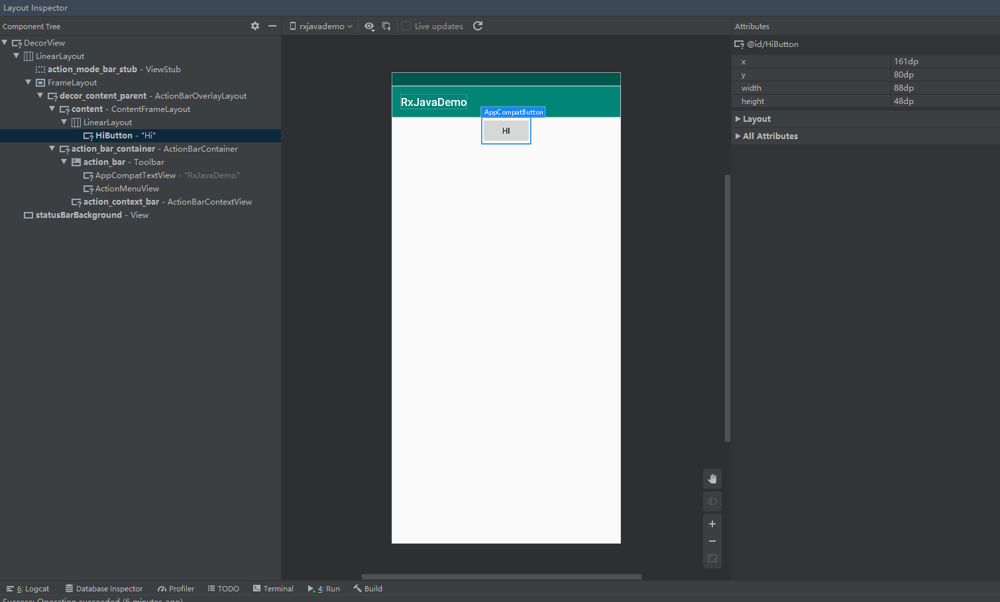
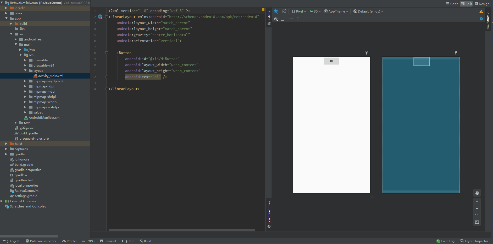
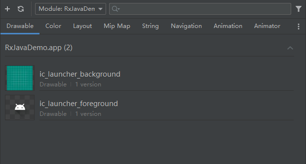

## Layout Inspector

- 打开方式：Tools > Layout Inspector

- 功能：
  - Component Tree 布局中视图的层次结构
    - 灰色View表宽或高为0，用户不可见
  - 工具栏：选择进程，视图显示，动态更新
    - 点击视图可以显示标签和边距
  - Attribute 布局属性
    - 边界宽高属性：x，y，width，height
    - Layout 属性
    - All Attributes 

- 局限

  - 只能针对debug版本分析，release现场需要用debug版本压测

  - Release 版本分析方法：adb输出当前布局信息，分析布局是否正常

    `adb shell uiautomator dump /sdcard/xxx.xml`

- 总结

  - 布局错误：大部分情况是控件可见性错误，或控制的树状结构，布局异常导致的
    - 在开发者模式-显示系统布局初步分析
    - 使用Layout Inspector通过选择控件，查看树状结构，分析属性（**宽高，可见性，marrgin，padding**）确认原因
  - 布局混乱：大部分情况是控件的marrgin，padding出现异常导致

## 布局验证器

- 打开方式：点击 res/layout 的 xxx.xml 布局文件

- 功能：
  - 系统显示选择：Landscape 横屏显示，UI Mode 硬件选择，Night Mode(暗色模式)，手机分辨率选择，用于快速适配
  - sdk 版本选择，AppTheme选择，默认语言选择

- 总结
  - 通过布局验证器，我们可以同时查看多语言，多字体大小，多分辨率的显示情况，减少手机来回频繁切换问题，提高开发效率

## Resource Manager

- 打开方式：Tools > Resource Manager

- 功能
  - Add：可向项目添加新资源，如图像、矢量、字体、资源文件和值，也可以将资源导入到项目中
  - 下拉列表：查看某个模块的专属资源
  - 搜索资源
  - 按类型对资源分组，使用标签页可在资源类型间切换，查看相对应的资源
  - 过滤：过滤查看本地依赖模块、外部库和Android框架资源，过滤显示主题背景属性

## .9 编辑器

- 应用场景：微信聊天背景图会根据你的文字变化而变化
- 定义
  - 点9图是一种可拉伸的图，常用来使图像充当背景时可自适应（一般是拉伸纯色区域）
  - 点9图是PNG格式图像，以.9.png结尾的图片，位于 res/drawable/ 路径下
  - 点9图作用是保证图片拉伸时不会失真
  - 点9图有四条黑边
    - 左边和上边的黑线定义了可拉伸区域
    - 右边和下边的黑心定义了填充区域（如填充文本）
- 点9图添加方式：右键png资源 > Create 9-Path file