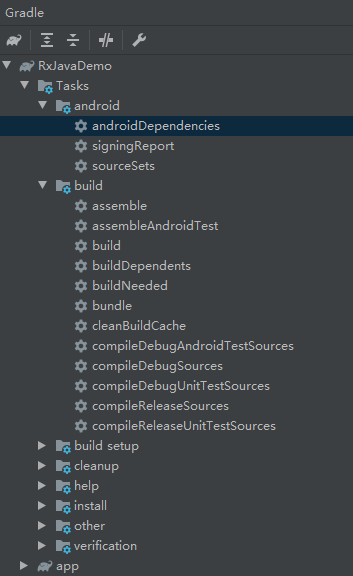

## Build Analyzer

- 打开方式：下方Build工具栏

## gradle 任务介绍

- 打开方式：View > Tool Window > Gradle

- 运行：双击运行，或Terminal输入：`gradlew gradle 任务名`
- 常用任务：
  - androidDependencies：依赖查看，可以快速查看所有依赖
  - assemble：打包命令
  - assembleDebugUnitTest：执行debug的单元测试
  - assembleDebugAndroidTest：执行debug的接口测试
  - build：构建任务
  - clean：清除构建和打包缓存，解决代表更新失败、生成代码冲突问题

## Device File Explorer 设备文件管理器

- 打开方式：View > Tool Windows > Device File Explorer
- 功能：可以在Android设备上查看、复制、删除文件
  - data/data/app_name/ 包含应用存储在内部存储空间中的数据文件
  - sdcard/ 包含存储在外部用户存储空间中的用户文件（图片等）