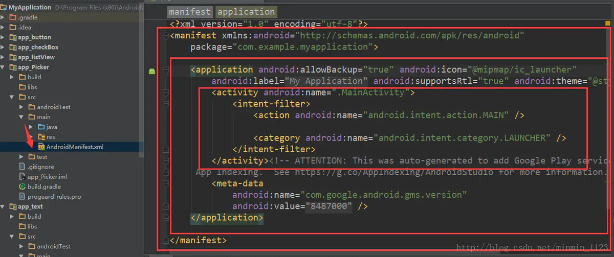
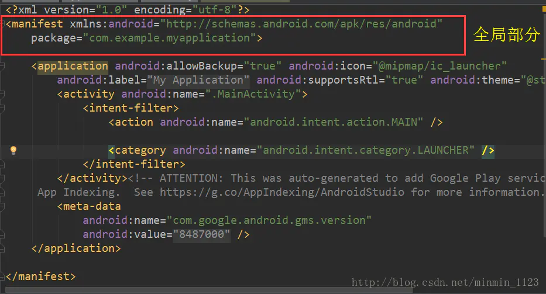
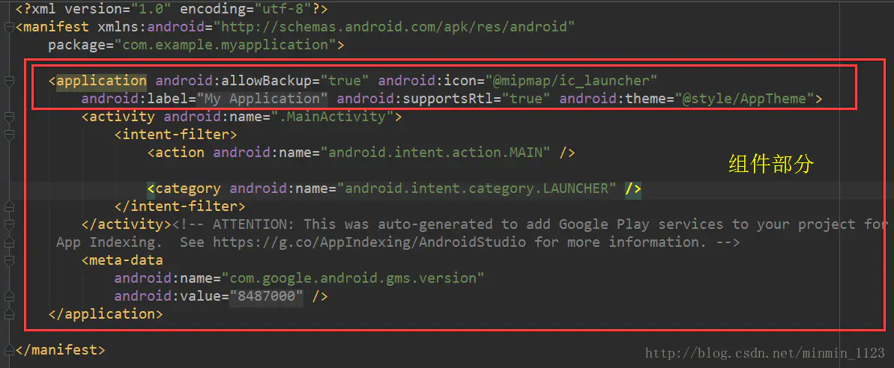
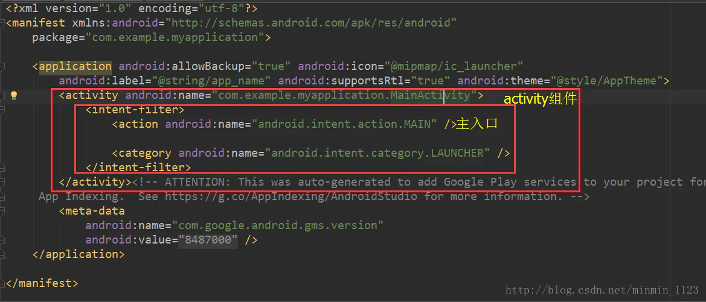

AndroidManifest.xml是整个应用的主配置清单文件，包括应用的包名、版本号、组件、权限等信息，它用来记录应用的相关的配置信息。它在main文件夹下，从图中可看出在manifest大标签下有各种各样的标签，接下来将从全局、组件和权限三个方面解读AndroidManifest里的常用标签。

## 全局部分

manifest是AndroidManifest.xml配置文件的根标签，  必须指定xmlns:android和package属性， 且只包含一个application节点。

**xlmns:android**指定了Android的命名空间，默认情况下是*[http://schemas.android.com/apk/res/android](https://links.jianshu.com/go?to=http%3A%2F%2Fschemas.android.com%2Fapk%2Fres%2Fandroid)*。
 **package**是标准的应用包名，也是一个应用进程的默认名称，为避免命名空间的冲突，一般会以应用的域名来作为包名。
 一般情况这部分不需要做改动。

## 组件部分

由一个application标签包裹着安卓四大组件。

在application标签下有几个面向全局的属性：**android:icon**（图标）、**android:label**（标题）、**android:theme**（主题样式）。
 而在application标签里面包裹着安卓四大组件：activity（活动）、service（服务）、content provider（内容提供者）以及broadcast receiver（广播接收者）。其中activity就是本篇的重点，它是一个应用程序通过屏幕提供给用户进行交互界面的Android组件，其他三个组件还没用到，后续介绍。在这四个组件添加到application时，一定要声明**android:name**属性，值以**包名.类名**的形式，其中包名（package）可省写成**.类名**即可。

下面主要看Activity标签：

每在Android应用中添加一个Activity都必须在AndroidManifest.xml配置文件中声明，  否则系统将不识别也不执行该Activity。当application下有多个Activity，可用上图中这样的 **intent-filter**表示当前这个Activity是主页面。

## 权限部分

权限就是当用户安装应用程序的时候，提示用户该程序为提供服务必须获得的权限。可用**uses-permission**标签声明一系列系统权限，需要的时候添加就可以，如下图就是一个申请访问网络的权限；当然也可以自定义权限，用到permission标签，并用name唯一标识自定义权限的名称，在其他应用程序中必须有这个name的permission才能访问到该应用程序，故目的是保护该程序里重要的组件。

