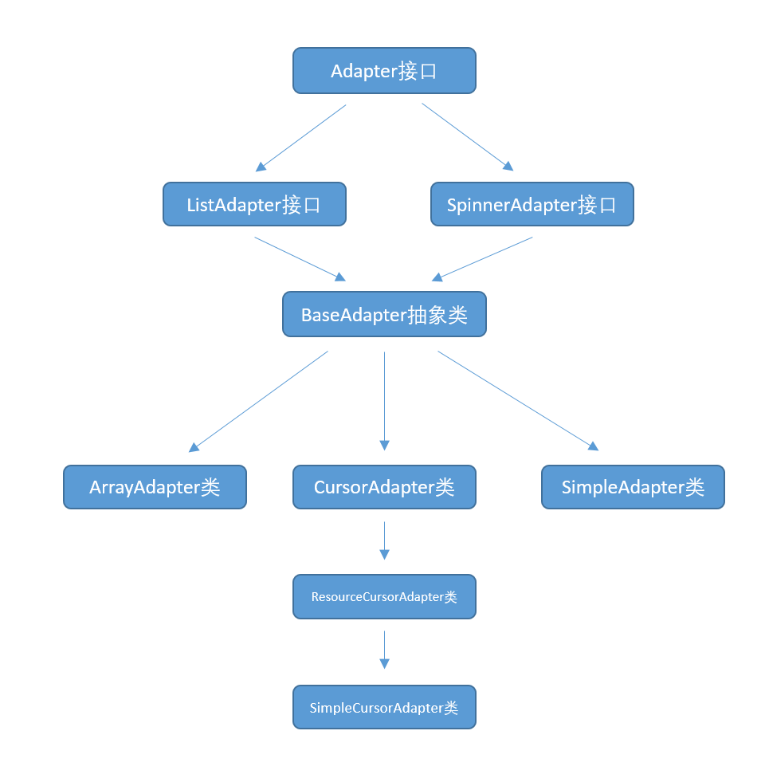

## Adapter 适配器

Adapter相当于一个数据源，可以给AdapterView提供数据，并根据数据创建对应的UI，可以通过调用AdapterView的setAdapter方法使得AdapterView将Adapter作为数据源。

常见的AdapterView的子类有ListView、GridView、Spinner和ExpandableListView等。

以下是Adapter相关类的关系图：



### Adapter接口

```java
public interface Adapter {
    /* Adapter使用了观察者模式，Adapter本身相当于被观察的对象，AdapterView相当于观察者，
     * 通过调用registerDataSetObserver方法，给Adapter注册观察者
     */
    void registerDataSetObserver(DataSetObserver observer);
    void unregisterDataSetObserver(DataSetObserver observer);

    int getCount();   
    Object getItem(int position);
    long getItemId(int position);
    
    boolean hasStableIds();
    
    /**
     * 该方法会根据数据项的索引为AdapterView创建对应的UI项
     */
    View getView(int position, View convertView, ViewGroup parent);

    ...
}
```

### BaseAdapter抽象类

BaseAdapter主要实现了以下功能：

- BaseAdapter实现了观察者模式，Adapter接口定义了方法registerDataSetObserver和unregisterDataSetObserver，BaseAdapter中维护了一个DataSetObservable类型的变量mDataSetObservable，并实现了方法registerDataSetObserver和unregisterDataSetObserver。

- BaseAdapter重写了getDropDownView方法，其调用了getView方法，如下所示：

  ```java
  public View getDropDownView(int position, View convertView, ViewGroup parent) {
      return getView(position, convertView, parent);
  }
  ```

- 覆写其他一些方法，设置了默认值，比如覆写hasStableIds方法，使其默认返回false

### ArrayAdapter类

```java
public class MainActivity extends Activity {

    @Override
    protected void onCreate(Bundle savedInstanceState) {
        super.onCreate(savedInstanceState);
        setContentView(R.layout.activity_main);

        ListView listView = (ListView)findViewById(R.id.listView);
        String[] values = {"iPhone","小米","三星","华为","中兴","联想","黑莓","魅族"};
        //List<String> list = Arrays.asList(values);
        //Arrays.asList(values)返回的是一个只读的List，不能进行add和remove
        //new ArrayList<>(Arrays.asList(values))则是一个可写的List，可以进行add和remove
        List<String> list = new ArrayList<>(Arrays.asList(values));
        final ArrayAdapter<String> adapter = new ArrayAdapter<String>(this, android.R.layout.simple_list_item_1, list);
        listView.setAdapter(adapter);
        //单击item之后，删除对应的item
        listView.setOnItemClickListener(new AdapterView.OnItemClickListener() {
            @Override
            public void onItemClick(AdapterView<?> parent, View view, int position, long id) {
                String item = adapter.getItem(position);
                adapter.remove(item);
                Toast.makeText(MainActivity.this, item, Toast.LENGTH_SHORT).show();
            }
        });
    }
}
```

### SimpleAdapter类

SimpleAdapter只有一个构造函数，签名如下所示：

```java
public SimpleAdapter (Context context, List<? extends Map<String, ?>> data, int resource, String[] from, int[] to)
```

- data表示的是List数据源，其中List中的元素都是Map类型，并且Map的key是String类型，Map的value可以是任意类型，我们一般使用`HashMap<String, Object>`作为List中的数据项。
- resource表示数据项UI所对应的layout文件，在本例中即R.layout.item。在本例中，每条数据项都要包含图片、名称、描述三条信息，所以我们在item.xml中定义了一个ImageView表示图片，两个TextView分别表示名称和描述，并且都设置了ID值。
- 每个数据项对应一个Map，from表示的是Map中key的数组。
- 数据项Map中的每个key都在layout中有对应的View，to表示数据项对应的View的ID数组。

```java
public class MainActivity extends Activity {

    @Override
    protected void onCreate(Bundle savedInstanceState) {
        super.onCreate(savedInstanceState);
        setContentView(R.layout.activity_main);

        ListView listView = (ListView)findViewById(R.id.listView);

        final String[] names = {"Windows","Mac OS","Linux","Android","Chrome OS"};

        final String[] descriptions = {
                "Windows是微软公司的操作系统",
                "Mac OS是苹果公司的操作系统",
                "Linux是开源免费操作系统",
                "Android是Google公司的智能手机操作系统",
                "Chrome OS是Google公司的Web操作系统"
        };

        final int[] icons = {
                R.drawable.windows,
                R.drawable.mac,
                R.drawable.linux,
                R.drawable.android,
                R.drawable.chrome
        };

        List<Map<String, Object>> list = new ArrayList<>();

        for(int i = 0; i < names.length; i++){
            HashMap<String, Object> map = new HashMap<>();
            map.put("name", names[i]);
            map.put("description", descriptions[i]);
            map.put("icon", icons[i]);
            list.add(map);
        }


        //每个数据项对应一个Map，from表示的是Map中key的数组
        String[] from = {"name", "description", "icon"};

        //数据项Map中的每个key都在layout中有对应的View，
        //to表示数据项对应的View的ID数组
        int[] to = {R.id.name, R.id.description, R.id.icon};

        //R.layout.item表示数据项UI所对应的layout文件
        SimpleAdapter adapter = new SimpleAdapter(this, list, R.layout.item, from, to);

        listView.setAdapter(adapter);
    }
}
```

```xml
<?xml version="1.0" encoding="utf-8"?>
<LinearLayout xmlns:android="http://schemas.android.com/apk/res/android"
    android:layout_width="match_parent"
    android:layout_height="wrap_content"
    android:orientation="horizontal"
    android:paddingTop="5dp"
    android:paddingBottom="5dp">

    <ImageView android:id="@+id/icon"
        android:layout_width="100dp"
        android:layout_height="wrap_content" />

    <LinearLayout
        android:layout_width="wrap_content"
        android:layout_height="wrap_content"
        android:orientation="vertical"
        android:paddingLeft="10dp">
        <TextView android:id="@+id/name"
            android:layout_width="match_parent"
            android:layout_height="wrap_content"
            android:textSize="@dimen/defaultFontSize" />

        <TextView android:id="@+id/description"
            android:layout_width="match_parent"
            android:layout_height="wrap_content"
            android:textSize="@dimen/defaultFontSize"
            android:layout_marginTop="10dp"/>
    </LinearLayout>

</LinearLayout>
```

---

## ViewHolder

要想使用 ListView 就需要编写一个 Adapter 将数据适配到 ListView上，而为了节省资源提高运行效率，一般自定义类 ViewHolder 来减少 findViewById() 的使用以及避免过多地 inflate view，从而实现目标。

```java
/** 重写方法 */
@Override
public int getCount(){
    return notes.size();
}
@Override
public Object getItem(int position){
    return notes.get(position);
}
@Override
public long getItemId(int position){
    return position;
}
@Override
public View getView(int position,View convertView,ViewGroup parent){
    ViewHolder viewHolder;
    // 若无可重用的 view 则进行加载
    if(converView == null){
        convertView = inflater.inflate('列表项布局文件',parent,false);
        // 初始化 ViewHolder 方便重用
        viewHolder = new ViewHolder();
        viewHolder.tvTitle = (TextView) convertView.findViewById('id1');
        viewHolder.tvContent = (TextView) convertView.findViewById('id2');
        converView.setTag(viewHolder);
    }else{ // 否则进行重用
        viewHolder = (ViewHolder)convertView.getTag();
    }
    // 获得条目内容对象
    Note note = notes.get(position);
    // 设置内容(Note Bean 需要自定义)
    viewHolder.tvTitle.setText(note.getTitle());
    viewHolder.tvContent.setText(note.getContent());
    return converView;
}
```

---

## ListView

[ListView详解--绘图、优化、适配器、观察者](https://www.jianshu.com/p/44e7760194bb)

简单使用：
- 创建布局文件
  + item 布局文件
  + listview 布局文件
- 建立实体类（Fruit）
- 建立实体类的适配器（FruitAdapter）
  + 适配器种类
    - ArrayAdapter（数组适配器）
    - SimpleAdapter（简单适配器）
    - BaseAdapter
  + 继承适配器（构建自己的Item样式）
    - 构建函数
    - 重写四个函数：`getCount()` `getItem()` `getItemId` `getView()`
- 设置ListView的适配器：`fruitListView.setAdapter(mAdapter);`
- 设置ListVIew的监听器：`fruitListView.setOnScrollListener(this)`
  + 实现`onScrollStateChanged()`:事件会返回一个scrollState，它有三个状态值
    + `SCROLL_STATE_FLING`离开屏幕，惯性滑动
    + `SCROLL_STATE_IDLE`离开屏幕，停止滑动
    + `SCROLL_STATE_TOUCH_SCROLL`没有离开，仍在滑动
    + `mAdapter.notifyDataSetChanged()`通知适配器数据发生了变化要重新加载数据
  + 实现`onScroll()`
```java
        mContext= ListViewActivity.this;
        fruitListView=(ListView)findViewById(R.id.fruit_list_view);

        mData=new LinkedList<Fruit>();
//        mData.add(new Fruit("苹果","我是苹果",R.mipmap.fruit_icon));

        mAdapter=new FruitAdapter((LinkedList<Fruit>)mData,mContext);
        fruitListView.setAdapter(mAdapter);

        fruitListView.setOnItemClickListener(this);
```

---

```java
        //动态加载顶部View和底部View
        final LayoutInflater inflater = LayoutInflater.from(this);
        View headView = inflater.inflate(R.layout.view_header, null, false);
        View footView = inflater.inflate(R.layout.view_footer, null, false);
        
        //添加表头和表尾需要写在setAdapter方法调用之前！！！
        fruitListView.addHeaderView(headView);
        fruitListView.addFooterView(footView);
```

---

```java
    //解析、设置、缓存convertView以及相关内容，ItemView的设置也在此
    @Override
    public View getView(int position, View convertView, ViewGroup parent) {
        ViewHolder holder = null;
        //Item View的复用
        if(converView == null) {
            convertView = mInflater.inflate(R.layout.my_listview_item, null);
            //convertView= LayoutInflater.from(mContext).inflate(R.layout.item,parent,false);
            
            //获取title
            holder.title = (TextView)convertView.findViewById(R.id.title);
            convertView.setTag(holder);
        }else {
            holder = (ViewHolder)convertView.getTag();
        }
        holder.title.setText(mDatas.get(position));
        return convertView;
    }
}
```

## RecyclerView

[Android 控件 RecyclerView](https://www.jianshu.com/p/4f9591291365)

### RecylerView相对于ListView的优点
- RecyclerView**封装了viewholder的回收复用**
  + RecyclerView标准化了ViewHolder，编写Adapter面向的是ViewHolder而不再是View了，复用的逻辑被封装了，写起来更加简单。
  + 直接省去了listview中convertView.setTag(holder)和convertView.getTag()这些繁琐的步骤。
- 提供了一种插拔式的体验，高度的解耦，异常的灵活，针对一个Item的显示RecyclerView专门**抽取出了相应的类，来控制Item的显示**，使其的扩展性非常强。
- 设置**布局管理器**以控制Item的布局方式，横向、竖向以及瀑布流方式
  + 横向或者纵向滑动列表效果可以通过LinearLayoutManager这个类来进行控制
  + GridView对应GridLayoutManager
  + 瀑布流对应StaggeredGridLayoutManager
- 可设置**Item的间隔样式**（可绘制）
  + 通过继承RecyclerView的ItemDecoration这个类，然后针对自己的业务需求去书写代码。
- 可以控制**Item增删的动画**，可以通过ItemAnimator这个类进行控制，当然针对增删的动画，RecyclerView有其自己默认的实现。

### 基本使用
- 在build.gradle文件中引入该类：`compile 'com.android.support:recyclerview-v7:23.4.0'`
- 创建布局文件
  + item 布局文件
  + recyclerview 布局文件
- 创建适配器
  + 创建Adapter：创建一个继承`RecyclerView.Adapter<VH>`的Adapter类（VH是ViewHolder的类名）
  + 创建ViewHolder：在Adapter中创建一个继承`RecyclerView.ViewHolder`的**静态内部类**，记为VH。ViewHolder的实现和ListView的ViewHolder实现几乎一样。
  + 在Adapter中实现3个方法：（`getView()`的功能拆分）
    - `onCreateViewHolder()`
      + 为每个Item inflater生成出一个View，但是该方法返回的是一个ViewHolder
      + 映射Layout必须为`View v = LayoutInflater.from(parent.getContext()).inflate(R.layout.item_1, parent, false);`
      + 不可以为`View v = LayoutInflater.from(parent.getContext()).inflate(R.layout.item_1, null);`
    - `onBindViewHolder()`
      + 这个方法主要用于适配渲染数据到View中。方法提供给你了一viewHolder而不是原来的convertView。
    - `getItemCount()`
      + 这个方法就类似于BaseAdapter的getCount方法了，即总共有多少个条目。
```java
// ① 创建Adapter
public class NormalAdapter extends RecyclerView.Adapter<NormalAdapter.VH>{
    //② 创建ViewHolder
    public static class VH extends RecyclerView.ViewHolder{
        public final TextView title;
        public VH(View v) {
            super(v);
            title = (TextView) v.findViewById(R.id.title);
        }
    }
    
    private List<String> mDatas;
    public NormalAdapter(List<String> data) {
        this.mDatas = data;
    }

    //③ 在Adapter中实现3个方法
    @Override
    public void onBindViewHolder(VH holder, int position) {
        holder.title.setText(mDatas.get(position));
        holder.itemView.setOnClickListener(new View.OnClickListener() {
            @Override
            public void onClick(View v) {
                //item 点击事件
            }
        });
    }

    @Override
    public int getItemCount() {
        return mDatas.size();
    }

    @Override
    public VH onCreateViewHolder(ViewGroup parent, int viewType) {
        //LayoutInflater.from指定写法
        View v = LayoutInflater.from(parent.getContext()).inflate(R.layout.item_1, parent, false);
        return new VH(v);
    }
}
```
```java
//给RecyclerView设置布局管理器
recyclerView.setLayoutManager(new LinearLayoutManager(getContext()));
//初始化适配器
adapter = new MyRecyclerViewAdapter(getContext(), list);
//给recyclerView添加适配器
recyclerView.setAdapter(adapter);


//设置分隔线  
recyclerView.addItemDecoration( new DividerGridItemDecoration(this ));  
//设置增加或删除条目的动画  
recyclerView.setItemAnimator( new DefaultItemAnimator());  

//RecyclerView除了LinearLayoutManager 之外，
//还提供了GridlayoutManager和StaggeredGridlayoutManager这两种内置的布局排列方式
//GridlayoutManager可以用于实现网格布局
//StaggeredGridlayoutManager可以用于实现瀑布流布局，
//第一个参数表示布局的列数  
//第二个参数表示布局的方向，这里我们传入StaggeredGridLayoutManager.VERTICAL，表示布局纵向排列        
//StaggeredGridLayoutManager layoutmanager =
//new StaggeredGridLayoutManager(3,StaggeredGridLayoutManager.VERTICAL);  
```

- 设置RecyclerView：四大设置（四大组成）
  + Layout Manager(必选)：Item的布局。
  + Adapter(必选)：为Item提供数据。
  + Item Decoration(可选，默认为空)：Item之间的Divider。
  + Item Animator(可选，默认为DefaultItemAnimator)：添加、删除Item动画。

---

### Layout Manager 布局管理器

RecyclerView提供了三种布局管理器：
- LinerLayoutManager 以垂直或者水平列表方式展示Item
- GridLayoutManager 以网格方式展示Item
- StaggeredGridLayoutManager 以瀑布流方式展示Item

设置布局管理器方法：`recyclerView.setLayoutManager(LayoutManager layoutManager)`

LayoutMananger子类LinearLayoutManager
- `new LinearLayoutManager(Context context)`参数为上下文环境，实现的是默认的垂直布局
- `new LinearLayoutManager( Context context, int orientation, boolean reverseLayout)`第一个参数为上下文环境，第二个参数为布局显示方式，第三个参数为布尔值是否反转
```java
LinearLayoutManager layoutManager=new LinearLayoutManager(MainActivity.this);
LinearLayoutManager layoutManager1=new LinearLayoutManager(MainActivity.this,LinearLayoutManager.VERTICAL,false);
recyclerView.setLayoutManager(layoutManager1);
```

如果想用 RecyclerView 来实现自己**自定义效果**，则应该去**继承实现自己的LayoutManager**，并重写相应的方法，而不应该想着去改写 RecyclerView。

LayoutManager 常见 API
```java
    canScrollHorizontally();//能否横向滚动
    canScrollVertically();//能否纵向滚动
    scrollToPosition(int position);//滚动到指定位置

    setOrientation(int orientation);//设置滚动的方向
    getOrientation();//获取滚动方向

    findViewByPosition(int position);//获取指定位置的Item View
    findFirstCompletelyVisibleItemPosition();//获取第一个完全可见的Item位置
    findFirstVisibleItemPosition();//获取第一个可见Item的位置
    findLastCompletelyVisibleItemPosition();//获取最后一个完全可见的Item位置
    findLastVisibleItemPosition();//获取最后一个可见Item的位置
```

LinearLayoutManager源码分析
- `onLayoutChildren()`: 对RecyclerView进行布局的入口方法。
- `fill()`: 负责填充RecyclerView。
- `scrollVerticallyBy()`:根据手指的移动滑动一定距离，并调用fill()填充。
- `canScrollVertically()`或`canScrollHorizontally()`: 判断是否支持纵向滑动或横向滑动。

深入学习：
- [创建一个 RecyclerView LayoutManager – Part 1](https://github.com/hehonghui/android-tech-frontier/blob/master/issue-9/%E5%88%9B%E5%BB%BA-RecyclerView-LayoutManager-Part-1.md)
- [创建一个 RecyclerView LayoutManager – Part 2](https://github.com/hehonghui/android-tech-frontier/blob/master/issue-13/%E5%88%9B%E5%BB%BA-RecyclerView-LayoutManager-Part-2.md)
- [创建一个 RecyclerView LayoutManager – Part 3](https://github.com/hehonghui/android-tech-frontier/blob/master/issue-13/%E5%88%9B%E5%BB%BA-RecyclerView-LayoutManager-Part-3.md)

---

### Item Decoration 间隔样式

RecyclerView通过`addItemDecoration()`方法添加item之间的分割线。Android并没有提供实现好的Divider，因此**任何分割线样式都需要自己实现**。

自定义间隔样式需要继承`RecyclerView.ItemDecoration`类，该类是个抽象类，官方目前并没有提供默认的实现类，主要有三个方法:
- `onDraw(Canvas c, RecyclerView parent, State state)`，在Item绘制之前被调用，该方法主要用于绘制间隔样式。
- `onDrawOver(Canvas c, RecyclerView parent, State state)`，在Item绘制之前被调用，该方法主要用于绘制间隔样式。
- `getItemOffsets(Rect outRect, View view, RecyclerView parent, State state)`，设置item的偏移量，偏移的部分用于填充间隔样式，即设置分割线的宽、高；在RecyclerView的`onMesure()`中会调用该方法。

onDraw()和onDrawOver()这两个方法都是用于绘制间隔样式，我们只需要复写其中一个方法即可。

实现步骤
- 获取listDivider，该属性的值是个Drawable
- getItemOffsets中，outRect去设置了绘制的范围
- onDraw中实现了真正的绘制

如果只需要实现Item之间相隔一定距离，那么只需要为Item的布局设置margin即可，没必要自己实现ItemDecoration这么麻烦。

---

### Item Animator 动画

[Android RecyclerView 详解（三） RecyclerView的动画实现（移除、添加、改变、移动）和自定义动画的实现](https://blog.csdn.net/superbiglw/article/details/53392877)

通过`mRecyclerView.setItemAnimator(ItemAnimator animator)`**设置添加、删除、移动、改变的动画效果**

RecyclerView提供了默认的ItemAnimator实现类：DefaultItemAnimator
```java
// 设置Item添加和移除的动画
mRecyclerView.setItemAnimator(new DefaultItemAnimator());
```

就添加一下删除和添加Item的动作。在Adapter里面添加方法。
```java
public void addNewItem() {
    if(mData == null) {
        mData = new ArrayList<>();
    }
    mData.add(0, "new Item");
  //更新数据集不是用adapter.notifyDataSetChanged()而是notifyItemInserted(position)与notifyItemRemoved(position) 否则没有动画效果。 
    notifyItemInserted(0);
}

public void deleteItem() {
    if(mData == null || mData.isEmpty()) {
        return;
    }
    mData.remove(0);
    notifyItemRemoved(0);
}
```

添加事件的处理
```java
public void onClick(View v) {
    int id = v.getId();
    if(id == R.id.rv_add_item_btn) {
        mAdapter.addNewItem();
        // 由于Adapter内部是直接在首个Item位置做增加操作，增加完毕后列表移动到首个Item位置
        mLayoutManager.scrollToPosition(0);
    } else if(id == R.id.rv_del_item_btn){
        mAdapter.deleteItem();
        // 由于Adapter内部是直接在首个Item位置做删除操作，删除完毕后列表移动到首个Item位置
        mLayoutManager.scrollToPosition(0);
    }
}
```

---

### 局部刷新闪屏问题解决

问题：
- 当Item视图中有图片和文字，当更新文字并调用notifyItemChanged()时，文字改变的同时图片会闪一下。
- 这个问题的原因是当调用`notifyItemChanged()`时，会调用DefaultItemAnimator的`animateChangeImpl()`执行change动画，该动画会使得Item的透明度从0变为1，从而造成闪屏。

解决：
在`rv.setAdapter()`之前调用`((SimpleItemAnimator)rv.getItemAnimator()).setSupportsChangeAnimations(false)`禁用change动画。

---

### 点击事件

- 可以监听RecyclerView的Touch事件然后判断手势做相应的处理
- 也可以通过在绑定ViewHolder的时候设置监听，然后通过Apater回调出去

第二种方法代码：
```java
public class MyAdapter extends RecyclerView.Adapter<MyAdapter.ViewHolder>{
    // 展示数据
    private ArrayList<String> mData;
    // 事件回调监听
    private MyAdapter.OnItemClickListener onItemClickListener;
    public MyAdapter(ArrayList<String> data) {
        this.mData = data;
    }
    public void updateData(ArrayList<String> data) {
        this.mData = data;
        notifyDataSetChanged();
    }
    // 添加新的Item
    public void addNewItem() {
        if(mData == null) {
            mData = new ArrayList<>();
        }
        mData.add(0, "new Item");
        notifyItemInserted(0);
    }
    // 删除Item
    public void deleteItem() {
        if(mData == null || mData.isEmpty()) {
            return;
        }
        mData.remove(0);
        notifyItemRemoved(0);
    }

    // ① 定义点击回调接口
    public interface OnItemClickListener {
        void onItemClick(View view, int position);
        void onItemLongClick(View view, int position);
    }
    
    // ② 定义一个设置点击监听器的方法
    public void setOnItemClickListener(MyAdapter.OnItemClickListener listener) {
        this.onItemClickListener = listener;
    }

    @Override
    public ViewHolder onCreateViewHolder(ViewGroup parent, int viewType) {
        // 实例化展示的view
        View v = LayoutInflater.from(parent.getContext()).inflate(R.layout.view_rv_item, parent, false);
        // 实例化viewholder
        ViewHolder viewHolder = new ViewHolder(v);
        return viewHolder;
    }

    @Override
    public void onBindViewHolder(final ViewHolder holder, int position) {
        // 绑定数据
        holder.mTv.setText(mData.get(position));
        //③ 对RecyclerView的每一个itemView设置点击事件
        holder.itemView.setOnClickListener(new View.OnClickListener() {
            @Override
            public void onClick(final View v) {
                if(onItemClickListener != null) {
                    int pos = holder.getLayoutPosition();
                    onItemClickListener.onItemClick(holder.itemView, pos);
                }
            }
        });

        holder.itemView.setOnLongClickListener(new View.OnLongClickListener() {
            @Override
            public boolean onLongClick(View v) {
                if(onItemClickListener != null) {
                    int pos = holder.getLayoutPosition();
                    onItemClickListener.onItemLongClick(holder.itemView, pos);
                }
                //表示此事件已经消费，不会触发单击事件
                return true;
            }
        });
    }

    @Override
    public int getItemCount() {
        return mData == null ? 0 : mData.size();
    }

    public static class ViewHolder extends RecyclerView.ViewHolder {
        TextView mTv;
        public ViewHolder(View itemView) {
            super(itemView);
            mTv = (TextView) itemView.findViewById(R.id.item_tv);
        }
    }
}
```

```java
mAdapter.setOnItemClickListener(new MyAdapter.OnItemClickListener() {
    @Override
    public void onItemClick(View view, int position) {
        Toast.makeText(MDRvActivity.this,"click " + position + " item", Toast.LENGTH_SHORT).show();
    }

    @Override
    public void onItemLongClick(View view, int position) {
        Toast.makeText(MDRvActivity.this,"long click " + position + " item", Toast.LENGTH_SHORT).show();
    }
});
```

---

### 拓展RecyclerView

ListView有，RecyclerView没有的功能
- `addHeaderView()`和`addFooterView()`的API
- `setEmptyView()`

---

#### 拖拽、侧滑删除

Android提供了ItemTouchHelper类，使得RecyclerView能够轻易地实现滑动和拖拽
- 创建继承`ItemTouchHelper.Callback`类，重写方法
  + `getMovementFlags()`: 设置支持的拖拽和滑动的方向，此处我们支持的拖拽方向为上下，滑动方向为从左到右和从右到左，内部通过makeMovementFlags()设置。
  + `onMove()`: 拖拽时回调。
  + `onSwiped()`: 滑动时回调。
  + `onSelectedChanged()`:状态变化时回调，一共有三个状态
    + ACTION_STATE_IDLE(空闲状态)
    + ACTION_STATE_SWIPE(滑动状态)
    + ACTION_STATE_DRAG(拖拽状态)
    + 此方法中可以做一些状态变化时的处理，比如拖拽的时候修改背景色。
  + `clearView()`: **用户交互结束**时回调。此方法可以做一些状态的清空，比如拖拽结束后还原背景色。
  + `isLongPressDragEnabled()`: 是否支持长按拖拽，默认为true。如果不想支持长按拖拽，则重写并返回false。
- 设置ItemTouchHelper给RecyclerView
```java
ItemTouchHelper helper = new ItemTouchHelper(new SimpleItemTouchCallback(adapter, data));
helper.attachToRecyclerView(recyclerview);
```

触摸拖拽：核心方法为`helper.startDrag(holder)`

---

#### 嵌套滑动机制

Android 5.0推出了嵌套滑动机制，在之前，一旦子View处理了触摸事件，父View就没有机会再处理这次的触摸事件，而嵌套滑动机制解决了这个问题

#### 局部刷新

#### 缓存机制

#### 回收机制

