## 1.Fragment概要

学习Fragment的时候可以联系之前学习过的Activity，因为它们有很多相似点：都可包含布局，有自己的生命周期，Fragment可看似迷你活动。正如Fragment的名字--碎片，它的出现是为了解决Android碎片化 ，它可作为Activity界面的组成部分，可在Activity运行中实现动态地加入、移除和交换。一个Activity中可同时出现多个Fragment，一个Fragment也可在多个Activity中使用。活动和碎片像极了夫妻， 虽然紧密联系但是又有独立空间，在一起让彼此变得更好。

下面这个非常经典的例子更直观地说明了Fragment作用：

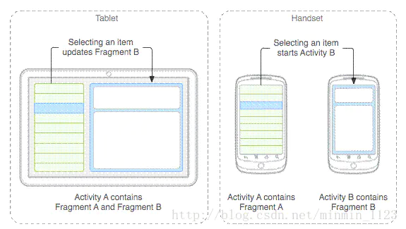

## 2.Fragment生命周期

先来看官方文档提供的有关Fragment生命周期的图片。

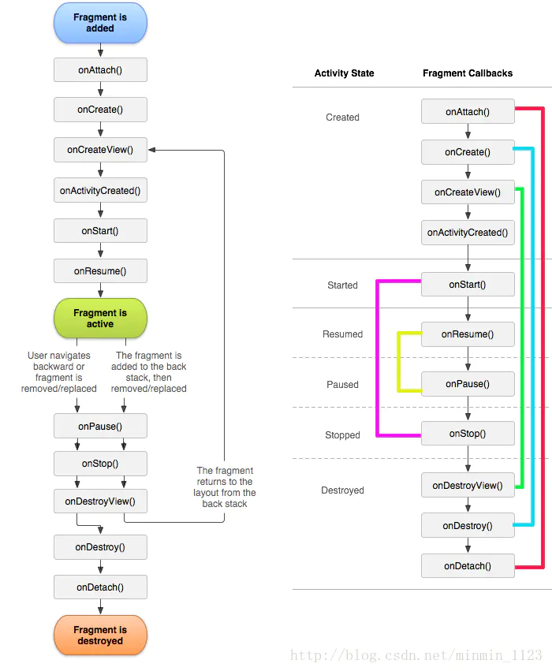

是不是能发现Fragment和Activity的生命周期太相似了，现在只需要再介绍几个Activity中没讲过的新方法：

**onAttach()**：当Fragment和Activity建立关联时调用
 **onCreateView()**：当Fragment创建视图时调用
 **onActivityCreated()**：当与Fragment相关联的Activity完成onCreate()之后调用
 **onDestroyView()**：在Fragment中的布局被移除时调用
 **onDetach()**：当Fragment和Activity解除关联时调用

在上图中画了几条线，可以看到Fragment周期中的状态几乎都是成对出现的，所以不难理解下图几种变化下Fragment生命周期方法的调用顺序了。

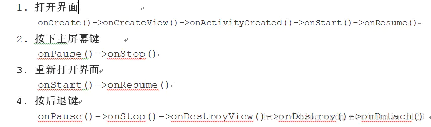

加载到Activity中的Fragment在各种变化下方法的调用顺序更值得注意。需要提一句的是，Activity的**FragmentManager**负责调用队列中Fragment的生命周期方法，只要Fragment的状态与Activity的状态保持了同步，托管Activity的FragmentManager便会继续调用其他生命周期方法以继续保持Fragment与Activity的状态一致。

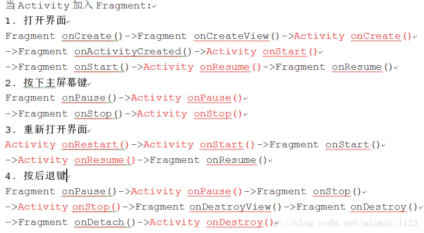

Fragment生命周期与Activity生命周期的一个关键区别就在于，Fragment的生命周期方法是由托管Activity而不是操作系统调用的。Activity中生命周期方法都是protected，而Fragment都是public，也能印证了这一点，因为Activity需要调用Fragment那些方法并管理它。

## 3.加载Fragment方法

现在就来学习如何在Activity中加载Fragment。

### （1）静态加载

在托管Activity的layout文件中声明Fragment

静态加载Fragment大致过程如图，分成四步：

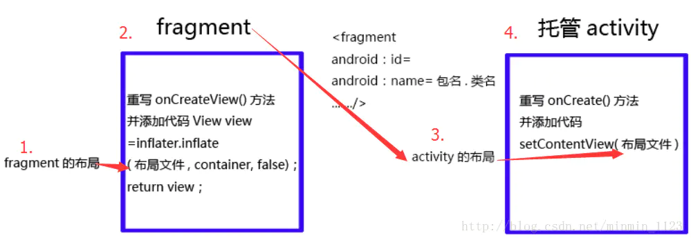

下面通过一个简单的例子感受Fragment静态加载到Activity的过程。

第一步：新建frag_layout.xml，为Fragment指定一个布局，这里简单的放一个TextView和一个Button。

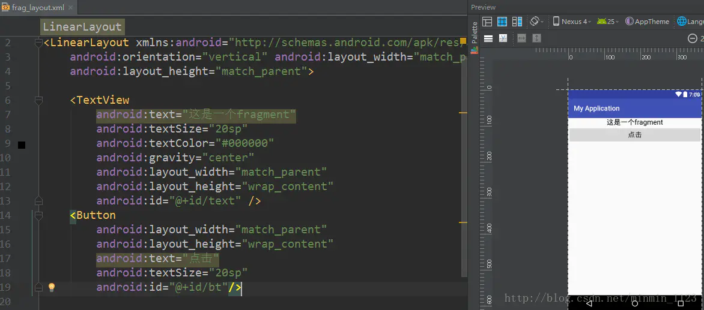

第二步：新建一个MyFragment类并继承Fragment，这里引用**android.app**包下的就可以，另一个包下主要用于兼容低版本的安卓系统。然后重写**onCreateView()**方法，这个方法里通过LayoutInflater的inflate()方法将刚刚定义的frag_layout布局加载进来并得到一个View，再return这个View。

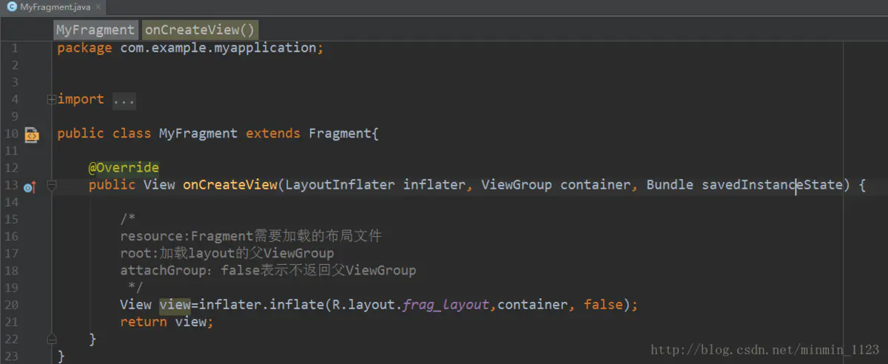

第三步：新建mian.xml，作为Activity的布局，使用< fragment>标签添加碎片，并且一定要有**android：name**属性且值为被加载的Fragment类的**包名.类名**完整形式。

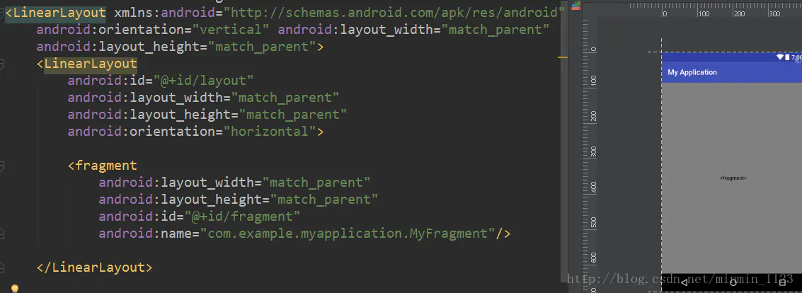

第四步：在MainActivity中加载main布局。现在MyFragment就完成了静态加载到MainActivity中，这时碎片里的控件自然也是活动的一个部分，可直接在活动中获取到Button的实例，来注册点击事件了。

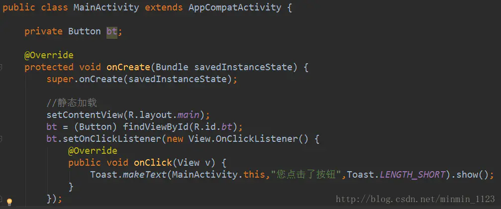

运行一下看看能不能达到效果：

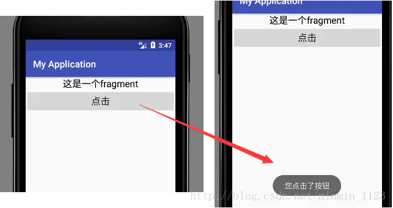

### （2）动态加载

在托管Activity通过代码动态添加

动态加载的代码也非常简单，直接看例子。修改main.xml，将整个< fragment>删掉。但还保留一个LinerLayout的空间并且还给了Id，为何这样做？马上揭秘。

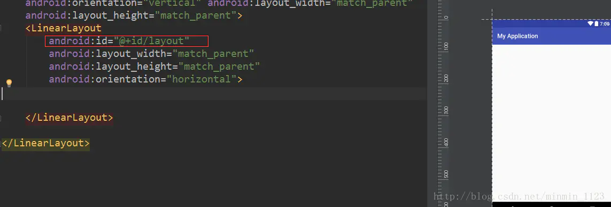

接下来在MainActivity中添加几行代码：

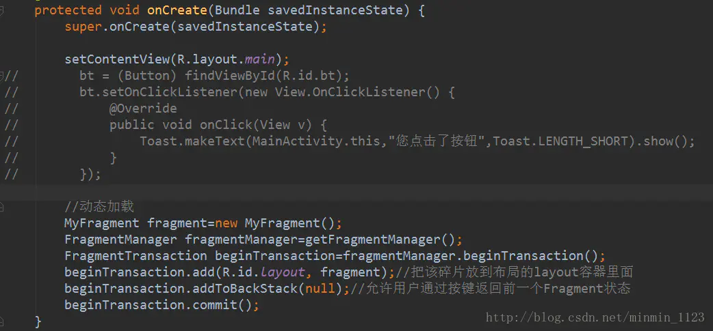

可将整个过程大致分为三个步骤：

第一步，先用**getFragmentManager()**方法获取一个FragmentManager对象，再通过它的**beginTransaction()**获取一个FragmentTransaction的实例。

第二步，用beginTransaction.**add()**方法将MyFragemnt实例添加到main布局里LinearLayout里，终于知道之前铺垫的Id是怎么回事了。一定要注意，add()方法里的第一个参数是容器视图资源Id，而不是layout。容器视图资源Id有两个作用：告知FragmentManager，碎片视图应该出现在活动视图的什么地方；它也是FragmentManager队列中碎片的唯一标识符。而静态加载时碎片的唯一标识符正是在活动布局里< fragment>下的id。

第三步：调用beginTransaction.**commit()**提交。另外，如果允许用户通过按下返回按键返回到前一个Fragment状态，在调用commit()之前先调用**addToBackStack(true)**方法。

这里注意到动态加载进来的Fragment里的控件并不能直接在活动中findViewById得到，那么如何实现点击效果呢，学完下一个知识点就有办法了。

## 4.Fragment与Activity之间通信

在活动中可以通过调用**FragmentManager**的**findFragmentById()**方法来得到相应碎片的实例，继而可以调用碎片里的方法。以上面demo举例，如果想得到静态加载碎片的实例，可在MainActivity添加代码如下：

```python
MyFragment myFragment = (MyFragment)getFragmentManager(). findFragmentById(R.id.fragment);
```

如果想得到动态加载碎片的实例，代码如下：

```python
MyFragment myFragment = (MyFragment)fragmentManager(). findFragmentById(R.id.layout);
```

在碎片中也可以通过调用getActivity()方法来得到和当前碎片相关联的活动实例，这样调用活动里的方法就变得轻而易举了。比如想在MyFragment得到MainActivity的实例：

```python
MainActivity activity=(MainActivity)getActivity();
```

于是碎片和活动可以很方便地进行通信了。再想一想碎片和碎片之间如何进行通信？先在一个碎片中可以得到与它相关联的活动，然后再通过这个活动去获取另外一个碎片的实例，这样实现了不同碎片之间的通信了。

现在你有没有想到解决之前那个问题的办法呢？可以这样做，修改MyFragment，代码如下图所示：

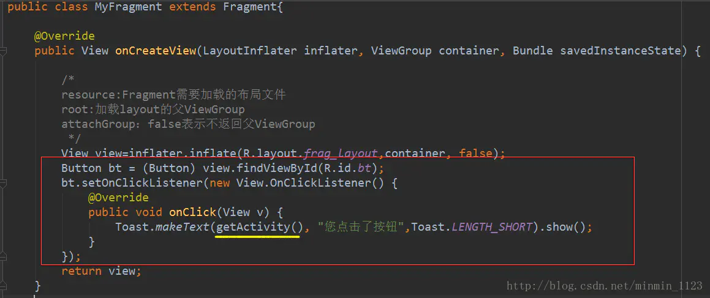

现在按钮点击就又有响应了！其实在实际开发中，如果某一板块每次用到都需要相同的功能，就完全可以在碎片中实现需求，而不必在活动中重复代码，这样可以提高代码的复用性。