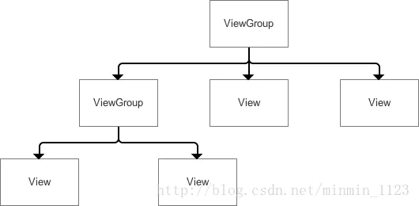
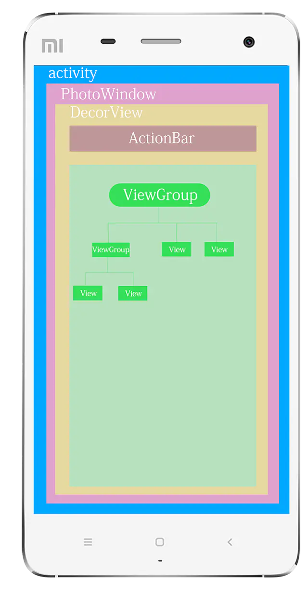
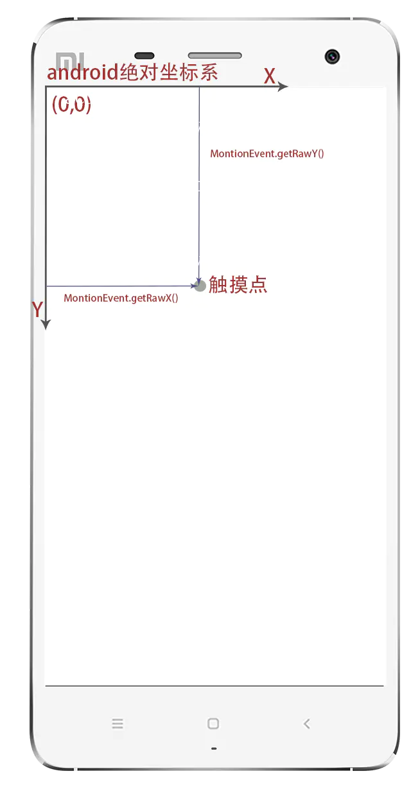
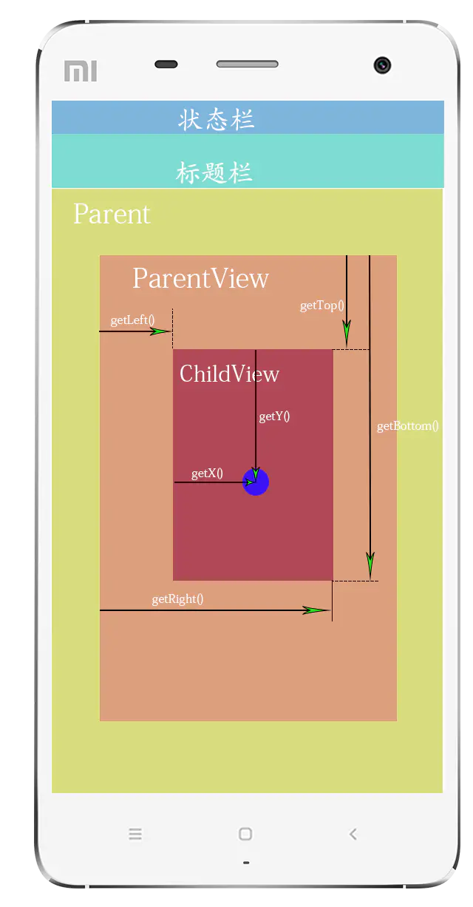
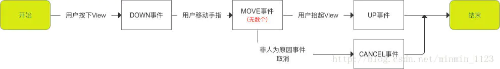
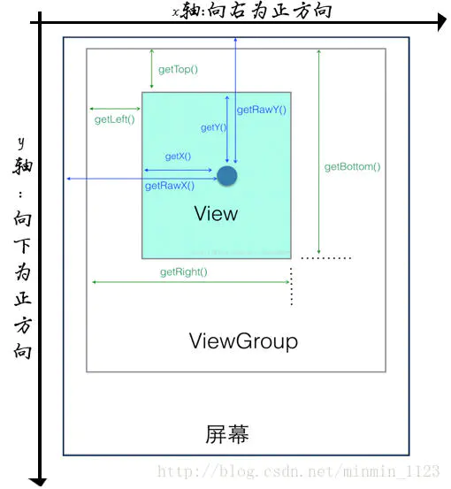
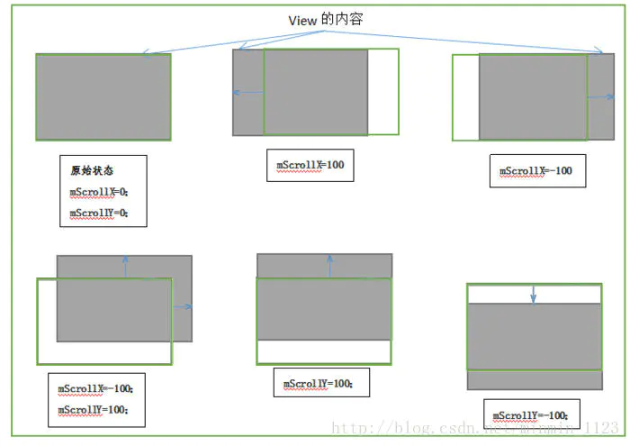
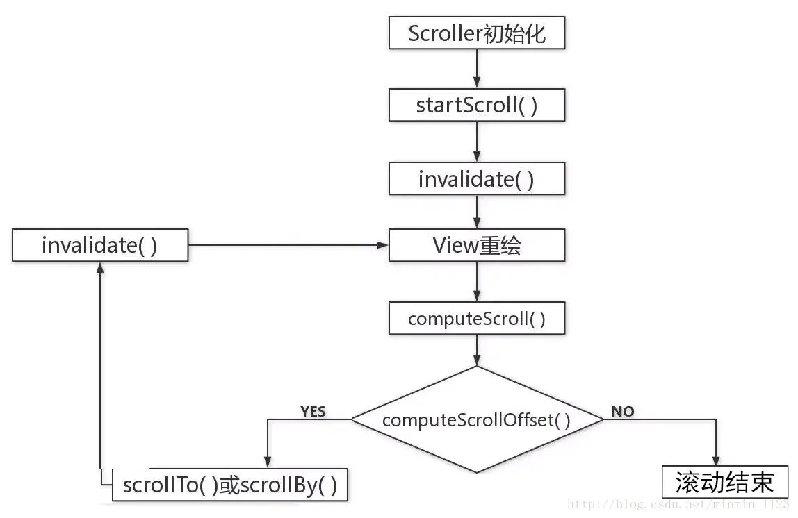
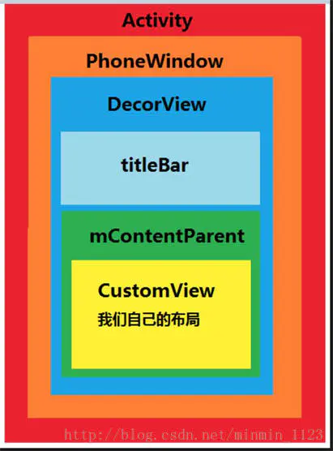
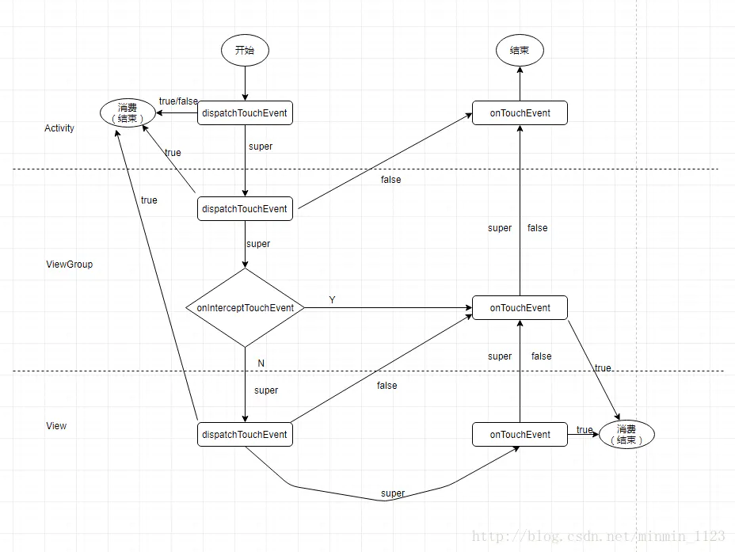

## View 的树形结构

在Android的世界中View是所有控件的基类，其中也包括ViewGroup在内，ViewGroup是代表着控件的集合，其中可以包含多个View控件。

从某种角度上来讲Android中的控件可以分为两大类：View与ViewGroup。通过ViewGroup，整个界面的控件形成了一个树形结构，上层的控件要负责测量与绘制下层的控件，并传递交互事件。

在每棵控件树的顶部都存在着一个ViewParent对象，它是整棵控件树的核心所在，所有的交互管理事件都由它来统一调度和分配，从而对整个视图进行整体控制。



View 是Android UI 控件的基类，ViewGroup也是继承自View，Android中的控件分为两部分，直接继承自View的控件和继承ViewGroup的布局（控件的集合），使整个Android控件形成的界面呈现出一个树形结构。每个父控件要负责绘制和测量下层控件，并进行事件传递交互。

在Android中，一个Activity的View结构如图所示：



在每个 Activity 创建时，同时会创建一个 Window (抽象类)，Window 的具体通过 PhotoWindow 类实现，它也是唯一的 Window 实现类，PhotoWindow 又创建了一个 DecorView（间接的继承自View）作为整个Activity的根布局。

DecorView 被分为两部分：

- ActionBar 部分（一般开发过程中都会隐藏，采用 google 推荐的 ToolBar）
-  id 为 content的FragmentLayout部分

我们 setContentView(@LayoutRes int layoutResID) 设置的Activity XML布局就是在FragmentLayout中（这部分的加载过程，下篇专门展开）接下来看android中的坐标系。

---

## View 的位置参数

android坐标系分为两类： 绝对坐标系（相对于设备的屏幕）和相对坐标系也称视图坐标系（相对于父控件）。

### 绝对坐标系

绝对坐标系 如图所示：



在Android中，将屏幕的左上角的顶点作为Android坐标系的原点，这个原点向右是X轴正方向，原点向下是Y轴正方向。在

这里主要强调MotionEvent触摸事件的getRawX()和getRawY():是获取的绝对坐标，还有绝对坐标经常需要计算的几个方法,在执行测量的系统方法是，需要在布局加载出来之后进行 一般在onWindowFocusChanged(boolean hasFocus)方法中执行 ：

```java
//获取整个屏幕宽高：
DisplayMetrics metrics = new DisplayMetrics();
getWindowManager().getDefaultDisplay().getMetrics(metrics);
int widthPixels = metrics.widthPixels;
int heightPixels = metrics.heightPixels;
```

```java
//获取状态栏高度
Rect rect= new Rect();
getWindow().getDecorView().getWindowVisibleDisplayFrame(rect);
int statusBarHeight = rectangle.top;
```

```java
//应用程序App区域宽高等尺寸获取
Rect rect = new Rect();
getWindow().getDecorView().getWindowVisibleDisplayFrame(rect);
```

```java
//View布局区域宽高等尺寸获取
Rect rect = new Rect();
getWindow().findViewById(Window.ID_ANDROID_CONTENT).getDrawingRect(rect);
```

### 相对坐标系

视图坐标系 如图所示：



视图坐标系其实就是我们在自定义控件，绘制过程中参考的坐标系，也就是View自身相对于父控件的距离，一般获取坐标的方法有：

```cpp
//View提供的方法：
//获取View自身顶边到其父布局顶边的距离
view.getTop()   
//获取View自身左边到其父布局左边的距离
view.getLeft()  
//获取View自身右边到其父布局左边的距离
view.getRight() 
//获取View自身底边到其父布局顶边的距离
view.getBottom()
//返回值为getLeft()+getTranslationX()，当setTranslationX()时getLeft()不变，getX()变。
view.getX() 
//返回值为getTop()+getTranslationY()，当setTranslationY()时getTop()不变，getY()变。
view.getY()
```

| View宽高方法        | 解释                                                         |
| ------------------- | ------------------------------------------------------------ |
| getWidth()          | layout后有效，返回值是mRight-mLeft，一般会参考measure的宽度（measure可能没用），但不是必须的。 |
| getHeight()         | layout后有效，返回值是mBottom-mTop，一般会参考measure的高度（measure可能没用），但不是必须的。 |
| getMeasuredWidth()  | 返回measure过程得到的mMeasuredWidth值，供layout参考，或许没用。 |
| getMeasuredHeight() | 返回measure过程得到的mMeasuredHeight值，供layout参考，或许没用。 |

---

## 触控系列

### MotionEvent

是手指触摸屏幕所产生的一系列事件。典型事件有：

- **ACTION_DOWN**：手指刚接触屏幕
- **ACTION_MOVE**：手指在屏幕上滑动
- **ACTION_UP**：手指在屏幕上松开的一瞬间

> 事件列：从手指接触屏幕至手指离开屏幕，这个过程产生的一系列事件
>  任何事件列都是以DOWN事件开始，UP事件结束，中间有无数的MOVE事件。如图：



通过MotionEvent 对象可以得到触摸事件的**x、y**坐标。其中通过getX()、getY()可获取相对于当前view左上角的x、y坐标；通过getRawX()、getRawY()可获取相对于手机屏幕左上角的x，y坐标。具体关系见下图：



### TouchSlop

系统所能识别的被认为是**滑动的最小距离**。即当手指在屏幕上滑动时，如果两次滑动之间的距离小于这个常量，那么系统就不认为你是在进行滑动操作。

> 该常量和设备有关，可用它来判断用户的滑动是否达到阈值，获取方法：**ViewConfiguration.get(getContext()).getScaledTouchSlop()**。

### VelocityTracker

速度追踪，用于追踪手指在滑动过程中的速度，包括水平和竖直方向的速度。

使用过程：首先在view的**onTouchEvent方法**中追踪当前单击事件的速度：

```csharp
VelocityTracker velocityTracker = VelocityTracker.obtain();//实例化一个VelocityTracker 对象
velocityTracker.addMovement(event);//添加追踪事件
```

接着在**ACTION_UP事件**中获取当前的速度。注意这里计算的是1000ms时间间隔移动的像素值，假设像素是100，即速度是每秒100像素。另外，手指逆着坐标系的正方向滑动，所产生的速度为负值，顺着正反向滑动，所产生的速度为正值。

```cpp
velocityTracker .computeCurrentVelocity(1000);//获取速度前先计算速度，这里计算的是在1000ms内
float xVelocity = velocityTracker .getXVelocity();//得到的是1000ms内手指在水平方向从左向右滑过的像素数，即水平速度
float yVelocity = velocityTracker .getYVelocity();//得到的是1000ms内手指在水平方向从上向下滑过的像素数，垂直速度
```

最后，当不需要使用它的时候，需要调用clear方法来重置并回收内存：

```css
velocityTracker.clear();
velocityTracker.recycle();
```

**推荐阅读**：[Android常用触控类分析：MotionEvent 、 ViewConfiguration、VelocityTracker](https://www.jianshu.com/p/e7200875384c)

### GestureDetector

手势检测，用于辅助检测用户的单击、滑动、长按、**双击**等行为。

使用过程：创建一个GestureDetecor对象并实现OnGestureListener接口，根据需要实现单击等方法：

```cpp
GestureDetector mGestureDetector = new GestureDetector(this);//实例化一个GestureDetector对象
mGestureDetector.setIsLongpressEnabled(false);// 解决长按屏幕后无法拖动的现象
```

接着，接管目标view的onTouchEvent方法，在待监听view的onTouchEvent方法中添加如下实现：

```csharp
boolean consume = mGestureDetector.onTouchEvent(event);
return consume;
```

然后，就可以有选择的实现OnGestureListener和OnDoubleTapListener中的方法了。

> 建议：如果只是监听滑动操作，建议在onTouchEvent中实现；如果要监听双击这种行为，则使用GestureDetector 。

**推荐阅读**:[Android手势检测——GestureDetector全面分析](https://www.jianshu.com/p/95b3fdc46b0f)

---

## 滑动系列

### 实现View滑动三种办法

#### ①通过View本身提供的**scrollTo/scrollBy**方法

> - 两者区别：scrollBy是内部调用了scrollTo的，它是基于当前位置的**相对滑动**；而scrollTo是**绝对滑动**，因此如果利用相同输入参数多次调用scrollTo()方法，由于View初始位置是不变只会出现一次View滚动的效果而不是多次。
> - 注意：两者都只能对**view内容**进行滑动，而不能使view本身滑动。

mScrollX和mScrollY分别表示View在X、Y方向的滚动距离。

- **mScrollX**：View的左边缘减去View的内容的左边缘；
- **mScrollY**：View的上边缘减去View的内容的上边缘。

从右向左滑动，mScrollX为正值，反之为负值；从下往上滑动，mScrollY为正值，反之为负值。（更直观感受：查看下一张照片或者查看长图时手指滑动方向为正）



绿色边框代表View在屏幕上对应的矩形区域，灰色阴影代表View的内容

推荐阅读：[scrollTo/scrollBy 使用详解](https://www.jianshu.com/p/859592b43d38)

#### ②通过**动画**给View施加平移效果

主要通过改变View的translationX和translationY参数来实现。可用view动画，也可以采用属性动画，如果使用属性动画的话，为了能够兼容3.0以下版本，需要采用开源动画库nineoldandroids。注意View动画的View移动只是位置移动，并不能真正的改变view的位置，而属性动画可以。

#### ③通过改变View的**LayoutParams**使得View重新布局

比如将一个View向右移动100像素，向右，只需要把它的marginLeft参数增大即可，代码见下：

```csharp
MarginLayoutParams params = (MarginLayoutParams) btn.getLayoutParams();
params.leftMargin += 100;
btn.requestLayout();// 请求重新对View进行measure、layout
```

> 三种方式对比：
>
> - scrollTo/scrollBy：操作简单，适合对view内容滑动。非平滑
> - 动画：操作简单，主要适用于没有交互的view和实现复杂的动画效果
> - 改变LayoutParams：操作稍微复杂，适用于有交互的view。非平滑

### 实现View弹性滑动三种方法

#### ①使用**Scroller**

> - 与scrollTo/scrollBy不同：scrollTo/scrollBy过程是瞬间完成的，非平滑；而Scroller则有过渡滑动的效果。
> - 注意：Scoller本身无法让View弹性滑动，它需要和View的**computerScroller**方法配合使用。

Scroller惯用代码：

```java
Scroller scroller = new Scroller(mContext); //实例化一个Scroller对象

private void smoothScrollTo(int dstX, int dstY) {
  int scrollX = getScrollX();//View的左边缘到其内容左边缘的距离
  int scrollY = getScrollY();//View的上边缘到其内容上边缘的距离
  int deltaX = dstX - scrollX;//x方向滑动的位移量
  int deltaY = dstY - scrollY;//y方向滑动的位移量
  scroller.startScroll(scrollX, scrollY, deltaX, deltaY, 1000); //开始滑动
  invalidate(); //刷新界面
}

@Override//计算一段时间间隔内偏移的距离，并返回是否滚动结束的标记
public void computeScroll() {
  if (scroller.computeScrollOffset()) { 
    scrollTo(scroller.getCurrX(), scroller.getCurY());
    postInvalidate();//通过不断的重绘不断的调用computeScroll方法
  }
}
```

其中startScroll源码如下，可见它并没有进行实际的滑动操作，而是通过后续invalidate()方法去做滑动动作。

```cpp
public void startScroll(int startX,int startY,int dx,int dy,int duration){
  mMode = SCROLL_MODE;
  mFinished = false;
  mDuration = duration;//滑动时间
  mStartTime = AnimationUtils.currentAminationTimeMills();//开始时间
  mStartX = startX;//滑动起点
  mStartY = startY;//滑动起点
  mFinalX = startX + dx;//滑动终点
  mFinalY = startY + dy;//滑动终点
  mDeltaX = dx;//滑动距离
  mDeltaY = dy;//滑动距离
  mDurationReciprocal = 1.0f / (float)mDuration;
 }
```

> - 具体过程：在MotionEvent.ACTION_UP事件触发时调用startScroll方法->马上调用invalidate/postInvalidate方法->会请求View重绘，导致View.draw方法被执行->会调用View.computeScroll方法，此方法是空实现，需要自己处理逻辑。具体逻辑是：先判断computeScrollOffset，若为true（表示滚动未结束），则执行scrollTo方法，它会再次调用postInvalidate，如此反复执行，直到返回值为false。如图所示：



> - 原理：Scroll的computeScrollOffset()根据**时间的流逝**动态计算一小段时间里View滑动的距离，并得到当前View位置，再通过scrollTo继续滑动。即把一次滑动拆分成无数次小距离滑动从而实现弹性滑动。

推荐阅读： [站在源码的肩膀上全解Scroller工作机制](https://links.jianshu.com/go?to=http%3A%2F%2Fblog.csdn.net%2Flfdfhl%2Farticle%2Fdetails%2F53143114)

#### ②通过**动画**

动画本身就是一种渐近的过程，故可通过动画来实现弹性滑动。方法是：

```cpp
ObjectAnimator.ofFloat(targetView,"translationX",0,100).setDuration(100).start();//在100ms内使得View从原始位置向右平移100像素
```

#### ③使用**延时策略**

通过发送一系列延时信息从而达到一种渐近式的效果，具体可以通过[**Handler**和View的**postDelayed**方法](https://www.jianshu.com/p/3718766df5ba)，也可使用线程的**sleep**方法。

对弹性滑动完成总时间有精确要求的使用场景下，使用延时策略是一个不太合适的选择。

**推荐阅读**：[View滑动与实现滑动的几种方法](https://www.jianshu.com/p/19aaa6a0dfdc)

---

## View 事件分发机制

a.事件分发本质：就是对**MotionEvent事件**分发的过程。即当一个MotionEvent产生了以后，系统需要将这个点击事件传递到一个具体的View上。

b.点击事件的传递顺序：**Activity（Window） -> ViewGroup -> View**



**补充阅读**：[对Activity、View、Window的理解](https://www.jianshu.com/p/5297e307a688)

c.需要的三个主要方法：

- **dispatchTouchEvent**：进行事件的分发（传递）。返回值是 boolean 类型，受当前onTouchEvent和下级view的dispatchTouchEvent影响
- **onInterceptTouchEvent**：对事件进行拦截。该方法只在ViewGroup中有，View（不包含 ViewGroup）是没有的。一旦拦截，则执行ViewGroup的onTouchEvent，在ViewGroup中处理事件，而不接着分发给View。且只调用一次，所以后面的事件都会交给ViewGroup处理。
- **onTouchEvent**：进行事件处理。

事件分发过程图：



> - 事件分发是逐级下发的，目的是将事件传递给一个View。
> - ViewGroup一旦拦截事件，就不往下分发，同时调用onTouchEvent处理事件。

**推荐阅读：**[Android事件分发机制详解（源码）](https://www.jianshu.com/p/38015afcdb58)

------

## View滑动冲突

a.产生原因：

- 一般情况下，在一个界面里存在内外两层可同时滑动的情况时，会出现滑动冲突现象。

b.可能场景：

- 外部滑动和内部滑动**方向不一致**：如ViewPager嵌套ListView(实际这么用没问题，因为ViewPager内部已处理过)。
- 外部滑动方向和内部滑动**方向一致**：如ScrollView嵌套ListView（实际上也已被解决）。
- 上面两种情况的嵌套

c.处理规则：

- 对场景一：当用户左右/上下滑动时让外部View拦截点击事件，当用户上下/左右滑动时让内部View拦截点击事件。即根据滑动的方向判断谁来拦截事件。关于判断是上下滑动还是左右滑动，可根据**滑动的距离**或者**滑动的角度**去判断。
- 对场景二：一般从**业务**上找突破点。即根据业务需求，规定何时让外部View拦截事件何时由内部View拦截事件。
- 对场景三：相对复杂，可同样根据需求在业务上找到突破点。

d.解决方式：

- 法一：外部拦截法
  - 含义：指点击事件都先经过**父容器的拦截处理**，如果父容器需要此事件就拦截，否则就不拦截。
  - 方法：需要重写父容器的**onInterceptTouchEvent**方法，在内部做出相应的拦截。以下是伪代码：

```csharp
//重写父容器的拦截方法
public boolean onInterceptTouchEvent (MotionEvent event){
    boolean intercepted = false;
    int x = (int) event.getX();
    int y = (int) event.getY();
    switch (event.getAction()) {
      case MotionEvent.ACTION_DOWN://对于ACTION_DOWN事件必须返回false，一旦拦截后续事件将不能传递给子View
         intercepted = false;
         break;
      case MotionEvent.ACTION_MOVE://对于ACTION_MOVE事件根据需要决定是否拦截
         if (父容器需要当前事件） {
             intercepted = true;
         } else {
             intercepted = flase;
         }
         break;
   }
      case MotionEvent.ACTION_UP://对于ACTION_UP事件必须返回false，一旦拦截子View的onClick事件将不会触发
         intercepted = false;
         break;
      default : break;
   }
    mLastXIntercept = x;
    mLastYIntercept = y;
    return intercepted;
   }
```

- 法二：内部拦截法
  - 含义：指父容器不拦截任何事件，而将所有的事件都传递给子容器，如果子容器需要此事件就直接消耗，否则就交由父容器进行处理。
  - 方法：需要配合**requestDisallowInterceptTouchEvent**方法。以下是子View的dispatchTouchEvent方法的伪代码：

```csharp
public boolean dispatchTouchEvent ( MotionEvent event ) {
  int x = (int) event.getX();
  int y = (int) event.getY();

  switch (event.getAction) {
      case MotionEvent.ACTION_DOWN:
         parent.requestDisallowInterceptTouchEvent(true);//为true表示禁止父容器拦截
         break;
      case MotionEvent.ACTION_MOVE:
         int deltaX = x - mLastX;
         int deltaY = y - mLastY;
         if (父容器需要此类点击事件) {
             parent.requestDisallowInterceptTouchEvent(false);
         }
         break;
      case MotionEvent.ACTION_UP:
         break;
      default :
         break;        
 }

  mLastX = x;
  mLastY = y;
  return super.dispatchTouchEvent(event);
}
```

除子容器需要做处理外，父容器也要**默认拦截除了ACTION_DOWN以外的其他事件**，这样当子容器调用parent.requestDisallowInterceptTouchEvent(false)方法时，父元素才能继续拦截所需的事件。因此，父View需要重写onInterceptTouchEvent方法：

```csharp
public boolean onInterceptTouchEvent (MotionEvent event) {
 int action = event.getAction();
 if(action == MotionEvent.ACTION_DOWN) {
     return false;
 } else {
     return true;
 }
}
```

> 内部拦截法要求父容器不能拦截ACTION_DOWN的原因：由于该事件并不受**FLAG_DISALLOW_INTERCEPT**（由requestDisallowInterceptTouchEvent方法设置）标记位控制，一旦ACTION_DOWN事件到来，该标记位会被重置。所以一旦父容器拦截了该事件，那么所有的事件都不会传递给子View，内部拦截法也就失效了。

**推荐阅读**：[一文解决Android View滑动冲突](https://www.jianshu.com/p/982a83271327)

