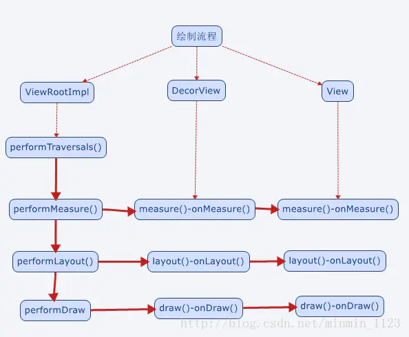
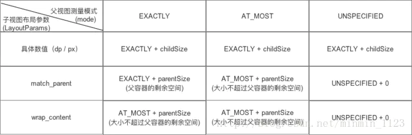
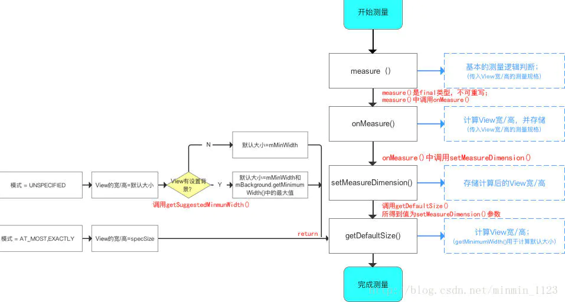
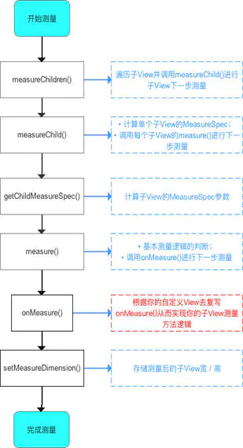
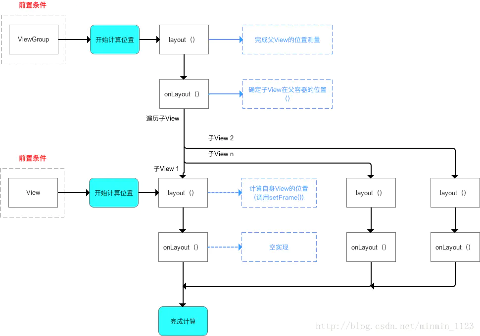
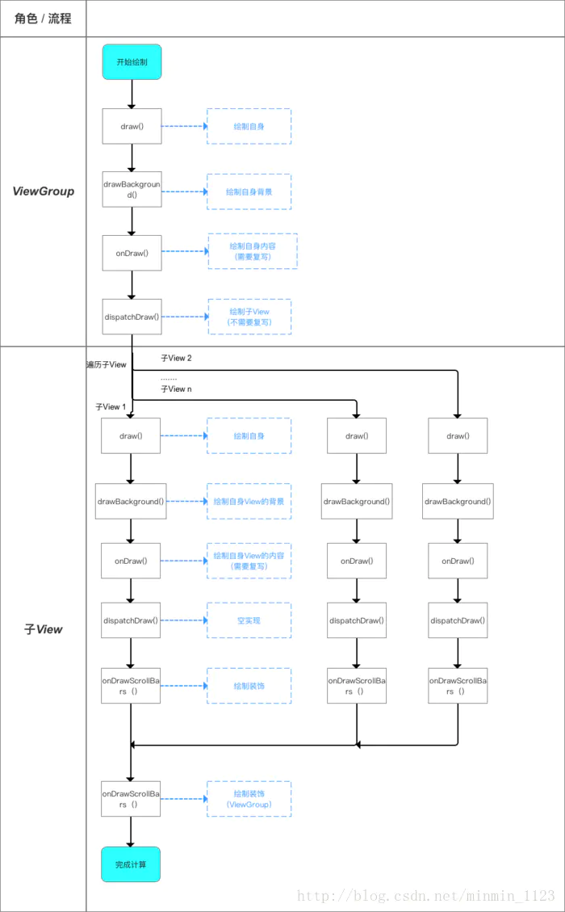

## View 绘制流程

measure测量->layout布局->draw绘制

- measure确定View的**测量宽高**
- layout确定View的**最终宽高**和**四个顶点的位置**
- draw将View **绘制到屏幕**上
- 对应onMeasure()、onLayout()、onDraw()三个方法。

> **具体过程：**
>
> - ViewRoot对应于ViewRootImpl类，它是连接WindowManager和DecorView的纽带。
> - View的绘制流程是从**ViewRoot**和**performTraversals**开始。
> - performTraversals()依次调用performMeasure()、performLayout()和performDraw()三个方法，分别完成**顶级** View的绘制。
> - 其中，performMeasure()会调用measure()，measure()中又调用onMeasure()，实现对其所有子元素的measure过程，这样就完成了一次measure过程；接着子元素会重复父容器的measure过程，如此反复至完成整个View树的遍历。layout和draw同理。过程图如下：



**补充阅读**：[了解ViewRoot和DecorView](https://www.jianshu.com/p/3e3a488cb1bb)

### measure过程：确定测量宽高

> 先来理解**MeasureSpec**：
>
> - 作用：通过宽测量值**widthMeasureSpec**和高测量值**heightMeasureSpec**决定View的大小
> - 组成：一个32位int值，高2位代表**SpecMode**(测量模式)，低30位代表**SpecSize**( 某种测量模式下的规格大小)。
> - 三种模式：
>   - **UNSPECIFIED**：父容器不对View有任何限制，要多大有多大。常用于系统内部。
>   - **EXACTLY**(精确模式)：父视图为子视图指定一个确切的尺寸SpecSize。对应LyaoutParams中的**match_parent**或**具体数值**。
>   - **AT_MOST**(最大模式)：父容器为子视图指定一个最大尺寸SpecSize，View的大小不能大于这个值。对应LayoutParams中的**wrap_content**。
> - 决定因素：值由子**View的布局参数LayoutParams**和**父容器的MeasureSpec值**共同决定。具体规则见下图：



现在，分别讨论两种measure过程：

①View的measure：只有一个原始的View，通过measure()即可完成测量。过程图见下：



View的measure过程图

> 从getDefaultSize()中可以看出，直接继承View的自定义View需要重写onMeasure()并设置wrap_content时的自身大小，否则效果相当于macth_parent。解决上述问题的典型代码：

```java
@Override
    protected void onMeasure(int widthMeasureSpec, int heightMeasureSpec) {
        super.onMeasure(widthMeasureSpec,heightMeasureSpec);
        
int widthSpecMode = MeasureSpec.getMode(widthMeasureSpec);
        int widthSpecSize = MeasureSpec.getSize(widthMeasureSpec);
        int heightSpecMode = MeasureSpec.getMode(heightMeasureSpec);
        int heightSpecSize = MeasureSpec.getSize(heightMeasureSpec);
        //分析模式，根据不同的模式来设置
        if(widthSpecMode == MeasureSpec.AT_MOST && heightSpecMode == MeasureSpec.AT_MOST){
            setMeasuredDimension(mWidth,mHeight);
        }else if(widthSpecMode == MeasureSpec.AT_MOST){
            setMeasuredDimension(mWidth,heightSpecSize);
        }else if(heightSpecMode == MeasureSpec.AT_MOST){
            setMeasuredDimension(widthSpecSize,mHeight);
        }
    }
```

**补充阅读：**[为什么你的自定义View wrap_content不起作用](https://www.jianshu.com/p/ca118d704b5e)

②ViewGroup的measure：除了完成ViewGroup自身的测量外，还会遍历去调用所有子元素的measure方法。

> ViewGroup中没有重写onMeasure()，而是提供**measureChildren()**。



ViewGroup的measure过程图

**图片来源**：[自定义View Measure过程](https://www.jianshu.com/p/1dab927b2f36)

### layout过程：确定View的最终宽高和四个顶点的位置

> - 大致流程：从顶级View开始依次调用layout()，其中子View的layout()会调用setFrame()来设定自己的四个顶点（mLeft、mRight、mTop、mBottom），接着调用onLayout()来确定其坐标，注意该方法是空方法，因为不同的ViewGroup对其子View的布局是不相同的。



layout过程图

**图片来源**：[自定义View Layout过程](https://www.jianshu.com/p/158736a2549d)

### draw过程：绘制到屏幕

绘制顺序：

- 绘制背景：**background.draw(canvas)**
- 绘制自己：**onDraw(canvas)**
- 绘制children：**dispatchDraw(canvas)**
- 绘制装饰：**onDrawScrollBars(canvas)**



draw过程图

> **注意**：Vew有一个特殊的方法**setWillNotDraw()**，该方法用于设置 **WILL_NOT_DRAW** 标记位（其作用是当一个View不需要绘制内容时，系统可进行相应优化）。**默认**情况下View是**没有**这个优化标志的（设为true）。

**图片来源**：[自定义View Draw过程](https://www.jianshu.com/p/95afeb7c8335)

**推荐阅读**：[对View工作流程的理解（源码)](https://www.jianshu.com/p/dc32ed4a384e)

