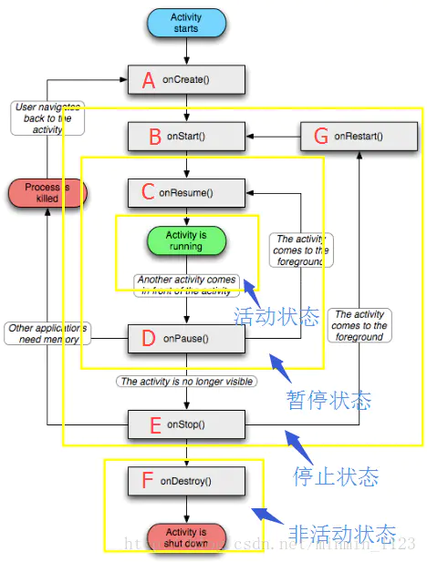
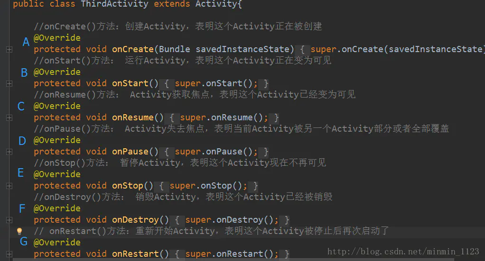

## Activity生命周期

下图表示了Activity从创建到销毁的一个完整的生命周期，包含七种方法和四种状态

### 七种方法

### 四种状态

**活动状态**：Activity处于页面最顶端。当启动应用时，将依次调用方法A->B->C，使应用获得焦点处于活动状态。

**暂停状态**：Activity失去焦点，但此时对用户可见。比如当另一个Activity在前一个Activity之上，而前一个Activity又是可见的并且部分透明或者没有覆盖整个屏幕时，该Activity会调用方法D失去焦点。返回到该Activity后又会调用C方法使它又处于活动状态。

**停止状态**：Activity完全被遮挡，但此时还保留所有状态和成员信息。比如当按下Home键使得应用处于后台，这个过程调用方法D->E，应用处于暂停状态；当重新回到应用，这个过程调用方法G->B->C，使应用再次获得焦点。

 **非活动状态**：Activity被销毁。当退出应用时，调用方法D->E->F最后整个应用被销毁。

### 生命周期全解析

#### 典型情况下Activity生命周期

 a.`onCreate()`:

- 状态：Activity **正在创建**
- 任务：做**初始化**工作，如setContentView界面资源、初始化数据
- 注意：此方法的传参**Bundle**为该Activity上次被异常情况销毁时保存的状态信息。

b.`onStart()`:

- 状态：Activity **正在启动**，这时Activity **可见但不在前台**，无法和用户交互。

c.`onResume()`:

- 状态：Activity **获得焦点**，此时Activity **可见且在前台**并开始活动。

d.`onPause()`:

- 状态： Activity **正在停止**
- 任务：可做 **数据存储、停止动画**等操作。
- 注意：Activity切换时，旧Activity的onPause会先执行，然后才会启动新的Activity。

e.`onStop()`:

- 状态：Activity **即将停止**
- 任务：可做**稍微重量级回收工作**，如取消网络连接、注销广播接收器等。
- 注意：新Activity是透明主题时，旧Activity都不会走onStop。

f.`onDestroy()`:

- 状态：Activity **即将销毁**
- 任务：做**回收工作、资源释放**。

g.`onRestart()`:

- 状态：Activity **重新启动**，Activity由后台切换到前台，由不可见到可见。

> **onStart()和onResume()、onPause()和onStop()的区别：** onStart与onStop是从Activity是否可见这个角度调用的，onResume和onPause是从Activity是否显示在前台这个角度来回调的，在实际使用没其他明显区别。

#### Activity生命周期的切换过程

 ①启动一个Activity：

- onCreate()-->onStart()-->onResume()

②打开一个新Activity：

- 旧Activity的onPause() -->新Activity的onCreate()-->onStart()-->onResume()-->旧Activity的onStop()

③返回到旧Activity：

- 新Activity的onPause（）-->旧Activity的onRestart()-->onStart()-->onResume()-->新Activity的onStop()-->onDestory();

④Activity1上弹出对话框Activity2：

- Activity1的onPause()-->Activity2的onCreate()-->onStart()-->onResume()

⑤关闭屏幕/按Home键：

- Activity2的onPause()-->onStop()-->Activity1的onStop()

⑥点亮屏幕/回到前台：

- Activity2的onRestart()-->onStart()-->Activity1的onRestart()-->onStart()-->Activity2的onResume()

⑦关闭对话框Activity2：

- Activity2的onPause()-->Activity1的onResume()-->Activity2的onStop()-->onDestroy()

⑧销毁Activity1：

- onPause()-->onStop()-->onDestroy()

#### 生命周期的各阶段

 a.**完整生命周期**：
 Activity在onCreate()和onDestroy()之间所经历的。
 在onCreate()中完成各初始化操作，在onDestroy()中释放资源。

b.**可见生命周期**：
 Activity在onStart()和onStop()之间所经历的。
 活动对于用户是可见的，但仍无法与用户进行交互。

c.**前台生命周期**：
 Activity在onResume()和onPause()之间所经历的。
 活动可见，且可交互。

#### onSaveInstanceState和onRestoreInstanceState

a.出现时机：**异常** 情况下Activity **重建**，非用户主动去销毁

b.系统异常终止时，调用**onSavaInstanceState**来保存状态。该方法调用在onStop之前，但和onPause没有时序关系。

> **onSaveInstanceState与onPause的区别：**前者适用于对临时性状态的保存，而后者适用于对数据的持久化保存。

c.Activity被重新创建时，调用**onRestoreInstanceState**（该方法在onStart之后），并将onSavaInstanceState保存的**Bundle**对象作为参数传到onRestoreInstanceState与onCreate方法。

> 可通过onRestoreInstanceState(Bundle savedInstanceState)和onCreate((Bundle savedInstanceState)来判断Activity是否被重建，并取出数据进行恢复。但需要注意的是，在onCreate取出数据时一定要先判断savedInstanceState是否为空。另外，谷歌更推荐使用onRestoreInstanceState进行数据恢复。

#### Activity异常情况下生命周期分析

a.**由于资源相关配置发生改变，导致Activity被杀死和重新创建**
 例如屏幕发生旋转：当竖屏切换到横屏时，会先调用onSaveInstanceState来保存切换时的数据，接着销毁当前的Activity，然后重新创建一个Activity，再调用onRestoreInstanceState恢复数据。

- onSaveInstanceState-->onPause（不定）-->onStop-->
   onDestroy-->onCreate-->onStart-->onRestoreInstanceState-->onResume

> 为了避免由于配置改变导致Activity重建，可在AndroidManifest.xml中对应的Activity中设置**android:configChanges="orientation|screenSize"**。此时再次旋转屏幕时，该Activity不会被系统杀死和重建，只会调用onConfigurationChanged。因此，当配置程序需要响应配置改变，指定**configChanges属性**，重写onConfigurationChanged方法即可。

b.**由于系统资源不足，导致优先级低的Activity被回收**
 ①Activity优先级排序：

- 前台可见Activity>前台可见不可交互Activity（前台Activity弹出Dialog)>后台Activity（用户按下Home键、切换到其他应用）

②当系统内存不足时，会按照Activity优先级从低到高去杀死目标Activity所在的进程。

③若一个进程没有四大组件在执行，那么这个进程将很快被系统杀死。

## Activity的创建方法

在简单了解配置文件和生命周期之后，接下来就可以用activity生命周期里一个重要方法——**onCreate()**实现如何创建一个Activity了。共四步：

step1：新建一个类，并继承AppCompatActivity类或Activity类。与Activity类不同的是，AppCompatActivity默认带标题栏，在v7包，且Android studio的工程也是默认继承AppcompatActivity类。
 step2：重写方法onCreate()。
 step3：用setContentView()方法设置在该Activity上显示的布局文件。

step4：最后一定要在AndroidManifest配置文件声明该Activity, 如果是主活动需要加上 intent-filter标签

## Activity四种启动模式

1.**Q：设置Activity启动模式的方法**
 **A：**
 a.在AndroidManifest.xml中给对应的Activity设定属性**android:launchMode**="standard|singleInstance|single Task|singleTop"。
 b.通过标记位设定，方法是**intent.addFlags(Intent.xxx)**。

2.**Q：Activity的四种LaunchMode**
 **A：**
 a.`standard`：标准模式、默认模式

- 含义：每次启动一个Activity就会创建一个新的实例。
- 注意：使用ApplicationContext去启动standard模式Activity就会报错。因为**standard模式的Activity会默认进入启动它所属的任务栈**，但是由于非Activity的Context没有所谓的任务栈。

b`.singleTop`：栈顶复用模式

- 含义：如果新Activity已经位于任务栈的栈顶，就不会重新创建，并回调**onNewIntent(intent)**方法。

c.`singleTask`：栈内复用模式

- 含义：只要该Activity在一个任务栈中存在，都不会重新创建，并回调**onNewIntent(intent)**方法。如果不存在，系统会先寻找是否存在需要的栈，如果不存在该栈，就创建一个任务栈，并把该Activity放进去；如果存在，就会创建到已经存在的栈中。

d.`singleInstance`：单实例模式

- 含义： 具有此模式的Activity只能单独位于一个任务栈中，且此任务栈中只有**唯一**一个实例。

> 标识Activity任务栈名称的属性：**android：taskAffinity**，默认为应用包名。

3.**常用的可设定Activity启动模式的标记位**

①**FLAG_ACTIVITY_SINGLE_TOP**:对应singleTop启动模式。
②**FLAG_ACTIVITY_NEW_TASK** ：对应singleTask模式。

## 页面跳转的实现

这样应用中就有多个活动页面，那如何实现页面之间的跳转呢？这里需要引入一个重要的类：**Intent类**（意图），它可以协助完成Android各个组件之间的通讯，充当信使的作用。

### 无结果的页面跳转

### 有结果的页面跳转

step1.首先在当前页面onCreate方法里换一种执行意图的方法，具体步骤如下：

- 注册点击事件
- 初始化一个Intent对象，参数表示（上下文对象，目标文件）,意图从当前页面跳转到目标页面
- 用方法startActivityForResult执行意图，参数表示（Intent对象，请求访问界面即主动方的int型标志）

step.2.然后在目标页面onCreate方法里准备回传的数据：

- 注册点击事件
- 初始化一个Intent对象，但不需要实现跳转,而需要用它的方法putExtra存储需要回传的数据
- 用方法setResult回传数据，参数表示(被请求访问界面即被动方的int型标志,Intent对象)
-  用finish()结束目标页面的进程

step.3 最后再回到当前页面，用方法onActivityResult接收回传数据，参数表示（请求访问界面即主动方的int型标志，被请求访问界面即被动方的int型标志，Intent对象）

## IntentFilter匹配规则

> **原则：**
>  ①一个intent只有**同时**匹配某个Activity的intent-filter中的action、category、data才算**完全匹配**，才能启动该Activity。
>  ② 一个Activity可以有**多个** intent-filter，一个 intent只要成功匹配**任意一组** intent-filter，就可以启动该Activity。

a. **action**匹配规则：

- 要求intent中的action **存在**且必须和intent-filter中的**其中一个** action相同。
- 区分大小写。

b. **category**匹配规则：

- intent中的category可以不存在，这是因为此时系统给该Activity **默认**加上了**< category  android:name="android.intent.category.DEAFAULT" />**属性值。
- 除上述情况外，有其他category，则要求intent中的category和intent-filter中的**所有**category 相同。

c. **data**匹配规则：

- 如果intent-filter中有定义data，那么Intent中也必须也要定义date。
- data主要由mimeType(媒体类型)和URI组成。在匹配时通过**intent.setDataAndType(Uri data, String type)**方法对date进行设置。

> 采用隐式方式启动Activity时，可以用PackageManager的resolveActivity方法或者Intent的resolveActivity方法判断是否有Activity匹配该隐式Intent。

**推荐阅读：**[intent-filter的action，category，data匹配规则](https://www.jianshu.com/p/5f644e0fdba9)

