## 普通广播

普通广播是一种**完全异步**执行的广播，在广播发出之后，所有的广播接收器几乎都会在同一时刻接收到这条广播消息，因此它们接收的先后是随机的。另外，接收器不能截断普通广播。标准广播的工作流程如图所示：

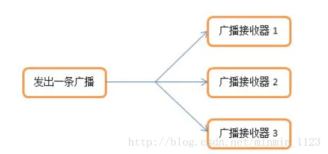

### 接收系统广播

想要接收一个广播，就要有能接收这个广播的接收器。下图展示了如何实现一个BroadcastReceiver的全过程：

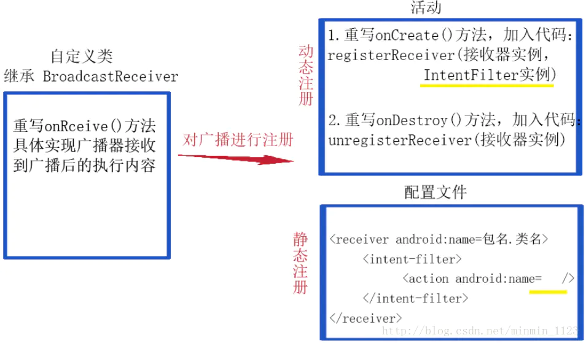

可以看到，具体用法是：
 第一步：自定义接收器类并继承BroadcastReceiver，然后具体实现**onReceive()**方法。几点注意：BroadcastReceiver生命周期只有十秒左右，因此在onReceive()**不要**做一些耗时的操作，应该发送给service，由service来完成；还有onReceive()**不要**开启子线程。

第二步：对广播接收器进行注册。有两种注册方法：一种在活动里通过代码**动态注册**，另一种在配置文件里**静态注册**。其实仔细观察，两种方式都是完成了对接收器以及它能接收的广播值这两个值的定义。这两种注册方法一个区别是：动态注册的接收器必须要在程序启动之后才能接收到广播，而静态注册的接收器即便程序未启动也能接收到广播，比如想接收到手机开机完成后系统发出的广播就只能用静态注册了。

举个例子，当网络状态发生变化时，系统会发出一条值为**android.net.conn.CONNECTIVITY_CHANGE**的广播，假设已经准备好了接收器MyReceiver，如果选择动态注册，方法是修改MainActivity：

```java
private IntentFilter intentFilter;
private MyReceiver myReceiver;

protected void onCreate(Bundle savedInstanceState) {
    super.onCreate(savedInstanceState);
    setContentView(R.layout.activity_main);
    
    intentFilter = new IntentFilter();
    intentFilter.addAction("android.net.conn.CONNECTIVITY_CHANGE");
    
    myReceiver = new MyReceiver();
    registerReceiver(myReceiver, intentFilter);
}
@Override
protected void onDestroy() {
    super.onDestroy();
    unregisterReceiver(myReceiver);
}
```

也可以静态注册，在配置文件添加：

```xml
<receiver android:name=".MyReceiver" >
   <intent-filter>
      <action android:name="android.net.conn.CONNECTIVITY_CHANGE"/>
   </intent-filter>
</receiver>
```

最后别忘了查询系统的网络状态需要声明权限：

```xml
<uses-permission android:name="android.permission.ACCESS_NETWORK_STATE"/>
```

现在只要网络状态发生变化，MyReceiver就会接收到这条广播并执行onReceive()里具体的任务了。

### 发送自定义广播

我们自定义的接收器不仅可以接收Android内置的各种系统级别的广播，也可以接收我们自定义的广播。那么就来学习如何发送一个自定义广播，看看接收器的接收情况吧！

发送一个自定义的普通广播方法非常简单，利用Intent把要发送的广播的值传入，再调用了Context的**sendBroadcast()**方法将广播发送出去，这样所有监听该广播的接收器就会收到消息。

```cpp
Intent intent = new Intent("com.example.minmin.MY_BROADCAST");//指明要发送的广播值
sendBroadcast(intent);
```

还是通过一个具体例子学习一下，先定义一个广播接收器，这里让它收到广播后弹出一个提示：

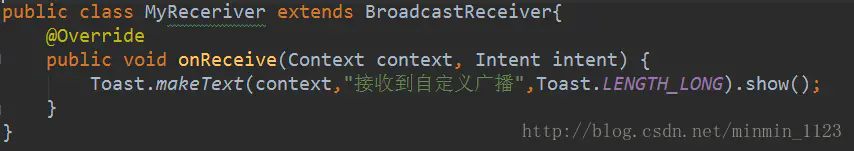

静态注册该接收器，定义它能接收一 条值为com.example.minmin.MY_BROADCAST的广播，一会儿就发这样的一条广播。

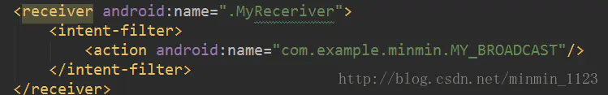

准备MainActvity的布局，这里就一个按钮用来发送广播。

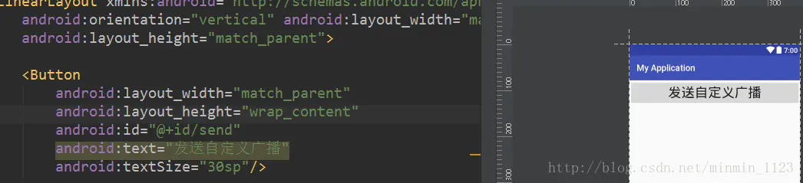

在这个按钮的点击事件完成发送一条值为com.example.minmin.MY_BROADCAST的广播。

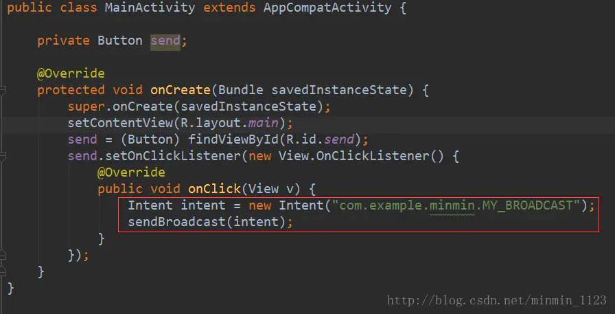

运行程序，发送自定义广播，接收器收到了！

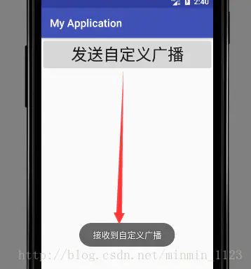

## 有序广播

有序广播是一种**同步执行**的广播，在广播发出之后，同一时刻只会有一个广播接收器能够收到这条广播消息，当这个广播接收器中的逻辑执行完毕后，广播才会继续传递，所以此时的广播接收器是有先后顺序的，且优先级（priority）高的广播接收器会先收到广播消息。有序广播可以被接收器截断使得后面的接收器无法收到它。有序广播的工作流程如图所示：

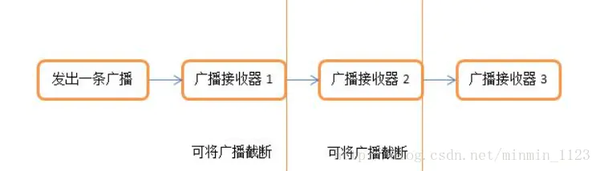

发送一个有序广播和普通广播的方法有细微的区别，只需要将sendBroadcast()方法改成**sendOrderedBroadcast()**方法， 它接收两个参数，第一个参数仍是Intent，第二个参数是一个与权限相关的字符串，这里传入 null就行。代码见下：

```csharp
Intent intent = new Intent("com.example.minmin.MY_BROADCAST");//指明要发送的广播值
sendOrderBroadcast(intent,null);
```

此时广播接收器是有先后顺序的，而且前面的广播接收器还可以将广播截断，以阻止其继续传播。为了说明这个情况，再自定义一个广播器看看吧！

这里AnotherReceiver接受广播后也弹出一个提醒，就用最后的“**！！**”来区分吧。

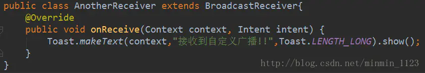

那如何让AnotherReceiver先接收到值为com.example.minmin.MY_BROADCAST的广播呢？只要在注册的时候设定它的优先级**android:priority**为100，数值越大优先级就越高，现在就能保证它一定会在MyReceiver之前收到广播。

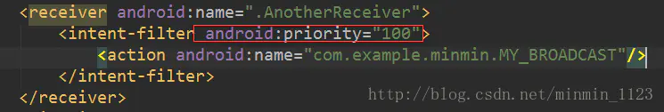

修改MainActivity中代码：

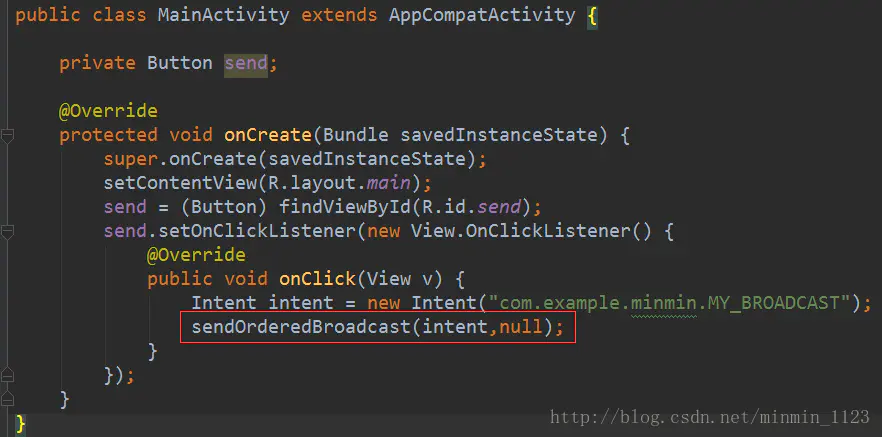

运行程序，会先弹出AnotherReceiver中的提示，之后才MyReceiver：

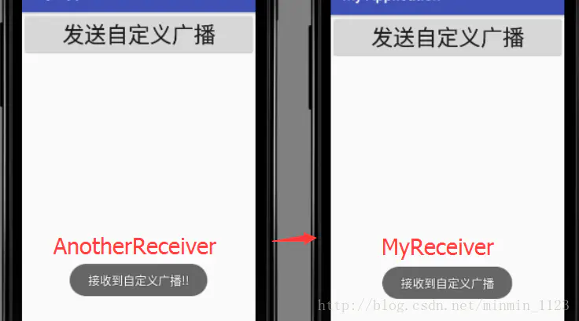

如果在AnotherReceiver的onReceive()方法中调用了**abortBroadcast()**方法，表示将这条广播截断，后面的广播接收器将无法再接收到这条广播。现在重新运行程序，并点击一下按钮，然后会发现，只有AnotherReceiver中的Toast信息弹出，说明这条广播经过AnotherReceiver之后确实是终止传递了。

## 本地广播

前面学到的的广播都属于系统**全局**广播，即发出的广播可被其他应用程序接收到，且我们也可接收到其他任何应用程序发送的广播。为了能够简单地解决全局广播可能带来的安全性问题，Android引入了一套本地广播机制，使用这个机制发出的广播只能够在应用程序的**内部**进行传递，并且广播接收器也只能接收本应用程序发出的广播。

实现本地广播的发送和接收也很简单，主要使用了一个**LocalBroadcastManager**来对广播进行管理，并提供了相应的发送广播和注册广播接收器的方法。

首先通过**LocalBroadcastManager.getInstance(this)**方法获取一个LocalBroadcastManager实例，然后用LocalBroadcastManager提供的**registerReceiver()**和**unregisterReceiver()**方法来动态注册和取消接收器以及**sendBroadcast()**方法发送本地广播。是不是非常熟悉？看了下图展示的代码你会更清楚：

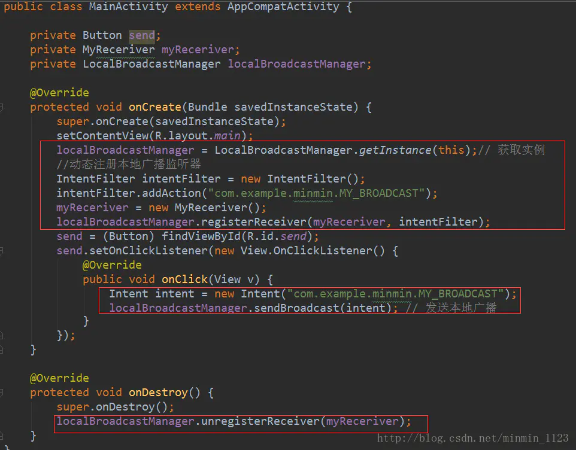

这基本上就和我们前面所学的动态注册广播接收器以及发送广播的代码是一样的！非常好理解。运行之后点击按钮也能看到MyReceiver的Toast提示了！

注意一点，本地广播是无法通过静态注册的方式来接收的，因为静态注册主要就是为了让程序在未启动的情况下也能收到广播，而发送本地广播时，应用程序肯定已经启动了，也完全不需要使用静态注册的功能。

## 粘性广播

通过**Context.sendStickyBroadcast()**方法可发送粘性(sticky)广播，这种广播会一直滞留，当有匹配该广播的接收器被注册后，该接收器就会收到此条广播。注意，发送粘性广播还需要**BROADCAST_STICKY**权限：

```xml
<uses-permission android:name="android.permission.BROADCAST_STICKY"/>
```

sendStickyBroadcast()只保留最后一条广播，并且一直保留下去，这样即使已经有广播接收器处理了该广播，一旦又有匹配的广播接收器被注册，该粘性广播仍会被接收。如果只想处理一遍该广播，可通过**removeStickyBroadcast()**方法来实现。接收粘性广播的过程和普通广播是一样的，就不多介绍了。


