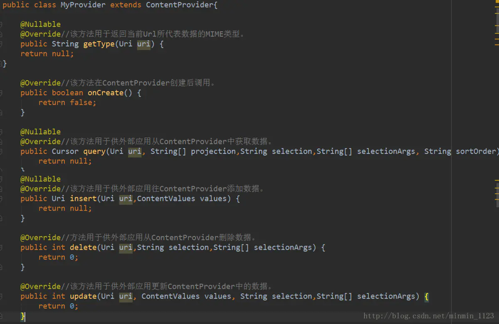

## ContentProvider概要

ContentProvider也有存储数据的功能，但与上一篇中学习的那三种数据存储方法不同的是，后者保存下的数据只能被该应用程序使用，而前者可以让不同应用程序之间进行数据共享，它还可以选择只对哪一部分数据进行共享，从而保证程序中的隐私数据不会有泄漏风险。所以组件ContentProvider主要负责存储和共享数据。

ContentProvider有两种形式：可以使用现有的内容提供者来读取和操作相应程序中的数据，也可以创建自己的内容提供者给这个程序的数据提供外部访问接口。下面分别学习一下。

## 从系统提供的Provider访问数据

既然ContentProvider有对外共享数据的功能，换句话说，其他应用程序可以通过ContentProvider对应用中的数据进行增删改查，说到这里是否感到熟悉？上篇学习SQLite数据存储的时候就提到过可以实现增删改查的各种辅助性方法，实际上ContentProvider是对SQLiteOpenHelper的进一步封装，因此它们使用的方法太像了，只不过不再用单纯的**表名**指明被操作的表，毕竟现在是其他程序访问它，而是用有一定格式规范的**内容URI**来代替。下面先来学习URI的组成。

### 内容URI的组成

以上篇最后做的关于数据库的demo为例，它的包名是com.example.myapplication，如果其他程序想访问该程序student.db中的student表，那么需要的内容URI如图所示：


可以看出内容 URI 可以非常清楚地表达出我们想要访问哪个程序中哪张表里的数据，但还没完，还需要将它解析成 Uri 对象才可以作为参数传入。通过调用 Uri.parse()方法，就可以将内容 URI 字符串解析成 Uri 对象了，代码如下：


### ContentResolve类

现在有了酷似“表名”的Uri，类似的，在ContentResolver类中提供的一系列用于对数据进行增删改查操作的方法也酷似SQLiteDatabase的那些辅助性方法：**insert()**方法用于添加数据，**update()**方法用于更新数据，**delete()**方法用于删除数据，**query()**方法用于查询数据。它们不仅方法名一样，连提供的参数都非常相似，见下图，红色部分是区别：


所以其他程序若想要访问ContentProvider中共享的数据的方法是：
 第一步：通过Context 中的**getContentResolver()**方法实例化一个ContentResolve对象。
 第二步：调用该对象的增删改查方法去操作ContentProvider中的数据。
 接下来通过读取联系人电话的小例子体验这个过程：

### 例子：读取联系人的电话

先在虚拟机上手动添加两个联系人和电话：


这样准备工作就做好了。然后建个布局，这里我们希望读取出来的联系人的信息能够在ListView中显示：


在活动中的onCreate()方法中，首先获取ListView控件的实例，并给它设置适配器，用ArrayAdapter就可以；然后调用init()方法去实现读取联系人电话的需求。


在init()方法中使用了ContentResolver的query()方法来查询系统的联系人数据。不过这里传入的 Uri 参数是一个常量**ContactsContract.Contacts.CONTENT_URI**，这是因为ContactsContract.Contacts类已经帮我们做好了封装，而这个常量就是使用 Uri.parse()方法解析出来的结果。接下来的过程就很熟悉了：用Cursor 对象进行遍历，先取出联系人姓名，这一列对应的常量是是**ContactsContract.Contacts.DISPLAY_NAME**，之后取出联系人的电话时，又进行一次遍历，这是因为一个联系人可能有多个电话，所以需要用ID唯一标识某个联系人然后到另一个表找他的所有电话。等名字和电话都取出之后，将它们拼接起来再添加到 ListView里。最后千万不要忘记将Cursor对象关闭掉。


因为读取系统联系人也是需要声明权限的，一定在配置文件中声明好

另外，Android6.0以上的系统要求部分权限还要手动申请，因此在活动中务必要添加一段代码：


这段代码很通用，不同权限只要更换名称就可用了：

```java
 final private int REQUEST_CODE_ASK_PERMISSIONS = 123;

  int hasWriteContactsPermission = ContextCompat.checkSelfPermission(this,Manifest.permission.READ_CONTACTS);
        if(hasWriteContactsPermission != PackageManager.PERMISSION_GRANTED) {
            if (Build.VERSION.SDK_INT >= Build.VERSION_CODES.M) {
                requestPermissions(new String[]{Manifest.permission.READ_CONTACTS},REQUEST_CODE_ASK_PERMISSIONS);
            }
            return;
        }
```

需要运行时权限的就是下图这几个：


现在就能看到之前添加的两个联系人的姓名和电话了！


## 创建自己的Provider

### UriMater类

UriMater类有匹配内容URI的功能，在这里常用它的两个方法：一个是**addURI()**方法用来传入URI，它接收三个参数（**权限，路径，一个自定义代码**）；另一个是**match()**方法用来匹配URI，接受一个Uri对象，返回值是某个能够匹配这个Uri对象所对应的自定义代码，利用这个自定义代码，就可以判断出调用方期望访问的是哪张表中的数据了。

### 自定义一个Provider的步骤

步骤一：新建一个类去继承ContentProvider。
 步骤二：重写ContentProvider的六个抽象方法，方法及含义如图：



步骤三：在配置文件中进行注册，并注明属性：
 **android:authorities**即Provider的权限，形式是**包名.provider**
 **android:name**即Provider的全名，形式是**包名.类名**
 **android:exported="true"**指明该Provider可被其它程序访问。

以上这些知识还是有点抽象，那还是再来个例子更深刻感受一下吧！

### 例子：为student.db创建MyProvider

接下里还是给上篇的数据库demo创建一个自定义提供器MyProvider，然后在别的应用程序中通过MyProvider去操作student.db中的数据。

先修改MyHelper，将Toast提示语句都去掉，因为跨程序访问时我们不能直接使用 Toast。


然后开始自定义提供器吧！一开始定义了四个常量，分别表示访问student表中的所有数据、访问student表中的单条数据（student/#用于表示student表中任意一行记录）、访问course表中的所有数据和访问course表中的单条数据。然后在静态代码块里对UriMatcher进行了初始化操作，将期望匹配的几种URI格式添加了进去。


接下来就是六个抽象方法的具体实现了，先看onCreate()方法，这里创建了一个MyHelper的实例，然后返回true表示内容提供器初始化成功，现在数据库就已经完成了创建或升级操作。


接下来是 getType()方法，需要返回一个MIME字符串。一个内容URI所对应的MIME字符串主要由三部分组分，Android对这三个部分做了以下格式规定：必须以**vnd**开头；如果内容URI以路径结尾，则后接**android.cursor.dir/**，如果内容URI以id结尾，则后接**android.cursor.item/**；最后接上**vnd.< authority>.< path>**。所以四个内容URI对应的MIME字符串分别是：


在query()方法里先获取到SQLiteDatabase的实例，然后根据传入的Uri参数判断出用户想要访问哪张表，再调用SQLiteDatabase的query()进行查询并将Cursor对象返回就好了。注意当访问的是单条数据时调用了Uri对象的getPathSegments()方法，它会将内容URI权限之后的部分以“/”符号进行分割，并把分割后的结果放入到一个字符串列表中，那这个列表的第0个位置存放的就是路径，第1个位置存放的就是id了。得到了id之后，再通过selection和selectionArgs参数进行约束，就实现了查询单条数据的功能。


再看insert()方法，同样的，先获取到SQLiteDatabase的实例，然后根据传入的Uri参数判断出用户想要往哪张表里添加数据，再调用SQLiteDatabase的insert()方法进行添加就可以了。注意insert()方法要求返回一个能够表示这条新增数据的 URI，所以还需要调用Uri.parse()方法将一个以新增数据的id结尾的内容URI解析成Uri对象。


再来看delete()方法，和前面一样的，不同的是这里需要在调用SQLiteDatabase的delete()方法删除特定记录的同时还要把被删除的行数作为返回值返回。


终于到了最后一个方法update()，和delete()相似的，在调用SQLiteDatabase的 update()方法进行更新的同时还要把受影响的行数作为返回值返回。


最后将MyProvider在AndroidManifest.xml文件中注册，一个自定义内容提供器终于完成了！


现在需要做的是将该程序从模拟器中卸载防止之前产生的遗留数据对后面操作有干扰，然后再运行一下重新安装在模拟器上，启动后直接关闭掉。接下来创建一个新的module，注意包要不同，代表其他程序。新建一个布局test.xml并放四个按钮：


接下来在活动分别处理四个按钮的点击事件。到目前为止这是第三次用增删改出方法去操作数据了，相信这些代码已经不难理解了！调用Uri.parse()将一个内容URI解析成Uri对象，这里希望操作student.db中的student表。又获取到ContentResolver对象就可以进行CRUD操作了，这里插入两条记录，并且通过第一条记录的insert()方法得到一个Uri对象，这个对象中包含了新增记录的id，调用getPathSegments()方法将它取出，之后利用这个id合成新的内容URI和Uri对象方便给该条记录进行更改和删除的操作。查询操作完成的打印出表中所有的数据。


现在运行这个程序，分别进行以下几个测试，观察打印出的数据的变化，和预想是一样的！


