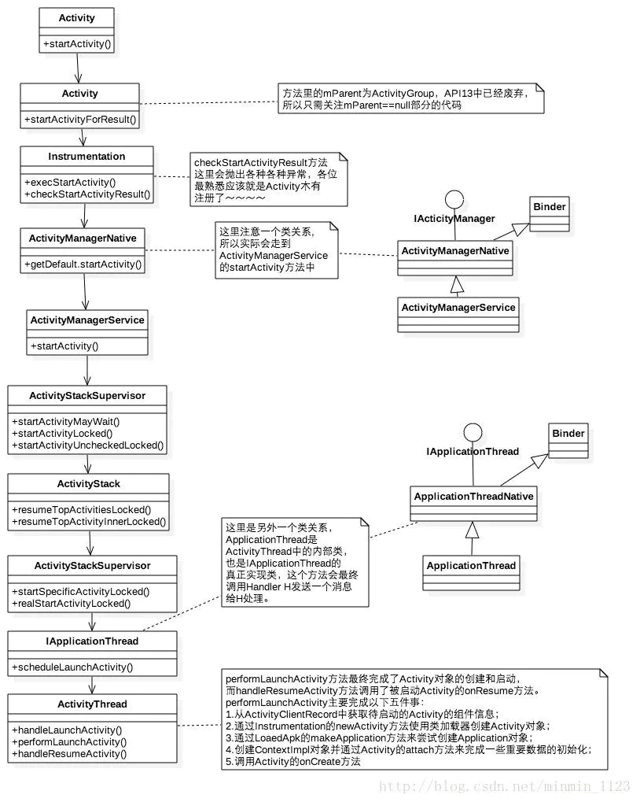
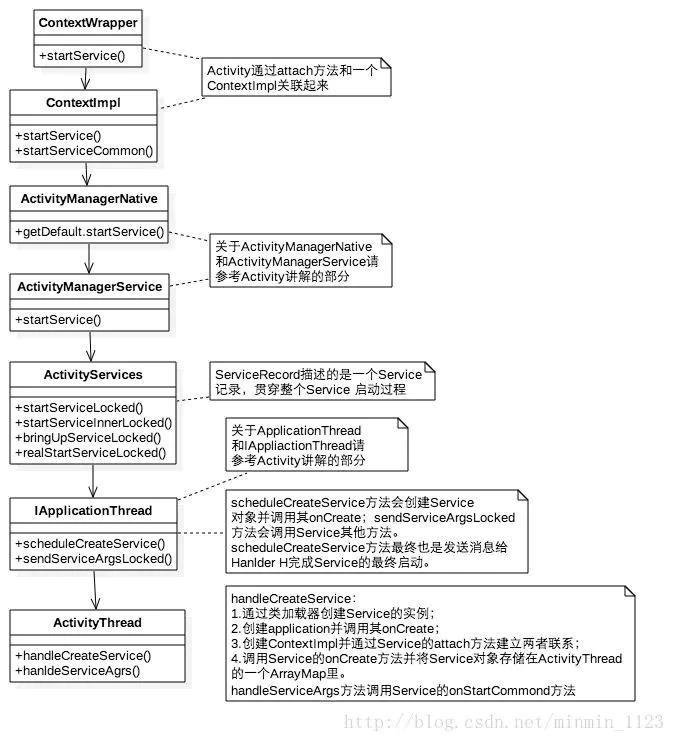
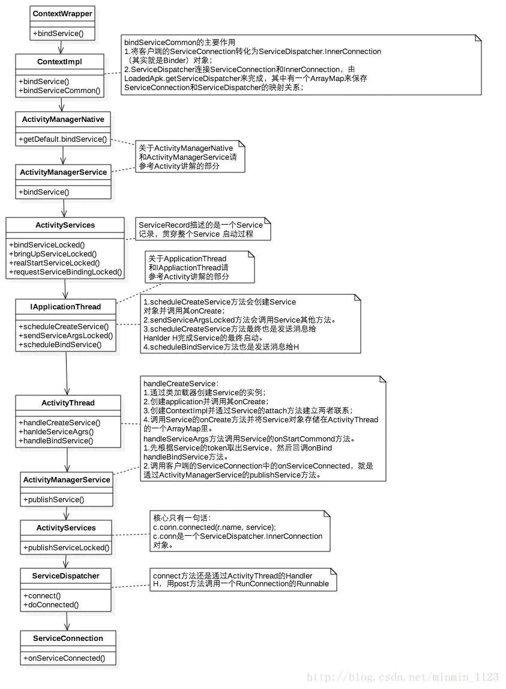
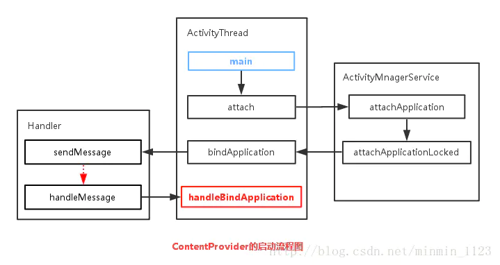
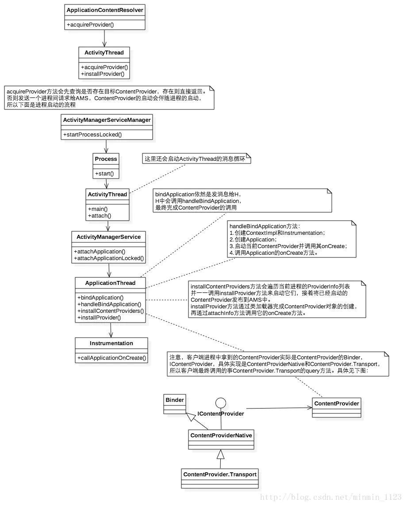
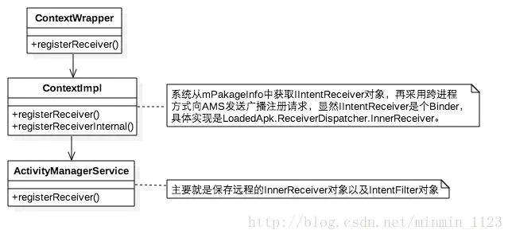
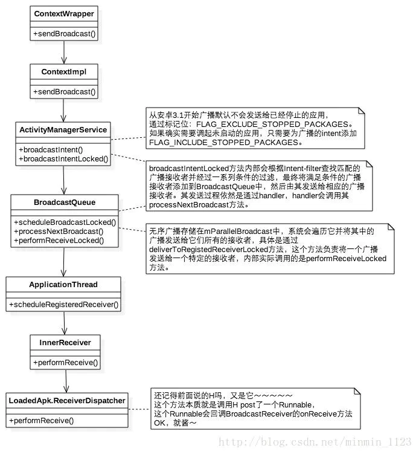

## Activity

Activity启动过程流程图：

**结论**：

- ActivityManagerService、ApplicationThread都是**Binder**。
- Application的创建也是通过**Instrumentation**来完成的，这个过程和Activity对象一样，都是通过类加载器来实现的。
- Activity的启动过程最终回到**ApplicationThread**中，通过`ApplicationThread.scheduleLaunchActivity()` 将启动Activity的消息发送并交由**Handler H**处理。
- Handler H对消息的处理会调用`handleLaunchActivity()`->`performLaunchActivity()`得以最终完成Activity的创建和启动。

**源码分析**：[Activity的工作过程](https://link.jianshu.com?t=http%3A%2F%2Fblog.csdn.net%2Fzizidemenghanxiao%2Farticle%2Fdetails%2F50639025)

## Service

- Service启动过程流程图：

- Service绑定过程流程图：

**结论**：

- **ContextImpl**是Context的具体实现，通过`Activity.attach()`和Activity建立关联。`Activity.attach()`中还会完成Window的创建并和Activity&Window的关联，由此事件可传递给Window。
- ActivityServices是一个辅助ActivityManagerService(**AMS**)进行Service管理的类，包括Service的启动、绑定和停止。
- 和Activity类似的，Service的启动/绑定过程最终回到**ApplicationThread**中，通过`ActivityThread.handleCreateService()`/`ActivityThread.handleBindService`完成Service的启动/绑定，注意绑定Service的后续还必须 告知客户端已经成功连接Service 的这一流程，由`ActivityManagerService.publishService()`去完成。

**源码分析**： [Service的工作过程](https://link.jianshu.com?t=http%3A%2F%2Fblog.csdn.net%2Fjly0612%2Farticle%2Fdetails%2F51249960)

## ContentProvider

- ContentProvider启动过程流程图：

> - 启动的入口为`ActivityThread.main()`：创建ActivityThread实例并创建主线程消息队列；
> - ->`ActivityThread.attach()`：远程调用`AMS.attachApplication()`并提供ApplicationThread用于和AMS的通信；
> - ->`AMS.attachApplication()`：通过`ActivityThread.bindApplication()`方法和Handler H来调回`ActivityThread.handleBindApplication()`;
> - ->`ActivityThread.handleBindApplication()`：先创建Application、再加载ContentProvider、最后回调`Application.onCreate()`。

**图片来源**：[四大组件的工作过程](https://link.jianshu.com?t=http%3A%2F%2Fblog.csdn.net%2Ftgzzl%2Farticle%2Fdetails%2F52234771)

- Query过程流程图：

`insert()`、`delete()`和`update()`类似，这里不展开

**结论**：

- ContentProvider的**multiprocess**属性：ContentProvider是否是单例，一般用单例。
- 访问ContentProvider需要ContentResolver，其真正实现类是**ApplicationContentResolver**。当ContentProvider所在进程未启动时，第一次访问它会触发ContentProvider的创建以及进程启动。
- 当ContentProvider所在的进程启动时，会同时被启动并被发布到AMS中。注意：`ContentProvider.onCreate()`要**先**于`Application.onCreate()`执行。
- 同样的，最终通过`ActivityThread.handleBindApplication()`完成ContentProvider的创建。

**源码分析**：[ ContentProvider的工作过程](https://link.jianshu.com?t=http%3A%2F%2Fblog.csdn.net%2FEthanCo%2Farticle%2Fdetails%2F55224723)

## BroadcastReceiver

- 四大组件的静态注册都是在应用安装时由**PackageManagerService**（PMS）解析注册，当**动态注册Service时**流程为：

- 广播发送和接收过程流程图：

结论：

- 动态注册广播最终会跨进程交给AMS，并把远程Receiver( 实际上传的是IIntentReceiver，是个Binder )对象和远程IntentFilter保存起来，完成注册任务。
- 发送广播时，系统为intent添加了两个标记位：
  - **FLAG_INCLUDE_STOPPED_PACKAGES** ：广播也会发送到已经停止的APP（两个标记共存时，以该标记为准）
  - **FLAG_EXCLUDE_STOPPED_PACKAGES** ：广播不会发送给已经停止的APP（系统为所有广播默认添加该标记）
- 最终在`ReceiverDispatcher .performReceive ()`里回调了Receiver 的`onReceive()`，使得广播得以接收并处理。

**源码分析**： [BroadcastReceiver 的工作过程](https://link.jianshu.com?t=http%3A%2F%2Fwww.open-open.com%2Flib%2Fview%2Fopen1475654927659.html)

