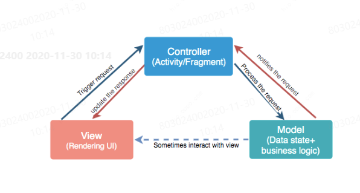
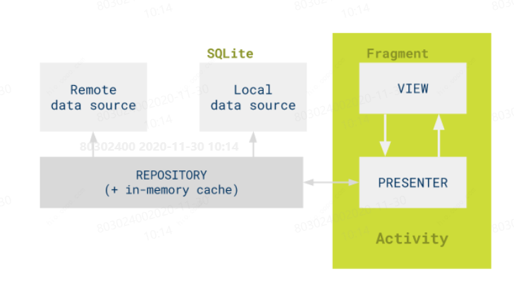
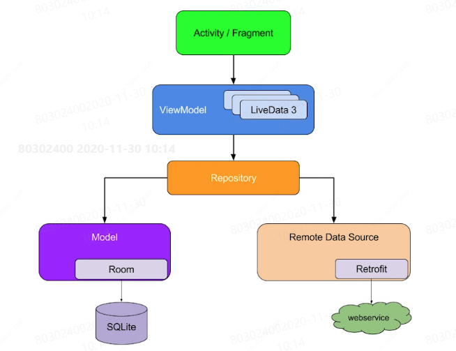
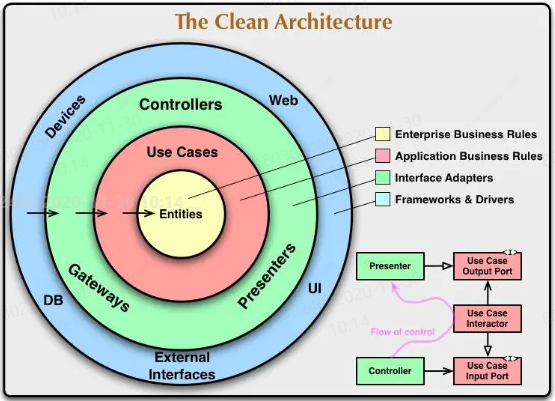

## MVC

在项目中：各层职责混杂，成为一个大泥球

- Activity --> Controller
- Activity --> View
- Activity --> Model
- Custom View --> View
- Custom View --> Controller

问题原因：

- Android框架中，Activity不太适合作为单纯的Controller层，一些View操作依赖Activity
- 缺少领域模型设计，导致过多的领域逻辑放在Activity中缺少持续的架构守护和看护

---

## MVP

优势：

- View是一个被动视图，更加轻量
- View和Model不直接交互，分层更清晰
- 基于接口，必要时可提供假实现，分工和单元测试都很便利
- 数据给到View前可以由Presenter进行预处理，且预处理逻辑很方便单元测试

劣势：

- Presenter逻辑容易堆积，导致Presenter与Model界限模糊
- 实现较繁琐、需定义很多接口

MVP 的分层自动化测试策略：

- 小型测试
  - Repository
  - Presenter
  - Model

- 中型测试
  - Local data source
  - Activity

- 大型测试
  - 功能测试
  - 性能测试

---

## MVVM

优势：

- View与ViewModel是双向绑定关系，使得View层的职责更加清晰和单一。
- 生命周期感知，避免泄露、提高性能。
- 可测试性高，利于分工协作（依赖注入）。
- 有丰富的工具组件便利于开发。

劣势：

- 学习成本高，Databinding、LiveData、ViewModel。
- 使用databinding的mvvm，难以debug在xml中的代码。
- Model层若没有好的设计，容易导致ViewModel成为一个大泥球

MVP 的分层自动化测试策略：

- 小型测试
  - Repository
  - ViewModel
  - Model

- 中型测试
  - Local data source
  - Service
  - Activity

- 大型测试
  - 功能测试
  - 性能测试

---

## Clean

目的：

应对更复杂的业务场景，解决P(MVP)/M(MVVM)层臃肿的问题领域层体现高度抽象的核心业务规则，独立于UI、数据库、框架更轻松的分层和集成测试

整洁架构和MVP/MVVM并不冲突，完全可以共存

Test：

Presentation Layer (表现层)：小型/中型测试， Robolectric、Espresso

Domain Layer (领域层)：小型测试，Junit、Mockito

Data Layer（数据层）：小型/中型测试，Robolectric（因为该层具有android依赖项），Junit、Mockito

