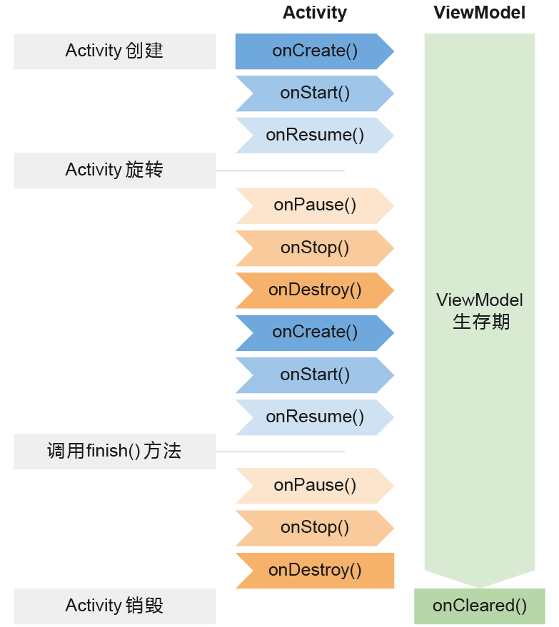

## ViewModel

ViewModel的一个重要作用就是可以帮助Activity分担一部分工作，它是专门用于存放与界面相关的数据的。也就是说，只要是界面上能看得到的数据，它的相关变量都应该存放在ViewModel中，而不是Activity中，这样可以在一定程度上减少Activity中的逻辑。

另外，ViewModel还有一个非常重要的特性。我们都知道，当手机发生横竖屏旋转的时候，Activity会被重新创建，同时存放在Activity中的数据也会丢失。而ViewModel的生命周期和Activity不同，它可以保证在手机屏幕发生旋转的时候不会被重新创建，只有当Activity退出的时候才会跟着Activity一起销毁。因此，将与界面相关的变量存放在ViewModel当中，这样即使旋转手机屏幕，界面上显示的数据也不会丢失。



```kotlin
class MainViewModel : ViewModel() {
    var counter = 0
}

class MainActivity : AppCompatActivity() {
    override fun onCreate(savedInstanceState: Bundle?) {
        super.onCreate(savedInstanceState)
        setContentView(R.layout.activity_main)
        val viewModel = ViewModelProviders.of(this).get(MainViewModel::class.java)
    }
}
```

---

## Lifecycles

感知Activity的生命周期并不复杂，但问题在于，在一个Activity中去感知它的生命周期非常简单，而如果要在一个非Activity的类中去感知Activity的生命周期，应该怎么办呢？

Lifecycles组件就是为了解决这个问题而出现的，它可以让任何一个类都能轻松感知到Activity的生命周期，同时又不需要在Activity中编写大量的逻辑处理。

```kotlin
class MyObserver : LifecycleObserver {

    @OnLifecycleEvent(Lifecycle.Event.ON_START)
    fun activityStart() {
        Log.d("MyObserver", "activityStart")
    }

    @OnLifecycleEvent(Lifecycle.Event.ON_STOP)
    fun activityStop() {
        Log.d("MyObserver", "activityStop")
    }

}
```

```kotlin
//Activity
lifecycle.addObserver(MyObserver())
```

---

## LiveData

LiveData是Jetpack提供的一种响应式编程组件，它可以包含任何类型的数据，并在数据发生变化的时候通知给观察者。

LiveData特别适合与ViewModel结合在一起使用，虽然它也可以单独用在别的地方，但是绝大多数情况下，它都是使用在ViewModel当中的。

```kotlin
class MainViewModel(countReserved: Int) : ViewModel() {

    val counter: LiveData<Int>
        get() = _counter

    //可变 LiveData 不应该暴露给 Activity，使用下横杆命名私有变量
    private val _counter = MutableLiveData<Int>()

    init {
        _counter.value = countReserved
    }

    fun plusOne() {
        val count = _counter.value ?: 0
        _counter.value = count + 1
    }

    fun clear() {
        _counter.value = 0
    }

    private val userLiveData = MutableLiveData<User>()

    //map：userName 监听 userLiveData 变化，lambda 返回 String
    val userName: LiveData<String> = Transformations.map(userLiveData) { user ->
        "${user.firstName} ${user.lastName}"
    }

    private val userIdLiveData = MutableLiveData<String>()

    //switchMap：user 监听 userLiveData 变化，lambda 返回 LiveData对象
    val user: LiveData<User> = Transformations.switchMap(userIdLiveData) { userId ->
        Repository.getUser(userId)
    }

    fun getUser(userId: String) {
        userIdLiveData.value = userId
    }

    private val refreshLiveData = MutableLiveData<Any?>()

    val refreshResult = Transformations.switchMap(refreshLiveData) {
        Repository.getUser("")
    }

    fun refresh() {
        refreshLiveData.value = refreshLiveData.value
    }

}

//获取数据模块
object Repository {
    fun getUser(userId: String): LiveData<User> {
        val liveData = MutableLiveData<User>()
        liveData.value = User(userId, userId, 0)
        return liveData
    }
}
```

```kotlin
//需要传参数给 ViewModel 需要使用 Factory
class MainViewModelFactory(private val countReserved: Int) : ViewModelProvider.Factory {

    override fun <T : ViewModel> create(modelClass: Class<T>): T {
        return MainViewModel(countReserved) as T
    }

}
```

```kotlin
// Activity onCreate
        sp = getPreferences(Context.MODE_PRIVATE)
        val countReserved = sp.getInt("count_reserved", 0)
        viewModel = ViewModelProviders.of(this, MainViewModelFactory(countReserved)).get(MainViewModel::class.java)

        plusOneBtn.setOnClickListener {
            viewModel.plusOne()
        }
        clearBtn.setOnClickListener {
            viewModel.clear()
        }
        viewModel.counter.observe(this, Observer{ count ->
            infoText.text = count.toString()
        })

        getUserBtn.setOnClickListener {
            val userId = (0..10000).random().toString()
            viewModel.getUser(userId)
        }
        viewModel.user.observe(this, Observer { user ->
            infoText.text = user.firstName
        })

//保存数据
    override fun onPause() {
        super.onPause()
        sp.edit {
            putInt("count_reserved", viewModel.counter.value ?: 0)
        }
    }
```

