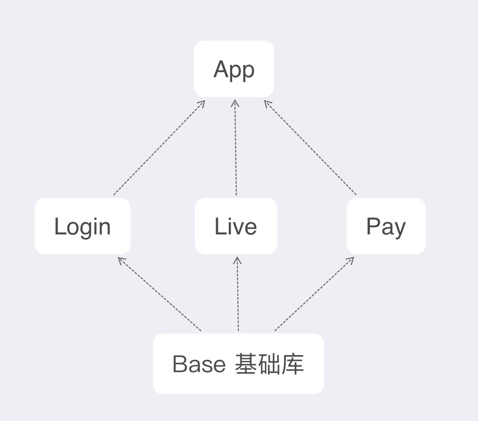
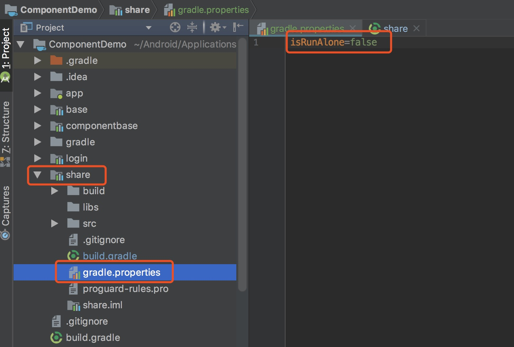
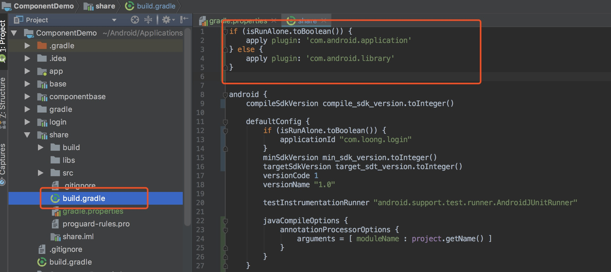
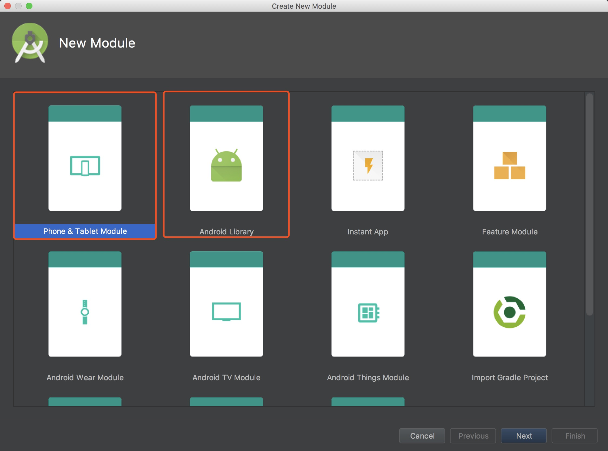
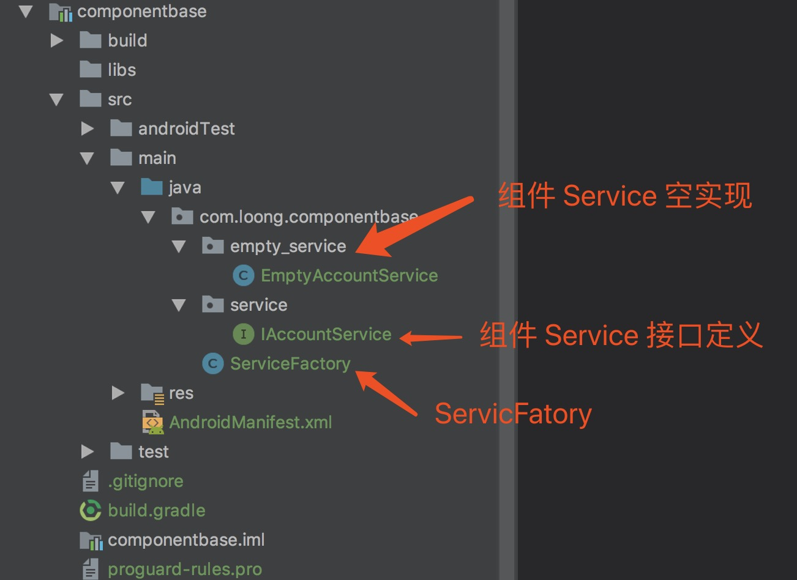
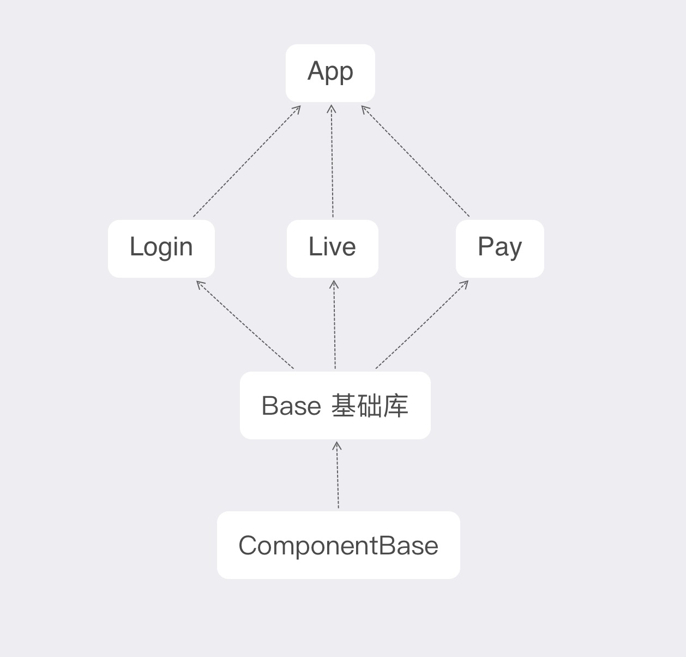
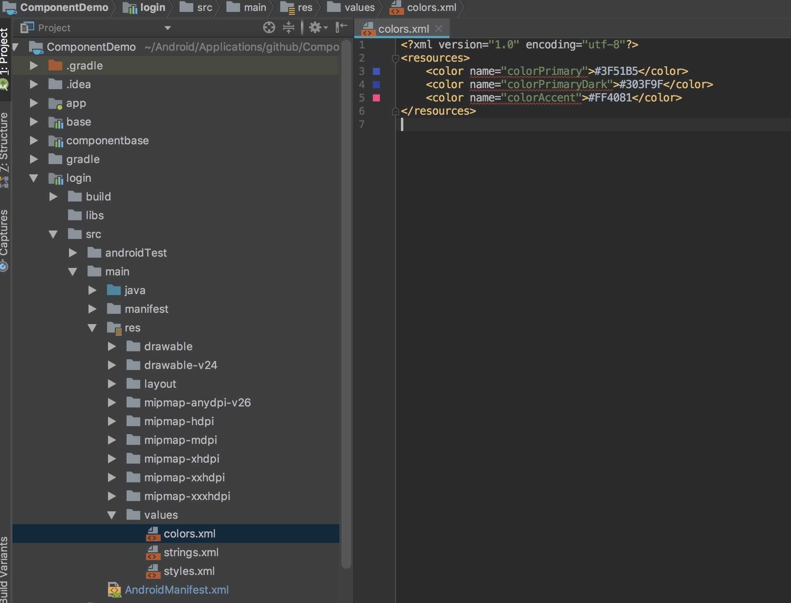
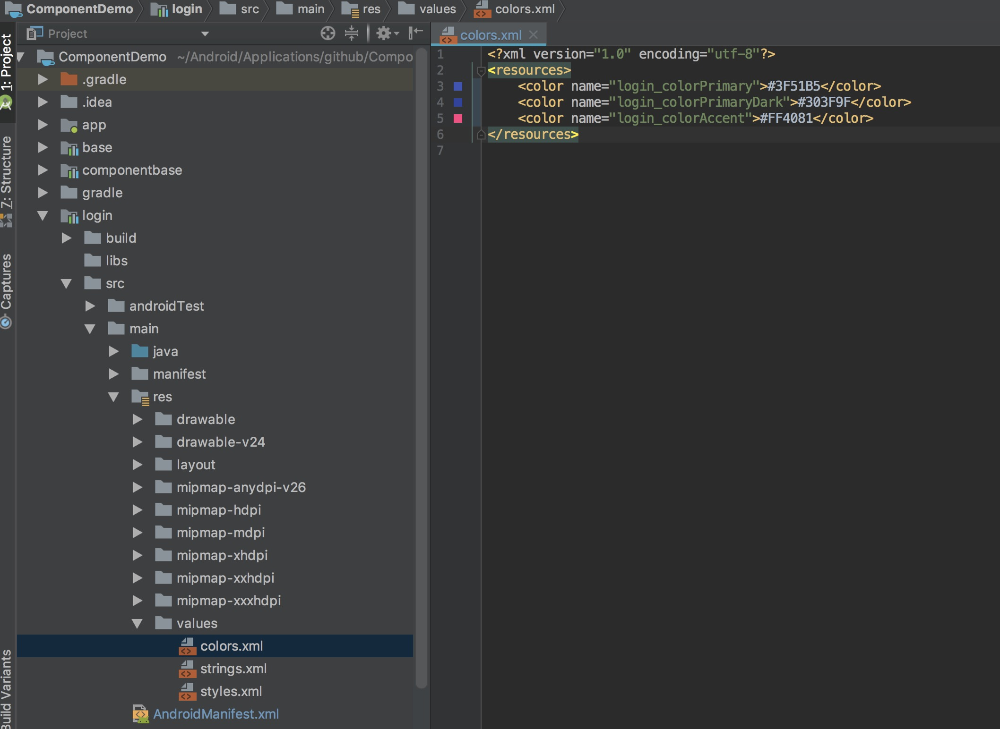

**Demo 地址 ：https://github.com/renxuelong/ComponentDemo**

## 演示为先


# Android 组件化最佳实践

在项目的开发过程中，随着开发人员的增多及功能的增加，如果提前没有使用合理的开发架构，那么代码会越来臃肿，功能间代码耦合也会越来越严重，这时候为了保证项目代码的质量，我们就必须进行重构。

比较简单的开发架构是按照功能模块进行拆分，也就是用 Android 开发中的 module 这个概念，每个功能都是一个 module，每个功能的代码都在自己所属的 module 中添加。这样的设计在各个功能相互直接比较独立的情况下是比较合理的，但是当多个模块中涉及到相同功能时代码的耦合又会增加。

例如首页模块和直播间模块中都可能涉及到了视频播放的功能，这时候不管将播放控制的代码放到首页还是直播间，开发过程中都会发现，我们想要解决的代码耦合情况又又又又出现了。为了进一步解决这个问题，组件化的开发模式顺势而来。

## 一、组件化和模块化的区别

上面说到了从普通的无架构到模块化，再由模块化到组件化，那么其中的界限是什么，模块化和组件化的本质区别又是什么？为了解决这些问题，我们就要先了解 “模块” 和 “组件” 的区别。

#### 模块

模块指的是独立的业务模块，比如刚才提到的 [首页模块]、[直播间模块] 等。

#### 组件

组件指的是单一的功能组件，如 [视频组件]、[支付组件] 等，每个组件都可以以一个单独的 module 开发，并且可以单独抽出来作为 SDK 对外发布使用。

由此来看，[模块] 和 [组件] 间最明显的区别就是模块相对与组件来说粒度更大，一个模块中可能包含多个组件。并且两种方式的本质思想是一样的，都是为了代码重用和业务解耦。在划分的时候，模块化是业务导向，组件化是功能导向。



上面是一个非常基础的组件化架构图，图中从上向下分别为应用层、组件层和基础层。

**基础层：** 基础层很容易理解，其中包含的是一些基础库以及对基础库的封装，比如常用的图片加载，网络请求，数据存储操作等等，其他模块或者组件都可以引用同一套基础库，这样不但只需要开发一套代码，还解耦了基础功能和业务功能的耦合，在基础库变更时更加容易操作。

**组件层：** 基础层往上是组件层，组件层就包含一些简单的功能组件，比如视频，支付等等

**应用层：** 组件层往上是应用层，这里为了简单，只添加了一个 APP ，APP 就相当于我们的模块，一个具体的业务模块会按需引用不同的组件，最终实现业务功能，这里如果又多个业务模块，就可以各自按需引用组件，最后将各个模块统筹输出 APP。

到这里我们最简单的组件化架构就已经可以使用了，但是这只是最理想的状态下的架构，实际的开发中，不同的组件不可能彻底的相互隔离，组件中肯定会有相互传递数据、调用方法、页面跳转等情况。

比如直播组件中用户需要刷礼物，刷礼物就需要支付组件的支持，而支付组件中支付操作是必须需要登录状态、用户 ID 等信息。如果当前未登录，是需要先跳转到登录组件中进行登录操作，登录成功后才能正常的进行支付流程。

而我们上面的架构图中，各个组件之间是相互隔离的，没有相互依赖，如果想直接进行组件交互，也就是组件间相互依赖，这就又违背了组件化开发的规则。所以我们必须找到方法解决这些问题才能进行组件化开发。

## 二、组件化开发需要解决的问题

在实现组件化的过程中，同一个问题可能有不同的技术路径可以解决，但是需要解决的问题主要有以下几点：

1. 每个组件都是一个完整的整体，所以组件开发过程中要满足单独运行及调试的要求，这样还可以提升开发过程中项目的编译速度。
2. 数据传递与组件间方法的相互调用，这也是上面我们提到的一个必须要解决的问题。
3. 组件间界面跳转，不同组件之间不仅会有数据的传递，也会有相互的页面跳转。在组件化开发过程中如何在不相互依赖的情况下实现互相跳转？
4. 主项目不直接访问组件中具体类的情况下，如何获取组件中 Fragment 的实例并将组件中的 Fragment 实例添加到主项目的界面中？
5. 组件开发完成后相互之间的集成调试如何实现？还有就是在集成调试阶段，依赖多个组件进行开发时，如果实现只依赖部分组件时可以编译通过？这样也会降低编译时间，提升效率。
6. 组件解耦的目标以及如何实现代码隔离？不仅组件之间相互隔离，还有第五个问题中模块依赖组件时可以动态增删组件，这样就是模块不会对组件中特定的类进行操作，所以完全的隔绝模块对组件中类的使用会使解耦更加彻底，程序也更加健壮。

以上就是实现组件化的过程中我们要解决的主要问题，下面我们会一个一个来解决，最终实现比较合理的组件化开发。

## 三、组件单独调试

### 1. 动态配置组件的工程类型？

在 AndroidStudio 开发 Android 项目时，使用的是 Gradle 来构建，具体来说使用的是 Android Gradle 插件来构建，Android Gradle 中提供了三种插件，在开发中可以通过配置不同的插件来配置不同的工程。

- App 插件，id: com.android.application
- Library 插件，id: com.android.libraay
- Test 插件，id: com.android.test

区别比较简单， App 插件来配置一个 Android App 工程，项目构建后输出一个 APK 安装包，Library 插件来配置一个 Android Library 工程，构建后输出 aar 包，Test 插件来配置一个 Android Test 工程。我们这里主要使用 App 插件和 Library 插件来实现组件的单独调试。这里就出现了第一个小问题，如何动态配置组件的工程类型？

通过工程的 build.gradle 文件中依赖的 Android Gradle 插件 id 来配置工程的类型，但是我们的组件既可以单独调试又可以被其他模块依赖，所以这里的插件 id 我们不应该写死，而是通过在 module 中添加一个 gradle.properties 配置文件，在配置文件中添加一个布尔类型的变量 isRunAlone，在 build.gradle 中通过 isRunAlone 的值来使用不同的插件从而配置不同的工程类型，在单独调试和集成调试时直接修改 isRunAlone 的值即可。例如，在 Share 分享组件中的配置：



### 2. 如何动态配置组件的 ApplicationId 和 AndroidManifest 文件

除了通过依赖的插件来配置不同的工程，我们还要根据 isRunAlone 的值来修改其他配置，一个 APP 是只有一个 ApplicationId 的，所以在单独调试和集成调试时组件的 ApplicationId 应该是不同的；一般来说一个 APP 也应该只有一个启动页， 在组件单独调试时也是需要有一个启动页，在集成调试时如果不处理启动页的问题，主工程和组件的 AndroidManifes 文件合并后就会出现两个启动页，这个问题也是需要解决的。

ApplicationId 和 AndroidManifest 文件都是可以在 build.gradle 文件中进行配置的，所以我们同样通过动态配置组件工程类型时定义的 isRunAlone 这个变量的值来动态修改 ApplicationId 和 AndroidManifest。首先我们要新建一个 AndroidManifest.xml 文件，加上原有的 AndroidManifest 文件，在两个文件中就可以分别配置单独调试和集成调试时的不同的配置，如图：


其中 AndroidManifest 文件中的内容如下：

```xml
// main/manifest/AndroidManifest.xml 单独调试
<?xml version="1.0" encoding="utf-8"?>
<manifest xmlns:android="http://schemas.android.com/apk/res/android"
    package="com.loong.share">

    <application
        android:allowBackup="true"
        android:icon="@mipmap/ic_launcher"
        android:label="@string/app_name"
        android:roundIcon="@mipmap/ic_launcher_round"
        android:supportsRtl="true"
        android:theme="@style/AppTheme">
        <activity android:name=".ShareActivity">
            <intent-filter>
                <action android:name="android.intent.action.MAIN" />

                <category android:name="android.intent.category.LAUNCHER" />
            </intent-filter>
        </activity>
    </application>

</manifest>

// main/AndroidManifest.xml 集成调试
<?xml version="1.0" encoding="utf-8"?>
<manifest xmlns:android="http://schemas.android.com/apk/res/android"
    package="com.loong.share">

    <application android:theme="@style/AppTheme">
        <activity android:name=".ShareActivity"/>
    </application>

</manifest>
```

然后在 build.gradle 中通过判断 isRunAlone 的值，来配置不同的 ApplicationId 和 AndroidManifest.xml 文件的路径

```java
// share 组件的 build.gradle

android {
    defaultConfig {
        if (isRunAlone.toBoolean()) {
            // 单独调试时添加 applicationId ，集成调试时移除
            applicationId "com.loong.login"
        }
        ...
    }
    
    sourceSets {
        main {
            // 单独调试与集成调试时使用不同的 AndroidManifest.xml 文件
            if (isRunAlone.toBoolean()) {
                manifest.srcFile 'src/main/manifest/AndroidManifest.xml'
            } else {
                manifest.srcFile 'src/main/AndroidManifest.xml'
            }
        }
    }
}
```

到这里我们就解决了组件化开发时遇到的第一个问题，实现了组件的单独调试与集成调试，并在不同情况时使用的不同配置。当然 build.gradle 中通过 Android Gradle 插件，我们还可以根据不同工程配置不同的 Java 源代码、不同的 resource 资源文件等的，有了上面问题的解决方式，这些问题就都可以解决了。

## 四、组件间数据传递与方法的相互调用

由于主项目与组件，组件与组件之间都是不可以直接使用类的相互引用来进行数据传递的，那么在开发过程中如果有组件间的数据传递时应该如何解决呢，这里我们可以采用 [接口 + 实现] 的方式来解决。

在这里可以添加一个 ComponentBase 模块，这个模块被所有的组件依赖，在这个模块中分别添加定义了组件可以对外提供访问自身数据的抽象方法的 Service。ComponentBase 中还提供了一个 ServiceFactory，每个组件中都要提供一个类实现自己对应的 Service 中的抽象方法。在组件加载后，需要创建一个实现类的对象，然后将实现了 Service 的类的对象添加到 ServiceFactory 中。这样在不同组件交互时就可以通过 ServiceFactory 获取想要调用的组件的接口实现，然后调用其中的特定方法就可以实现组件间的数据传递与方法调用。

当然，ServiceFactory 中也会提供所有的 Service 的空实现，在组件单独调试或部分集成调试时避免出现由于实现类对象为空引起的空指针异常。

下面我们就按照这个方法来解决组件间数据传递与方法的相互调用这个问题，这里我们通过**分享组件** 中调用 **登录组件** 中的方法来获取登录状态这个场景来演示。

### 1. 创建 componentbase 模块

AndroidStudio 中创建模块比较简单，通过菜单栏中的 File -> New -> New Module 来创建我们的 componentbase 模块。需要注意的是我们在创建组件时需要使用 Phone & Tablet Module ，创建 componentbase 模块时使用 Android Library 来创建，其中的区别是通过 Phone & Tablet Module 创建的默认是 APP 工程，通过 Android Library 创建的默认是 Library 工程，区别我们上面已经说过了。当然如果选错了也不要紧，在 buidl.gradle 中也可以自己来修改配置。如下图：



这里 Login 组件中提供获取登录状态和获取登录用户 AccountId 的两个方法，分享组件中的分享操作需要用户登录才可以进行，如果用户未登录则不进行分享操作。我们先看一下 componentbase 模块中的文件结构：



其中 service 文件夹中定义接口， IAccountService 接口中定义了 Login 组件向外提供的数据传递的接口方法，empty_service 中是 service 中定义的接口的空实现，ServiceFactory 接收组件中实现的接口对象的注册以及向外提供特定组件的接口实现。

```java
// IAccountService
public interface IAccountService {

    /**
     * 是否已经登录
     * @return
     */
    boolean isLogin();

    /**
     * 获取登录用户的 AccountId
     * @return
     */
    String getAccountId();
}

// EmptyAccountService
public class EmptyAccountService implements IAccountService {
    @Override
    public boolean isLogin() {
        return false;
    }

    @Override
    public String getAccountId() {
        return null;
    }
}

// ServiceFacoty
public class ServiceFactory {

    private IAccountService accountService;

    /**
     * 禁止外部创建 ServiceFactory 对象
     */
    private ServiceFactory() {
    }

    /**
     * 通过静态内部类方式实现 ServiceFactory 的单例
     */
    public static ServiceFactory getInstance() {
        return Inner.serviceFactory;
    }

    private static class Inner {
        private static ServiceFactory serviceFactory = new ServiceFactory();
    }

    /**
     * 接收 Login 组件实现的 Service 实例
     */
    public void setAccountService(IAccountService accountService) {
        this.accountService = accountService;
    }

    /**
     * 返回 Login 组件的 Service 实例
     */
    public IAccountService getAccountService() {
        if (accountService == null) {
            accountService = new EmptyAccountService();
        }
        return accountService;
    }
}
```

前面我们提到的组件化架构图中，所有的组件都依赖 Base 模块，而 componentbase 模块也是所有组件需要依赖的，所以我们可以让 Base 模块依赖 componentbase 模块，这样在组件中依赖 Base 模块后就可以访问 componentbase 模块中的类。

### 2. Login 组件在 ServiceFactory 中注册接口对象

在 componentbase 定义好 Login 组件需要提供的 Service 后，Login 组件需要依赖 componentbase 模块，然后在 Login 组件中创建类实现 IAccountService 接口并实现其中的接口方法，并在 Login 组件初始化(最好是在 Application 中) 时将 IAccountService 接口的实现类对象注册到 ServiceFactory 中。相关代码如下：

```java
// Base 模块的 build.gradle
dependencies {
    api project (':componentbase')
    ...
}

// login 组件的 build.gradle
dependencies {
    implementation fileTree(dir: 'libs', include: ['*.jar'])
    implementation project (':base')
}

// login 组件中的 IAccountService 实现类
public class AccountService implements IAccountService {
    @Override
    public boolean isLogin() {
        return AccountUtils.userInfo != null;
    }

    @Override
    public String getAccountId() {
        return AccountUtils.userInfo == null ? null : AccountUtils.userInfo.getAccountId();
    }
}

// login 组件中的 Aplication 类
public class LoginApp extends BaseApp {

    @Override
    public void onCreate() {
        super.onCreate();
        // 将 AccountService 类的实例注册到 ServiceFactory
        ServiceFactory.getInstance().setAccountService(new AccountService());
    }
}
```

以上代码就是 Login 组件中对外提供服务的关键代码，到这里有的小伙伴可能想到了，一个项目时只能有一个 Application 的，Login 作为组件时，主模块的 Application 类会初始化，而 Login 组件中的 Applicaiton 不会初始化。确实是存在这个问题的，我们这里先将 Service 的注册放到这里，稍后我们会解决 Login 作为组件时 Appliaciton 不会初始化的问题。

### 3. Share 组件与 Login 组件实现数据传递

Login 组件中将 IAccountService 的实现类对象注册到 ServiceFactory 中以后，其他模块就可以使用这个 Service 与 Login 组件进行数据传递，我们在 Share 组件中需要使用登录状态，接下来我们看 Share 组件中如何使用 Login 组件提供的 Service。

同样，Share 组件也是依赖了 Base 模块的，所以也可以直接访问到 componentbase 模块中的类，在 Share 组件中直接通过 ServiceFactory 对象的 getAccountService 即可获取到 Login 组件提供的 IAccountService 接口的实现类对象，然后通过调用该对象的方法即可实现与 Login 组件的数据传递。主要代码如下：

```java
// Share 组件的 buidl.gradle
dependencies {
    implementation project (':base')
    ...
}

// Share 组件的 ShareActivity
public class ShareActivity extends AppCompatActivity {

    @Override
    protected void onCreate(Bundle savedInstanceState) {
        super.onCreate(savedInstanceState);
        setContentView(R.layout.activity_share);

        share();
    }

    private void share() {
        if(ServiceFactory.getInstance().getAccountService().isLogin()) {
            Toast.makeText(this, "分享成功", Toast.LENGTH_SHORT);
        } else {
            Toast.makeText(this, "分享失败：用户未登录", Toast.LENGTH_SHORT);
        }
    }
}
```

这样的开发模式实现了各个组件间的数据传递都是基于接口编程，接口和实现完全分离，所以就实现了组件间的解耦。在组件内部的实现类对方法的实现进行修改时，更极端的情况下，我们直接删除、替换了组件时，只要新加的组件实现了对应 Service 中的抽象方法并在初始化时将实现类对象注册到 ServiceFactory 中，其他与这个组件有数据传递的组件都不需要有任何修改。

到这里我们组件间数据传递和方法调用的问题就已经解决了，其实，组件间交互还有很多其他的方式，比如 EventBus，广播，数据持久化等方式，但是往往这些方式的交互会不那么直观，所以对通过 Service 这种形式可以实现的交互，我们最好通过这种方式进行。

### 4. 组件 Application 的动态配置

上面提到了由于 Application 的替换原则，在主模块中有 Application 等情况下，组件在集中调试时其 Applicaiton 不会初始化的问题。而我们组件的 Service 在 ServiceFactory 的注册又必须放到组件初始化的地方。

为了解决这个问题可以将组件的 Service 类强引用到主 Module 的 Application 中进行初始化，这就必须要求主模块可以直接访问组件中的类。而我们又不想在开发过程中主模块能访问组件中的类，这里可以通过反射来实现组件 Application 的初始化。

##### 1）第一步：在 Base 模块中定义抽象类 BaseApp 继承 Application，里面定义了两个方法，initModeApp 是初始化当前组件时需要调用的方法，initModuleData 是所有组件的都初始化后再调用的方法。

```java
// Base 模块中定义
public abstract class BaseApp extends Application {
    /**
     * Application 初始化
     */
    public abstract void initModuleApp(Application application);

    /**
     * 所有 Application 初始化后的自定义操作
     */
    public abstract void initModuleData(Application application);
}
```

##### 2）第二步：所有的组件的 Application 都继承 BaseApp，并在对应的方法中实现操作，我们这里还是以 Login 组件为例，其 LoginApp 实现了 BaseApp 接口，其 initModuleApp 方法中完成了在 ServiceFactory 中注册自己的 Service 对象。在单独调试时 onCreate() 方法中也会调用 initModuleApp() 方法完成在 ServiceFactory 中的注册操作。

```java
// Login 组件的 LoginApp
public class LoginApp extends BaseApp {

    @Override
    public void onCreate() {
        super.onCreate();
        initModuleApp(this);
        initModuleData(this);
    }

    @Override
    public void initModuleApp(Application application) {
        ServiceFactory.getInstance().setAccountService(new AccountService());
    }

    @Override
    public void initModuleData(Application application) {

    }
}
```

##### 3）第三步：在 Base 模块中定义 AppConfig 类，其中的 moduleApps 是一个静态的 String 数组，我们将需要初始化的组件的 Application 的完整类名放入到这个数组中。

```java
// Base 模块的 AppConfig
public class AppConfig {
    private static final String LoginApp = "com.loong.login.LoginApp";

    public static String[] moduleApps = {
            LoginApp
    };
}
```

##### 4）第四步：主 module 的 Application 也继承 BaseApp ，并实现两个初始化方法，在这两个初始化方法中遍历 AppcConfig 类中定义的 moduleApps 数组中的类名，通过反射，初始化各个组件的 Application。

```java
// 主 Module 的 Applicaiton
public class MainApplication extends BaseApp {
    @Override
    public void onCreate() {
        super.onCreate();
        
        // 初始化组件 Application
        initModuleApp(this);
        
        // 其他操作
        
        // 所有 Application 初始化后的操作
        initModuleData(this);
        
    }

    @Override
    public void initModuleApp(Application application) {
        for (String moduleApp : AppConfig.moduleApps) {
            try {
                Class clazz = Class.forName(moduleApp);
                BaseApp baseApp = (BaseApp) clazz.newInstance();
                baseApp.initModuleApp(this);
            } catch (ClassNotFoundException e) {
                e.printStackTrace();
            } catch (IllegalAccessException e) {
                e.printStackTrace();
            } catch (InstantiationException e) {
                e.printStackTrace();
            }
        }
    }

    @Override
    public void initModuleData(Application application) {
        for (String moduleApp : AppConfig.moduleApps) {
            try {
                Class clazz = Class.forName(moduleApp);
                BaseApp baseApp = (BaseApp) clazz.newInstance();
                baseApp.initModuleData(this);
            } catch (ClassNotFoundException e) {
                e.printStackTrace();
            } catch (IllegalAccessException e) {
                e.printStackTrace();
            } catch (InstantiationException e) {
                e.printStackTrace();
            }
        }
    }
}
```

到这里我们就通过反射，完成了组件 Application 的初始化操作，也实现了组件与化中的解耦需求。

### 四、组件间界面跳转

Android 中的界面跳转，主要有显式 Intent 和隐式 Intent 两种。在同一个组件中，因为类可以自由访问，所以界面跳转可以通过显式 Intent 的方式实现。而在组件化开发中，由于不同组件式没有相互依赖的，所以不可以直接访问彼此的类，这时候就没办法通过显式的方式实现了。

Android 中提供的隐式 Intent 的方式可以实现这个需求，但是隐式 Intent 需要通过 AndroidManifest 集中管理，协作开发比较麻烦。所以在这里我们采取更加灵活的一种方式，使用 Alibaba 开源的 [ARouter](https://github.com/alibaba/ARouter) 来实现。

> 一个用于帮助 Android App 进行组件化改造的框架 —— 支持模块间的路由、通信、解耦

由 github 上 ARouter 的介绍可以知道，它可以实现组件间的路由功能。路由是指从一个接口上收到数据包，根据数据路由包的目的地址进行定向并转发到另一个接口的过程。这里可以体现出路由跳转的特点，非常适合组件化解耦。

要使用 ARouter 进行界面跳转，需要我们的组件对 Arouter 添加依赖，因为所有的组件都依赖了 Base 模块，所以我们在 Base 模块中添加 ARouter 的依赖即可。其它组件共同依赖的库也最好都放到 Base 中统一依赖。

这里需要注意的是，arouter-compiler 的依赖需要所有使用到 ARouter 的模块和组件中都单独添加，不然无法在 apt 中生成索引文件，也就无法跳转成功。并且在每一个使用到 ARouter 的模块和组件的 build.gradle 文件中，其 android{} 中的 javaCompileOptions 中也需要添加特定配置。

```
// Base 模块的 build.gradle
dependencies {
    api 'com.alibaba:arouter-api:1.3.1'
    // arouter-compiler 的注解依赖需要所有使用 ARouter 的 module 都添加依赖
    annotationProcessor 'com.alibaba:arouter-compiler:1.1.4'
}
// 所有使用到 ARouter 的组件和模块的 build.gradle
android {
    defaultConfig {
        ...
        javaCompileOptions {
            annotationProcessorOptions {
                arguments = [ moduleName : project.getName() ]
            }
        }
    }
}

dependencies {
    ...
    implementation project (':base')
    annotationProcessor 'com.alibaba:arouter-compiler:1.1.4'
}
// 主项目的 build.gradle 需要添加对 login 组件和 share 组件的依赖
dependencies {
    // ... 其他
    implementation project(':login')
    implementation project(':share')
}
```

添加了对 ARouter 的依赖后，还需要在项目的 Application 中将 ARouter 初始化，我们这里将 ARouter 的初始化工作放到主项目 Application 的 onCreate 方法中，在应用启动的同时将 ARouter 初始化。

```java
// 主项目的 Application
public class MainApplication extends Application {
    @Override
    public void onCreate() {
        super.onCreate();

        // 初始化 ARouter
        if (isDebug()) {           
            // 这两行必须写在init之前，否则这些配置在init过程中将无效
            
            // 打印日志
            ARouter.openLog();     
            // 开启调试模式(如果在InstantRun模式下运行，必须开启调试模式！线上版本需要关闭,否则有安全风险)
            ARouter.openDebug();   
        }
        
        // 初始化 ARouter
        ARouter.init(this);
        
        // 其他操作 ...
    }

    private boolean isDebug() {
        return BuildConfig.DEBUG;
    }
    
    // 其他代码 ...
}
```

这里我们以主项目跳登录界面，然后登录界面登录成功后跳分享组件的分享界面为例。其中分享功能还使用了我们上面提到的调用登录组件的 Service 对登录状态进行判断。

首先，需要在登录和分享组件中分别添加 LoginActivity 和 ShareActivity ，然后分别为两个 Activity 添加注解 Route，其中 path 是跳转的路径，这里的路径需要注意的是至少需要有两级，/xx/xx

```java
// Login 组件的 LoginActivity 
@Route(path = "/account/login")
public class LoginActivity extends AppCompatActivity {

    private TextView tvState;

    @Override
    protected void onCreate(Bundle savedInstanceState) {
        super.onCreate(savedInstanceState);
        setContentView(R.layout.activity_login);

        initView();
        updateLoginState();
    }

    private void initView() {
        tvState = (TextView) findViewById(R.id.tv_login_state);
    }

    public void login(View view) {
        AccountUtils.userInfo = new UserInfo("10086", "Admin");
        updateLoginState();
    }

    private void updateLoginState() {
        tvState.setText("这里是登录界面：" + (AccountUtils.userInfo == null ? "未登录" : AccountUtils.userInfo.getUserName()));
    }

    public void exit(View view) {
        AccountUtils.userInfo = null;
        updateLoginState();
    }

    public void loginShare(View view) {
        ARouter.getInstance().build("/share/share").withString("share_content", "分享数据到微博").navigation();
    }
}
// Share 组件的 ShareActivity
@Route(path = "/share/share")
public class ShareActivity extends AppCompatActivity {
    private TextView tvState;
    private Button btnLogin, btnExit;

    @Override
    protected void onCreate(Bundle savedInstanceState) {
        super.onCreate(savedInstanceState);
        setContentView(R.layout.activity_login);

        initView();
        updateLoginState();
    }

    private void initView() {
        tvState = (TextView) findViewById(R.id.tv_login_state);
    }

    public void login(View view) {
        AccountUtils.userInfo = new UserInfo("10086", "Admin");
        updateLoginState();
    }

    public void exit(View view) {
        AccountUtils.userInfo = null;
        updateLoginState();
    }

    public void loginShare(View view) {
        ARouter.getInstance().build("/share/share").withString("share_content", "分享数据到微博").navigation();
    }
    
    private void updateLoginState() {
        tvState.setText("这里是登录界面：" + (AccountUtils.userInfo == null ? "未登录" : AccountUtils.userInfo.getUserName()));
    }
}
```

然后在 MainActivity 中通过 ARouter 跳转，其中build 处填的是 path 地址，withXXX 处填的是 Activity 跳转时携带的参数的 key 和 value，navigation 就是发射了路由跳转。

```java
// 主项目的 MainActivity
public class MainActivity extends AppCompatActivity {

    @Override
    protected void onCreate(@Nullable Bundle savedInstanceState) {
        super.onCreate(savedInstanceState);
        setContentView(R.layout.activity_main);
    }

    /**
     * 跳登录界面
     * @param view
     */
    public void login(View view){
        ARouter.getInstance().build("/account/login").navigation();
    }

    /**
     * 跳分享界面
     * @param view
     */
    public void share(View view){
        ARouter.getInstance().build("/share/share").withString("share_content", "分享数据到微博").navigation();
    }
}
```

如果研究过 ARouter 源码的同学可能知道，ARouter拥有自身的编译时注解框架，其跳转功能是通过编译时生成的辅助类完成的，最终的实现实际上还是调用了 startActivity。

路由的另外一个重要作用就是过滤拦截，以 ARouter 为例，如果我们定义了过滤器，在模块跳转前会遍历所有的过滤器，然后通过判断跳转路径来找到需要拦截的跳转，比如上面我们提到的分享功能一般都是需要用户登录的，如果我们不想在所有分享的地方都添加登录状态的判断，我们就可以使用路由的过滤功能，我们就以这个功能来演示，我们可以定义一个简单的过滤器:

```java
// Login 模块中的登录状态过滤拦截器
@Interceptor(priority = 8, name = "登录状态拦截器")
public class LoginInterceptor implements IInterceptor {

    private Context context;

    @Override
    public void process(Postcard postcard, InterceptorCallback callback) {

        // onContinue 和 onInterrupt 至少需要调用其中一种，否则不会继续路由
        
        if (postcard.getPath().equals("/share/share")) {
            if (ServiceFactory.getInstance().getAccountService().isLogin()) {
                callback.onContinue(postcard);  // 处理完成，交还控制权
            } else {
                callback.onInterrupt(new RuntimeException("请登录")); // 中断路由流程
            }
        } else {
            callback.onContinue(postcard);  // 处理完成，交还控制权
        }

    }

    @Override
    public void init(Context context) {
        // 拦截器的初始化，会在sdk初始化的时候调用该方法，仅会调用一次
        this.context = context;
    }
}
```

自定义的过滤器需要通过 @Tnterceptor 来注解，priority 是优先级，name 是对这个拦截器的描述。以上代码中通过 Postcard 获取跳转的 path，然后通过 path 以及特定的需求来判断是否拦截，在这里是通过对登录状态的判断进行拦截，如果已经登录就继续跳转，如果未登录就拦截跳转。

## 五、主项目如何在不直接访问组件中具体类的情况下使用组件的 Fragment

除了 Activity 的跳转，我们在开发过程中也会经常使用 Fragment，一种很常见的样式就是应用主页 Activity 中包含了多个隶属不同组件的 Fragment。一般情况下，我们都是直接通过访问具体 Fragment 类的方式实现 Fragment 的实例化，但是现在为了实现模块与组件间的解耦，在移除组件时不会由于引用的 Fragment 不存在而编译失败，我们就不能模块中直接访问组件的 Fragment 类。

这个问题我们依旧可以通过反射来解决，通过来初始化 Fragment 对象并返回给 Activity，在 Actiivty 中将 Fragment 添加到特定位置即可。

也可以通过我们的 componentbase 模块来实现这个功能，我们可以把 Fragment 的初始化工作放到每一个组件中，模块需要使用组件的 Fragment 时，通过 componentbase 提供的 Service 中的方法来实现 Fragment 的初始化。

这里我们通过第二种方式实现在 Login 组件中提供一个 UserFragment 来演示。

首先，在 Login 组件中创建 UserFragment，然后在 IAccountService 接口中添加 newUserFragment 方法返回一个 Fragment，在 Login 组件中的 AccountService 和 componentbase 中 IAccountService 的空实现类中实现这个方法，然后在主模块中通过 ServiceFactory 获取 IAccountService 的实现类对象，调用其 newUserFragment 即可获取到 UserFragment 的实例。以下是主要代码：

```java
// componentbase 模块的 IAccountService 
public interface IAccountService {
    // 其他代码 ...

    /**
     * 创建 UserFragment
     * @param activity
     * @param containerId
     * @param manager
     * @param bundle
     * @param tag
     * @return
     */
    Fragment newUserFragment(Activity activity, int containerId, FragmentManager manager, Bundle bundle, String tag);
}

// Login 组件中的 AccountService
public class AccountService implements IAccountService {
    // 其他代码 ...

    @Override
    public Fragment newUserFragment(Activity activity, int containerId, FragmentManager manager, Bundle bundle, String tag) {
        FragmentTransaction transaction = manager.beginTransaction();
        // 创建 UserFragment 实例，并添加到 Activity 中
        Fragment userFragment = new UserFragment();
        transaction.add(containerId, userFragment, tag);
        transaction.commit();
        return userFragment;
    }
}

// 主模块的 FragmentActivity
public class FragmentActivity extends AppCompatActivity {

    @Override
    protected void onCreate(Bundle savedInstanceState) {
        super.onCreate(savedInstanceState);
        setContentView(R.layout.activity_fragment);
        
        // 通过组件提供的 Service 实现 Fragment 的实例化
        ServiceFactory.getInstance().getAccountService().newUserFragment(this, R.id.layout_fragment, getSupportFragmentManager(), null, "");
    }
}
```

这样就实现了 Fragment 的实例化，满足了解耦的要求，并保证了业务分离是不会造成编译失败及 App 崩溃。

## 六、组件集成调试

上面解决的几个问题主要是组件开发过程中必须要解决的问题，当组件开发完成后我们可能需要将特定几个组件集成调试，而不是将所有的组件全部集成进行调试。这时候我们要满足只集成部分组件时可以编译通过，不会因为未集成某些组件而出现编译失败的问题。

其实这个问题我们在解决上面几个问题的时候就已经解决了。不管是组件间还是模块与组件间都没有直接使用其中的类进行操作，而是通过 componentbase 模块中的 Service 来实现的，而 componentbase 模块中所有 Service 接口的空实现也保证了即使特定组件没有初始化，在其他组件调用其对应方法时也不会出现异常。这种面向接口编程的方式，满足了我们不管是组件间还是模块与组件间的相互解耦。

这时候组件化的架构图就成了这样：



## 七、组件解耦的目标及代码隔离

#### 解耦目标

代码解耦的首要目标就是组件之间的完全隔离，在开发过程中我们要时刻牢记，我们不仅不能直接使用其他组件中的类，最好能根本不了解其中的实现细节。

#### 代码隔离

通过以上几个问题的解决方式可以看到，我们在极力的避免组件间及模块与组件间类的直接引用。不过即使通过 componentbase 中提供 Service 的方式解决了直接引用类的问题，但是我们在主项目通过 implementation 添加对 login 和 share 组件的依赖后，在主项目中依旧是可以访问到 login 和 share 组件中的类的。

这种情况下即使我们的目标是面向接口编程，但是只要能直接访问到组件中的类，就存在有意或无意的直接通过访问类的方式使用到组件中的代码的可能，如果真的出现了这种情况，我们上面说的解耦就会完全白做了。

我们希望的组件依赖是只有在打包过程中才能直接引用组件中的类，在开发阶段，所有组件中的类我们都是不可以访问的。只有实现了这个目标，才能从根本上杜绝直接引用组件中类的问题。

这个问题我们可以通过 Gradle 提供的方式来解决，Gradle 3.0 提供了新的依赖方式 runtimeOnly ，通过 runtimeOnly 方式依赖时，依赖项仅在运行时对模块及其消费者可用，编译期间依赖项的代码对其消费者时完全隔离的。

所以我们将主项目中对 Login 组件和 Share 组件的依赖方式修改为 runtimeOnly 的方式就可以解决开发阶段可以直接引用到组件中类的问题。

```
// 主项目的 build.gradle
dependencies {
    // 其他依赖 ...
    runtimeOnly project(':login')
    runtimeOnly project(':share')
}
```

解决了代码隔离的问题，另一个问题就会又浮现出来。组件开发中不仅要实现代码的隔离，还要实现资源文件的隔离。解决代码隔离的 runtimeOnly 并不能做到资源隔离。通过 runtimeOnly 依赖组件后，在主项目中还是可以直接使用到组件中的资源文件。

为了解决这个问题，我们可以在每个组件的 build.gradle 中添加 resourcePrefix 配置来固定这个组件中的资源前缀。不过 resourcePrefix 配置只能限定 res 中 xml 文件中定义的资源，并不能限定图片资源，所以我们在往组件中添加图片资源时要手动限制资源前缀。并将多个组件中都会用到的资源放入 Base 模块中。这样我们就可以在最大限度上实现组件间资源的隔离。

如果组件配置了 resourcePrefix ，其 xml 中定义的资源没有以 resourcePrefix 的值作为前缀，在对应的 xml 中定义的资源会报红。resourcePrefix 的值就是指定的组件中 xml 资源的前缀。以 Login 组件为例：

```
// Login 组件的 build.gradle
android {
    resourcePrefix "login_"
    // 其他配置 ...
}
```

Login 组件中添加 resourcePrefix 配置后，我们会发现 res 中 xml 定义的资源都报红：



而我们修改前缀后则报红消失，显示恢复正常：



到这里解决了组件间代码及资源隔离的问题也就解决了。

## 八、总结

解决了上面提到的六个问题，组件化开发中遇到的主要问题也就全部解决了。其中最关键的就是模块与组件间的解耦。在设计之初也参考了目前主流的几种组件化方案，后来从使用难度、理解难度、维护难度、扩展难度等方面考虑，最终确定了目前的组件化方案。

**Demo 地址 ：https://github.com/renxuelong/ComponentDemo**

