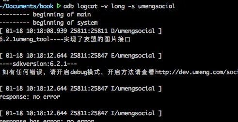

在命令行中输入adb logcat会打印链接设备的log信息，但是如果仅仅输入adb logcat不加任何筛选，信息太多，没法找到我们想要的信息。下面介绍一下通过加参数获取想要的log信息。

# 通过标签过滤：

```undefined
adb logcat -s 标签
```

如下图所示：


## -v time 显示时间

```undefined
adb logcat -v time -s umengsocial
```


## -v threadtime 查看日志的输出时间和线程信息

```undefined
adb logcat -v threadtime -s umengsocial
```


## -v process

```undefined
adb logcat -v process -s umengsocial
```


## -v long 输出所有信息

```cpp
adb logcat -v long -s umengsocial
```



# 通过字符过滤

这个是我使用的最多的一种方式

```undefined
adb logcat | grep Wifi
```

所有包含Wifi字符的log

## 过滤字符串忽略大小写

```undefined
adb logcat | grep -i wifi
```

# 其他

## log 清空

```swift
adb logcat -c
```

## 输出最近的日志

```undefined
adb logcat -t 5
```

