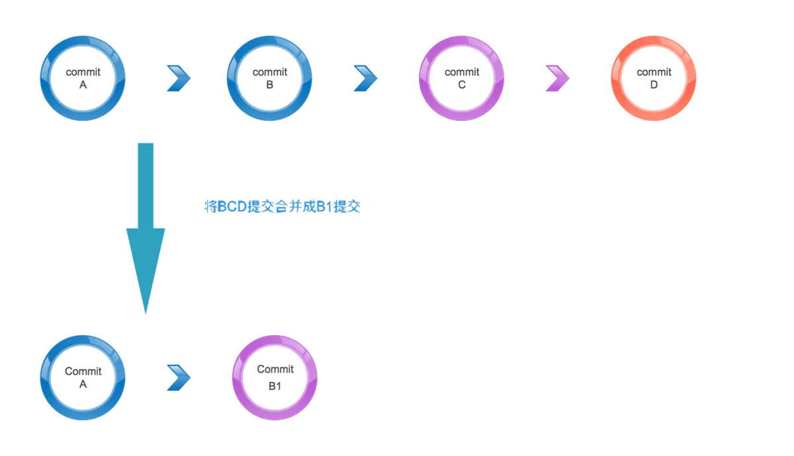
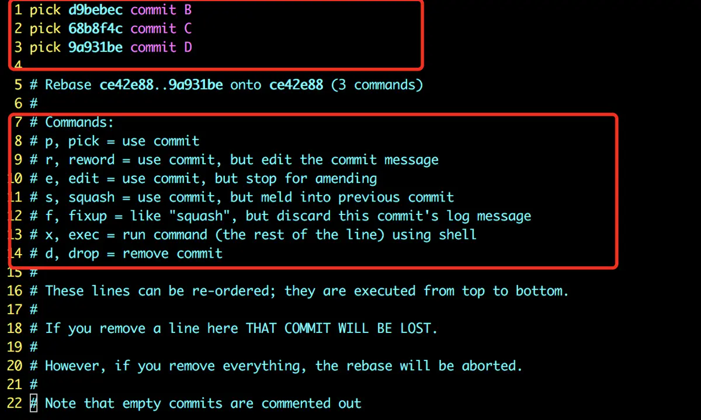

### git commit --amend追加提交

首先我们设想下面一种情况，在开发过程中，你为了完成某一项工作，修改了很多个文件，最后当工作完成的时候，我们需要将这次完成的功能提交到代码库。提交的时候你可能会这么注释“finish xxx work”完成了某某某工作。这个工作完成之后，你可能要进行下一个工作。在进行下个工作之前，你突然发现刚才的提交漏了两个文件，这个时候如果你再次提交一次，显然是不合适的。因为那样会产生两次提交不利于以后的版本维护。那么这个时候就需要用到`git commit --amend`了。千说不如一练。看下面的demo。
 首先新建一个文件1.txt和新建一个2.txt，然后将1.txt添加到暂存区，并提交到版本库,log为commit 1.txt。然后将2.txt添加到暂存区，然后提交的时候使用`--amend`
 会出现如下的界面

```git
  1 commit 1.txt
  2
  3 # Please enter the commit message for your changes. Lines starting
  4 # with '#' will be ignored, and an empty message aborts the commit.
  5 #
  6 # Date:      Wed Jul 11 15:19:00 2018 +0800
  7 #
  8 # On branch master
  9 # Changes to be committed:
 10 #       new file:   1.txt
 11 #       new file:   2.txt
 12 #
```

这个时候我们看到了第一次提交的内容和log。提交完成之后我们查看当前git状态和提交历史。我们发现虽然我们提交了两次，但是log中只出现了一次提交。因为我们使用`--amend`将第二次提交追加到第一次提交上了。这样会使我们的提交历史变得整洁清晰。

```shell
commit ce42e88895cc87c43458c284df911b500b7e94fd (HEAD -> master)
Author: snowzhang <xxxx@aliyun.com>
Date:   Wed Jul 11 15:19:00 2018 +0800

    commit 1.txt and commit 2.txt
```

### git rebase 合并多次提交

`rebase`在`git`中是一个非常有魅力的命令，使用得当会极大提高自己的工作效率；相反，如果乱用，会给团队中其他人带来麻烦。它的作用简要概括为：可以对某一段线性提交历史进行编辑、删除、复制、粘贴；因此，合理使用`rebase`命令可以使我们的提交历史干净、简洁！
 **前提：不要通过rebase对任何已经提交到公共仓库中的commit进行修改（你自己一个人玩的分支除外）**
 当我们在本地仓库中提交了多次，在我们把本地提交push到公共仓库中之前，为了让提交记录更简洁明了，我们希望把如下分支B、C、D三个提交记录合并为一个完整的提交，然后再push到公共仓库。




下面开始实践`rebase`命令

- 首先创建三次次提交BCD

```shell
snowzhang@snowdeMBP-2:~/gitLearn$     git log
commit 9a931be7950033df6905b8b77dc590cdfc37367c (HEAD -> master)
Author: snowzhang <snxxxxxxx@aliyun.com>
Date:   Wed Jul 11 15:50:55 2018 +0800

    commit D

commit 68b8f4ce42e0201fb731085790ffeb190d9747b5
Author: snowzhang <snxxxxxxx@aliyun.com>
Date:   Wed Jul 11 15:50:06 2018 +0800

    commit C

commit d9bebec678b202ac388518ed0aed3a2fb7bc85b3
Author: snowzhang <snxxxxxxx@aliyun.com>
Date:   Wed Jul 11 15:49:27 2018 +0800

    commit B
```

这里我们使用命令:

```shell
git rebase -i  [startpoint]  [endpoint]
```

其中`-i`的意思是`--interactive`，即弹出交互式的界面让用户编辑完成合并操作，[startpoint]  [endpoint]则指定了一个编辑区间，如果不指定[endpoint]，则该区间的终点默认是当前分支HEAD所指向的commit(注：该区间指定的是一个前开后闭的区间)。
 在查看到了log日志后，我们运行以下命令：

```shell
git rebase -i ce42e8889
```




上面显示未注释区域为我们的编辑区域，下面注释区的Commands为命令，具体命令解释如下：

> - pick：保留该commit（缩写:p）
> - reword：保留该commit，但我需要修改该commit的注释（缩写:r）
> - edit：保留该commit, 但我要停下来修改该提交(不仅仅修改注释)（缩写:e）
> - squash：将该commit和前一个commit合并（缩写:s）
> - fixup：将该commit和前一个commit合并，但我不要保留该提交的注释信息（缩写:f）
> - exec：执行shell命令（缩写:x）
> - drop：我要丢弃该commit（缩写:d）

我们将按照上面的命令提示，修改pick成下面这样

```git
pick d9bebec commit B
s 68b8f4c commit C
s 9a931be commit D
```

最终查看`git log`会给出这样的提示

```git
commit 3ab108fd7e0fb3a7477763f2ef8032251105e69f (HEAD -> master)
Author: snowzhang <snxxxx@aliyun.com>
Date:   Wed Jul 11 15:49:27 2018 +0800

    commit B

    commit C

    commit D
```