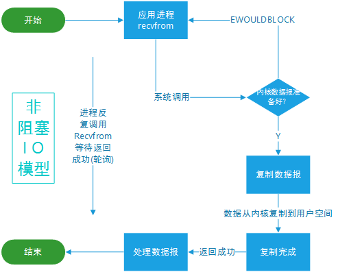
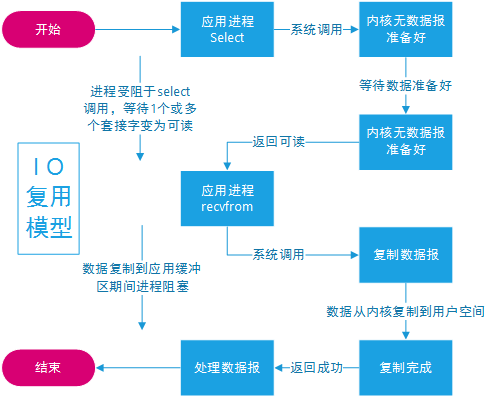

# IO 模型 - Unix IO 模型

> 本文主要简要介绍 Unix I/O 5种模型，并对5大模型比较，并重点为后续章节解释IO多路复用做铺垫。@pdai


##  Unix IO 模型简介

一个输入操作通常包括两个阶段:

- 等待数据准备好
- 从内核向进程复制数据

对于一个套接字上的输入操作，第一步通常涉及等待数据从网络中到达。当所等待分组到达时，它被复制到内核中的某个缓冲区。第二步就是把数据从内核缓冲区复制到应用进程缓冲区。

Unix 下有五种 I/O 模型:

- 阻塞式 I/O
- 非阻塞式 I/O
- I/O 复用(select 和 poll)
- 信号驱动式 I/O(SIGIO)
- 异步 I/O(AIO)


###  阻塞式 I/O

应用进程被阻塞，直到数据复制到应用进程缓冲区中才返回。

应该注意到，在阻塞的过程中，其它程序还可以执行，因此阻塞不意味着整个操作系统都被阻塞。因为其他程序还可以执行，因此不消耗 CPU 时间，这种模型的执行效率会比较高。

下图中，recvfrom 用于接收 Socket 传来的数据，并复制到应用进程的缓冲区 buf 中。这里把 recvfrom() 当成系统调用。

```c
ssize_t recvfrom(int sockfd, void *buf, size_t len, int flags, struct sockaddr *src_addr, socklen_t *addrlen);
```


或者网友提供的


###  非阻塞式 I/O

应用进程执行系统调用之后，内核返回一个错误码。应用进程可以继续执行，但是需要不断的执行系统调用来获知 I/O 是否完成，这种方式称为轮询(polling)。

由于 CPU 要处理更多的系统调用，因此这种模型是比较低效的。


或者网友提供的




###  I/O 复用

使用 select 或者 poll 等待数据，并且可以等待多个套接字中的任何一个变为可读，这一过程会被阻塞，当某一个套接字可读时返回。之后再使用 recvfrom 把数据从内核复制到进程中。

它可以让单个进程具有处理多个 I/O 事件的能力。又被称为 Event Driven I/O，即事件驱动 I/O。

如果一个 Web 服务器没有 I/O 复用，那么每一个 Socket 连接都需要创建一个线程去处理。如果同时有几万个连接，那么就需要创建相同数量的线程。并且相比于多进程和多线程技术，I/O 复用不需要进程线程创建和切换的开销，系统开销更小。


或者网友提供的




###  信号驱动 I/O

应用进程使用 sigaction 系统调用，内核立即返回，应用进程可以继续执行，也就是说等待数据阶段应用进程是非阻塞的。内核在数据到达时向应用进程发送 SIGIO 信号，应用进程收到之后在信号处理程序中调用 recvfrom 将数据从内核复制到应用进程中。

相比于非阻塞式 I/O 的轮询方式，信号驱动 I/O 的 CPU 利用率更高。


或者网友提供的


###  异步 I/O

进行 aio_read 系统调用会立即返回，应用进程继续执行，不会被阻塞，内核会在所有操作完成之后向应用进程发送信号。

异步 I/O 与信号驱动 I/O 的区别在于，异步 I/O 的信号是通知应用进程 I/O 完成，而信号驱动 I/O 的信号是通知应用进程可以开始 I/O。


或者网友提供的


##  I/O 模型比较

###  同步 I/O 与异步 I/O

- 同步 I/O: 应用进程在调用 recvfrom 操作时会阻塞。
- 异步 I/O: 不会阻塞。

阻塞式 I/O、非阻塞式 I/O、I/O 复用和信号驱动 I/O 都是同步 I/O，虽然非阻塞式 I/O 和信号驱动 I/O 在等待数据阶段不会阻塞，但是在之后的将数据从内核复制到应用进程这个操作会阻塞。

###  五大 I/O 模型比较

前四种 I/O 模型的主要区别在于第一个阶段，而第二个阶段是一样的: 将数据从内核复制到应用进程过程中，应用进程会被阻塞。


##  IO多路复用

> IO多路复用最为重要，后面的文章[Java NIO - IO多路复用详解]()将对IO多路复用，Ractor模型以及Java NIO对其的支持作详解。

这里主要概要性的理解: IO多路复用工作模式和应用。


###  IO多路复用工作模式

epoll 的描述符事件有两种触发模式: LT(level trigger)和 ET(edge trigger)。

####  1. LT 模式

当 epoll_wait() 检测到描述符事件到达时，将此事件通知进程，进程可以不立即处理该事件，下次调用 epoll_wait() 会再次通知进程。是默认的一种模式，并且同时支持 Blocking 和 No-Blocking。

####  2. ET 模式

和 LT 模式不同的是，通知之后进程必须立即处理事件，下次再调用 epoll_wait() 时不会再得到事件到达的通知。

很大程度上减少了 epoll 事件被重复触发的次数，因此效率要比 LT 模式高。只支持 No-Blocking，以避免由于一个文件句柄的阻塞读/阻塞写操作把处理多个文件描述符的任务饿死。


###  应用场景

很容易产生一种错觉认为只要用 epoll 就可以了，select 和 poll 都已经过时了，其实它们都有各自的使用场景。

####  1. select 应用场景

select 的 timeout 参数精度为 1ns，而 poll 和 epoll 为 1ms，因此 select 更加适用于实时要求更高的场景，比如核反应堆的控制。

select 可移植性更好，几乎被所有主流平台所支持。

####  2. poll 应用场景

poll 没有最大描述符数量的限制，如果平台支持并且对实时性要求不高，应该使用 poll 而不是 select。

需要同时监控小于 1000 个描述符，就没有必要使用 epoll，因为这个应用场景下并不能体现 epoll 的优势。

需要监控的描述符状态变化多，而且都是非常短暂的，也没有必要使用 epoll。因为 epoll 中的所有描述符都存储在内核中，造成每次需要对描述符的状态改变都需要通过 epoll_ctl() 进行系统调用，频繁系统调用降低效率。并且epoll 的描述符存储在内核，不容易调试。

####  3. epoll 应用场景

只需要运行在 Linux 平台上，并且有非常大量的描述符需要同时轮询，而且这些连接最好是长连接。


##  参考资料

- Stevens W R, Fenner B, Rudoff A M. UNIX network programming[M]. Addison-Wesley Professional, 2004.
- [Boost application performance using asynchronous I/O  (opens new window)](https://www.ibm.com/developerworks/linux/library/l-async/)
- [Synchronous and Asynchronous I/O  (opens new window)](https://msdn.microsoft.com/en-us/library/windows/desktop/aa365683(v=vs.85).aspx)
- [Linux IO 模式及 select、poll、epoll 详解  (opens new window)](https://segmentfault.com/a/1190000003063859)
- [poll vs select vs event-based  (opens new window)](https://daniel.haxx.se/docs/poll-vs-select.html)
- [select / poll / epoll: practical difference for system architects  (opens new window)](http://www.ulduzsoft.com/2014/01/select-poll-epoll-practical-difference-for-system-architects/)
- [Browse the source code of userspace/glibc/sysdeps/unix/sysv/linux/ online](https://code.woboq.org/userspace/glibc/sysdeps/unix/sysv/linux/)