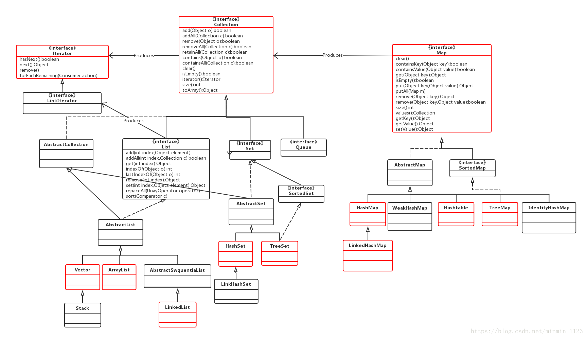
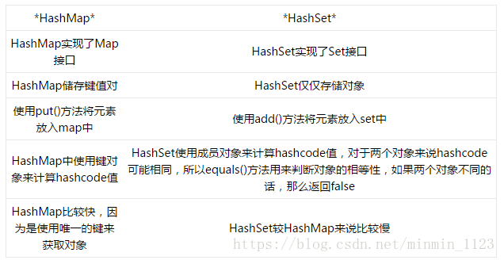

参考：[Java集合类](https://www.jianshu.com/p/7b9abda70c8f)

## 作用

负责保存和盛装其他数据，又称容器类。

- 用于存储数量不等的对象，并可实现常用的数据结构，如栈、队列等
- 用于保存具有映射关系的关联数组

和数组的区别：
- 数组元素可以是基本类型，也可以是对象
- 集合元素只能是对象

## 体系结构

- Set：代表无序、不可重复的集合
- List：代表有序、可重复的集合
- Map：代表具有映射关系的集合
- Queue：代表一种队列集合

### Collection接口：

是List、Set和Queue接口的父接口，该接口中定义的方法可操作以上三种集合。

常用方法：添加对象`add()`、删除对象`remove()`、清空容器`clear()`、判断容器是否为空`isEmpty()`等。

### List系列：有序、可重复

[ArrayList](https://www.jianshu.com/p/2cd7be850540)特点：
- 底层结构是**数组**，可用索引实现快速查找
- **非线程安全**，建议在单线程中才使用ArrayList，而在多线程中可以选择Vector或者CopyOnWriteArrayList
- 是动态数组，相比于数组容量可实现动态增长。默认初始容量为10，每次扩容为原来的1.5倍

[LinkedList](https://www.jianshu.com/p/d5ec2ff72b33)特点：
- 底层结构是**链表**，增删速度快
- **非线程安全**
- 是一个双向循环链表，也可以被当作堆栈、队列或双端队列
- 包含一个非常重要的内部类Entry，是双向链表节点所对应的数据结构，其包括的属性有『当前节点所包含的值』、『上一个节点』、『下一个节点』

[Vector](https://www.jianshu.com/p/9925907985d5)特点：

- 底层结构是**数组**，可用索引实现快速查找
- 使用了synchronized关键字，是**线程安全**的，比ArrayList开销更大，访问更慢
- 默认初始容量为10，默认每次扩容为原来的2倍，可通过capacityIncrement属性设置。

### Set 系列：无序、不可重复

[HashSet](https://www.jianshu.com/p/1f7a8dda341b)特点：
- 不能保证元素的排列顺序
- 使用Hash算法来存储集合中的元素，有良好的存取和查找性能
- 非同步，多线程并发要注意线程同问题
- 集合元素值可为null
- 通过equal()判断两个元素是否相等，并两个元素的hashCode()返回值也相等

LinkHashSet

[TreeSet](https://www.jianshu.com/p/12f4dbdbc652)特点：
- 是SortedSet接口的实现类，根据元素实际值的大小进行排序
- 采用红黑树的数据结构来存储集合元素
- 非同步
- 支持两种排序方法：自然排序（默认情况）和定制排序。前者通过实现Comparable接口中的compareTo()比较两个元素之间大小关系，然后按升序排列；后者通过实现Comparator接口中的compare()比较两个元素之间大小关系，实现定制排列。

### Iterator 接口：

- 用于遍历Collection中的集合中的元素，又称**迭代器**。本身并不提供盛装对象的能力。
- 必须依赖于Collection对象，独立存在无意义。
- 常用方法：
  - 判断集合是否还有下一个元素`hasNext()`，
  - 可通过`remove()`删除集合中上一次`next()`返回的集合元素。

### Map接口：

- 保存具有映射关系的数据。

- Map集合中保存着两组值，一组用于保存Map中的key，一组用于保存Map中的value。
  - key和value可以是任何引用类型的数据。
  - key不允许重复，key没有顺序。可以把key集合看成一个Set集合，它们的存储形式、子类命名也非常相似。
  - value允许重复，value通过索引查找。可以把value集合看成一个List集合。

- 常用方法：
  - 成对添加`put()`和删除`remove()`key-value对，
  - 获取指定key的`valueget()`
  - 判断是否包含指定`keycontainsKey()`和指定`valuecontainsValue()`等。

### Map系列

[HashMap](https://www.jianshu.com/p/e6536af1018f)特点：
- 基于AbstractMap类，实现了Map、Cloneable（能被克隆）、Serializable（支持序列化）接口，
- **无序**
- **非线程安全**
- 允许存在一个为null的key和任意个为null的value
- 采用**链表散列**的数据结构，即数组和链表的结合
- 初始容量为16，填充因子默认为0.75，扩容时是当前容量翻倍，即2capacity

[LinkedHashMap](https://www.jianshu.com/p/8f4f58b4b8ab)特点：
- 继承自HashMap类
- **有序**，默认为插入顺序，还可以是访问顺序
- **非线程安全**
- 允许存在一个为null的key和任意个为null的value
- 内部通过Entry维护了一个双向链表，负责维护Map的迭代顺序

[Hashtable](http://note.youdao.com/noteshare?id=a77a94090307d5b02419d9f23f334f7a)特点：
- 基于Map接口和Dictionary类
- **无序**
- **线程安全**，开销比HashMap大，如果多线程访问一个Map对象，使用Hashtable更好
- 不允许使用null作为key和value
- 底层基于哈希表结构
- 初始容量为11，填充因子默认为0.75，扩容时是容量翻倍+1，即2capacity+1

TreeMap特点：
- 是SortedMap接口的实现类
- **有序**，根据key对节点进行排序
- 支持两种排序方法：**自然排序和定制排序**。
  - 前者所有key必须实现**Comparable接口**且所有key应该是一个类的对象；
  - 后者通过传入一个**Comparator接口**对象负责对多有key进行排序。
- **非线程安全**
- 采用**红黑树**的数据结构

[Java7/8 中的 HashMap 和 ConcurrentHashMap 全解析](https://javadoop.com/post/hashmap)