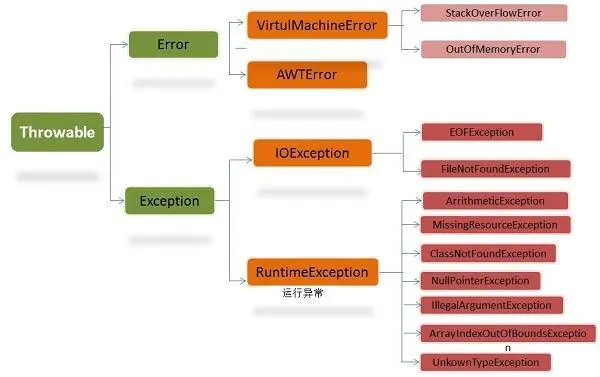
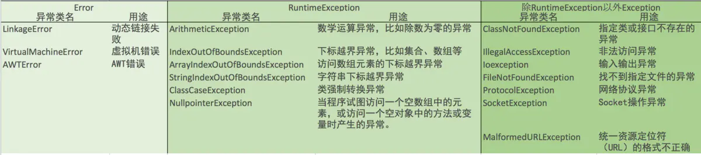

参考：[美团实习| 周记(三)](https://www.jianshu.com/p/3718766df5ba)、[java程序错误类型及异常处理](https://www.cnblogs.com/liaoliao/p/5009150.html)

## 异常

当一个程序出现错误时，可能是以下三种错误：
- 语法错误：如缺少必要的标点符号、关键字输入错误、数据类型不匹配等，在编译器对程序进行编译的过程中，会把检测到的语法错误以提示的方式列举出来，故又称为编译错误。
- 运行时错误：如空指针异常，数组越界，除数为零、数据库连接失败等，迫使程序终止，有特定的发生条件。
- 逻辑错误：在语法上是有效的，但是在逻辑上是错误的，此类问题不好调试。

### 简介

Java异常处理机制主要是指处理运行时错误

Throwable继承层次结构，可见分成两大类Error和Exception



### Error

指程序无法恢复的异常情况，表示运行应用程序中较严重的问题。

- 发生于虚拟机自身、或者在虚拟机试图执行应用时，
  - `Virtual MachineError`（Java虚拟机运行错误）、
  - `NoClassDefFoundError`（类定义错误）。

- 属于**不可查异常**，即不强制程序员必须处理，即使不处理也不会出现语法错误。

### Exception

指程序有可能恢复的异常情况，表示程序本身可以处理的异常。又分两大类：

- RuntimeException（运行时异常）：由程序自身的问题导致产生的异常。
  - `NullPointerException`（空指针异常）
  - `IndexOutOfBoundsException`（下标越界异常）。
  - 属于**不可查异常**。

- 非运行时异常：由程序外部的问题引起的异常。
  - 除了`RuntimeException`以外的异常，如`FileNotFoundException`（文件不存在异常）。
  - 属于**可查异常**，即强制程序员必须进行处理，如果不进行处理则会出现语法错误。



## 异常处理机制

### 捕捉异常

由系统自动抛出异常

- `try` 捕获异常：
  - 用于监控，若发生异常，会抛出异常类所产生的对象并立刻结束执行，
  - 并转向异常处理catch块。

- `catch` 处理异常：
  - 若抛出的异常对象属于catch内所定义的异常类，则进入catch中的对应代码段继续运行程序，
  - 反之进入`finally块。常用方法：
    - `e.getMessage()`：返回异常对象的一个简短描述
    - `e.toString()`：获取异常对象的详细信息
    - `e.printStackTrace()`：在控制台上打印异常对象和它的追踪信息

- `finally` 最终处理：
  - 无论是否捕获或处理异常，finally块里的语句都会被执行。
  - 在以下4种特殊情况下，finally块才不会被执行：
    - 在finally语句块中发生了异常
    - 在前面的代码中用了System.exit()退出程序
    - 程序所在的线程死亡
    - 关闭CPU

```java
try {  
    // 可能会发生异常的程序代码  
} catch (异常类1  异常变量) {  
    // 捕获并处理try抛出的异常类型Type1  
} catch (异常类2  异常变量) {  
    // 捕获并处理try抛出的异常类型Type2  
} finally {  
    // 无论是否发生异常，都将执行的语句块  
}
```

### 抛出异常

在方法中将异常对象显性地抛出，之后异常会沿着调用层次向上抛出，交由调用它的方法来处理。

- `throws`：声明抛出的异常，位置在方法名后、异常类型前
  - 用来声明一个方法可能产生的所有异常，不做任何处理而是将异常往上传，谁调用我我就抛给谁
  - 其实就是自己不想对异常做出任何的处理，告诉别人自己可能出现的异常，交给别人处理，然别人处理
```java
public class ThrowsDemo {
    public static void main(String args[]) throws Exception{
        ...
   }
}
```

- `throw`：抛出异常，一般在方法体内部
  - 就是自己处理一个异常，有两种方式要么是自己捕获异常try...catch代码块，
  - 要么是抛出一个异常（throws 异常）
```java
        try
        {
            //调用带throws声明的方法，必须显式捕获该异常
            //否则，必须在main方法中再次声明抛出
            throw new Exception("..."); 
        }
        catch (Exception e)
        {
            System.out.println(e.getMessage());
        }
        //调用抛出Runtime异常的方法既可以显式捕获该异常，
        //也可不理会该异常
        throw new RuntimeException("...");
```

### 自定义异常

继承Execption类或其子类，实现步骤如下：
- 声明自定义异常类并继承Exception，可重写方法如`getMessage()`
- 在方法头用`throws`声明该方法可能抛出的异常
- 在方法体的适当位置创建自定义异常类对象，并用`throw`将异常抛出
- 调用该方法时，对可能产生的异常进行捕获，并处理异常

```java
//1.自定义的异常类
class MyException extends Exception { 

   String message; 

   public MyException(String ErrorMessagr) { 
      super(ErrorMessagr) ;
   }

   public String getMessage() {
      return message;
   }

}

public class Demo {

    public static void main(String[] args) {
        //4.调用方法时捕获和处理
        try {
            test();
        } catch (MyException e) {
            System.out.println(e.getMessage());
            e.printStackTrace();
        }
    }
    
    //2.在方法头声明可能出现的异常
    public static void test() throws MyException{
        try {
            int i = 10/0;
            System.out.println("i="+i); 
        } catch (ArithmeticException e) {
            //3.在适当情况下抛出异常
            throw new MyException("This is MyException"); 
        }
    }
}
```

