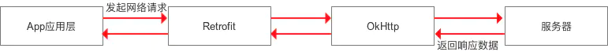
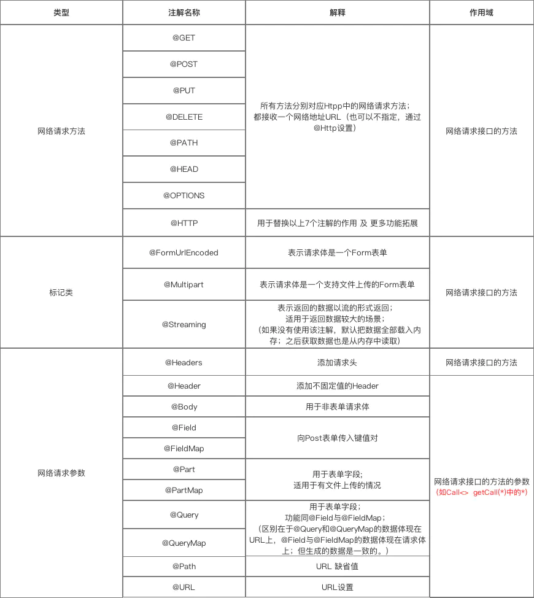
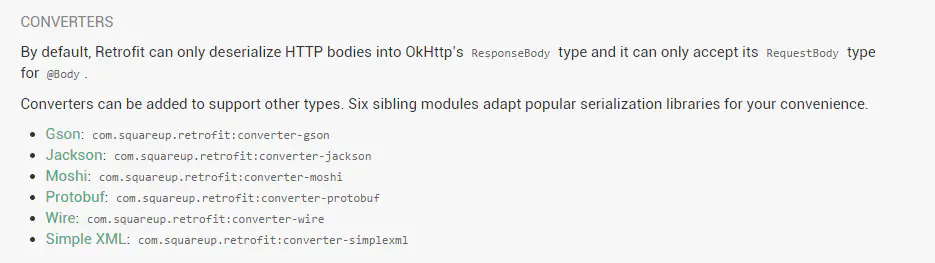
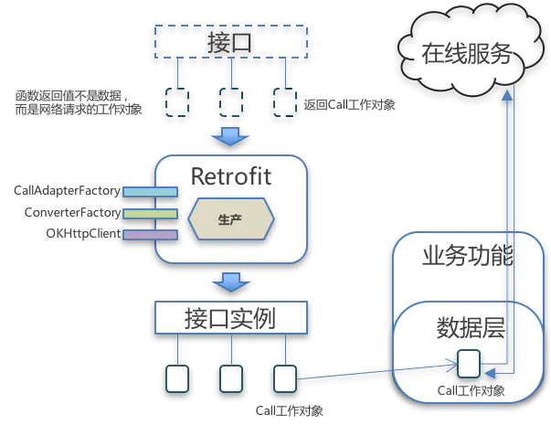

## 1.概述

a.**Retrofit**是Square公司推出的一个基于RESTful风格的HTTP网络框架。

> 相关链接地址：
>
> - [Retrofit GitHub地址](https://github.com/square/retrofit)
> - [Retrofit 官网地址](http://square.github.io/retrofit/)
> - [Retrofit 修复日志](https://github.com/square/retrofit/blob/master/CHANGELOG.md)
> - [OkHttp GitHub地址](https://github.com/square/okhttp)
> - [OkHttp 官网地址](http://square.github.io/okhttp/)

b.与**OkHttp**的关系：

是对OkHttp网络请求框架的二次封装，本质仍是OkHttp。即网络请求的工作本质上是由OkHttp完成，而Retrofit仅负责网络请求接口的封装。流程如图：



> - App应用程序通过Retrofit请求网络，实际上是使用Retrofit接口层封装请求参数、Header、Url等信息，之后由OkHttp完成后续的请求操作。
> - 在服务端返回数据之后，OkHttp将原始的结果交给Retrofit，Retrofit会根据用户的需求对结果进行解析。
> - 通过使用大量的设计模式进行功能模块的解耦，使得上面的过程进行得更加简单和流畅。

c.其他网络框架简介：

- **AndroidAsynHttp**：基于[**HttpClient**](https://blog.csdn.net/yhmq66/article/details/78213993)，已经停止维护，Android5.0不再使用HttpClient。
- [**Volley**](https://www.jianshu.com/p/a69eb95c17f7)：基于[**HttpUrlConnection**]((https://blog.csdn.net/YHMQ66/article/details/78212133))，由谷歌官方推出，适合轻量级网络交互，如数据传输量小的场景，而不适合大文件传输。

> 相比于上述两种网络框架，Retrofit具有的**优点**：
>
> - 遵循Restful API设计风格，简洁易用
> - 支持同步&异步网络请求
> - 支持多种数据的解析&序列化格式(Gson、 Json、XML、 Protobuf)
> - 支持对RxJava支持
> - 注解化配置高度解耦、采用大量设计模式简化使用

------

## 2.使用方式

大致分成八个步骤：

### step1：添加Retrofit库、OkHttp库、数据解析器集成库的依赖，并注册网络权限

在app文件包下的build.gradle中添加依赖，这里用的是JSON数据解析器：

```bash
compile 'com.squareup.retrofit2:retrofit:2.4.0'
compile 'com.squareup.okhttp3:okhttp:3.10.0'
compile 'com.squareup.retrofit2:converter-gson:2.4.0'
```

在AndroidManifest.xml中注册权限：

```xml
<uses-permission android:name="android.permission.INTERNET"/>
```

------

### step2：创建接收服务器返回数据的类

请求后服务器会返回数据，需要根据返回数据的格式和解析方式（Json、XML等）来定义实体类Model。

假设有返回数据格式为如下JSON，其中，如果用户名和密码匹配成功，则code值为1，反之为0：

```json
{
  "code":1,
  "data":{
     "id":10001,
     "username":"Tom",
     "email":"888888888@qq.com",
     "tel":"18088888888"
  },
  "message":"success"
}
```

则对应的实体类UserInfoModel：

```cpp
public class UserInfoModel {

    public int code;
    public UserInfo data;
    public String message;
    
    public static class UserInfo{
    
        public int id;
        public String username;
        public String email;
        public String tel;
    }
}
```

------

### step3：创建用于描述网络请求的接口

定义一个网络请求的接口，接口函数里要定义**URL路径**、**请求参数**、**返回类型**。其中，需要使用**注解**来描述请求类型和请求参数。

```kotlin
public interface Interface {
  
    @GET("URL")
    Call<Model>  getCall(@Query("xxx") String xxx);
   
    // 用@GET("URL")声明了URL路径
    // 用getCall()接收网络请求数据，并用注解@Query("xxx") 声明了请求参数
    // 该方法会返回一个Retrofit的Call对象，这里声明了这个对象处理的数据类型为自定义Model
}
```

在上例中，对应的UserMgrService接口如下，当发送请求参数为Tom和123456时，请求将发送给的URL为『login?username=Tom&pwd=123456』，并会返回之前定义的GSON数据：

```kotlin
public interface UserMgrService{
    
    @GET("login")
    Call<UserInfoModel> login(@Query("username") String username,@Query("pwd") String pwd);
}
```

常用的注解含义如图：



这里可以发现，@GET和@Query搭配使用，@POST和@Field搭配使用。

------

### step4：创建Retrofit对象并设置数据解析器

```cpp
Retrofit retrofit = new Retrofit.Builder()
                .baseUrl("URL") //设置网络请求的Url地址，注意以要以斜线（代表根目录）结尾
                .addConverterFactory(GsonConverterFactory.create()) //设置数据解析器，这里表示用的是JSON解析返回值
                .build();
```

常用的数据解析器如图：



------

### step5：生成接口对象

由于是interface不是class，无法直接调用内部方法，需要利用已创建的Retrofit对象去生成代理的接口对象。

```java
UserMgrService service=retrofit.create(UserMgrService.class);
```

------

### step6：调用接口方法返回Call对象

调用接口对象的方法，返回一个可以执行网络访问的网络工作对象。

```bash
Call<UserInfoModel> call=service.login("Tom","123456");
```

------

### step7：发送网络请求（异步 / 同步）

a.**同步**：调用Call对象`execute()`，返回结果是响应体。

```java
//开线程进行网络请求
new Thread(new Runable()){
    @Override
    pubblic void run(){
        Response<UserInfoModel> response=null;
        try{
           response=call.execute();
        }catch{
           e.printStackTrace();
        }
        //处理服务器返回的数据
    }
}.start();
```

b.**异步**：调用Call对象`enqueue()`，参数是一个回调。

```java
//异步时，框架中已经封装好数据转换、线程切换的操作，无需手动开线程
call.enqueue(new CallBack<UserInfoModel>(){
    @Override
    public void onResponse(Call<UserInfoModel> call,Response<UserInfoModel> response){
        //处理服务器返回的数据
    }
    @Override
    public void onFailure(Call<UserInfoModel> call,Throwable t){
    }
});
```

------

### step8： 处理服务器返回的数据

现在可以去打印出返回结果：

```ruby
Log.i("response","code:"+response.body().code);//结果为"code:1"
```

------

## 3.总结

下面给出官方给的simple demo，便于更好的理解Retrofit的使用步骤：

```java
//step3：
public interface GitHub {
    @GET("/repos/{owner}/{repo}/contributors")
    Call<List<Contributor>> contributors(
        @Path("owner") String owner,
        @Path("repo") String repo);
  }

  public static void main(String... args) throws IOException {
    // step4：Create a very simple REST adapter which points the GitHub API.
    Retrofit retrofit = new Retrofit.Builder()
        .baseUrl(API_URL)
        .addConverterFactory(GsonConverterFactory.create())
        .build();

    // step5：Create an instance of our GitHub API interface.
    GitHub github = retrofit.create(GitHub.class);

    // step6：Create a call instance for looking up Retrofit contributors.
    Call<List<Contributor>> call = github.contributors("square", "retrofit");

    // step7：Fetch and print a list of the contributors to the library.
    List<Contributor> contributors = call.execute().body();
    
    //step8：
    for (Contributor contributor : contributors) {
      System.out.println(contributor.login + " (" + contributor.contributions + ")");
    } 
  }
```

**实例**：[这是一份很详细的 Retrofit 2.0 使用教程（含实例讲解）](https://blog.csdn.net/carson_ho/article/details/73732076)

------

以上，可以看到，Retrofit可根据不同的接口定义，灵活地生成对应的网络工作对象，然后利用这个对象去访问网络。它就像一个工厂，只提供产品，本身不处理网络请求，而是让产品去处理网络请求。



**图片来源**：[从架构角度看Retrofit的作用、原理和启示](https://www.jianshu.com/p/f57b7cdb1c99)