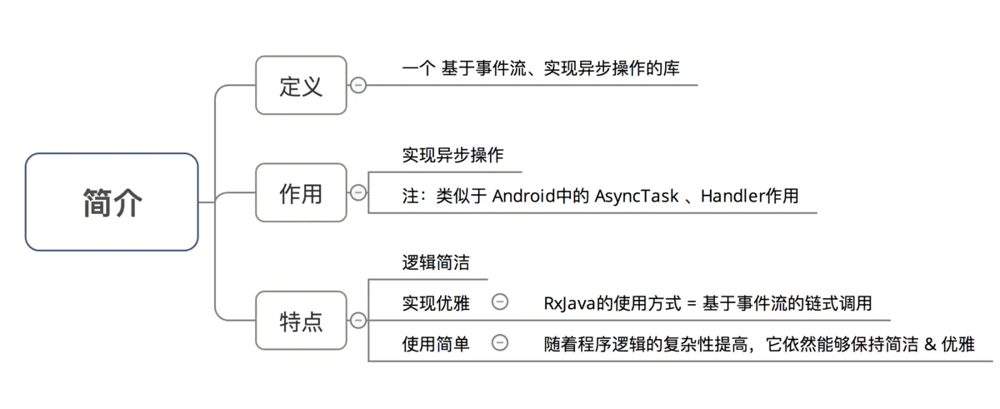
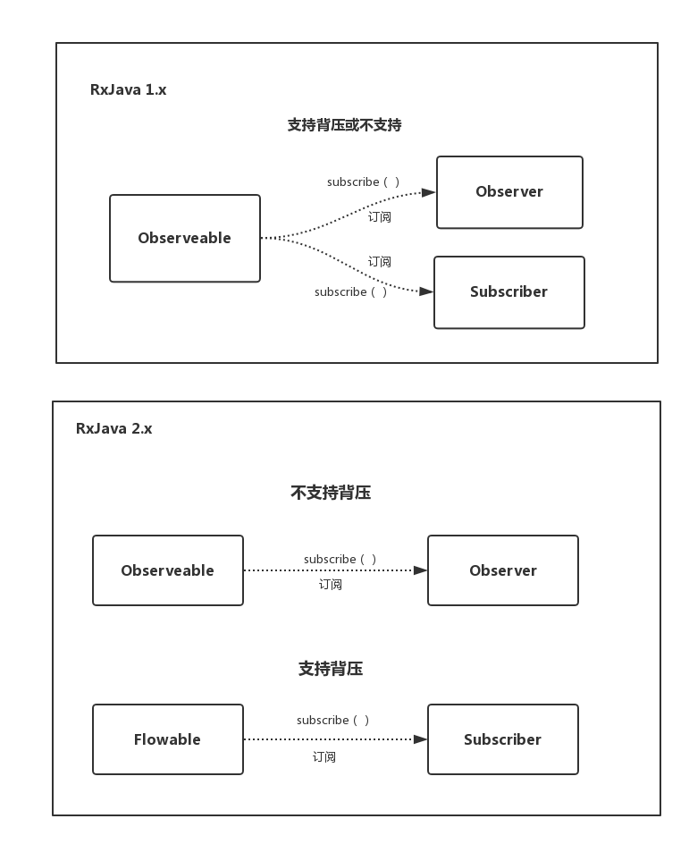
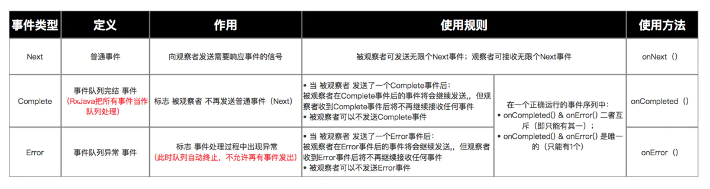
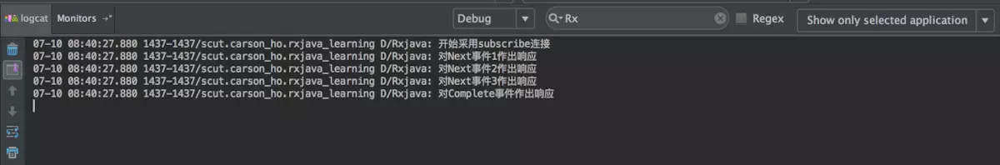

# RxJava 基础入门

## RxJava简介



## 观察者模式

### 基本概念

**观察者模式**面向的需求是：A 对象（观察者）对 B 对象（被观察者）的某种变化高度敏感，需要在 B 变化的一瞬间做出反应。

Android 开发中一个比较典型的例子是点击监听器 OnClickListener 。对设置 OnClickListener 来说， View 是被观察者， OnClickListener 是观察者，二者通过 setOnClickListener() 方法达成订阅关系。订阅之后用户点击按钮的瞬间，Android Framework 就会将点击事件发送给已经注册的 OnClickListener 。采取这样被动的观察方式，既省去了反复检索状态的资源消耗，也能够得到最高的反馈速度。


如果把这张图中的概念抽象出来（Button -> 被观察者、OnClickListener -> 观察者、setOnClickListener() -> 订阅，onClick() -> 事件），就由专用的观察者模式（例如只用于监听控件点击）转变成了通用的观察者模式。


### 响应式编程

**响应式编程**是一种基于异步数据流概念的编程模式。数据流就像一条河：它可以被观测，被过滤，被操作，或者为新的消费者与另外一条流合并为一条新的流。

响应式编程的一个关键概念是事件。事件可以被等待，可以触发过程，也可以触发其它事件。


### RxJava 2.x 的观察者模式

- Observable ( 被观察者 ) / Observer ( 观察者 )
- Flowable （被观察者）/ Subscriber （观察者）



**背压是流速控制的一种策略**。背压是指在异步场景中，被观察者发送事件速度远快于观察者的处理速度的情况下，一种告诉上游的被观察者降低发送速度的策略。

## 基本使用

### RxJava 2.x 基本实现

- 初始化 Observable

  ```java
          // 1. 创建被观察者 Observable 对象
          Observable<Integer> observable = Observable.create(new ObservableOnSubscribe<Integer>() {
            // create() 是 RxJava 最基本的创造事件序列的方法
            // 此处传入了一个 OnSubscribe 对象参数
            // 当 Observable 被订阅时，OnSubscribe 的 call() 方法会自动被调用，即事件序列就会依照设定依次被触发
            // 即观察者会依次调用对应事件的复写方法从而响应事件
            // 从而实现被观察者调用了观察者的回调方法 & 由被观察者向观察者的事件传递，即观察者模式
  
          // 2. 在复写的subscribe（）里定义需要发送的事件
              @Override
              public void subscribe(ObservableEmitter<Integer> emitter) throws Exception {
                  // 通过 ObservableEmitter类对象产生事件并通知观察者
                  // ObservableEmitter类介绍
                      // a. 定义：事件发射器
                      // b. 作用：定义需要发送的事件 & 向观察者发送事件
                  emitter.onNext(1);
                  emitter.onNext(2);
                  emitter.onNext(3);
                  emitter.onComplete();//结束订阅
                  emitter.onNext(4);//事件发送，但不被接收
              }
          });
  
  <--扩展：RxJava 提供了其他方法用于 创建被观察者对象Observable -->
  // 方法1：just(T...)：直接将传入的参数依次发送出来
    Observable observable = Observable.just("A", "B", "C");
    // 将会依次调用：
    // onNext("A");
    // onNext("B");
    // onNext("C");
    // onCompleted();
  
  // 方法2：from(T[]) / from(Iterable<? extends T>) : 将传入的数组 / Iterable 拆分成具体对象后，依次发送出来
    String[] words = {"A", "B", "C"};
    Observable observable = Observable.from(words);
    // 将会依次调用：
    // onNext("A");
    // onNext("B");
    // onNext("C");
    // onCompleted();
  ```



- 初始化 Observer

  ```java
  <--方式1：采用Observer 接口 -->
          // 1. 创建观察者 （Observer ）对象
          Observer<Integer> observer = new Observer<Integer>() {
          // 2. 创建对象时通过对应复写对应事件方法 从而 响应对应事件
  
              // 观察者接收事件前，默认最先调用复写 onSubscribe（）
              @Override
              public void onSubscribe(Disposable d) {
                  Log.d(TAG, "开始采用subscribe连接");
              }
              
              // 当被观察者生产Next事件 & 观察者接收到时，会调用该复写方法 进行响应
              @Override
              public void onNext(Integer value) {
                  Log.d(TAG, "对Next事件作出响应" + value);
              }
  
              // 当被观察者生产Error事件& 观察者接收到时，会调用该复写方法 进行响应
              @Override
              public void onError(Throwable e) {
                  Log.d(TAG, "对Error事件作出响应");
              }
            
              // 当被观察者生产Complete事件& 观察者接收到时，会调用该复写方法 进行响应
              @Override
              public void onComplete() {
                  Log.d(TAG, "对Complete事件作出响应");
              }
          };
  
  <--方式2：采用Subscriber 抽象类 -->
  // 说明：Subscriber类 = RxJava 内置的一个实现了 Observer 的抽象类，对 Observer 接口进行了扩展
  
  // 1. 创建观察者 （Observer ）对象
  Subscriber<String> subscriber = new Subscriber<Integer>() {
  
  // 2. 创建对象时通过对应复写对应事件方法 从而 响应对应事件
              // 观察者接收事件前，默认最先调用复写 onSubscribe（）
              @Override
              public void onSubscribe(Subscription s) {
                  Log.d(TAG, "开始采用subscribe连接");
              }
  
              // 当被观察者生产Next事件 & 观察者接收到时，会调用该复写方法 进行响应
              @Override
              public void onNext(Integer value) {
                  Log.d(TAG, "对Next事件作出响应" + value);
              }
  
              // 当被观察者生产Error事件& 观察者接收到时，会调用该复写方法 进行响应
              @Override
              public void onError(Throwable e) {
                  Log.d(TAG, "对Error事件作出响应");
              }
  
              // 当被观察者生产Complete事件& 观察者接收到时，会调用该复写方法 进行响应
              @Override
              public void onComplete() {
                  Log.d(TAG, "对Complete事件作出响应");
              }
          };
  
  
  <--特别注意：2种方法的区别，即Subscriber 抽象类与Observer 接口的区别 -->
  // 相同点：二者基本使用方式完全一致（实质上，在RxJava的 subscribe 过程中，Observer总是会先被转换成Subscriber再使用）
  // 不同点：Subscriber抽象类对 Observer 接口进行了扩展，新增了两个方法：
      // 1. onStart()：在还未响应事件前调用，用于做一些初始化工作
      // 2. unsubscribe()：用于取消订阅。在该方法被调用后，观察者将不再接收 & 响应事件
      // 调用该方法前，先使用 isUnsubscribed() 判断状态，确定被观察者Observable是否还持有观察者Subscriber的引用，如果引用不能及时释放，就会出现内存泄露
  ```

- subscribe() 建立订阅关系

  ```java
  observable.subscribe(observer);
   // 或者 
  observable.subscribe(subscriber)；
  
  <-- Observable.subscribe(Subscriber) 的内部实现 -->
  
  public Subscription subscribe(Subscriber subscriber) {
      subscriber.onStart();
      // 步骤1中 观察者  subscriber抽象类复写的方法，用于初始化工作
      onSubscribe.call(subscriber);
      // 通过该调用，从而回调观察者中的对应方法从而响应被观察者生产的事件
      // 从而实现被观察者调用了观察者的回调方法 & 由被观察者向观察者的事件传递，即观察者模式
      // 同时也看出：Observable只是生产事件，真正的发送事件是在它被订阅的时候，即当 subscribe() 方法执行时
  }
  ```

### 优雅的实现方法 - 基于事件流的链式调用

```java
// RxJava的链式操作
        Observable.create(new ObservableOnSubscribe<Integer>() {
        // 1. 创建被观察者 & 生产事件
            @Override
            public void subscribe(ObservableEmitter<Integer> emitter) throws Exception {
                emitter.onNext(1);
                emitter.onNext(2);
                emitter.onNext(3);
                emitter.onComplete();
            }
        }).subscribe(new Observer<Integer>() {
            // 2. 通过通过订阅（subscribe）连接观察者和被观察者
            // 3. 创建观察者 & 定义响应事件的行为
            @Override
            public void onSubscribe(Disposable d) {
                Log.d(TAG, "开始采用subscribe连接");
            }
            // 默认最先调用复写的 onSubscribe（）

            @Override
            public void onNext(Integer value) {
                Log.d(TAG, "对Next事件"+ value +"作出响应"  );
            }

            @Override
            public void onError(Throwable e) {
                Log.d(TAG, "对Error事件作出响应");
            }

            @Override
            public void onComplete() {
                Log.d(TAG, "对Complete事件作出响应");
            }

        });
    }
}

/* 整体方法调用顺序：
 *  观察者.onSubscribe() 
 *  被观察者.subscribe() 
 *  观察者.onNext()
 *  观察者.onComplete()
 */
```

## 函数式接口

`RxJava 2.x` 提供了多个函数式接口 ，用于实现简便式的观察者模式


```java
public interface Action {
    /**
     * Runs the action and optionally throws a checked exception
     * @throws Exception if the implementation wishes to throw a checked exception
     */
    void run() throws Exception;
}
```

Consumer即消费者，用于接收单个值, BigConsumer则是接收两个值, Function用于变换对象, Predicate用于判断

### Consumer和Action

```java
public interface Consumer<T> {//Consumer自带一个参数
    //当被观察者发射 onNext时，由于onNext带有参数，所以使用Consumer
    /**
     * Consume the given value.
     * @param t the value
     * @throws Exception on error
     */
    void accept(T t) throws Exception;
}

public interface Action {//Action不带参数
    //当被观察者发送onComplete时，由于onComplete不带参数，所以使用Action
    /**
     * Runs the action and optionally throws a checked exception.
     * @throws Exception if the implementation wishes to throw a checked exception
     */
    void run() throws Exception;
}
```


### subscribe 方法

```java
    public final Disposable subscribe() {}
    // 表示观察者不对被观察者发送的事件作出任何响应（但被观察者还是可以继续发送事件）

    public final Disposable subscribe(Consumer<? super T> onNext) {}
    // 表示观察者只对被观察者发送的Next事件作出响应
    public final Disposable subscribe(Consumer<? super T> onNext, Consumer<? super Throwable> onError) {} 
    // 表示观察者只对被观察者发送的Next事件 & Error事件作出响应

    public final Disposable subscribe(Consumer<? super T> onNext, Consumer<? super Throwable> onError, Action onComplete) {}
    // 表示观察者只对被观察者发送的Next事件、Error事件 & Complete事件作出响应

    public final Disposable subscribe(Consumer<? super T> onNext, Consumer<? super Throwable> onError, Action onComplete, Consumer<? super Disposable> onSubscribe) {}
    // 表示观察者只对被观察者发送的Next事件、Error事件 、Complete事件 & onSubscribe事件作出响应

    public final void subscribe(Observer<? super T> observer) {}
    // 表示观察者对被观察者发送的任何事件都作出响应
```


- **subscribe()**

  不带任何参数，也就是说观察者没有任何回调。

- **subscribe(Observer<? super T> observer)**

  将Observer作为参数，它有四个回调方法

- **subscribe(Consumer<? super T> onNext)**

  将Consumer作为参数，Consumer中有个回调方法accept，accept带有一个参数，接受被观察者发射过来的数据

  ```java
      Observable.create(new ObservableOnSubscribe<String>() {
          @Override
          public void subscribe(ObservableEmitter<String> emitter) {
              emitter.onNext("hello word A");
              emitter.onNext("hello word B");
              emitter.onNext("hello word C");
              emitter.onComplete();
          }
      }).subscribe(new Consumer<String>() {
          @Override
          public void accept(String s) throws Exception {
              //当被观察者发射onNext时，accept将被执行
              System.out.println(s);
          }
      });
  ```

- subscribe(Consume<? super T> onNext, Consumer<? super Throwable> onError)

  带有**两个Consumer**参数，分别负责**`onNext`**和**`onError`**的回到

  ```java
      Observable.create(new ObservableOnSubscribe<String>() {
  
          @Override
          public void subscribe(ObservableEmitter<String> emitter) {
              emitter.onNext("hello word A");
              emitter.onNext("hello word B");
              emitter.onNext("hello word C");
              emitter.onError(new Throwable("this is nullpointException"));
              emitter.onComplete();
          }
      }).subscribe(new Consumer<String>() {
          @Override
          public void accept(String s) throws Exception {
              System.out.println(s);
          }
      }, new Consumer<Throwable>() {
          @Override
          public void accept(Throwable throwable) throws Exception {
              System.out.println(throwable.getMessage());
          }
      });
  
  //输出
  hello word A
  hello word B
  hello word C
  this is nullpointException
  ```

- **subscribe(Consume<? super T> onNext, Consumer<? super Throwable> onError, Action onComplete)**

  带有三个参数，分别负责**onNext、onError和onComplete**的回调

  ```java
      Observable.create(new ObservableOnSubscribe<String>() {
  
          @Override
          public void subscribe(ObservableEmitter<String> emitter) {
              emitter.onNext("hello word A");
              emitter.onNext("hello word B");
              emitter.onNext("hello word C");
              //emitter.onError(new Throwable("this is nullpointException"));
              emitter.onComplete();
          }
      }).subscribe(new Consumer<String>() {
          @Override
          public void accept(String s) throws Exception {
              System.out.println(s);
          }
      }, new Consumer<Throwable>() {
          @Override
          public void accept(Throwable throwable) throws Exception {
              System.out.println(throwable.getMessage());
          }
      }, new Action() {
          @Override
          public void run() throws Exception {
              System.out.println("onComplete");
          }
      });
  
  //输出
  hello word A
  hello word B
  hello word C
  onComplete
  ```

- subscribe(Consume<? super T> onNext, Consumer<? super Throwable> onError, Action onComplete, Consumer<? super Disposable> onSubscribe)

  ```java
      Observable.create(new ObservableOnSubscribe<String>() {
  
          @Override
          public void subscribe(ObservableEmitter<String> emitter) {
              emitter.onNext("hello word A");
              emitter.onNext("hello word B");
              emitter.onNext("hello word C");
              //emitter.onError(new Throwable("this is nullpointException"));
              emitter.onComplete();
          }
      }).subscribe(new Consumer<String>() {
          @Override
          public void accept(String s) throws Exception {
              System.out.println(s);
          }
      }, new Consumer<Throwable>() {
          @Override
          public void accept(Throwable throwable) throws Exception {
              System.out.println(throwable.getMessage());
          }
      }, new Action() {
          @Override
          public void run() throws Exception {
              System.out.println("onComplete");
          }
      }, new Consumer<Disposable>() {
          @Override
          public void accept(Disposable disposable) throws Exception {
              System.out.println("观察者和被观察者已被连接，disposable可以立即中断连接！");
          }
      });
  ```

### Disposable.dispose()

可采用 `Disposable.dispose()` 切断观察者 与 被观察者 之间的连接
即观察者 无法继续 接收 被观察者的事件，但被观察者还是可以继续发送事件

```java

// 主要在观察者 Observer中 实现
        Observer<Integer> observer = new Observer<Integer>() {
            // 1. 定义Disposable类变量
            private Disposable mDisposable;

            @Override
            public void onSubscribe(Disposable d) {
                Log.d(TAG, "开始采用subscribe连接");
                // 2. 对Disposable类变量赋值
                mDisposable = d;
            }

            @Override
            public void onNext(Integer value) {
                Log.d(TAG, "对Next事件"+ value +"作出响应"  );
                if (value == 2) {
                    // 设置在接收到第二个事件后切断观察者和被观察者的连接
                    mDisposable.dispose();
                    Log.d(TAG, "已经切断了连接：" + mDisposable.isDisposed());
                }
            }

            @Override
            public void onError(Throwable e) {
                Log.d(TAG, "对Error事件作出响应");
            }

            @Override
            public void onComplete() {
                Log.d(TAG, "对Complete事件作出响应");
            }
        };
```


## 实例

### 加入依赖

```
    implementation 'io.reactivex.rxjava2:rxjava:2.2.20'
    implementation 'io.reactivex.rxjava2:rxandroid:2.1.1'
```

### 实现

```java
public class MainActivity extends AppCompatActivity {

    private static final String TAG = "Rxjava";

    @Override
    protected void onCreate(Bundle savedInstanceState) {
        super.onCreate(savedInstanceState);
        setContentView(R.layout.activity_main);


// 步骤1：创建被观察者 Observable & 生产事件
// 即 顾客入饭店 - 坐下餐桌 - 点菜
        
        //  1. 创建被观察者 Observable 对象
        Observable<Integer> observable = Observable.create(new ObservableOnSubscribe<Integer>() {
            // 2. 在复写的subscribe（）里定义需要发送的事件
            @Override
            public void subscribe(ObservableEmitter<Integer> emitter) throws Exception {
                // 通过 ObservableEmitter类对象产生事件并通知观察者
                // ObservableEmitter类介绍
                    // a. 定义：事件发射器
                    // b. 作用：定义需要发送的事件 & 向观察者发送事件
                emitter.onNext(1);
                emitter.onNext(2);
                emitter.onNext(3);
                emitter.onComplete();
            }
        });

// 步骤2：创建观察者 Observer 并 定义响应事件行为
// 即 开厨房 - 确定对应菜式
        
        Observer<Integer> observer = new Observer<Integer>() {
            // 通过复写对应方法来 响应 被观察者
            @Override
            public void onSubscribe(Disposable d) {
                Log.d(TAG, "开始采用subscribe连接");
            }
            // 默认最先调用复写的 onSubscribe（）

            @Override
            public void onNext(Integer value) {
                Log.d(TAG, "对Next事件"+ value +"作出响应"  );
            }

            @Override
            public void onError(Throwable e) {
                Log.d(TAG, "对Error事件作出响应");
            }

            @Override
            public void onComplete() {
                Log.d(TAG, "对Complete事件作出响应");
            }
        };

        
        // 步骤3：通过订阅（subscribe）连接观察者和被观察者
        // 即 顾客找到服务员 - 点菜 - 服务员下单到厨房 - 厨房烹调
        observable.subscribe(observer);
        
        /*********************************************************/
        
        // RxJava的流式操作
        Observable.create(new ObservableOnSubscribe<Integer>() {
        // 1. 创建被观察者 & 生产事件
            @Override
            public void subscribe(ObservableEmitter<Integer> emitter) throws Exception {
                emitter.onNext(1);
                emitter.onNext(2);
                emitter.onNext(3);
                emitter.onComplete();
            }
        }).subscribe(new Observer<Integer>() {
            // 2. 通过通过订阅（subscribe）连接观察者和被观察者
            // 3. 创建观察者 & 定义响应事件的行为
            @Override
            public void onSubscribe(Disposable d) {
                Log.d(TAG, "开始采用subscribe连接");
            }
            // 默认最先调用复写的 onSubscribe（）

            @Override
            public void onNext(Integer value) {
                Log.d(TAG, "对Next事件"+ value +"作出响应"  );
            }

            @Override
            public void onError(Throwable e) {
                Log.d(TAG, "对Error事件作出响应");
            }

            @Override
            public void onComplete() {
                Log.d(TAG, "对Complete事件作出响应");
            }

        });
    }
}
```

### 实现效果

