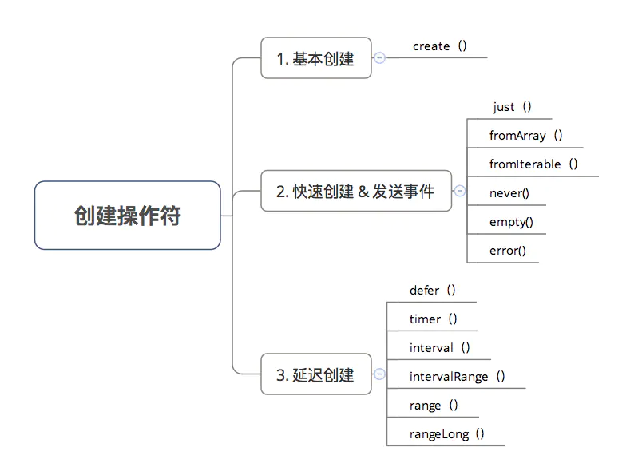
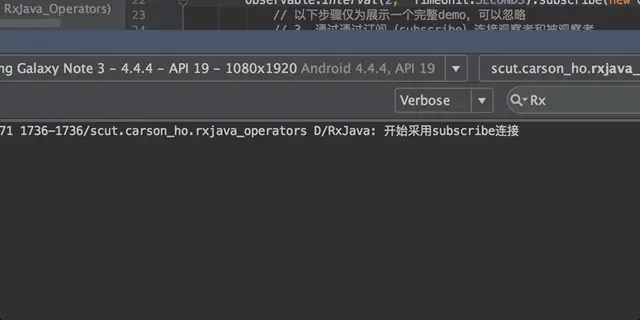
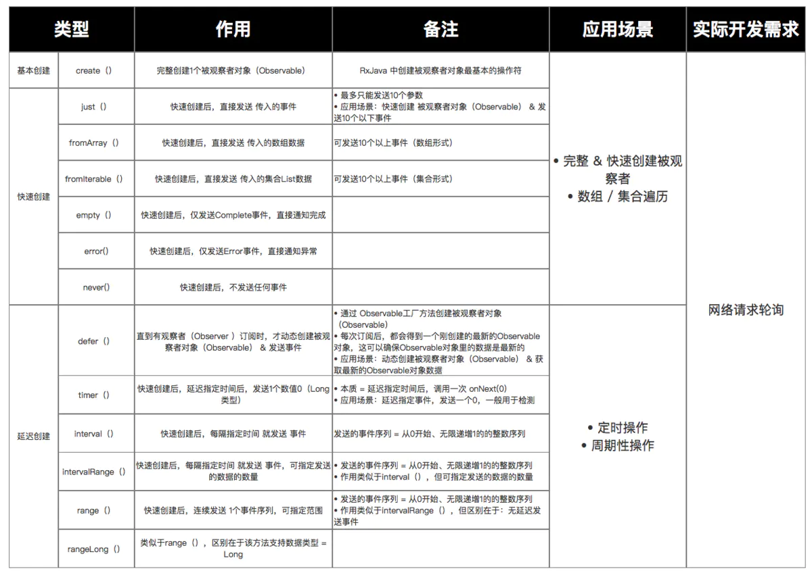
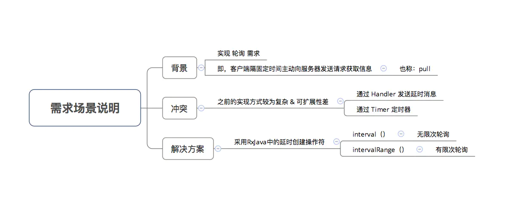

# 创建操作符

创建 被观察者（ `Observable`） 对象 & 发送事件。



## 基本创建

- 需求场景
  完整的创建被观察者对象
- 对应操作符类型

**create（）**

- 作用
  完整创建1个被观察者对象（`Observable`）

  `RxJava` 中创建被观察者对象最基本的操作符

- 具体使用

  ```java
  /***
     * 1. 通过creat（）创建被观察者 Observable 对象
     */ 
          Observable<Integer> observable = Observable.create(new ObservableOnSubscribe<Integer>() {
            // 传入参数： OnSubscribe 对象
            // 当 Observable 被订阅时，OnSubscribe 的 call() 方法会自动被调用，即事件序列就会依照设定依次被触发
            // 即观察者会依次调用对应事件的复写方法从而响应事件
            // 从而实现由被观察者向观察者的事件传递 & 被观察者调用了观察者的回调方法 ，即观察者模式
  /***
     * 2. 在复写的subscribe（）里定义需要发送的事件
     */ 
              @Override
              public void subscribe(ObservableEmitter<Integer> emitter) throws Exception {
                  // 通过 ObservableEmitter类对象 产生 & 发送事件
                  // ObservableEmitter类介绍
                      // a. 定义：事件发射器
                      // b. 作用：定义需要发送的事件 & 向观察者发送事件
                     // 注：建议发送事件前检查观察者的isUnsubscribed状态，以便在没有观察者时，让Observable停止发射数据
                      if (!observer.isUnsubscribed()) {
                             emitter.onNext(1);
                             emitter.onNext(2);
                             emitter.onNext(3);
                  }
                  emitter.onComplete();
              }
          });
  
  // 至此，一个完整的被观察者对象（Observable）就创建完毕了。
  ```

  在具体使用时，一般采用 **链式调用** 来创建

  ```java
          // 1. 通过creat（）创建被观察者对象
          Observable.create(new ObservableOnSubscribe<Integer>() {
  
              // 2. 在复写的subscribe（）里定义需要发送的事件
              @Override
              public void subscribe(ObservableEmitter<Integer> emitter) throws Exception {
  
                      emitter.onNext(1);
                      emitter.onNext(2);
                      emitter.onNext(3);
  
                  emitter.onComplete();
              }  // 至此，一个被观察者对象（Observable）就创建完毕
          }).subscribe(new Observer<Integer>() {
              // 以下步骤仅为展示一个完整demo，可以忽略
              // 3. 通过通过订阅（subscribe）连接观察者和被观察者
              // 4. 创建观察者 & 定义响应事件的行为
              @Override
              public void onSubscribe(Disposable d) {
                  Log.d(TAG, "开始采用subscribe连接");
              }
              // 默认最先调用复写的 onSubscribe（）
  
              @Override
              public void onNext(Integer value) {
                  Log.d(TAG, "接收到了事件"+ value  );
              }
  
              @Override
              public void onError(Throwable e) {
                  Log.d(TAG, "对Error事件作出响应");
              }
  
              @Override
              public void onComplete() {
                  Log.d(TAG, "对Complete事件作出响应");
              }
  
          });
      }
  ```

- 测试结果


## 快速创建 & 发送事件

- 需求场景
   快速的创建被观察者对象
- 对应操作符类型

### just（）

- 作用
  1. 快速创建1个被观察者对象（`Observable`）
  2. 发送事件的特点：直接发送 传入的事件 
  3. **最多只能发送10个参数**

- 应用场景
   快速创建 被观察者对象（`Observable`） & **发送10个以下事件**
- 具体使用

```java
        // 1. 创建时传入整型1、2、3、4
        // 在创建后就会发送这些对象，相当于执行了onNext(1)、onNext(2)、onNext(3)、onNext(4)
        Observable.just(1, 2, 3,4)   
            // 至此，一个Observable对象创建完毕，以下步骤仅为展示一个完整demo，可以忽略
            // 2. 通过通过订阅（subscribe）连接观察者和被观察者
            // 3. 创建观察者 & 定义响应事件的行为
         .subscribe(new Observer<Integer>() {
            
            @Override
            public void onSubscribe(Disposable d) {
                Log.d(TAG, "开始采用subscribe连接");
            }
            // 默认最先调用复写的 onSubscribe（）

            @Override
            public void onNext(Integer value) {
                Log.d(TAG, "接收到了事件"+ value  );
            }

            @Override
            public void onError(Throwable e) {
                Log.d(TAG, "对Error事件作出响应");
            }

            @Override
            public void onComplete() {
                Log.d(TAG, "对Complete事件作出响应");
            }

        });
    }
```

### fromArray（）

- 作用
  1. 快速创建1个被观察者对象（`Observable`）
  2. 发送事件的特点：直接发送 **传入的数组数据**
  3. **会将数组中的数据转换为`Observable`对象**

- 应用场景
  1. 快速创建 被观察者对象（`Observable`） & 发送10个以上事件（数组形式）
  2. 数组元素遍历
- 具体使用

```java
      // 1. 设置需要传入的数组
     Integer[] items = { 0, 1, 2, 3, 4 };

        // 2. 创建被观察者对象（Observable）时传入数组
        // 在创建后就会将该数组转换成Observable & 发送该对象中的所有数据
        Observable.fromArray(items) 
        .subscribe(new Observer<Integer>() {
            @Override
            public void onSubscribe(Disposable d) {
                Log.d(TAG, "开始采用subscribe连接");
            }

            @Override
            public void onNext(Integer value) {
                Log.d(TAG, "接收到了事件"+ value  );
            }

            @Override
            public void onError(Throwable e) {
                Log.d(TAG, "对Error事件作出响应");
            }

            @Override
            public void onComplete() {
                Log.d(TAG, "对Complete事件作出响应");
            }

        });
    }

// 注：
// 可发送10个以上参数
// 若直接传递一个list集合进去，否则会直接把list当做一个数据元素发送

/*
  * 数组遍历
  **/
        // 1. 设置需要传入的数组
        Integer[] items = { 0, 1, 2, 3, 4 };

        // 2. 创建被观察者对象（Observable）时传入数组
        // 在创建后就会将该数组转换成Observable & 发送该对象中的所有数据
        Observable.fromArray(items)
                .subscribe(new Observer<Integer>() {
                    @Override
                    public void onSubscribe(Disposable d) {
                        Log.d(TAG, "数组遍历");
                    }

                    @Override
                    public void onNext(Integer value) {
                        Log.d(TAG, "数组中的元素 = "+ value  );
                    }

                    @Override
                    public void onError(Throwable e) {
                        Log.d(TAG, "对Error事件作出响应");
                    }

                    @Override
                    public void onComplete() {
                        Log.d(TAG, "遍历结束");
                    }

                });
```

### fromIterable（）

- 作用
  1. 快速创建1个被观察者对象（`Observable`）
  2. 发送事件的特点：直接发送 **传入的集合**`List`数据
  3. **会将数组中的数据转换为`Observable`对象**

- 应用场景
  1. 快速创建 被观察者对象（`Observable`） & 发送10个以上事件（集合形式）
  2. 集合元素遍历
- 具体使用

```java
/*
 * 快速发送集合
 **/
// 1. 设置一个集合
        List<Integer> list = new ArrayList<>();
        list.add(1);
        list.add(2);
        list.add(3);

// 2. 通过fromIterable()将集合中的对象 / 数据发送出去
        Observable.fromIterable(list)
                .subscribe(new Observer<Integer>() {
                    @Override
                    public void onSubscribe(Disposable d) {
                        Log.d(TAG, "开始采用subscribe连接");
                    }

                    @Override
                    public void onNext(Integer value) {
                        Log.d(TAG, "接收到了事件"+ value  );
                    }

                    @Override
                    public void onError(Throwable e) {
                        Log.d(TAG, "对Error事件作出响应");
                    }

                    @Override
                    public void onComplete() {
                        Log.d(TAG, "对Complete事件作出响应");
                    }
                });


/*
 * 集合遍历
 **/
        // 1. 设置一个集合
        List<Integer> list = new ArrayList<>();
        list.add(1);
        list.add(2);
        list.add(3);

        // 2. 通过fromIterable()将集合中的对象 / 数据发送出去
        Observable.fromIterable(list)
                .subscribe(new Observer<Integer>() {
                    @Override
                    public void onSubscribe(Disposable d) {
                        Log.d(TAG, "集合遍历");
                    }

                    @Override
                    public void onNext(Integer value) {
                        Log.d(TAG, "集合中的数据元素 = "+ value  );
                    }

                    @Override
                    public void onError(Throwable e) {
                        Log.d(TAG, "对Error事件作出响应");
                    }

                    @Override
                    public void onComplete() {
                        Log.d(TAG, "遍历结束");
                    }
                });
```

### 其它方法

```java
// 下列方法一般用于测试使用

<-- empty()  -->
// 该方法创建的被观察者对象发送事件的特点：仅发送Complete事件，直接通知完成
Observable observable1=Observable.empty(); 
// 即观察者接收后会直接调用onCompleted（）

<-- error()  -->
// 该方法创建的被观察者对象发送事件的特点：仅发送Error事件，直接通知异常
// 可自定义异常
Observable observable2=Observable.error(new RuntimeException())
// 即观察者接收后会直接调用onError（）

<-- never()  -->
// 该方法创建的被观察者对象发送事件的特点：不发送任何事件
Observable observable3=Observable.never();
// 即观察者接收后什么都不调用
```

## 延迟创建

- 需求场景
  1. 定时操作：在经过了x秒后，需要自动执行y操作
  2. 周期性操作：每隔x秒后，需要自动执行y操作

### defer（）

- 作用
   直到有观察者（`Observer` ）订阅时，才动态创建被观察者对象（`Observable`） & 发送事件

> 1. 通过 `Observable`工厂方法创建被观察者对象（`Observable`）
> 2. 每次订阅后，都会得到一个刚创建的最新的`Observable`对象，这可以确保`Observable`对象里的数据是最新的

- 应用场景

   >动态创建被观察者对象（`Observable`） & 获取最新的`Observable`对象数据

- 具体使用

```java
       <-- 1. 第1次对i赋值 -->
        Integer i = 10;

        // 2. 通过defer 定义被观察者对象
        // 注：此时被观察者对象还没创建
        Observable<Integer> observable = Observable.defer(new Callable<ObservableSource<? extends Integer>>() {
            @Override
            public ObservableSource<? extends Integer> call() throws Exception {
                return Observable.just(i);
            }
        });

        <-- 2. 第2次对i赋值 ->>
        i = 15;

        <-- 3. 观察者开始订阅 ->>
        // 注：此时，才会调用defer（）创建被观察者对象（Observable）
        observable.subscribe(new Observer<Integer>() {

            @Override
            public void onSubscribe(Disposable d) {
                Log.d(TAG, "开始采用subscribe连接");
            }

            @Override
            public void onNext(Integer value) {
                Log.d(TAG, "接收到的整数是"+ value  );
            }

            @Override
            public void onError(Throwable e) {
                Log.d(TAG, "对Error事件作出响应");
            }

            @Override
            public void onComplete() {
                Log.d(TAG, "对Complete事件作出响应");
            }
        });
```

- 测试结果

  因为是在订阅时才创建，所以i值会取第2次的赋值


### timer（）

- 作用
  1. 快速创建1个被观察者对象（`Observable`）
  2. 发送事件的特点：延迟指定时间后，发送1个数值0（`Long`类型）

> 本质 = 延迟指定时间后，调用一次 `onNext(0)`

- 应用场景
   延迟指定事件，发送一个0，一般用于检测

- 具体使用

  ```java
          // 该例子 = 延迟2s后，发送一个long类型数值
          Observable.timer(2, TimeUnit.SECONDS) 
                    .subscribe(new Observer<Long>() {
              @Override
              public void onSubscribe(Disposable d) {
                  Log.d(TAG, "开始采用subscribe连接");
              }
  
              @Override
              public void onNext(Long value) {
                  Log.d(TAG, "接收到了事件"+ value  );
              }
  
              @Override
              public void onError(Throwable e) {
                  Log.d(TAG, "对Error事件作出响应");
              }
  
              @Override
              public void onComplete() {
                  Log.d(TAG, "对Complete事件作出响应");
              }
  
          });
  
  // 注：timer操作符默认运行在一个新线程上
  // 也可自定义线程调度器（第3个参数）：timer(long,TimeUnit,Scheduler) 
  ```

- 测试结果

  

### interval（）

- 作用
  1. 快速创建1个被观察者对象（`Observable`）
  2. 发送事件的特点：每隔指定时间 就发送 事件

> 发送的事件序列 = 从0开始、无限递增1的的整数序列

- 具体使用

  ```java
         // 参数说明：
          // 参数1 = 第1次延迟时间；
          // 参数2 = 间隔时间数字；
          // 参数3 = 时间单位；
          Observable.interval(3,1,TimeUnit.SECONDS)
                  // 该例子发送的事件序列特点：延迟3s后发送事件，每隔1秒产生1个数字（从0开始递增1，无限个）
                  .subscribe(new Observer<Long>() {
                      @Override
                      public void onSubscribe(Disposable d) {
                          Log.d(TAG, "开始采用subscribe连接");
                      }
                      // 默认最先调用复写的 onSubscribe（）
  
                      @Override
                      public void onNext(Long value) {
                          Log.d(TAG, "接收到了事件"+ value  );
                      }
  
                      @Override
                      public void onError(Throwable e) {
                          Log.d(TAG, "对Error事件作出响应");
                      }
  
                      @Override
                      public void onComplete() {
                          Log.d(TAG, "对Complete事件作出响应");
                      }
  
                  });
  
  // 注：interval默认在computation调度器上执行
  // 也可自定义指定线程调度器（第3个参数）：interval(long,TimeUnit,Scheduler)
  ```

- 测试结果

  

### intervalRange（）

- 作用
  1. 快速创建1个被观察者对象（`Observable`）
  2. 发送事件的特点：每隔指定时间 就发送 事件，**可指定发送的数据的数量**

> a. 发送的事件序列 = 从0开始、无限递增1的的整数序列
>  b. 作用类似于`interval（）`，但可指定发送的数据的数量

- 具体使用

  ```java
  // 参数说明：
          // 参数1 = 事件序列起始点；
          // 参数2 = 事件数量；
          // 参数3 = 第1次事件延迟发送时间；
          // 参数4 = 间隔时间数字；
          // 参数5 = 时间单位
          Observable.intervalRange(3,10,2, 1, TimeUnit.SECONDS)
                  // 该例子发送的事件序列特点：
                  // 1. 从3开始，一共发送10个事件；
                  // 2. 第1次延迟2s发送，之后每隔2秒产生1个数字（从0开始递增1，无限个）
                  .subscribe(new Observer<Long>() {
                      @Override
                      public void onSubscribe(Disposable d) {
                          Log.d(TAG, "开始采用subscribe连接");
                      }
                      // 默认最先调用复写的 onSubscribe（）
  
                      @Override
                      public void onNext(Long value) {
                          Log.d(TAG, "接收到了事件"+ value  );
                      }
  
                      @Override
                      public void onError(Throwable e) {
                          Log.d(TAG, "对Error事件作出响应");
                      }
  
                      @Override
                      public void onComplete() {
                          Log.d(TAG, "对Complete事件作出响应");
                      }
  
                  });
  ```

- 测试结果


### range（）

- 作用
  1. 快速创建1个被观察者对象（`Observable`）
  2. 发送事件的特点：连续发送 1个事件序列，可指定范围

> a. 发送的事件序列 = 从0开始、无限递增1的的整数序列
>  b. 作用类似于`intervalRange（）`，但区别在于：无延迟发送事件

- 具体使用

  ```java
  
  // 参数说明：
          // 参数1 = 事件序列起始点；
          // 参数2 = 事件数量；
          // 注：若设置为负数，则会抛出异常
          Observable.range(3,10)
                  // 该例子发送的事件序列特点：从3开始发送，每次发送事件递增1，一共发送10个事件
                  .subscribe(new Observer<Integer>() {
                      @Override
                      public void onSubscribe(Disposable d) {
                          Log.d(TAG, "开始采用subscribe连接");
                      }
                      // 默认最先调用复写的 onSubscribe（）
  
                      @Override
                      public void onNext(Integer value) {
                          Log.d(TAG, "接收到了事件"+ value  );
                      }
  
                      @Override
                      public void onError(Throwable e) {
                          Log.d(TAG, "对Error事件作出响应");
                      }
  
                      @Override
                      public void onComplete() {
                          Log.d(TAG, "对Complete事件作出响应");
                      }
  
                  });
  
  ```

- 测试结果


### rangeLong（）

- 作用：类似于`range（）`，区别在于该方法支持数据类型 = `Long`
- 具体使用
  与`range（）`类似，此处不作过多描述

## 总结



## 项目实例

- [（无条件）网络请求轮询](https://github.com/Carson-Ho/RxJavaLearningMaterial)

