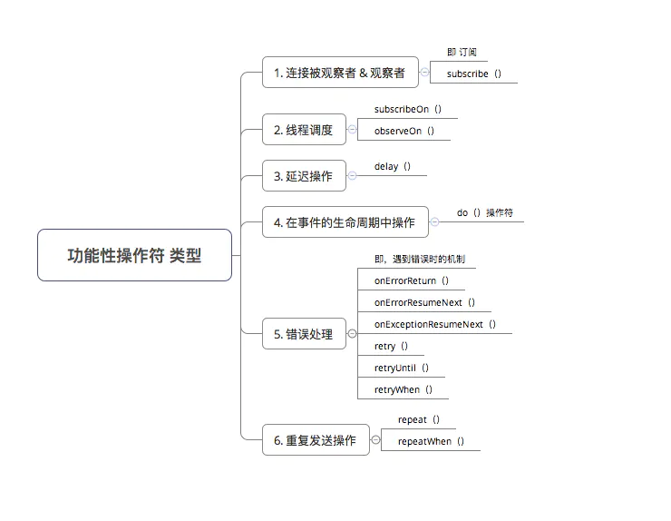
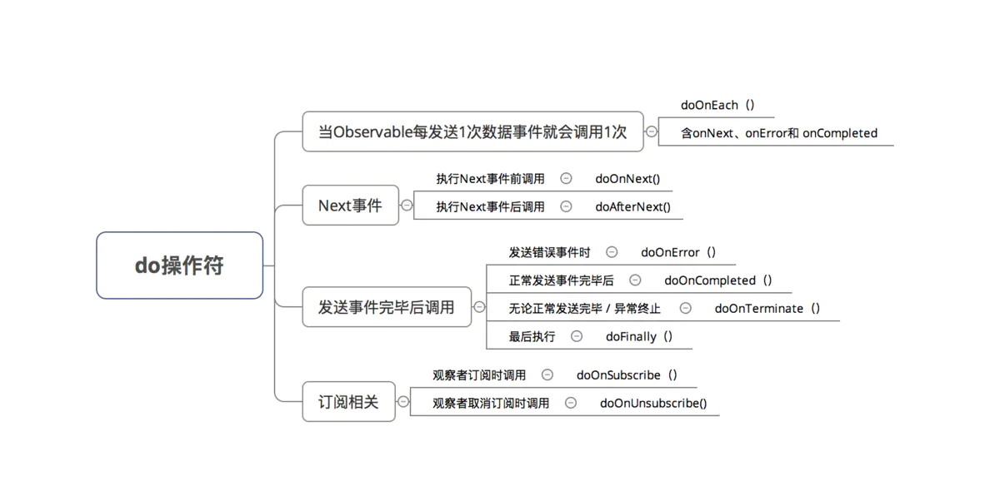
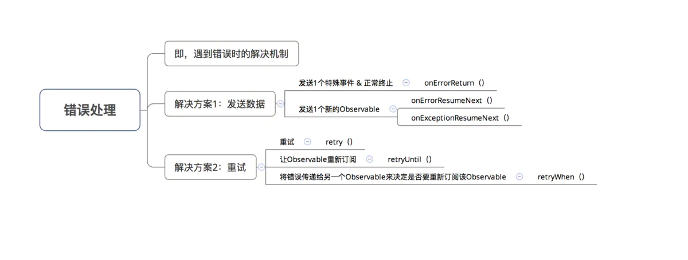

# 功能性操作符

## 作用

辅助被观察者（`Observable`） 在发送事件时实现一些功能性需求

> 如错误处理、线程调度等等

## 类型

- `RxJava 2` 中，常见的功能性操作符 主要有：



## 连接被观察者 & 观察者

- 需求场景
  即使得被观察者 & 观察者 **形成订阅关系**
- 对应操作符

### subscribe（）

- 作用
  订阅，即连接观察者 & 被观察者
- 具体使用

```java
observable.subscribe(observer);
// 前者 = 被观察者（observable）；后者 = 观察者（observer 或 subscriber）


<-- 1. 分步骤的完整调用 -->
//  步骤1： 创建被观察者 Observable 对象
        Observable<Integer> observable = Observable.create(new ObservableOnSubscribe<Integer>() {
            @Override
            public void subscribe(ObservableEmitter<Integer> emitter) throws Exception {
                emitter.onNext(1);
                emitter.onNext(2);
                emitter.onNext(3);
                emitter.onComplete();
            }
        });

// 步骤2：创建观察者 Observer 并 定义响应事件行为
        Observer<Integer> observer = new Observer<Integer>() {
            // 通过复写对应方法来 响应 被观察者
            @Override
            public void onSubscribe(Disposable d) {
                Log.d(TAG, "开始采用subscribe连接");
            }
            // 默认最先调用复写的 onSubscribe（）

            @Override
            public void onNext(Integer value) {
                Log.d(TAG, "对Next事件"+ value +"作出响应"  );
            }

            @Override
            public void onError(Throwable e) {
                Log.d(TAG, "对Error事件作出响应");
            }

            @Override
            public void onComplete() {
                Log.d(TAG, "对Complete事件作出响应");
            }
        };

        
        // 步骤3：通过订阅（subscribe）连接观察者和被观察者
        observable.subscribe(observer);


<-- 2. 基于事件流的链式调用 -->
        Observable.create(new ObservableOnSubscribe<Integer>() {
        // 1. 创建被观察者 & 生产事件
            @Override
            public void subscribe(ObservableEmitter<Integer> emitter) throws Exception {
                emitter.onNext(1);
                emitter.onNext(2);
                emitter.onNext(3);
                emitter.onComplete();
            }
        }).subscribe(new Observer<Integer>() {
            // 2. 通过通过订阅（subscribe）连接观察者和被观察者
            // 3. 创建观察者 & 定义响应事件的行为
            @Override
            public void onSubscribe(Disposable d) {
                Log.d(TAG, "开始采用subscribe连接");
            }
            // 默认最先调用复写的 onSubscribe（）

            @Override
            public void onNext(Integer value) {
                Log.d(TAG, "对Next事件"+ value +"作出响应"  );
            }

            @Override
            public void onError(Throwable e) {
                Log.d(TAG, "对Error事件作出响应");
            }

            @Override
            public void onComplete() {
                Log.d(TAG, "对Complete事件作出响应");
            }

        });
    }
}

```

- 扩展说明

```java
<-- Observable.subscribe(Subscriber) 的内部实现 -->

public Subscription subscribe(Subscriber subscriber) {
    subscriber.onStart();
    // 在观察者 subscriber抽象类复写的方法 onSubscribe.call(subscriber)，用于初始化工作
    // 通过该调用，从而回调观察者中的对应方法从而响应被观察者生产的事件
    // 从而实现被观察者调用了观察者的回调方法 & 由被观察者向观察者的事件传递，即观察者模式
    // 同时也看出：Observable只是生产事件，真正的发送事件是在它被订阅的时候，即当 subscribe() 方法执行时
}
```

## 线程调度

- 需求场景
  快速、方便指定 & 控制被观察者 & 观察者 的工作线程

- [线程调度操作符使用详解](./线程调度操作符使用详解.md)
- [线程调度底层原理](./线程调度底层原理.md)

## 延迟操作

- 需求场景
  即在被观察者发送事件前进行一些延迟的操作
- 对应操作符使用

### delay（）

- 作用
  使得被观察者延迟一段时间再发送事件
- 方法介绍
  `delay（）` 具备多个重载方法，具体如下：

```java
// 1. 指定延迟时间
// 参数1 = 时间；参数2 = 时间单位
delay(long delay,TimeUnit unit)

// 2. 指定延迟时间 & 调度器
// 参数1 = 时间；参数2 = 时间单位；参数3 = 线程调度器
delay(long delay,TimeUnit unit,mScheduler scheduler)

// 3. 指定延迟时间  & 错误延迟
// 错误延迟，即：若存在Error事件，则如常执行，执行后再抛出错误异常
// 参数1 = 时间；参数2 = 时间单位；参数3 = 错误延迟参数
delay(long delay,TimeUnit unit,boolean delayError)

// 4. 指定延迟时间 & 调度器 & 错误延迟
// 参数1 = 时间；参数2 = 时间单位；参数3 = 线程调度器；参数4 = 错误延迟参数
delay(long delay,TimeUnit unit,mScheduler scheduler,boolean delayError): 指定延迟多长时间并添加调度器，错误通知可以设置是否延迟
```

- 具体使用

```java
Observable.just(1, 2, 3)
                .delay(3, TimeUnit.SECONDS) // 延迟3s再发送，由于使用类似，所以此处不作全部展示
                .subscribe(new Observer<Integer>() {
                    @Override
                    public void onSubscribe(Disposable d) {

                    }

                    @Override
                    public void onNext(Integer value) {
                        Log.d(TAG, "接收到了事件"+ value  );
                    }

                    @Override
                    public void onError(Throwable e) {
                        Log.d(TAG, "对Error事件作出响应");
                    }

                    @Override
                    public void onComplete() {
                        Log.d(TAG, "对Complete事件作出响应");
                    }
                });
```

## 在事件的生命周期中操作

- 需求场景
   在事件发送 & 接收的整个生命周期过程中进行操作

> 如发送事件前的初始化、发送事件后的回调请求等

- 对应操作符使用

### do（）

- 作用
   在某个事件的生命周期中调用
- 类型
   `do（）`操作符有很多个，具体如下：



- 具体使用

```java
Observable.create(new ObservableOnSubscribe<Integer>() {
            @Override
            public void subscribe(ObservableEmitter<Integer> e) throws Exception {
                e.onNext(1);
                e.onNext(2);
                e.onNext(3);
                e.onError(new Throwable("发生错误了"));
                 }
               })
                // 1. 当Observable每发送1次数据事件就会调用1次
                .doOnEach(new Consumer<Notification<Integer>>() {
                    @Override
                    public void accept(Notification<Integer> integerNotification) throws Exception {
                        Log.d(TAG, "doOnEach: " + integerNotification.getValue());
                    }
                })
                // 2. 执行Next事件前调用
                .doOnNext(new Consumer<Integer>() {
                    @Override
                    public void accept(Integer integer) throws Exception {
                        Log.d(TAG, "doOnNext: " + integer);
                    }
                })
                // 3. 执行Next事件后调用
                .doAfterNext(new Consumer<Integer>() {
                    @Override
                    public void accept(Integer integer) throws Exception {
                        Log.d(TAG, "doAfterNext: " + integer);
                    }
                })
                // 4. Observable正常发送事件完毕后调用
                .doOnComplete(new Action() {
                    @Override
                    public void run() throws Exception {
                        Log.e(TAG, "doOnComplete: ");
                    }
                })
                // 5. Observable发送错误事件时调用
                .doOnError(new Consumer<Throwable>() {
                    @Override
                    public void accept(Throwable throwable) throws Exception {
                        Log.d(TAG, "doOnError: " + throwable.getMessage());
                    }
                })
                // 6. 观察者订阅时调用
                .doOnSubscribe(new Consumer<Disposable>() {
                    @Override
                    public void accept(@NonNull Disposable disposable) throws Exception {
                        Log.e(TAG, "doOnSubscribe: ");
                    }
                })
                // 7. Observable发送事件完毕后调用，无论正常发送完毕 / 异常终止
                .doAfterTerminate(new Action() {
                    @Override
                    public void run() throws Exception {
                        Log.e(TAG, "doAfterTerminate: ");
                    }
                })
                // 8. 最后执行
                .doFinally(new Action() {
                    @Override
                    public void run() throws Exception {
                        Log.e(TAG, "doFinally: ");
                    }
                })
                .subscribe(new Observer<Integer>() {
                    @Override
                    public void onSubscribe(Disposable d) {

                    }
                    @Override
                    public void onNext(Integer value) {
                        Log.d(TAG, "接收到了事件"+ value  );
                    }

                    @Override
                    public void onError(Throwable e) {
                        Log.d(TAG, "对Error事件作出响应");
                    }

                    @Override
                    public void onComplete() {
                        Log.d(TAG, "对Complete事件作出响应");
                    }
                });
```

- 测试结果


## 错误处理

- 需求场景
  发送事件过程中，遇到错误时的处理机制
- 对应操作符类型



### onErrorReturn（）

- 作用
  遇到错误时，发送1个特殊事件 & 正常终止

> 可捕获在它之前发生的异常

- 具体使用

```java
Observable.create(new ObservableOnSubscribe<Integer>() {
            @Override
            public void subscribe(ObservableEmitter<Integer> e) throws Exception {
                e.onNext(1);
                e.onNext(2);
                e.onError(new Throwable("发生错误了"));
                 }
               })
                .onErrorReturn(new Function<Throwable, Integer>() {
                    @Override
                    public Integer apply(@NonNull Throwable throwable) throws Exception {
                        // 捕捉错误异常
                        Log.e(TAG, "在onErrorReturn处理了错误: "+throwable.toString() );

                        return 666;
                        // 发生错误事件后，发送一个"666"事件，最终正常结束
                    }
                })
                .subscribe(new Observer<Integer>() {
                    @Override
                    public void onSubscribe(Disposable d) {

                    }
                    @Override
                    public void onNext(Integer value) {
                        Log.d(TAG, "接收到了事件"+ value  );
                    }

                    @Override
                    public void onError(Throwable e) {
                        Log.d(TAG, "对Error事件作出响应");
                    }

                    @Override
                    public void onComplete() {
                        Log.d(TAG, "对Complete事件作出响应");
                    }
                });
```

- 测试结果


### onErrorResumeNext（）

- 作用
   遇到错误时，发送1个新的`Observable`

> 注：
>
> 1. `onErrorResumeNext（）`拦截的错误 = `Throwable`；若需拦截`Exception`请用`onExceptionResumeNext（）`
> 2. 若`onErrorResumeNext（）`拦截的错误 = `Exception`，则会将错误传递给观察者的`onError`方法

- 具体使用

```java
Observable.create(new ObservableOnSubscribe<Integer>() {
            @Override
            public void subscribe(ObservableEmitter<Integer> e) throws Exception {
                e.onNext(1);
                e.onNext(2);
                e.onError(new Throwable("发生错误了"));
                 }
               })
                .onErrorResumeNext(new Function<Throwable, ObservableSource<? extends Integer>>() {
                    @Override
                    public ObservableSource<? extends Integer> apply(@NonNull Throwable throwable) throws Exception {

                        // 1. 捕捉错误异常
                        Log.e(TAG, "在onErrorReturn处理了错误: "+throwable.toString() );

                        // 2. 发生错误事件后，发送一个新的被观察者 & 发送事件序列
                        return Observable.just(11,22);
                        
                    }
                })
                .subscribe(new Observer<Integer>() {
                    @Override
                    public void onSubscribe(Disposable d) {

                    }
                    @Override
                    public void onNext(Integer value) {
                        Log.d(TAG, "接收到了事件"+ value  );
                    }

                    @Override
                    public void onError(Throwable e) {
                        Log.d(TAG, "对Error事件作出响应");
                    }

                    @Override
                    public void onComplete() {
                        Log.d(TAG, "对Complete事件作出响应");
                    }
                });
```

- 测试结果


### onExceptionResumeNext（）

- 作用
   遇到错误时，发送1个新的`Observable`

> 注：
>
> 1. `onExceptionResumeNext（）`拦截的错误 = `Exception`；若需拦截`Throwable`请用`onErrorResumeNext（）`
> 2. 若`onExceptionResumeNext（）`拦截的错误 = `Throwable`，则会将错误传递给观察者的`onError`方法

- 具体使用

```java
Observable.create(new ObservableOnSubscribe<Integer>() {
            @Override
            public void subscribe(ObservableEmitter<Integer> e) throws Exception {
                e.onNext(1);
                e.onNext(2);
                e.onError(new Exception("发生错误了"));
                 }
               })
                .onExceptionResumeNext(new Observable<Integer>() {
                    @Override
                    protected void subscribeActual(Observer<? super Integer> observer) {
                        observer.onNext(11);
                        observer.onNext(22);
                        observer.onComplete();
                    }
                })
                .subscribe(new Observer<Integer>() {
                    @Override
                    public void onSubscribe(Disposable d) {

                    }
                    @Override
                    public void onNext(Integer value) {
                        Log.d(TAG, "接收到了事件"+ value  );
                    }

                    @Override
                    public void onError(Throwable e) {
                        Log.d(TAG, "对Error事件作出响应");
                    }

                    @Override
                    public void onComplete() {
                        Log.d(TAG, "对Complete事件作出响应");
                    }
                });
```

- 测试结果


### retry（）

- 作用
   重试，即当出现错误时，让被观察者（`Observable`）重新发射数据

> 1. 接收到 onError（）时，重新订阅 & 发送事件
> 2. `Throwable` 和 `Exception`都可拦截

- 类型

共有5种重载方法

```java
<-- 1. retry（） -->
// 作用：出现错误时，让被观察者重新发送数据
// 注：若一直错误，则一直重新发送

<-- 2. retry（long time） -->
// 作用：出现错误时，让被观察者重新发送数据（具备重试次数限制
// 参数 = 重试次数
 
<-- 3. retry（Predicate predicate） -->
// 作用：出现错误后，判断是否需要重新发送数据（若需要重新发送& 持续遇到错误，则持续重试）
// 参数 = 判断逻辑

<--  4. retry（new BiPredicate<Integer, Throwable>） -->
// 作用：出现错误后，判断是否需要重新发送数据（若需要重新发送 & 持续遇到错误，则持续重试
// 参数 =  判断逻辑（传入当前重试次数 & 异常错误信息）

<-- 5. retry（long time,Predicate predicate） -->
// 作用：出现错误后，判断是否需要重新发送数据（具备重试次数限制
// 参数 = 设置重试次数 & 判断逻辑

```

- 具体使用

```java
<-- 1. retry（） -->
// 作用：出现错误时，让被观察者重新发送数据
// 注：若一直错误，则一直重新发送

Observable.create(new ObservableOnSubscribe<Integer>() {
            @Override
            public void subscribe(ObservableEmitter<Integer> e) throws Exception {
                e.onNext(1);
                e.onNext(2);
                e.onError(new Exception("发生错误了"));
                e.onNext(3);
                 }
               })
                .retry() // 遇到错误时，让被观察者重新发射数据（若一直错误，则一直重新发送
                .subscribe(new Observer<Integer>() {
                    @Override
                    public void onSubscribe(Disposable d) {

                    }
                    @Override
                    public void onNext(Integer value) {
                        Log.d(TAG, "接收到了事件"+ value  );
                    }

                    @Override
                    public void onError(Throwable e) {
                        Log.d(TAG, "对Error事件作出响应");
                    }

                    @Override
                    public void onComplete() {
                        Log.d(TAG, "对Complete事件作出响应");
                    }
                });


<-- 2. retry（long time） -->
// 作用：出现错误时，让被观察者重新发送数据（具备重试次数限制
// 参数 = 重试次数
Observable.create(new ObservableOnSubscribe<Integer>() {
            @Override
            public void subscribe(ObservableEmitter<Integer> e) throws Exception {
                e.onNext(1);
                e.onNext(2);
                e.onError(new Exception("发生错误了"));
                e.onNext(3);
                 }
               })
                .retry(3) // 设置重试次数 = 3次
                .subscribe(new Observer<Integer>() {
                    @Override
                    public void onSubscribe(Disposable d) {

                    }
                    @Override
                    public void onNext(Integer value) {
                        Log.d(TAG, "接收到了事件"+ value  );
                    }

                    @Override
                    public void onError(Throwable e) {
                        Log.d(TAG, "对Error事件作出响应");
                    }

                    @Override
                    public void onComplete() {
                        Log.d(TAG, "对Complete事件作出响应");
                    }
                });

<-- 3. retry（Predicate predicate） -->
// 作用：出现错误后，判断是否需要重新发送数据（若需要重新发送& 持续遇到错误，则持续重试）
// 参数 = 判断逻辑
Observable.create(new ObservableOnSubscribe<Integer>() {
            @Override
            public void subscribe(ObservableEmitter<Integer> e) throws Exception {
                e.onNext(1);
                e.onNext(2);
                e.onError(new Exception("发生错误了"));
                e.onNext(3);
                 }
               })
                // 拦截错误后，判断是否需要重新发送请求
                .retry(new Predicate<Throwable>() {
                    @Override
                    public boolean test(@NonNull Throwable throwable) throws Exception {
                        // 捕获异常
                        Log.e(TAG, "retry错误: "+throwable.toString());

                        //返回false = 不重新重新发送数据 & 调用观察者的onError结束
                        //返回true = 重新发送请求（若持续遇到错误，就持续重新发送）
                        return true;
                    }
                })
                .subscribe(new Observer<Integer>() {
                    @Override
                    public void onSubscribe(Disposable d) {

                    }
                    @Override
                    public void onNext(Integer value) {
                        Log.d(TAG, "接收到了事件"+ value  );
                    }

                    @Override
                    public void onError(Throwable e) {
                        Log.d(TAG, "对Error事件作出响应");
                    }

                    @Override
                    public void onComplete() {
                        Log.d(TAG, "对Complete事件作出响应");
                    }
                });

<--  4. retry（new BiPredicate<Integer, Throwable>） -->
// 作用：出现错误后，判断是否需要重新发送数据（若需要重新发送 & 持续遇到错误，则持续重试
// 参数 =  判断逻辑（传入当前重试次数 & 异常错误信息）
Observable.create(new ObservableOnSubscribe<Integer>() {
            @Override
            public void subscribe(ObservableEmitter<Integer> e) throws Exception {
                e.onNext(1);
                e.onNext(2);
                e.onError(new Exception("发生错误了"));
                e.onNext(3);
                 }
               })

                // 拦截错误后，判断是否需要重新发送请求
                .retry(new BiPredicate<Integer, Throwable>() {
                    @Override
                    public boolean test(@NonNull Integer integer, @NonNull Throwable throwable) throws Exception {
                        // 捕获异常
                        Log.e(TAG, "异常错误 =  "+throwable.toString());

                        // 获取当前重试次数
                        Log.e(TAG, "当前重试次数 =  "+integer);

                        //返回false = 不重新重新发送数据 & 调用观察者的onError结束
                        //返回true = 重新发送请求（若持续遇到错误，就持续重新发送）
                        return true;
                    }
                })
                .subscribe(new Observer<Integer>() {
                    @Override
                    public void onSubscribe(Disposable d) {

                    }
                    @Override
                    public void onNext(Integer value) {
                        Log.d(TAG, "接收到了事件"+ value  );
                    }

                    @Override
                    public void onError(Throwable e) {
                        Log.d(TAG, "对Error事件作出响应");
                    }

                    @Override
                    public void onComplete() {
                        Log.d(TAG, "对Complete事件作出响应");
                    }
                });


<-- 5. retry（long time,Predicate predicate） -->
// 作用：出现错误后，判断是否需要重新发送数据（具备重试次数限制
// 参数 = 设置重试次数 & 判断逻辑
Observable.create(new ObservableOnSubscribe<Integer>() {
            @Override
            public void subscribe(ObservableEmitter<Integer> e) throws Exception {
                e.onNext(1);
                e.onNext(2);
                e.onError(new Exception("发生错误了"));
                e.onNext(3);
                 }
               })
                // 拦截错误后，判断是否需要重新发送请求
                .retry(3, new Predicate<Throwable>() {
                    @Override
                    public boolean test(@NonNull Throwable throwable) throws Exception {
                        // 捕获异常
                        Log.e(TAG, "retry错误: "+throwable.toString());

                        //返回false = 不重新重新发送数据 & 调用观察者的onError（）结束
                        //返回true = 重新发送请求（最多重新发送3次）
                        return true;
                    }
                })
                .subscribe(new Observer<Integer>() {
                    @Override
                    public void onSubscribe(Disposable d) {

                    }
                    @Override
                    public void onNext(Integer value) {
                        Log.d(TAG, "接收到了事件"+ value  );
                    }

                    @Override
                    public void onError(Throwable e) {
                        Log.d(TAG, "对Error事件作出响应");
                    }

                    @Override
                    public void onComplete() {
                        Log.d(TAG, "对Complete事件作出响应");
                    }
                });
```

### retryUntil（）

- 作用
   出现错误后，判断是否需要重新发送数据

> 1. 若需要重新发送 & 持续遇到错误，则持续重试
> 2. 作用类似于`retry（Predicate predicate）`

- 具体使用
   具体使用类似于`retry（Predicate predicate）`，唯一区别：返回 `true` 则不重新发送数据事件。此处不作过多描述

### retryWhen（）

- 作用
   遇到错误时，将发生的错误传递给一个新的被观察者（`Observable`），并决定是否需要重新订阅原始被观察者（`Observable`）& 发送事件

- 具体使用

```java
Observable.create(new ObservableOnSubscribe<Integer>() {
            @Override
            public void subscribe(ObservableEmitter<Integer> e) throws Exception {
                e.onNext(1);
                e.onNext(2);
                e.onError(new Exception("发生错误了"));
                e.onNext(3);
            }
        })
                // 遇到error事件才会回调
                .retryWhen(new Function<Observable<Throwable>, ObservableSource<?>>() {
                    
                    @Override
                    public ObservableSource<?> apply(@NonNull Observable<Throwable> throwableObservable) throws Exception {
                        // 参数Observable<Throwable>中的泛型 = 上游操作符抛出的异常，可通过该条件来判断异常的类型
                        // 返回Observable<?> = 新的被观察者 Observable（任意类型）
                        // 此处有两种情况：
                            // 1. 若 新的被观察者 Observable发送的事件 = Error事件，那么 原始Observable则不重新发送事件：
                            // 2. 若 新的被观察者 Observable发送的事件 = Next事件 ，那么原始的Observable则重新发送事件：
                        return throwableObservable.flatMap(new Function<Throwable, ObservableSource<?>>() {
                            @Override
                            public ObservableSource<?> apply(@NonNull Throwable throwable) throws Exception {

                                // 1. 若返回的Observable发送的事件 = Error事件，则原始的Observable不重新发送事件
                                // 该异常错误信息可在观察者中的onError（）中获得
                                 return Observable.error(new Throwable("retryWhen终止啦"));
                                
                                // 2. 若返回的Observable发送的事件 = Next事件，则原始的Observable重新发送事件（若持续遇到错误，则持续重试）
                                 // return Observable.just(1);
                            }
                        });

                    }
                })
                .subscribe(new Observer<Integer>() {
                    @Override
                    public void onSubscribe(Disposable d) {

                    }
                    @Override
                    public void onNext(Integer value) {
                        Log.d(TAG, "接收到了事件"+ value  );
                    }

                    @Override
                    public void onError(Throwable e) {
                        Log.d(TAG, "对Error事件作出响应" + e.toString());
                        // 获取异常错误信息
                    }

                    @Override
                    public void onComplete() {
                        Log.d(TAG, "对Complete事件作出响应");
                    }
                });
```

- 测试结果

  - 新的Observable发送错误事件 = 原始Observable终止发送

  

  - 新的Observable发送数据事件 = 原始Observable 持续重试

  

## 重复发送

- 需求场景
   重复不断地发送被观察者事件
- 对应操作符类型
   `repeat（）` & `repeatWhen（）`

### repeat（）

- 作用
   无条件地、重复发送 被观察者事件

> 具备重载方法，可设置重复创建次数

- 具体使用

```java
// 不传入参数 = 重复发送次数 = 无限次
        repeat（）；
        // 传入参数 = 重复发送次数有限
        repeatWhen（Integer int ）；

// 注：
  // 1. 接收到.onCompleted()事件后，触发重新订阅 & 发送
  // 2. 默认运行在一个新的线程上

        // 具体使用
        Observable.just(1, 2, 3, 4)
                .repeat(3) // 重复创建次数 =- 3次
                .subscribe(new Observer<Integer>() {
                    @Override
                    public void onSubscribe(Disposable d) {
                        Log.d(TAG, "开始采用subscribe连接");
                    }
                    
                    @Override
                    public void onNext(Integer value) {
                        Log.d(TAG, "接收到了事件" + value);
                    }

                    @Override
                    public void onError(Throwable e) {
                        Log.d(TAG, "对Error事件作出响应");
                    }

                    @Override
                    public void onComplete() {
                        Log.d(TAG, "对Complete事件作出响应");
                    }

                });


```

- 测试结果


### repeatWhen（）

- 作用
   有条件地、重复发送 被观察者事件
- 原理
   将原始 `Observable`  停止发送事件的标识（`Complete（）` /  `Error（）`）转换成1个 `Object` 类型数据传递给1个新被观察者（`Observable`），以此决定是否重新订阅 & 发送原来的 `Observable`

> 1. 若新被观察者（`Observable`）返回1个`Complete` / `Error`事件，则不重新订阅 & 发送原来的 `Observable`
> 2. 若新被观察者（`Observable`）返回其余事件时，则重新订阅 & 发送原来的 `Observable`

- 具体使用

```java
 Observable.just(1,2,4).repeatWhen(new Function<Observable<Object>, ObservableSource<?>>() {
            @Override
            // 在Function函数中，必须对输入的 Observable<Object>进行处理，这里我们使用的是flatMap操作符接收上游的数据
            public ObservableSource<?> apply(@NonNull Observable<Object> objectObservable) throws Exception {
                // 将原始 Observable 停止发送事件的标识（Complete（） /  Error（））转换成1个 Object 类型数据传递给1个新被观察者（Observable）
                // 以此决定是否重新订阅 & 发送原来的 Observable
                // 此处有2种情况：
                // 1. 若新被观察者（Observable）返回1个Complete（） /  Error（）事件，则不重新订阅 & 发送原来的 Observable
                // 2. 若新被观察者（Observable）返回其余事件，则重新订阅 & 发送原来的 Observable
                return objectObservable.flatMap(new Function<Object, ObservableSource<?>>() {
                    @Override
                    public ObservableSource<?> apply(@NonNull Object throwable) throws Exception {

                        // 情况1：若新被观察者（Observable）返回1个Complete（） /  Error（）事件，则不重新订阅 & 发送原来的 Observable
                        return Observable.empty();
                        // Observable.empty() = 发送Complete事件，但不会回调观察者的onComplete（）

                        // return Observable.error(new Throwable("不再重新订阅事件"));
                        // 返回Error事件 = 回调onError（）事件，并接收传过去的错误信息。

                        // 情况2：若新被观察者（Observable）返回其余事件，则重新订阅 & 发送原来的 Observable
                        // return Observable.just(1);
                       // 仅仅是作为1个触发重新订阅被观察者的通知，发送的是什么数据并不重要，只要不是Complete（） /  Error（）事件
                    }
                });

            }
        })
                .subscribe(new Observer<Integer>() {
                    @Override
                    public void onSubscribe(Disposable d) {
                        Log.d(TAG, "开始采用subscribe连接");
                    }

                    @Override
                    public void onNext(Integer value) {
                        Log.d(TAG, "接收到了事件" + value);
                    }

                    @Override
                    public void onError(Throwable e) {
                        Log.d(TAG, "对Error事件作出响应：" + e.toString());
                    }

                    @Override
                    public void onComplete() {
                        Log.d(TAG, "对Complete事件作出响应");
                    }

                });
```

- 测试结果

  - 新的Observable发送Complete 事件 = 原始Observable停止发送 & 不重新发送

    

  - 新的Observable发送Error 事件 = 原始Observable停止发送 & 不重新发送

    

  - 新的Observable发送其余事件 = 原始Observable重新发送

    

## 项目实例

- [（有条件）网络请求轮询（结合Retrofit）](https://www.jianshu.com/p/dbeaaa4afad5)
- [网络请求出错重连（结合Retrofit）](https://www.jianshu.com/p/508c30aef0c1)