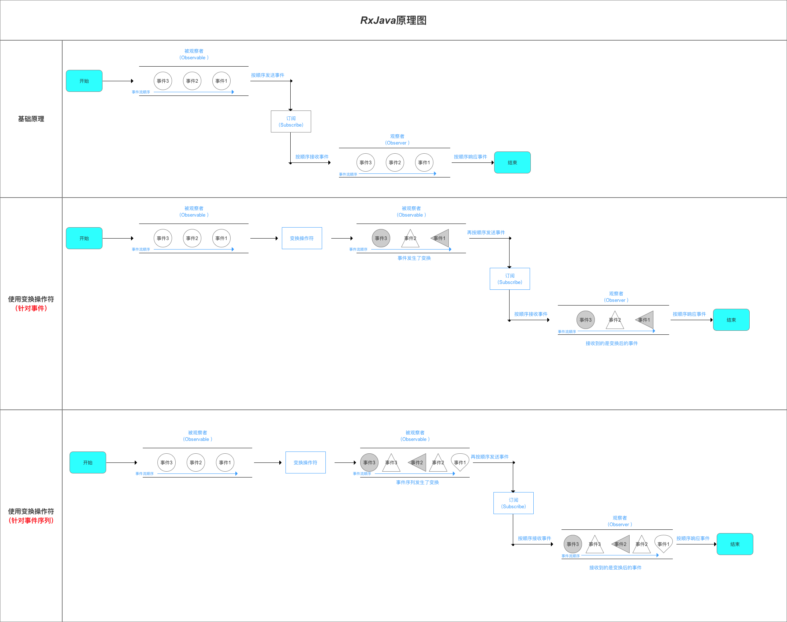
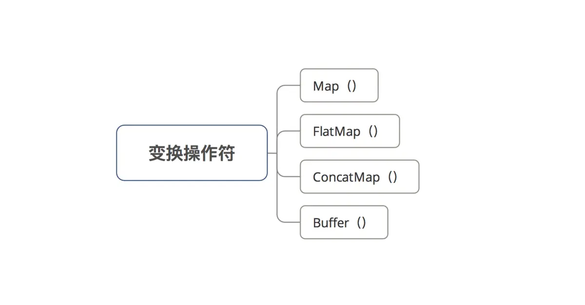
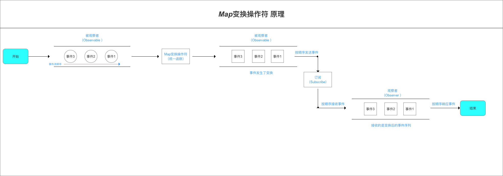
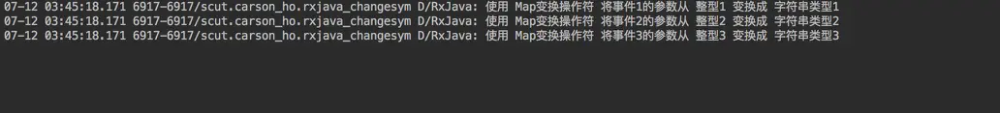
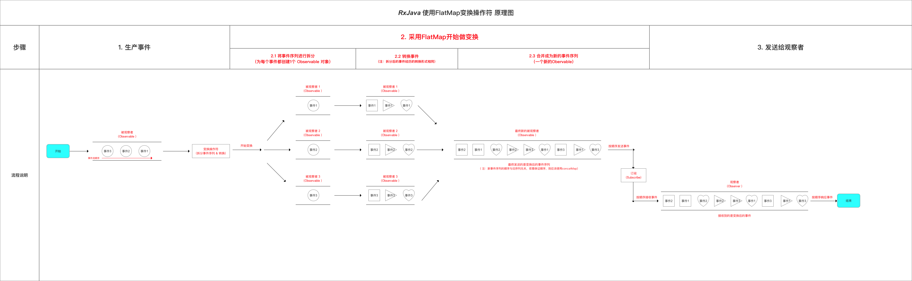
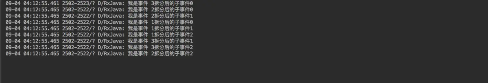
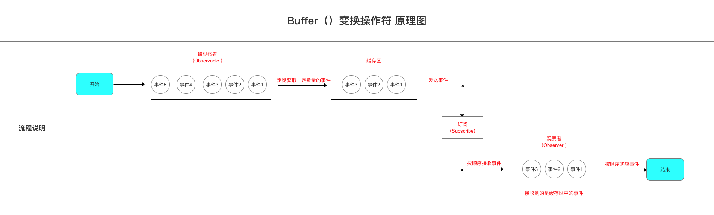
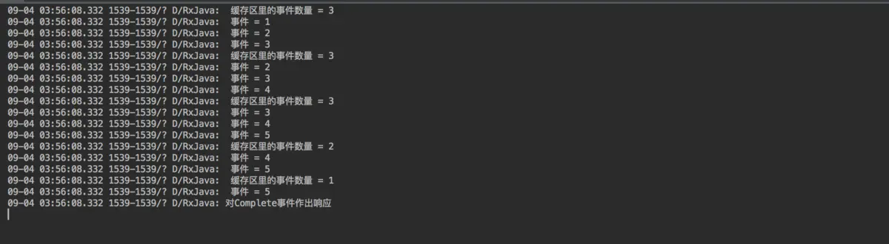
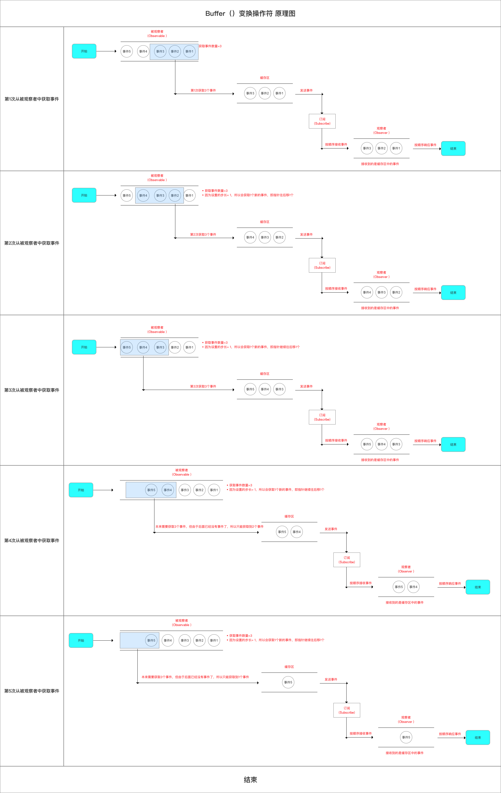
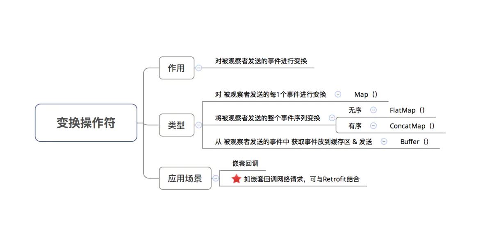

# 变换操作符

## 作用

- 对事件序列中的事件 / 整个事件序列 进行**加工处理**（即变换），使得其转变成不同的事件 / 整个事件序列
- 具体原理如下



## 类型

- `RxJava`中常见的变换操作符如下：



## 应用场景 & 对应操作符 介绍

### Map（）

- 作用
  对 被观察者发送的每1个事件都通过 **指定的函数** 处理，从而变换成另外一种事件

> 即， **将被观察者发送的事件转换为任意的类型事件。**

- 原理



- 应用场景
  数据类型转换

- 具体使用
  下面以将 使用`Map（）` 将事件的参数从 **整型** 变换成 **字符串类型** 为例子说明

```java
 // 采用RxJava基于事件流的链式操作
        Observable.create(new ObservableOnSubscribe<Integer>() {

            // 1. 被观察者发送事件 = 参数为整型 = 1、2、3
            @Override
            public void subscribe(ObservableEmitter<Integer> emitter) throws Exception {
                emitter.onNext(1);
                emitter.onNext(2);
                emitter.onNext(3);

            }
            // 2. 使用Map变换操作符中的Function函数对被观察者发送的事件进行统一变换：整型变换成字符串类型
        }).map(new Function<Integer, String>() {
            @Override
            public String apply(Integer integer) throws Exception {
                return "使用 Map变换操作符 将事件" + integer +"的参数从 整型"+integer + " 变换成 字符串类型" + integer ;
            }
        }).subscribe(new Consumer<String>() {

            // 3. 观察者接收事件时，是接收到变换后的事件 = 字符串类型
            @Override
            public void accept(String s) throws Exception {
                Log.d(TAG, s);
            }
        });
```

`map()` 将参数中的 `Integer` 类型对象转换成一个 `String`类型 对象后返回

> 同时，事件的参数类型也由 `Integer` 类型变成了 `String` 类型

- 测试结果



### FlatMap（）

- 作用：将被观察者发送的事件序列进行 **拆分  & 单独转换**，再合并成一个新的事件序列，最后再进行发送
- 原理

1. 为事件序列中每个事件都创建一个 `Observable` 对象；
2. 将对每个 原始事件 转换后的 新事件 都放入到对应 `Observable`对象；
3. 将新建的每个`Observable` 都合并到一个 新建的、总的`Observable` 对象；
4. 新建的、总的`Observable` 对象 将 新合并的事件序列 发送给观察者（`Observer`）



- 应用场景
  无序的将被观察者发送的整个事件序列进行变换
- 具体使用

```java
// 采用RxJava基于事件流的链式操作
        Observable.create(new ObservableOnSubscribe<Integer>() {
            @Override
            public void subscribe(ObservableEmitter<Integer> emitter) throws Exception {
                emitter.onNext(1);
                emitter.onNext(2);
                emitter.onNext(3);
            }

            // 采用flatMap（）变换操作符
        }).flatMap(new Function<Integer, ObservableSource<String>>() {
            @Override
            public ObservableSource<String> apply(Integer integer) throws Exception {
                final List<String> list = new ArrayList<>();
                for (int i = 0; i < 3; i++) {
                    list.add("我是事件 " + integer + "拆分后的子事件" + i);
                    // 通过flatMap中将被观察者生产的事件序列先进行拆分，再将每个事件转换为一个新的发送三个String事件
                    // 最终合并，再发送给被观察者
                }
                return Observable.fromIterable(list);
            }
        }).subscribe(new Consumer<String>() {
            @Override
            public void accept(String s) throws Exception {
                Log.d(TAG, s);
            }
        });
```

- 测试结果

  **新合并生成的事件序列顺序是有序的，即 严格按照旧序列发送事件的顺序**



### Buffer（）

- 作用
  定期从 被观察者（`Obervable`）需要发送的事件中 获取一定数量的事件 & 放到缓存区中，最终发送
- 原理



- 应用场景
  缓存被观察者发送的事件

- 具体使用
  那么，`Buffer（）`每次是获取多少个事件放到缓存区中的呢？下面我将通过一个例子来说明

  ```java
  // 被观察者 需要发送5个数字
          Observable.just(1, 2, 3, 4, 5)
                  .buffer(3, 1) // 设置缓存区大小 & 步长
                                      // 缓存区大小 = 每次从被观察者中获取的事件数量
                                      // 步长 = 每次获取新事件的数量
                  .subscribe(new Observer<List<Integer>>() {
                      @Override
                      public void onSubscribe(Disposable d) {
  
                      }
                      @Override
                      public void onNext(List<Integer> stringList) {
                          //
                          Log.d(TAG, " 缓存区里的事件数量 = " +  stringList.size());
                          for (Integer value : stringList) {
                              Log.d(TAG, " 事件 = " + value);
                          }
                      }
  
                      @Override
                      public void onError(Throwable e) {
                          Log.d(TAG, "对Error事件作出响应" );
                      }
  
                      @Override
                      public void onComplete() {
                          Log.d(TAG, "对Complete事件作出响应");
                      }
                  });
  ```

- 测试结果



- 过程解释

  下面，我将通过一个图来解释`Buffer（）`原理 & 整个例子的结果



## 总结



## 项目实例

- [网络请求嵌套回调](https://www.jianshu.com/p/5f5d61f04f96)