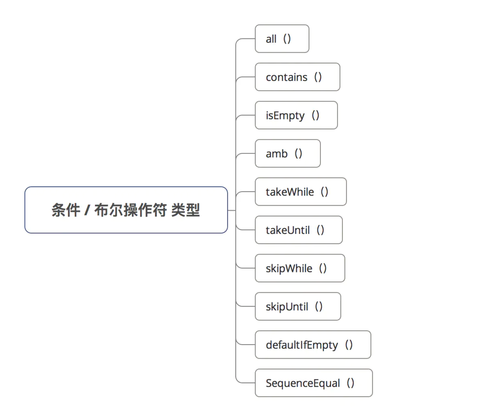
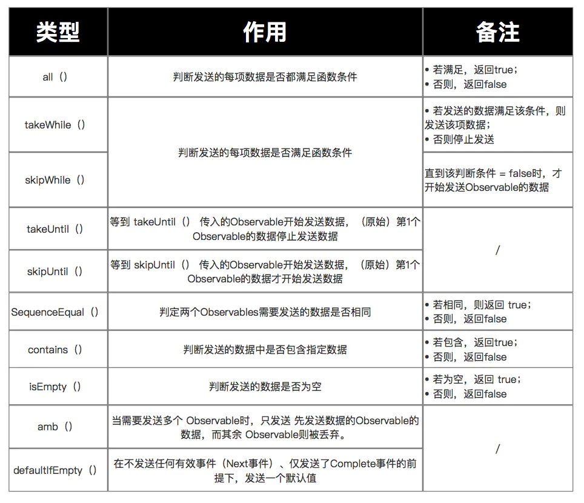

# 条件/布尔 操作符

## 作用

通过设置函数，判断被观察者（`Observable`）发送的事件是否符合条件

## 类型

`RxJava2`中，条件 / 布尔操作符的类型包括：



## 具体操作符详解

### all（）

作用：判断发送的每项数据是否都满足 设置的函数条件

> 若满足，返回 `true`；否则，返回 `false`

- 具体代码

  ```java
  
    Observable.just(1,2,3,4,5,6)
                  .all(new Predicate<Integer>(){
                      @Override
                      public boolean test( Integer integer) throws Exception {
                          return (integer<=10);
                          // 该函数用于判断Observable发送的10个数据是否都满足integer<=10
                      }
                  }).subscribe(new Consumer<Boolean>() {
              @Override
              public void accept(Boolean aBoolean) throws Exception {
                  Log.d(TAG,"result is "+ aBoolean);
                  // 输出返回结果
              }
  
          });
  ```

  

### takeWhile（）

作用：判断发送的每项数据是否满足 设置函数条件

> 若发送的数据满足该条件，则发送该项数据；否则不发送

- 具体代码

  ```java
  // 1. 每1s发送1个数据 = 从0开始，递增1，即0、1、2、3
          Observable.interval(1, TimeUnit.SECONDS)
                  // 2. 通过takeWhile传入一个判断条件
                  .takeWhile(new Predicate<Long>(){
                      @Override
                      public boolean test( Long integer) throws Exception {
                          return (integer<3);
                          // 当发送的数据满足<3时，才发送Observable的数据
                      }
                  }).subscribe(new Observer<Long>() {
              @Override
              public void onSubscribe(Disposable d) {
              }
  
              @Override
              public void onNext(Long value) {
                  Log.d(TAG,"发送了事件 "+ value);
              }
  
              @Override
              public void onError(Throwable e) {
              }
  
              @Override
              public void onComplete() {
              }
          });
  ```

  

### skipWhile（）

作用：判断发送的每项数据是否满足 设置函数条件

> 直到该判断条件 = `false`时，才开始发送`Observable`的数据

- 具体使用

  ```java
  // 1. 每隔1s发送1个数据 = 从0开始，每次递增1
          Observable.interval(1, TimeUnit.SECONDS)
                  // 2. 通过skipWhile（）设置判断条件
                  .skipWhile(new Predicate<Long>(){
                      @Override
                      public boolean test( Long aLong) throws Exception {
                          return (aLong<5);
                          // 直到判断条件不成立 = false = 发射的数据≥5，才开始发送数据
                      }
                  }).subscribe(new Observer<Long>() {
              @Override
              public void onSubscribe(Disposable d) {
              }
  
              @Override
              public void onNext(Long value) {
                  Log.d(TAG,"发送了事件 "+ value);
              }
  
              @Override
              public void onError(Throwable e) {
              }
  
              @Override
              public void onComplete() {
              }
          });
  ```

  

### takeUntil（）

作用：执行到某个条件时，停止发送事件。具体使用如下：

```java
// 1. 每1s发送1个数据 = 从0开始，递增1，即0、1、2、3
        Observable.interval(1, TimeUnit.SECONDS)
                // 2. 通过takeUntil的Predicate传入判断条件
                .takeUntil(new Predicate<Long>(){
                    @Override
                    public boolean test( Long integer) throws Exception {
                        return (integer>3);
                        // 返回true时，就停止发送事件
                        // 当发送的数据满足>3时，就停止发送Observable的数据
                    }
                }).subscribe(new Observer<Long>() {
            @Override
            public void onSubscribe(Disposable d) {
            }

            @Override
            public void onNext(Long value) {
                Log.d(TAG,"发送了事件 "+ value);
            }

            @Override
            public void onError(Throwable e) {
            }

            @Override
            public void onComplete() {
            }
        });

```

该判断条件也可以是Observable，**即 等到 `takeUntil（）` 传入的`Observable`开始发送数据，（原始）第1个`Observable`的数据停止发送数据**

```java
// （原始）第1个Observable：每隔1s发送1个数据 = 从0开始，每次递增1
        Observable.interval(1, TimeUnit.SECONDS)
                // 第2个Observable：延迟5s后开始发送1个Long型数据
                .takeUntil(Observable.timer(5, TimeUnit.SECONDS))
                .subscribe(new Observer<Long>() {
                    @Override
                    public void onSubscribe(Disposable d) {
                        Log.d(TAG, "开始采用subscribe连接");
                    }

                    @Override
                    public void onNext(Long value) {
                        Log.d(TAG, "接收到了事件"+ value  );
                    }

                    @Override
                    public void onError(Throwable e) {
                        Log.d(TAG, "对Error事件作出响应");
                    }

                    @Override
                    public void onComplete() {
                        Log.d(TAG, "对Complete事件作出响应");
                    }

                });
```

### skipUntil（）

- 作用：等到 `skipUntil（）` 传入的`Observable`开始发送数据，（原始）第1个`Observable`的数据才开始发送数据

- 具体使用

  ```java
                  // （原始）第1个Observable：每隔1s发送1个数据 = 从0开始，每次递增1
          Observable.interval(1, TimeUnit.SECONDS)
                  // 第2个Observable：延迟5s后开始发送1个Long型数据
                  .skipUntil(Observable.timer(5, TimeUnit.SECONDS))
                  .subscribe(new Observer<Long>() {
                      @Override
                      public void onSubscribe(Disposable d) {
                          Log.d(TAG, "开始采用subscribe连接");
                      }
  
                      @Override
                      public void onNext(Long value) {
                          Log.d(TAG, "接收到了事件"+ value  );
                      }
  
                      @Override
                      public void onError(Throwable e) {
                          Log.d(TAG, "对Error事件作出响应");
                      }
  
                      @Override
                      public void onComplete() {
                          Log.d(TAG, "对Complete事件作出响应");
                      }
  
                  });
  ```

- 测试结果：5s后（ `skipUntil（）` 传入的`Observable`开始发送数据），（原始）第1个`Observable`的数据才开始发送

### SequenceEqual（）

- 作用：判定两个`Observables`需要发送的数据是否相同

> 若相同，返回 `true`；否则，返回 `false`

- 具体使用

```java
Observable.sequenceEqual(
                Observable.just(4,5,6),
                Observable.just(4,5,6)
        )
                .subscribe(new Consumer<Boolean>() {
                    @Override
                    public void accept( Boolean aBoolean) throws Exception {
                        Log.d(TAG,"2个Observable是否相同："+ aBoolean);
                        // 输出返回结果
                    }
                });
```

### contains（）

- 作用：判断发送的数据中是否包含指定数据

> 1. 若包含，返回 `true`；否则，返回 `false`
> 2. 内部实现 = `exists（）`

- 具体代码

  ```java
  Observable.just(1,2,3,4,5,6)
                  .contains(4)
                  .subscribe(new Consumer<Boolean>() {
              @Override
              public void accept(Boolean aBoolean) throws Exception {
                  Log.d(TAG,"result is "+ aBoolean);
                  // 输出返回结果
              }
  
          });
  ```

  

### isEmpty（）

- 作用：判断发送的数据是否为空

> 若为空，返回 `true`；否则，返回 `false`

- 具体代码

  ```java
  Observable.just(1,2,3,4,5,6)
            .isEmpty() // 判断发送的数据中是否为空
          }).subscribe(new Action1<Boolean>() {
              @Override
              public void call(Boolean aBoolean) {
                  Log.d(TAG,"result is "+ aBoolean); 
                  // 输出返回结果
              }
          });
  ```

  

### amb（）

- 作用：当需要发送多个 `Observable`时，只发送 **先发送数据的`Observable`的数据**，而其余 `Observable`则被丢弃。

- 具体代码

  ```java
         // 设置2个需要发送的Observable & 放入到集合中
          List<ObservableSource<Integer>> list= new ArrayList <>();
          // 第1个Observable延迟1秒发射数据
          list.add( Observable.just(1,2,3).delay(1,TimeUnit.SECONDS));
          // 第2个Observable正常发送数据
          list.add( Observable.just(4,5,6));
  
          // 一共需要发送2个Observable的数据
          // 但由于使用了amba（）,所以仅发送先发送数据的Observable
          // 即第二个（因为第1个延时了）
          Observable.amb(list).subscribe(new Consumer<Integer>() {
              @Override
              public void accept(Integer integer) throws Exception {
                  Log.e(TAG, "接收到了事件 "+integer);
              }
          });
  ```

- 测试结果：即只发送了先发送数据的Observable的数据 = 4，5，6

### defaultIfEmpty（）

- 作用：在不发送任何有效事件（ `Nex`t事件）、仅发送了 `Complete` 事件的前提下，发送一个默认值

- 具体使用

  ```java
  Observable.create(new ObservableOnSubscribe<Integer>() {
              @Override
              public void subscribe(ObservableEmitter<Integer> e) throws Exception {
                  // 不发送任何有效事件
                  //  e.onNext(1);
                  //  e.onNext(2);
  
                  // 仅发送Complete事件
                  e.onComplete();
              }
          }).defaultIfEmpty(10) // 若仅发送了Complete事件，默认发送 值 = 10
                  .subscribe(new Observer<Integer>() {
                      @Override
                      public void onSubscribe(Disposable d) {
                          Log.d(TAG, "开始采用subscribe连接");
                      }
  
                      @Override
                      public void onNext(Integer value) {
                          Log.d(TAG, "接收到了事件"+ value  );
                      }
  
                      @Override
                      public void onError(Throwable e) {
                          Log.d(TAG, "对Error事件作出响应");
                      }
  
                      @Override
                      public void onComplete() {
                          Log.d(TAG, "对Complete事件作出响应");
                      }
                  });
  ```

  

## 总结

