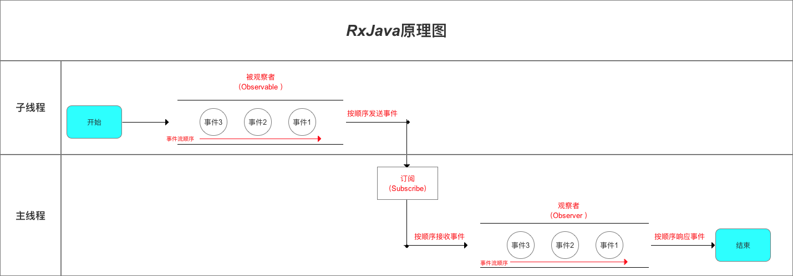

# 线程调度操作符使用详解

## RxJava线程控制（调度 / 切换）的作用是什么？

指定 被观察者 `（Observable）`  / 观察者`（Observer）` 的工作线程类型。

## 为什么要进行RxJava线程控制（调度 / 切换）？

### 背景

- 在 `RxJava`模型中，**被观察者 `（Observable）`  / 观察者`（Observer）`的工作线程 = 创建自身的线程**

> 即，若被观察者 `（Observable）`  / 观察者`（Observer）`在主线程被创建，那么他们的工作（生产事件 / 接收& 响应事件）就会发生在主线程

- 因为创建被观察者 `（Observable）`  / 观察者`（Observer）`的线程  = 主线程
- 所以生产事件 / 接收& 响应事件都发生在主线程

> 下面请看1个RxJava的基础使用

```java
public class MainActivity extends AppCompatActivity {

    private static final String TAG = "Rxjava";

    @Override
    protected void onCreate(Bundle savedInstanceState) {
        super.onCreate(savedInstanceState);
        setContentView(R.layout.activity_main);

        // 步骤1：创建被观察者 Observable & 发送事件
        // 在主线程创建被观察者 Observable 对象
        // 所以生产事件的线程是：主线程

        Observable<Integer> observable = Observable.create(new ObservableOnSubscribe<Integer>() {
            @Override
            public void subscribe(ObservableEmitter<Integer> emitter) throws Exception {

                Log.d(TAG, " 被观察者 Observable的工作线程是: " + Thread.currentThread().getName());
                // 打印验证
                emitter.onNext(1);
                emitter.onComplete();
            }
        });

// 步骤2：创建观察者 Observer 并 定义响应事件行为
        // 在主线程创建观察者 Observer 对象
        // 所以接收 & 响应事件的线程是：主线程
        Observer<Integer> observer = new Observer<Integer>() {

            @Override
            public void onSubscribe(Disposable d) {
                Log.d(TAG, "开始采用subscribe连接");
                Log.d(TAG, " 观察者 Observer的工作线程是: " + Thread.currentThread().getName());
                // 打印验证

            }
            @Override
            public void onNext(Integer value) {
                Log.d(TAG, "对Next事件"+ value +"作出响应"  );
            }
            @Override
            public void onError(Throwable e) {
                Log.d(TAG, "对Error事件作出响应");
            }
            @Override
            public void onComplete() {
                Log.d(TAG, "对Complete事件作出响应");
            }
        };

        // 步骤3：通过订阅（subscribe）连接观察者和被观察者
        observable.subscribe(observer);
    }
}
```

### 冲突

- 对于一般的需求场景，需要在子线程中实现耗时的操作；然后回到主线程实现 `UI`操作
- 应用到 `RxJava` 模型中，可理解为：
  1. 被观察者 `（Observable）` 在 **子线程** 中生产事件（如实现耗时操作等等）
  2. 观察者`（Observer）`在 **主线程** 接收 & 响应事件（即实现UI操作）



### 解决方案

所以，为了解决上述冲突，即实现 **真正的异步操作**，我们需要对`RxJava`进行 **线程控制（也称为调度 / 切换）**

## 实现方式

采用 `RxJava`内置的**线程调度器**（ `Scheduler` ），即通过 **功能性操作符`subscribeOn（）` & `observeOn（）`**实现

### 功能性操作符subscribeOn（） &  observeOn（）简介

- 作用
   线程控制，即指定 被观察者 `（Observable）`  / 观察者`（Observer）` 的工作线程类型
- 线程类型
   在 `RxJava`中，内置了多种用于调度的线程类型

| 类型                           |         含义          |                         应用场景 |
| ------------------------------ | :-------------------: | -------------------------------: |
| Schedulers.immediate()         | 当前线程 = 不指定线程 |                             默认 |
| AndroidSchedulers.mainThread() |     Android主线程     |                           操作UI |
| Schedulers.newThread()         |      常规新线程       |                       耗时等操作 |
| Schedulers.io()                |      io操作线程       | 网络请求、读写文件等io密集型操作 |
| Schedulers.computation()       |    CPU计算操作线程    |                     大量计算操作 |

- 注：`RxJava`内部使用 **线程池** 来维护这些线程，所以线程的调度效率非常高。

### 具体使用

```java

<-- 使用说明 -->
  // Observable.subscribeOn（Schedulers.Thread）：指定被观察者 发送事件的线程（传入RxJava内置的线程类型）
  // Observable.observeOn（Schedulers.Thread）：指定观察者 接收 & 响应事件的线程（传入RxJava内置的线程类型）

<-- 实例使用 -->
// 步骤3：通过订阅（subscribe）连接观察者和被观察者
        observable.subscribeOn(Schedulers.newThread()) // 1. 指定被观察者 生产事件的线程
                  .observeOn(AndroidSchedulers.mainThread())  // 2. 指定观察者 接收 & 响应事件的线程
                  .subscribe(observer); // 3. 最后再通过订阅（subscribe）连接观察者和被观察者

```

### 特别注意

- 若`Observable.subscribeOn（）`多次指定被观察者 生产事件的线程，则只有第一次指定有效，其余的指定线程无效

```java
// 步骤3：通过订阅（subscribe）连接观察者和被观察者
        observable.subscribeOn(Schedulers.newThread()) // 第一次指定被观察者线程 = 新线程
                  .subscribeOn(AndroidSchedulers.mainThread()) // 第二次指定被观察者线程 = 主线程
                  .observeOn(AndroidSchedulers.mainThread())
                  .subscribe(observer);
```

- 若Observable.observeOn（）多次指定观察者 接收 & 响应事件的线程，则每次指定均有效，即每指定一次，就会进行一次线程的切换

```java
// 步骤3：通过订阅（subscribe）连接观察者和被观察者
        observable.subscribeOn(Schedulers.newThread())
                  .observeOn(AndroidSchedulers.mainThread()) // 第一次指定观察者线程 = 主线程
                  .doOnNext(new Consumer<Integer>() { // 生产事件
                    @Override
                    public void accept(Integer integer) throws Exception {
                        Log.d(TAG, "第一次观察者Observer的工作线程是： " + Thread.currentThread().getName());
                    }
                })
                .observeOn(Schedulers.newThread()) // 第二次指定观察者线程 = 新的工作线程
                .subscribe(observer); // 生产事件


// 注：
// 1. 整体方法调用顺序：观察者.onSubscribe（）> 被观察者.subscribe（）> 观察者.doOnNext（）>观察者.onNext（）>观察者.onComplete() 
// 2. 观察者.onSubscribe（）固定在主线程进行
```

