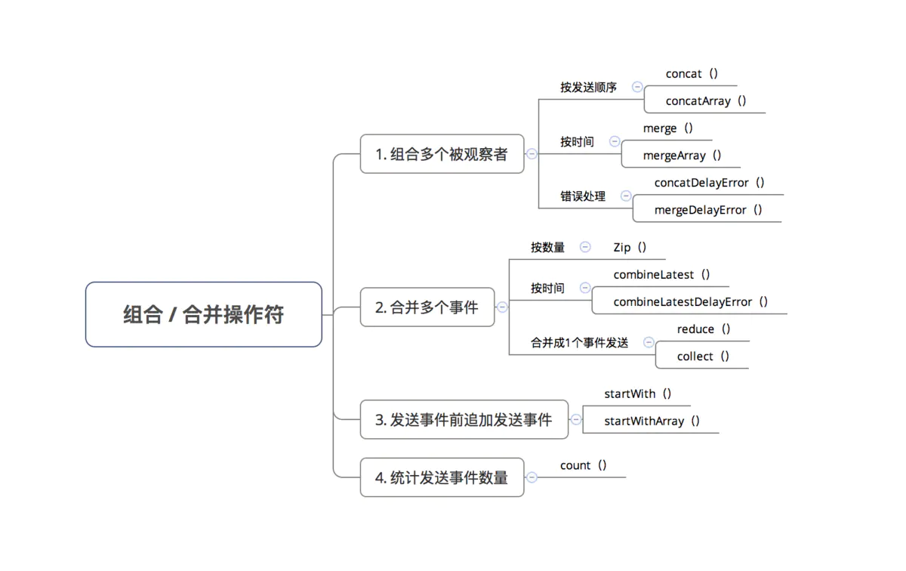
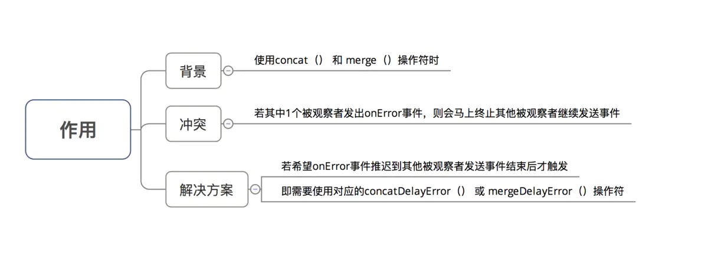
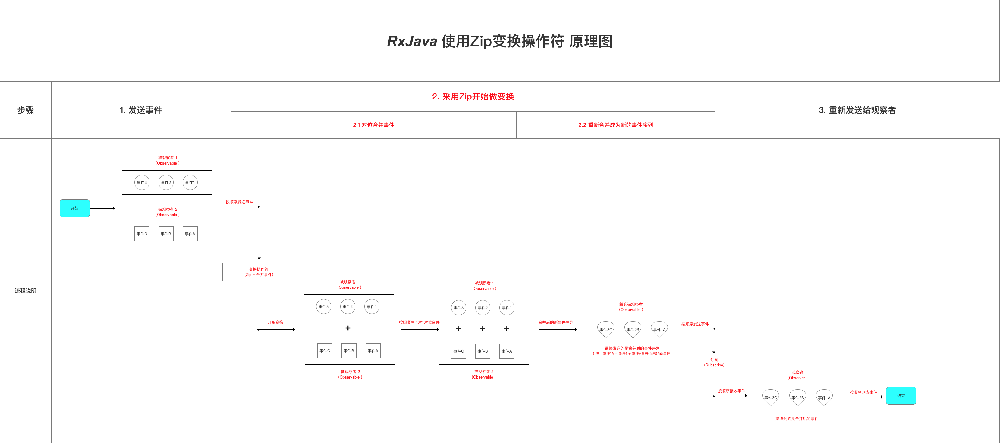
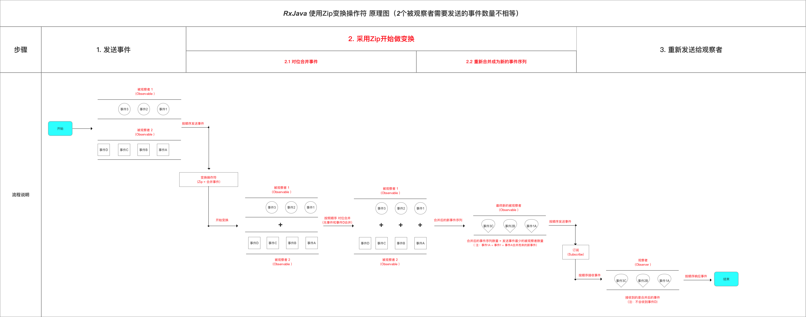
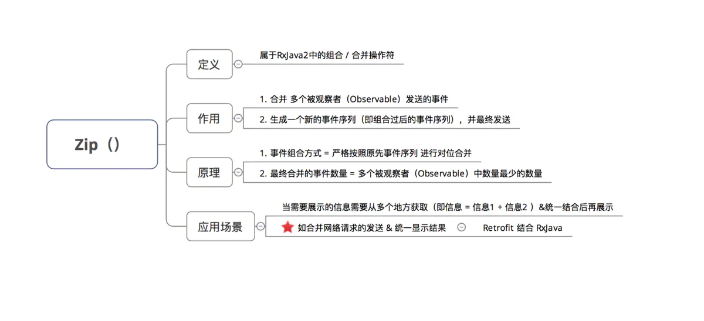
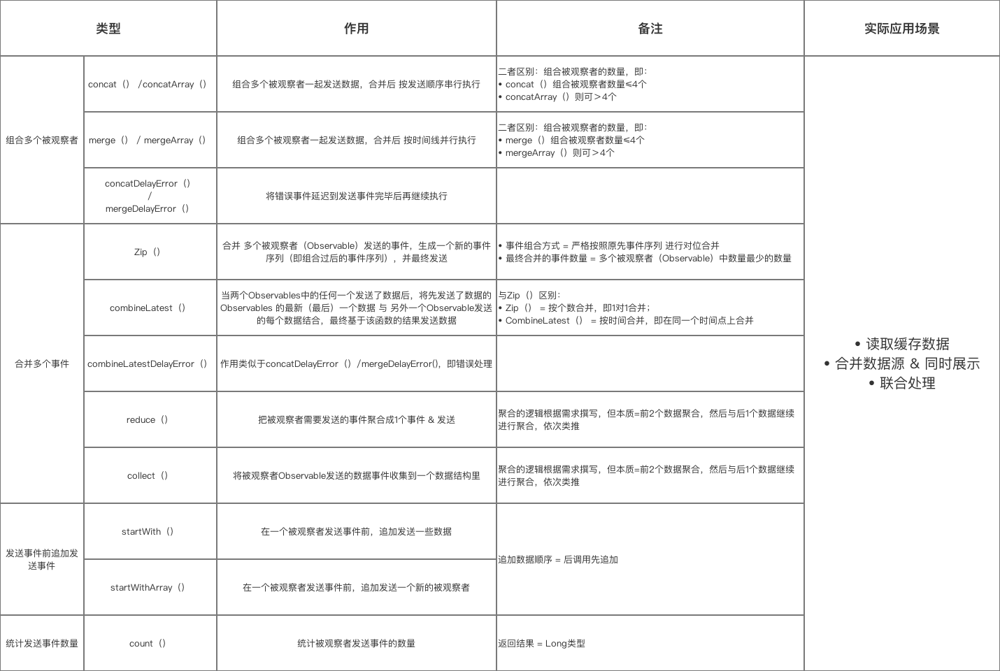

# 组合/合并 操作符

## 作用

组合 多个被观察者（`Observable`） & 合并需要发送的事件

## 类型

- `RxJava 2` 中，常见的组合 / 合并操作符 主要有：



## 组合多个被观察者

### concat（） / concatArray（）

- 作用
   组合多个被观察者一起发送数据，合并后 **按发送顺序串行执行**

> 二者区别：组合被观察者的数量，即`concat（）`组合被观察者数量≤4个，而`concatArray（）`则可＞4个

- 具体使用

```java
// concat（）：组合多个被观察者（≤4个）一起发送数据
        // 注：串行执行
        Observable.concat(Observable.just(1, 2, 3),
                           Observable.just(4, 5, 6),
                           Observable.just(7, 8, 9),
                           Observable.just(10, 11, 12))
                  .subscribe(new Observer<Integer>() {
                    @Override
                    public void onSubscribe(Disposable d) {

                    }

                    @Override
                    public void onNext(Integer value) {
                        Log.d(TAG, "接收到了事件"+ value  );
                    }

                    @Override
                    public void onError(Throwable e) {
                        Log.d(TAG, "对Error事件作出响应");
                    }

                    @Override
                    public void onComplete() {
                        Log.d(TAG, "对Complete事件作出响应");
                    }
                });

// concatArray（）：组合多个被观察者一起发送数据（可＞4个）
        // 注：串行执行
        Observable.concatArray(Observable.just(1, 2, 3),
                           Observable.just(4, 5, 6),
                           Observable.just(7, 8, 9),
                           Observable.just(10, 11, 12),
                           Observable.just(13, 14, 15))
                  .subscribe(new Observer<Integer>() {
                    @Override
                    public void onSubscribe(Disposable d) {

                    }

                    @Override
                    public void onNext(Integer value) {
                        Log.d(TAG, "接收到了事件"+ value  );
                    }

                    @Override
                    public void onError(Throwable e) {
                        Log.d(TAG, "对Error事件作出响应");
                    }

                    @Override
                    public void onComplete() {
                        Log.d(TAG, "对Complete事件作出响应");
                    }
                });

```

- concatArray 测试结果


### merge（） / mergeArray（）

- 作用
   组合多个被观察者一起发送数据，合并后 **按时间线并行执行**

> 1. 二者区别：组合被观察者的数量，即`merge（）`组合被观察者数量≤4个，而`mergeArray（）`则可＞4个
> 2. 区别上述`concat（）`操作符：同样是组合多个被观察者一起发送数据，但`concat（）`操作符合并后是按发送顺序串行执行

- 具体使用

```java
// merge（）：组合多个被观察者（＜4个）一起发送数据
        // 注：合并后按照时间线并行执行
        Observable.merge(
                Observable.intervalRange(0, 3, 1, 1, TimeUnit.SECONDS), // 从0开始发送、共发送3个数据、第1次事件延迟发送时间 = 1s、间隔时间 = 1s
                Observable.intervalRange(2, 3, 1, 1, TimeUnit.SECONDS)) // 从2开始发送、共发送3个数据、第1次事件延迟发送时间 = 1s、间隔时间 = 1s
                  .subscribe(new Observer<Long>() {
                    @Override
                    public void onSubscribe(Disposable d) {

                    }

                    @Override
                    public void onNext(Long value) {
                        Log.d(TAG, "接收到了事件"+ value  );
                    }

                    @Override
                    public void onError(Throwable e) {
                        Log.d(TAG, "对Error事件作出响应");
                    }

                    @Override
                    public void onComplete() {
                        Log.d(TAG, "对Complete事件作出响应");
                    }
                });

// mergeArray（） = 组合4个以上的被观察者一起发送数据，此处不作过多演示，类似concatArray（）

```

- 测试结果

  两个被观察者发送事件并行执行，输出结果 = `0,2 -> 1,3 -> 2,4`


### concatDelayError（） / mergeDelayError（）

- 作用



- 具体使用

```java
//无使用concatDelayError（）的情况
//测试结果：第1个被观察者发送Error事件后，第2个被观察者则不会继续发送事件

Observable.concat(
                Observable.create(new ObservableOnSubscribe<Integer>() {
                    @Override
                    public void subscribe(ObservableEmitter<Integer> emitter) throws Exception {

                        emitter.onNext(1);
                        emitter.onNext(2);
                        emitter.onNext(3);
                        emitter.onError(new NullPointerException()); // 发送Error事件，因为无使用concatDelayError，所以第2个Observable将不会发送事件
                        emitter.onComplete();
                    }
                }),
                Observable.just(4, 5, 6))
                .subscribe(new Observer<Integer>() {
                    @Override
                    public void onSubscribe(Disposable d) {

                    }
                    @Override
                    public void onNext(Integer value) {
                        Log.d(TAG, "接收到了事件"+ value  );
                    }

                    @Override
                    public void onError(Throwable e) {
                        Log.d(TAG, "对Error事件作出响应");
                    }

                    @Override
                    public void onComplete() {
                        Log.d(TAG, "对Complete事件作出响应");
                    }
                });

```

```java

<-- 使用了concatDelayError（）的情况 -->
Observable.concatArrayDelayError(
                Observable.create(new ObservableOnSubscribe<Integer>() {
                    @Override
                    public void subscribe(ObservableEmitter<Integer> emitter) throws Exception {

                        emitter.onNext(1);
                        emitter.onNext(2);
                        emitter.onNext(3);
                        emitter.onError(new NullPointerException()); // 发送Error事件，因为使用了concatDelayError，所以第2个Observable将会发送事件，等发送完毕后，再发送错误事件
                        emitter.onComplete();
                    }
                }),
                Observable.just(4, 5, 6))
                .subscribe(new Observer<Integer>() {
                    @Override
                    public void onSubscribe(Disposable d) {

                    }
                    @Override
                    public void onNext(Integer value) {
                        Log.d(TAG, "接收到了事件"+ value  );
                    }

                    @Override
                    public void onError(Throwable e) {
                        Log.d(TAG, "对Error事件作出响应");
                    }

                    @Override
                    public void onComplete() {
                        Log.d(TAG, "对Complete事件作出响应");
                    }
                });
```

## 合并多个事件

该类型的操作符主要是对多个被观察者中的事件进行合并处理。

### Zip（）

- 作用
   合并 多个被观察者（`Observable`）发送的事件，生成一个新的事件序列（即组合过后的事件序列），并最终发送
- 原理



- **特别注意：**

1. **事件组合方式 = 严格按照原先事件序列 进行对位合并**
2. **最终合并的事件数量 = 多个被观察者（`Observable`）中数量最少的数量**



- 具体使用

```java
<-- 创建第1个被观察者 -->
        Observable<Integer> observable1 = Observable.create(new ObservableOnSubscribe<Integer>() {
            @Override
            public void subscribe(ObservableEmitter<Integer> emitter) throws Exception {
                Log.d(TAG, "被观察者1发送了事件1");
                emitter.onNext(1);
                // 为了方便展示效果，所以在发送事件后加入2s的延迟
                Thread.sleep(1000);

                Log.d(TAG, "被观察者1发送了事件2");
                emitter.onNext(2);
                Thread.sleep(1000);

                Log.d(TAG, "被观察者1发送了事件3");
                emitter.onNext(3);
                Thread.sleep(1000);

                emitter.onComplete();
            }
        }).subscribeOn(Schedulers.io()); // 设置被观察者1在工作线程1中工作

<-- 创建第2个被观察者 -->
        Observable<String> observable2 = Observable.create(new ObservableOnSubscribe<String>() {
            @Override
            public void subscribe(ObservableEmitter<String> emitter) throws Exception {
                Log.d(TAG, "被观察者2发送了事件A");
                emitter.onNext("A");
                Thread.sleep(1000);

                Log.d(TAG, "被观察者2发送了事件B");
                emitter.onNext("B");
                Thread.sleep(1000);

                Log.d(TAG, "被观察者2发送了事件C");
                emitter.onNext("C");
                Thread.sleep(1000);

                Log.d(TAG, "被观察者2发送了事件D");
                emitter.onNext("D");
                Thread.sleep(1000);

                emitter.onComplete();
            }
        }).subscribeOn(Schedulers.newThread());// 设置被观察者2在工作线程2中工作
        // 假设不作线程控制，则该两个被观察者会在同一个线程中工作，即发送事件存在先后顺序，而不是同时发送

<-- 使用zip变换操作符进行事件合并 -->
// 注：创建BiFunction对象传入的第3个参数 = 合并后数据的数据类型
        Observable.zip(observable1, observable2, new BiFunction<Integer, String, String>() {
            @Override
            public String apply(Integer integer, String string) throws Exception {
                return  integer + string;
            }
        }).subscribe(new Observer<String>() {
            @Override
            public void onSubscribe(Disposable d) {
                Log.d(TAG, "onSubscribe");
            }

            @Override
            public void onNext(String value) {
                Log.d(TAG, "最终接收到的事件 =  " + value);
            }

            @Override
            public void onError(Throwable e) {
                Log.d(TAG, "onError");
            }

            @Override
            public void onComplete() {
                Log.d(TAG, "onComplete");
            }
        });
```

- 测试结果


- **特别注意：**

1. **尽管被观察者2的事件`D`没有事件与其合并，但还是会继续发送**
2. **若在被观察者1 & 被观察者2的事件序列最后发送`onComplete()`事件，则被观察者2的事件D也不会发送**

- 总结



### combineLatest（）

- 作用
   当两个`Observables`中的任何一个发送了数据后，将先发送了数据的`Observables` 的最新（最后）一个数据 与 另外一个`Observable`发送的每个数据结合，最终基于该函数的结果发送数据

> 与`Zip（）`的区别：`Zip（）` = 按个数合并，即1对1合并；`CombineLatest（）` = 按时间合并，即在同一个时间点上合并

- 具体使用

```java
Observable.combineLatest(
                    Observable.just(1L, 2L, 3L), // 第1个发送数据事件的Observable
                    Observable.intervalRange(0, 3, 1, 1, TimeUnit.SECONDS), // 第2个发送数据事件的Observable：从0开始发送、共发送3个数据、第1次事件延迟发送时间 = 1s、间隔时间 = 1s
                    new BiFunction<Long, Long, Long>() {
                @Override
                public Long apply(Long o1, Long o2) throws Exception {
                    // o1 = 第1个Observable发送的最新（最后）1个数据
                    // o2 = 第2个Observable发送的每1个数据
                    Log.e(TAG, "合并的数据是： "+ o1 + " "+ o2);
                    return o1 + o2;
                    // 合并的逻辑 = 相加
                    // 即第1个Observable发送的最后1个数据 与 第2个Observable发送的每1个数据进行相加
                }
            }).subscribe(new Consumer<Long>() {
                @Override
                public void accept(Long s) throws Exception {
                    Log.e(TAG, "合并的结果是： "+s);
                }
            });
```

- 测试结果


### combineLatestDelayError（）

作用类似于`concatDelayError（）` / `mergeDelayError（）` ，即错误处理，此处不作过多描述

### reduce（）

- 作用
   把被观察者需要发送的事件聚合成1个事件 & 发送

> 聚合的逻辑根据需求撰写，但本质都是前2个数据聚合，然后与后1个数据继续进行聚合，依次类推

- 具体使用

```java
Observable.just(1,2,3,4)
                .reduce(new BiFunction<Integer, Integer, Integer>() {
                    // 在该复写方法中复写聚合的逻辑
                    @Override
                    public Integer apply(@NonNull Integer s1, @NonNull Integer s2) throws Exception {
                        Log.e(TAG, "本次计算的数据是： "+s1 +" 乘 "+ s2);
                        return s1 * s2;
                        // 本次聚合的逻辑是：全部数据相乘起来
                        // 原理：第1次取前2个数据相乘，之后每次获取到的数据 = 返回的数据x原始下1个数据每
                    }
                }).subscribe(new Consumer<Integer>() {
            @Override
            public void accept(@NonNull Integer s) throws Exception {
                Log.e(TAG, "最终计算的结果是： "+s);

            }
        });
```

- 测试结果


### collect（）

- 作用
  将被观察者`Observable`发送的数据事件收集到一个数据结构里
- 具体使用

```java
Observable.just(1, 2, 3 ,4, 5, 6)
                .collect(
                        // 1. 创建数据结构（容器），用于收集被观察者发送的数据
                        new Callable<ArrayList<Integer>>() {
                            @Override
                            public ArrayList<Integer> call() throws Exception {
                                return new ArrayList<>();
                            }
                            // 2. 对发送的数据进行收集
                        }, new BiConsumer<ArrayList<Integer>, Integer>() {
                            @Override
                            public void accept(ArrayList<Integer> list, Integer integer)
                                    throws Exception {
                                // 参数说明：list = 容器，integer = 后者数据
                                list.add(integer);
                                // 对发送的数据进行收集
                            }
                        }).subscribe(new Consumer<ArrayList<Integer>>() {
            @Override
            public void accept(@NonNull ArrayList<Integer> s) throws Exception {
                Log.e(TAG, "本次发送的数据是： "+s);

            }
        });
```

- 测试结果


## 发送事件前追加发送事件

### startWith（） / startWithArray（）

- 作用
  在一个被观察者发送事件前，追加发送一些数据 / 一个新的被观察者
- 具体使用

```java
<-- 在一个被观察者发送事件前，追加发送一些数据 -->
        // 注：追加数据顺序 = 后调用先追加
        Observable.just(4, 5, 6)
                  .startWith(0)  // 追加单个数据 = startWith()
                  .startWithArray(1, 2, 3) // 追加多个数据 = startWithArray()
                  .subscribe(new Observer<Integer>() {
                    @Override
                    public void onSubscribe(Disposable d) {
                    }

                    @Override
                    public void onNext(Integer value) {
                        Log.d(TAG, "接收到了事件"+ value  );
                    }

                    @Override
                    public void onError(Throwable e) {
                        Log.d(TAG, "对Error事件作出响应");
                    }

                    @Override
                    public void onComplete() {
                        Log.d(TAG, "对Complete事件作出响应");
                    }
                });


<-- 在一个被观察者发送事件前，追加发送被观察者 & 发送数据 -->
        // 注：追加数据顺序 = 后调用先追加
        Observable.just(4, 5, 6)
                .startWith(Observable.just(1, 2, 3))
                .subscribe(new Observer<Integer>() {
                    @Override
                    public void onSubscribe(Disposable d) {

                    }

                    @Override
                    public void onNext(Integer value) {
                        Log.d(TAG, "接收到了事件"+ value  );
                    }

                    @Override
                    public void onError(Throwable e) {
                        Log.d(TAG, "对Error事件作出响应");
                    }

                    @Override
                    public void onComplete() {
                        Log.d(TAG, "对Complete事件作出响应");
                    }
                });

```

- 测试结果


## 统计发送事件数量

### count（）

- 作用
  统计被观察者发送事件的数量
- 具体使用

```java
// 注：返回结果 = Long类型
        Observable.just(1, 2, 3, 4)
                  .count()
                  .subscribe(new Consumer<Long>() {
                    @Override
                    public void accept(Long aLong) throws Exception {
                        Log.e(TAG, "发送的事件数量 =  "+aLong);

                    }
                });
```

- 测试结果


## 总结



## 项目实例

- [从磁盘 / 内存缓存中 获取缓存数据](https://www.jianshu.com/p/6f3b6b934787)
- [联合判断多个事件](https://www.jianshu.com/p/2becc0eaedab)