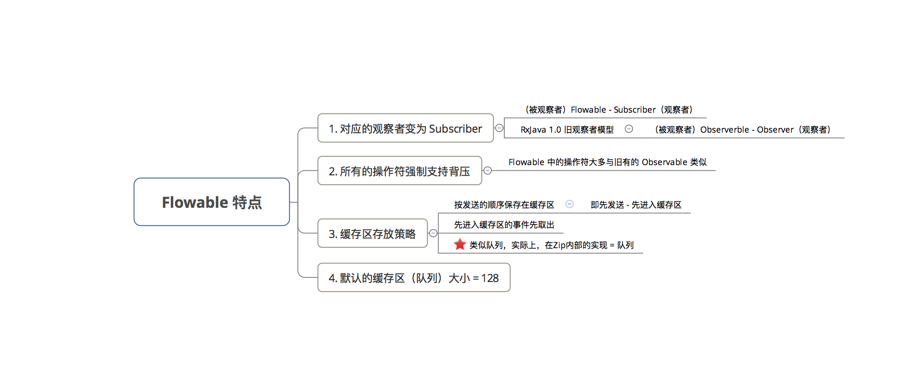
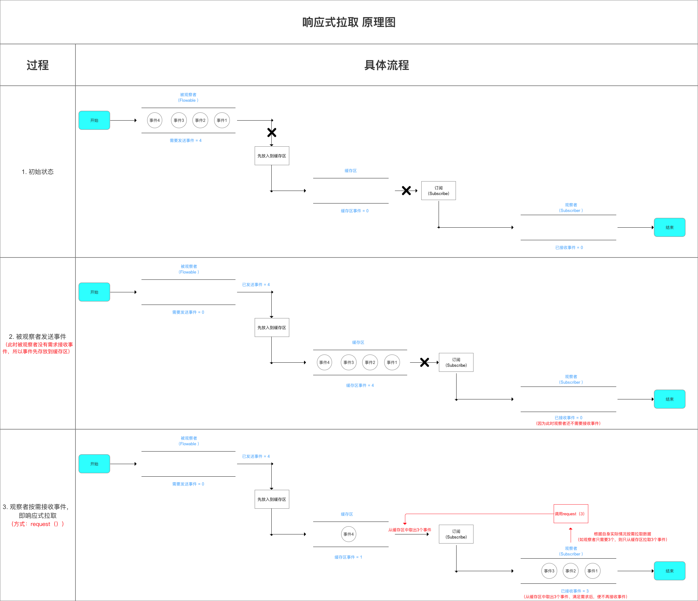
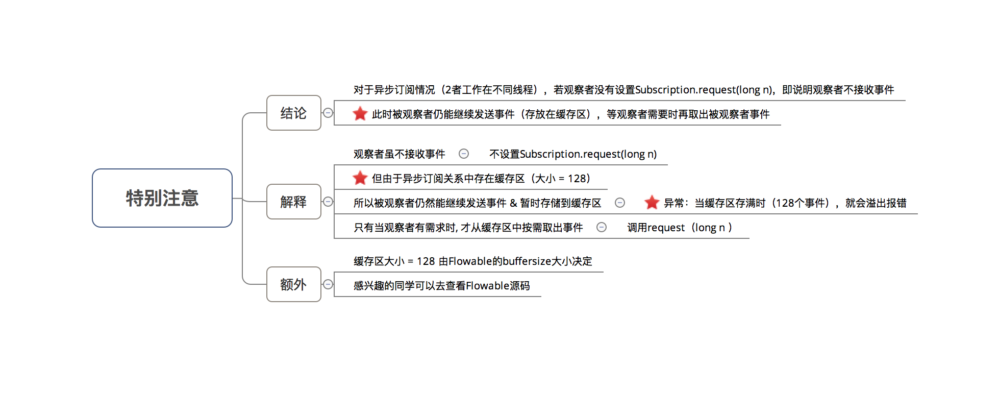
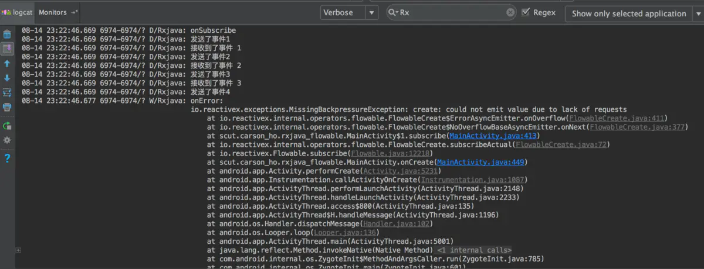
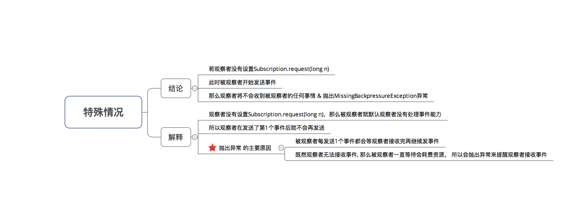
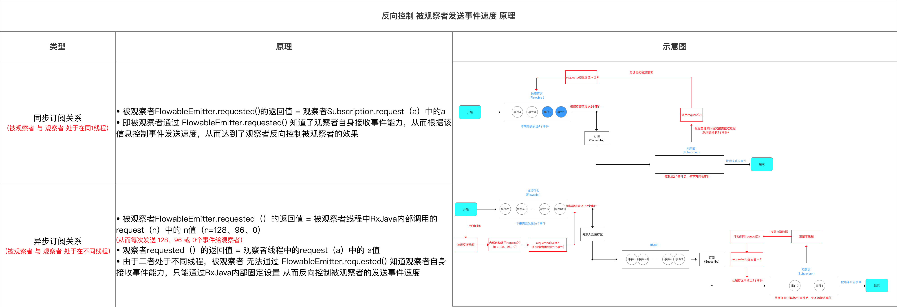
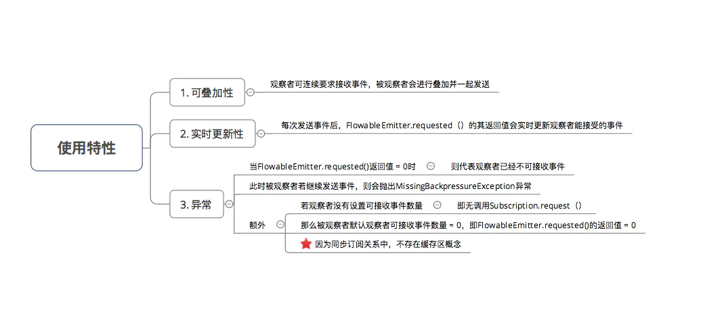
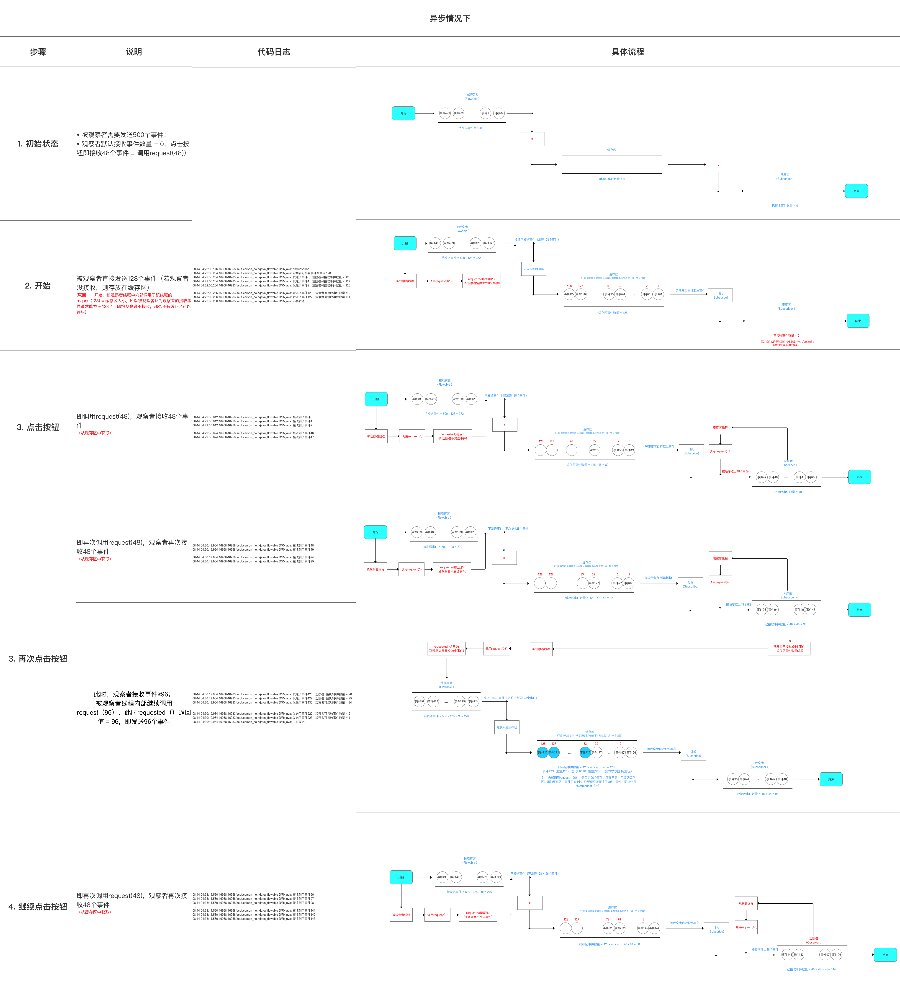
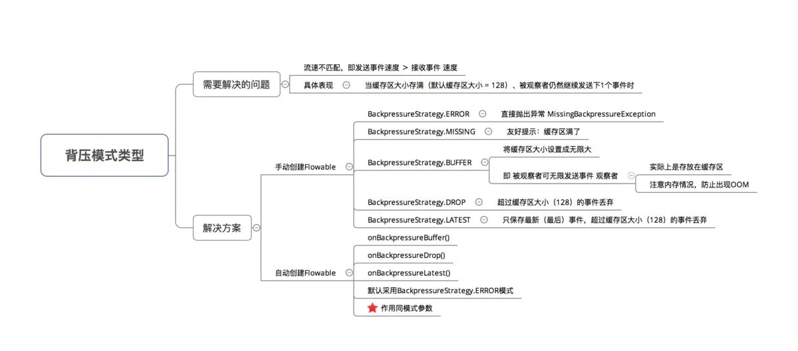

# 背压

## 引言

### 背景

- 观察者 & 被观察者 之间存在2种订阅关系：同步 & 异步。具体如下：


- 对于异步订阅关系，存在 **被观察者发送事件速度 与观察者接收事件速度 不匹配的情况**

> 1. 发送 & 接收事件速度 = 单位时间内 发送&接收事件的数量
> 2. 大多数情况，主要是 **被观察者发送事件速度 ＞ 观察者接收事件速度**

### 问题

- 被观察者 发送事件速度太快，而观察者 来不及接收所有事件，从而导致**观察者无法及时响应 / 处理所有发送过来事件的问题，最终导致缓存区溢出、事件丢失 & OOM**

> 1. 如，点击按钮事件：连续过快的点击按钮10次，则只会造成点击2次的效果；
> 2. 解释：因为点击速度太快了，所以按钮来不及响应

下面再举个例子：

- 被观察者的发送事件速度 = 10ms / 个
- 观察者的接收事件速度 = 5s / 个

即出现发送 & 接收事件严重不匹配的问题

```java
 Observable.create(new ObservableOnSubscribe<Integer>() {
            // 1. 创建被观察者 & 生产事件
            @Override
            public void subscribe(ObservableEmitter<Integer> emitter) throws Exception {

                for (int i = 0; ; i++) {
                    Log.d(TAG, "发送了事件"+ i );
                    Thread.sleep(10);
                    // 发送事件速度：10ms / 个 
                    emitter.onNext(i);

                }
                
            }
        }).subscribeOn(Schedulers.io()) // 设置被观察者在io线程中进行
                .observeOn(AndroidSchedulers.mainThread()) // 设置观察者在主线程中进行
             .subscribe(new Observer<Integer>() {
            // 2. 通过通过订阅（subscribe）连接观察者和被观察者
                 
            @Override
            public void onSubscribe(Disposable d) {
                Log.d(TAG, "开始采用subscribe连接");
            }

            @Override
            public void onNext(Integer value) {

                try {
                    // 接收事件速度：5s / 个 
                    Thread.sleep(5000);
                    Log.d(TAG, "接收到了事件"+ value  );
                } catch (InterruptedException e) {
                    e.printStackTrace();
                }

            }

            @Override
            public void onError(Throwable e) {
                Log.d(TAG, "对Error事件作出响应");
            }

            @Override
            public void onComplete() {
                Log.d(TAG, "对Complete事件作出响应");
            }

        });
```

- 结果
  由于被观察者发送事件速度 > 观察者接收事件速度，所以出现流速不匹配问题，从而导致`OOM`

### 解决方案

采用 背压策略。

## 背压策略简介

### 定义

一种 **控制事件流速** 的策略

### 作用

在 **异步订阅关系** 中，**控制事件发送 & 接收的速度**

> 注：背压的作用域 = **异步订阅关系**，即 被观察者 & 观察者处在不同线程中

### 解决的问题

解决了 因被观察者发送事件速度 与 观察者接收事件速度 **不匹配**（一般是前者 快于 后者），从而导致观察者无法及时响应 / 处理所有 被观察者发送事件 的问题

### 应用场景

- 被观察者发送事件速度 与 观察者接收事件速度 **不匹配**的场景
- 具体场景就取决于 该事件的类型，如：网络请求，那么具体场景：有很多网络请求需要执行，但执行者的执行速度没那么快，此时就需要使用背压策略来进行控制。

## 背压策略的原理

- 那么，RxJava实现背压策略（`Backpressure`）的原理是什么呢？
- 解决方案 & 思想主要如下：


- 背压比较


- 好了，那么上图中在`RxJava 2.0`观察者模型中，`Flowable`到底是什么呢？它其实是`RxJava 2.0`中被观察者的一种新实现，同时也是背压策略实现的承载者

## 背压策略的具体实现：Flowable

在 `RxJava2.0`中，采用 `Flowable` 实现 背压策略

> 正确来说，应该是 “**非阻塞式背压**” 策略

### Flowable 介绍

- 定义：在 `RxJava2.0`中，被观察者（`Observable`）的一种新实现

> 同时，`RxJava1.0` 中被观察者（`Observable`）的旧实现： `Observable`依然保留

- 作用：实现 非阻塞式背压 策略

### Flowable 特点

- `Flowable`的特点 具体如下



### 与 RxJava1.0 中被观察者的旧实现 Observable 的关系

- 具体如下图


- 那么，为什么要采用新实现`Flowable`实现背压，而不采用旧的`Observable`呢？
- **主要原因：旧实现`Observable`无法很好解决背压问题。**


### Flowable的基础使用

- `Flowable`的基础使用非常类似于 `Observable`
- 具体如下

```java
/**
  * 步骤1：创建被观察者 =  Flowable
  */
        Flowable<Integer> upstream = Flowable.create(new FlowableOnSubscribe<Integer>() {
            @Override
            public void subscribe(FlowableEmitter<Integer> emitter) throws Exception {
                emitter.onNext(1);
                emitter.onNext(2);
                emitter.onNext(3);
                emitter.onComplete();
            }
        }, BackpressureStrategy.ERROR);
        // 需要传入背压参数BackpressureStrategy，下面会详细讲解

 /**
   * 步骤2：创建观察者 =  Subscriber
   */
        Subscriber<Integer> downstream = new Subscriber<Integer>() {

            @Override
            public void onSubscribe(Subscription s) {
                // 对比Observer传入的Disposable参数，Subscriber此处传入的参数 = Subscription
                // 相同点：Subscription具备Disposable参数的作用，即Disposable.dispose()切断连接, 同样的调用Subscription.cancel()切断连接
                // 不同点：Subscription增加了void request(long n)
                Log.d(TAG, "onSubscribe");
                s.request(Long.MAX_VALUE);
               // 关于request()下面会继续详细说明
            }

            @Override
            public void onNext(Integer integer) {
                Log.d(TAG, "onNext: " + integer);
            }

            @Override
            public void onError(Throwable t) {
                Log.w(TAG, "onError: ", t);
            }

            @Override
            public void onComplete() {
                Log.d(TAG, "onComplete");
            }
        };

 /**
   * 步骤3：建立订阅关系
   */
        upstream.subscribe(downstream);

```

- 更加优雅的链式调用

```java
        // 步骤1：创建被观察者 =  Flowable
        Flowable.create(new FlowableOnSubscribe<Integer>() {
            @Override
            public void subscribe(FlowableEmitter<Integer> emitter) throws Exception {
                Log.d(TAG, "发送事件 1");
                emitter.onNext(1);
                Log.d(TAG, "发送事件 2");
                emitter.onNext(2);
                Log.d(TAG, "发送事件 3");
                emitter.onNext(3);
                Log.d(TAG, "发送完成");
                emitter.onComplete();
            }
        }, BackpressureStrategy.ERROR)
                .subscribe(new Subscriber<Integer>() {
                // 步骤2：创建观察者 =  Subscriber & 建立订阅关系

                    @Override
                    public void onSubscribe(Subscription s) {
                        Log.d(TAG, "onSubscribe");
                        s.request(3);
                    }

                    @Override
                    public void onNext(Integer integer) {
                        Log.d(TAG, "接收到了事件" + integer);
                    }

                    @Override
                    public void onError(Throwable t) {
                        Log.w(TAG, "onError: ", t);
                    }

                    @Override
                    public void onComplete() {
                        Log.d(TAG, "onComplete");
                    }
                });
```

## 背压策略的使用

- 在本节中，我将结合 **背压策略的原理 & Flowable的使用**，为大家介绍在RxJava 2.0 中该如何使用Flowable来实现背压策略功能，即背压策略的使用
- `Flowable`与`Observable`在功能上的区别主要是 **多了背压的功能**


示意图

> 注：
>
> 1. 由于第2节中提到，**使用背压的场景 = 异步订阅关系**，所以下文中讲解的主要是异步订阅关系场景，即 被观察者 & 观察者 工作在不同线程中
> 2. 但由于**在同步订阅关系的场景也可能出现流速不匹配的问题**，所以在讲解异步情况后，会稍微讲解一下同步情况，以方便对比

### 控制 观察者接收事件 的速度

#### 异步订阅情况

- 具体原理图



- 具体使用

```java
// 1. 创建被观察者Flowable
        Flowable.create(new FlowableOnSubscribe<Integer>() {
            @Override
            public void subscribe(FlowableEmitter<Integer> emitter) throws Exception {
                // 一共发送4个事件
                Log.d(TAG, "发送事件 1");
                emitter.onNext(1);
                Log.d(TAG, "发送事件 2");
                emitter.onNext(2);
                Log.d(TAG, "发送事件 3");
                emitter.onNext(3);
                Log.d(TAG, "发送事件 4");
                emitter.onNext(4);
                Log.d(TAG, "发送完成");
                emitter.onComplete();
            }
        }, BackpressureStrategy.ERROR).subscribeOn(Schedulers.io()) // 设置被观察者在io线程中进行
                .observeOn(AndroidSchedulers.mainThread()) // 设置观察者在主线程中进行
                .subscribe(new Subscriber<Integer>() {
                    @Override
                    public void onSubscribe(Subscription s) {
                        // 对比Observer传入的Disposable参数，Subscriber此处传入的参数 = Subscription
                        // 相同点：Subscription参数具备Disposable参数的作用，即Disposable.dispose()切断连接, 同样的调用Subscription.cancel()切断连接
                        // 不同点：Subscription增加了void request(long n)

                        s.request(3);
                        // 作用：决定观察者能够接收多少个事件
                        // 如设置了s.request(3)，这就说明观察者能够接收3个事件（多出的事件存放在缓存区）
                        // 官方默认推荐使用Long.MAX_VALUE，即s.request(Long.MAX_VALUE);
                    }

                    @Override
                    public void onNext(Integer integer) {
                        Log.d(TAG, "接收到了事件" + integer);
                    }

                    @Override
                    public void onError(Throwable t) {
                        Log.w(TAG, "onError: ", t);
                    }

                    @Override
                    public void onComplete() {
                        Log.d(TAG, "onComplete");
                    }
                });

```


- 注意



- 代码演示1：观察者不接收事件的情况下，被观察者继续发送事件 & 存放到缓存区；再按需取出

```java
 /**
    * 步骤1：设置变量
    */
    private static final String TAG = "Rxjava";
    private Button btn; // 该按钮用于调用Subscription.request（long n ）
    private Subscription mSubscription; // 用于保存Subscription对象
    
  /**
    * 步骤2：设置点击事件 = 调用Subscription.request（long n ）
    */
        btn = (Button) findViewById(R.id.btn);
        btn.setOnClickListener(new View.OnClickListener() {
            @Override
            public void onClick(View view) {
                mSubscription.request(2);
            }

        });

        /**
         * 步骤3：异步调用
         */
        Flowable.create(new FlowableOnSubscribe<Integer>() {
            @Override
            public void subscribe(FlowableEmitter<Integer> emitter) throws Exception {
                Log.d(TAG, "发送事件 1");
                emitter.onNext(1);
                Log.d(TAG, "发送事件 2");
                emitter.onNext(2);
                Log.d(TAG, "发送事件 3");
                emitter.onNext(3);
                Log.d(TAG, "发送事件 4");
                emitter.onNext(4);
                Log.d(TAG, "发送完成");
                emitter.onComplete();
            }
        }, BackpressureStrategy.ERROR).subscribeOn(Schedulers.io()) // 设置被观察者在io线程中进行
                .observeOn(AndroidSchedulers.mainThread()) // 设置观察者在主线程中进行
                .subscribe(new Subscriber<Integer>() {
                    @Override
                    public void onSubscribe(Subscription s) {
                        Log.d(TAG, "onSubscribe");
                        mSubscription = s;
                        // 保存Subscription对象，等待点击按钮时（调用request(2)）观察者再接收事件
                    }

                    @Override
                    public void onNext(Integer integer) {
                        Log.d(TAG, "接收到了事件" + integer);
                    }

                    @Override
                    public void onError(Throwable t) {
                        Log.w(TAG, "onError: ", t);
                    }

                    @Override
                    public void onComplete() {
                        Log.d(TAG, "onComplete");
                    }
                });

```

- 代码演示2：观察者不接收事件的情况下，被观察者继续发送事件至超出缓存区大小（128）

```java
Flowable.create(new FlowableOnSubscribe<Integer>() {
            @Override
            public void subscribe(FlowableEmitter<Integer> emitter) throws Exception {
                // 一共发送129个事件，即超出了缓存区的大小
                for (int i = 0;i< 129; i++) {
                    Log.d(TAG, "发送了事件" + i);
                    emitter.onNext(i);
                }
                emitter.onComplete();
            }
        }, BackpressureStrategy.ERROR).subscribeOn(Schedulers.io()) // 设置被观察者在io线程中进行
                .observeOn(AndroidSchedulers.mainThread()) // 设置观察者在主线程中进行
                .subscribe(new Subscriber<Integer>() {
                    @Override
                    public void onSubscribe(Subscription s) {
                        Log.d(TAG, "onSubscribe");
                        // 默认不设置可接收事件大小
                    }

                    @Override
                    public void onNext(Integer integer) {
                        Log.d(TAG, "接收到了事件" + integer);
                    }

                    @Override
                    public void onError(Throwable t) {
                        Log.w(TAG, "onError: ", t);
                    }

                    @Override
                    public void onComplete() {
                        Log.d(TAG, "onComplete");
                    }
                });
```

#### 同步订阅情况

同步订阅 & 异步订阅 的区别在于：

- 同步订阅中，被观察者 & 观察者工作于同1线程
- 同步订阅关系中没有缓存区


- 被观察者在发送1个事件后，必须等待观察者接收后，才能继续发下1个事件

```java
/**
         * 步骤1：创建被观察者 =  Flowable
         */
        Flowable<Integer> upstream = Flowable.create(new FlowableOnSubscribe<Integer>() {
            @Override
            public void subscribe(FlowableEmitter<Integer> emitter) throws Exception {
                
                // 发送3个事件
                Log.d(TAG, "发送了事件1");
                emitter.onNext(1);
                Log.d(TAG, "发送了事件2");
                emitter.onNext(2);
                Log.d(TAG, "发送了事件3");
                emitter.onNext(3);
                emitter.onComplete();
            }
        }, BackpressureStrategy.ERROR);

        /**
         * 步骤2：创建观察者 =  Subscriber
         */
        Subscriber<Integer> downstream = new Subscriber<Integer>() {

            @Override
            public void onSubscribe(Subscription s) {
                Log.d(TAG, "onSubscribe");
                 s.request(3);
                 // 每次可接收事件 = 3 二次匹配
            }

            @Override
            public void onNext(Integer integer) {
                Log.d(TAG, "接收到了事件 " + integer);
            }

            @Override
            public void onError(Throwable t) {
                Log.w(TAG, "onError: ", t);
            }

            @Override
            public void onComplete() {
                Log.d(TAG, "onComplete");
            }
        };

        /**
         * 步骤3：建立订阅关系
         */
        upstream.subscribe(downstream);
```

所以，实际上并不会出现被观察者发送事件速度 > 观察者接收事件速度的情况。**可是，却会出现被观察者发送事件数量 > 观察者接收事件数量的问题。**

- 如：观察者只能接受3个事件，但被观察者却发送了4个事件，所以出现了不匹配情况

```java
/**
         * 步骤1：创建被观察者 =  Flowable
         */
        Flowable<Integer> upstream = Flowable.create(new FlowableOnSubscribe<Integer>() {
            @Override
            public void subscribe(FlowableEmitter<Integer> emitter) throws Exception {

                // 被观察者发送事件数量 = 4个
                Log.d(TAG, "发送了事件1");
                emitter.onNext(1);
                Log.d(TAG, "发送了事件2");
                emitter.onNext(2);
                Log.d(TAG, "发送了事件3");
                emitter.onNext(3);
                Log.d(TAG, "发送了事件4");
                emitter.onNext(4);
                emitter.onComplete();
            }
        }, BackpressureStrategy.ERROR);

        /**
         * 步骤2：创建观察者 =  Subscriber
         */
        Subscriber<Integer> downstream = new Subscriber<Integer>() {

            @Override
            public void onSubscribe(Subscription s) {
                Log.d(TAG, "onSubscribe");
                 s.request(3);
                 // 观察者接收事件 = 3个 ，即不匹配
            }

            @Override
            public void onNext(Integer integer) {
                Log.d(TAG, "接收到了事件 " + integer);
            }

            @Override
            public void onError(Throwable t) {
                Log.w(TAG, "onError: ", t);
            }

            @Override
            public void onComplete() {
                Log.d(TAG, "onComplete");
            }
        };

        /**
         * 步骤3：建立订阅关系
         */
        upstream.subscribe(downstream);
```



所以，对于**没有缓存区概念**的同步订阅关系来说，单纯采用控制观察者的接收事件数量（响应式拉取）实际上就等于 “单相思”，虽然观察者控制了要接收3个事件，但假设被观察者需要发送4个事件，还是会出现问题。

- 特殊情况



```java
/**
  * 同步情况
  */

        /**
         * 步骤1：创建被观察者 =  Flowable
         */
        Flowable<Integer> upstream = Flowable.create(new FlowableOnSubscribe<Integer>() {
            @Override
            public void subscribe(FlowableEmitter<Integer> emitter) throws Exception {
                Log.d(TAG, "发送了事件1");
                emitter.onNext(1);
                Log.d(TAG, "发送了事件2");
                emitter.onNext(2);
                Log.d(TAG, "发送了事件3");
                emitter.onNext(3);
                emitter.onComplete();
            }
        }, BackpressureStrategy.ERROR);

        /**
         * 步骤2：创建观察者 =  Subscriber
         */
        Subscriber<Integer> downstream = new Subscriber<Integer>() {

            @Override
            public void onSubscribe(Subscription s) {
                Log.d(TAG, "onSubscribe");
                // 不设置request（long n）
                // s.request(Long.MAX_VALUE);

            }

            @Override
            public void onNext(Integer integer) {
                Log.d(TAG, "onNext: " + integer);
            }

            @Override
            public void onError(Throwable t) {
                Log.w(TAG, "onError: ", t);
            }

            @Override
            public void onComplete() {
                Log.d(TAG, "onComplete");
            }
        };

        /**
         * 步骤3：建立订阅关系
         */
        upstream.subscribe(downstream);
```

在被观察者发送第1个事件后, 就抛出`MissingBackpressureException`异常 & 观察者没有收到任何事件


### 控制 被观察者发送事件 的速度

- 简介


- `FlowableEmitter`类的`requested()`介绍

```java

public interface FlowableEmitter<T> extends Emitter<T> {
// FlowableEmitter = 1个接口，继承自Emitter
// Emitter接口方法包括：onNext(),onComplete() & onError

    
    long requested();
    // 作用：返回当前线程中request（a）中的a值
    // 该request（a）则是措施1中讲解的方法，作用  = 设置
   
    ....// 仅贴出关键代码

}
```

- 每个线程中的`requested（）`的返回值 = 该线程中的`request（a）`的a值
- 对应于同步 & 异步订阅情况 的原理图



#### 同步订阅情况

即在同步订阅情况中，被观察者 通过 `FlowableEmitter.requested()`获得了观察者自身接收事件能力，**从而根据该信息控制事件发送速度，从而达到了观察者反向控制被观察者的效果**

- 具体使用
   下面的例子 = 被观察者根据观察者自身接收事件能力（10个事件），从而仅发送10个事件

```java
Flowable.create(new FlowableOnSubscribe<Integer>() {
            @Override
            public void subscribe(FlowableEmitter<Integer> emitter) throws Exception {
                
                // 调用emitter.requested()获取当前观察者需要接收的事件数量
                long n = emitter.requested();

                Log.d(TAG, "观察者可接收事件" + n);

                // 根据emitter.requested()的值，即当前观察者需要接收的事件数量来发送事件
                for (int i = 0; i < n; i++) {
                    Log.d(TAG, "发送了事件" + i);
                    emitter.onNext(i);
                }
            }
        }, BackpressureStrategy.ERROR)
                .subscribe(new Subscriber<Integer>() {
                    @Override
                    public void onSubscribe(Subscription s) {
                        Log.d(TAG, "onSubscribe");

                        // 设置观察者每次能接受10个事件
                        s.request(10);

                    }

                    @Override
                    public void onNext(Integer integer) {
                        Log.d(TAG, "接收到了事件" + integer);
                    }

                    @Override
                    public void onError(Throwable t) {
                        Log.w(TAG, "onError: ", t);
                    }

                    @Override
                    public void onComplete() {
                        Log.d(TAG, "onComplete");
                    }
                });
```

- 特别注意
  在同步订阅情况中使用`FlowableEmitter.requested()`时，有以下几种使用特性需要注意的：



##### 情况1：可叠加性

- 即：观察者可连续要求接收事件，被观察者会进行叠加并一起发送

```java
Subscription.request（a1）；
Subscription.request（a2）；

FlowableEmitter.requested()的返回值 = a1 + a2
```

```java
Flowable.create(new FlowableOnSubscribe<Integer>() {
            @Override
            public void subscribe(FlowableEmitter<Integer> emitter) throws Exception {
                        
                // 调用emitter.requested()获取当前观察者需要接收的事件数量
                Log.d(TAG, "观察者可接收事件" + emitter.requested());

            }
        }, BackpressureStrategy.ERROR)
                .subscribe(new Subscriber<Integer>() {
                    @Override
                    public void onSubscribe(Subscription s) {
                        Log.d(TAG, "onSubscribe");

                        s.request(10); // 第1次设置观察者每次能接受10个事件
                        s.request(20); // 第2次设置观察者每次能接受20个事件

                    }

                    @Override
                    public void onNext(Integer integer) {
                        Log.d(TAG, "接收到了事件" + integer);
                    }

                    @Override
                    public void onError(Throwable t) {
                        Log.w(TAG, "onError: ", t);
                    }

                    @Override
                    public void onComplete() {
                        Log.d(TAG, "onComplete");
                    }
                });
```

##### 情况2：实时更新性

- 即，每次发送事件后，emitter.requested()会实时更新观察者能接受的事件

> 1. 即一开始观察者要接收10个事件，发送了1个后，会实时更新为9个
> 2. 仅计算`Next`事件，`complete & error`事件不算。

```java

Subscription.request（10）；
// FlowableEmitter.requested()的返回值 = 10

FlowableEmitter.onNext(1); // 发送了1个事件
// FlowableEmitter.requested()的返回值 = 9
```

```java
Flowable.create(new FlowableOnSubscribe<Integer>() {
            @Override
            public void subscribe(FlowableEmitter<Integer> emitter) throws Exception {

                // 1. 调用emitter.requested()获取当前观察者需要接收的事件数量
                Log.d(TAG, "观察者可接收事件数量 = " + emitter.requested());

                // 2. 每次发送事件后，emitter.requested()会实时更新观察者能接受的事件
                // 即一开始观察者要接收10个事件，发送了1个后，会实时更新为9个
                Log.d(TAG, "发送了事件 1");
                emitter.onNext(1);
                Log.d(TAG, "发送了事件1后, 还需要发送事件数量 = " + emitter.requested());

                Log.d(TAG, "发送了事件 2");
                emitter.onNext(2);
                Log.d(TAG, "发送事件2后, 还需要发送事件数量 = " + emitter.requested());

                Log.d(TAG, "发送了事件 3");
                emitter.onNext(3);
                Log.d(TAG, "发送事件3后, 还需要发送事件数量 = " + emitter.requested());

                emitter.onComplete();
            }
        }, BackpressureStrategy.ERROR)
                .subscribe(new Subscriber<Integer>() {
                    @Override
                    public void onSubscribe(Subscription s) {
                        Log.d(TAG, "onSubscribe");

                        s.request(10); // 设置观察者每次能接受10个事件
                    }

                    @Override
                    public void onNext(Integer integer) {
                        Log.d(TAG, "接收到了事件" + integer);
                    }

                    @Override
                    public void onError(Throwable t) {
                        Log.w(TAG, "onError: ", t);
                    }

                    @Override
                    public void onComplete() {
                        Log.d(TAG, "onComplete");
                    }
                });
```

示意图

##### 情况3：异常

- 当`FlowableEmitter.requested()`减到0时，则代表观察者已经不可接收事件
- 此时被观察者若继续发送事件，则会抛出`MissingBackpressureException`异常

> 如观察者可接收事件数量 = 1，当被观察者发送第2个事件时，就会抛出异常

```java
Flowable.create(new FlowableOnSubscribe<Integer>() {
            @Override
            public void subscribe(FlowableEmitter<Integer> emitter) throws Exception {

                // 1. 调用emitter.requested()获取当前观察者需要接收的事件数量
                Log.d(TAG, "观察者可接收事件数量 = " + emitter.requested());

                // 2. 每次发送事件后，emitter.requested()会实时更新观察者能接受的事件
                // 即一开始观察者要接收10个事件，发送了1个后，会实时更新为9个
                Log.d(TAG, "发送了事件 1");
                emitter.onNext(1);
                Log.d(TAG, "发送了事件1后, 还需要发送事件数量 = " + emitter.requested());

                Log.d(TAG, "发送了事件 2");
                emitter.onNext(2);
                Log.d(TAG, "发送事件2后, 还需要发送事件数量 = " + emitter.requested());

                emitter.onComplete();
            }
        }, BackpressureStrategy.ERROR)
                .subscribe(new Subscriber<Integer>() {
                    @Override
                    public void onSubscribe(Subscription s) {

                        Log.d(TAG, "onSubscribe");
                        s.request(1); // 设置观察者每次能接受1个事件

                    }

                    @Override
                    public void onNext(Integer integer) {
                        Log.d(TAG, "接收到了事件" + integer);
                    }

                    @Override
                    public void onError(Throwable t) {
                        Log.w(TAG, "onError: ", t);
                    }

                    @Override
                    public void onComplete() {
                        Log.d(TAG, "onComplete");
                    }
                });
```

##### 额外

- 若观察者没有设置可接收事件数量，即无调用`Subscription.request（）`
- 那么被观察者默认观察者可接收事件数量 = 0，即`FlowableEmitter.requested()`的返回值 = 0

#### 异步订阅情况

由于二者处于不同线程，所以被观察者 无法通过 `FlowableEmitter.requested()`知道观察者自身接收事件能力，即 **被观察者不能根据 观察者自身接收事件的能力 控制发送事件的速度**。具体请看下面例子

```java
Flowable.create(new FlowableOnSubscribe<Integer>() {
            @Override
            public void subscribe(FlowableEmitter<Integer> emitter) throws Exception {

                // 调用emitter.requested()获取当前观察者需要接收的事件数量
                Log.d(TAG, "观察者可接收事件数量 = " + emitter.requested());

            }
        }, BackpressureStrategy.ERROR).subscribeOn(Schedulers.io()) // 设置被观察者在io线程中进行
                .observeOn(AndroidSchedulers.mainThread()) // 设置观察者在主线程中进行
                .subscribe(new Subscriber<Integer>() {
                    @Override
                    public void onSubscribe(Subscription s) {
                        Log.d(TAG, "onSubscribe");
                        s.request(150);
                        // 该设置仅影响观察者线程中的requested，却不会影响的被观察者中的FlowableEmitter.requested()的返回值
                        // 因为FlowableEmitter.requested()的返回值 取决于RxJava内部调用request(n)，而该内部调用会在一开始就调用request(128)
                        // 为什么是调用request(128)下面再讲解
                    }

                    @Override
                    public void onNext(Integer integer) {
                        Log.d(TAG, "接收到了事件" + integer);
                    }

                    @Override
                    public void onError(Throwable t) {
                        Log.w(TAG, "onError: ", t);
                    }

                    @Override
                    public void onComplete() {
                        Log.d(TAG, "onComplete");
                    }
                });
```


**而在异步订阅关系中，反向控制的原理是：通过`RxJava`内部固定调用被观察者线程中的`request(n)` 从而 反向控制被观察者的发送事件速度**

那么该什么时候调用被观察者线程中的`request(n)`  & `n` 的值该是多少呢？请继续往下看。

- 具体使用

关于`RxJava`内部调用`request(n)（n = 128、96、0）`的逻辑如下：


> 至于为什么是调用`request（128）` & `request（96）` & `request（0）`，感兴趣的读者可自己阅读 `Flowable`的源码

- 代码演示

下面我将用一个例子来演示该原理的逻辑

```java
// 被观察者：一共需要发送500个事件，但真正开始发送事件的前提 = FlowableEmitter.requested()返回值 ≠ 0
// 观察者：每次接收事件数量 = 48（点击按钮）

        Flowable.create(new FlowableOnSubscribe<Integer>() {
            @Override
            public void subscribe(FlowableEmitter<Integer> emitter) throws Exception {

                Log.d(TAG, "观察者可接收事件数量 = " + emitter.requested());
                    boolean flag; //设置标记位控制

                    // 被观察者一共需要发送500个事件
                    for (int i = 0; i < 500; i++) {
                        flag = false;

                        // 若requested() == 0则不发送
                        while (emitter.requested() == 0) {
                            if (!flag) {
                                Log.d(TAG, "不再发送");
                                flag = true;
                            }
                        }
                        // requested() ≠ 0 才发送
                        Log.d(TAG, "发送了事件" + i + "，观察者可接收事件数量 = " + emitter.requested());
                        emitter.onNext(i);


                }
            }
        }, BackpressureStrategy.ERROR).subscribeOn(Schedulers.io()) // 设置被观察者在io线程中进行
                .observeOn(AndroidSchedulers.mainThread()) // 设置观察者在主线程中进行
                .subscribe(new Subscriber<Integer>() {
                    @Override
                    public void onSubscribe(Subscription s) {
                        Log.d(TAG, "onSubscribe");
                        mSubscription = s;
                       // 初始状态 = 不接收事件；通过点击按钮接收事件
                    }

                    @Override
                    public void onNext(Integer integer) {
                        Log.d(TAG, "接收到了事件" + integer);
                    }

                    @Override
                    public void onError(Throwable t) {
                        Log.w(TAG, "onError: ", t);
                    }

                    @Override
                    public void onComplete() {
                        Log.d(TAG, "onComplete");
                    }
                });


// 点击按钮才会接收事件 = 48 / 次
btn = (Button) findViewById(R.id.btn);
        btn.setOnClickListener(new View.OnClickListener() {
            @Override
            public void onClick(View view) {
                mSubscription.request(48);
                // 点击按钮 则 接收48个事件
            }

        });
```



### 采用背压策略模式：BackpressureStrategy

#### 背压模式介绍

在Flowable的使用中，会被要求传入背压模式参数

- 面向对象：针对缓存区
- 作用：当缓存区大小存满、被观察者仍然继续发送下1个事件时，该如何处理的策略方式

> 缓存区大小存满、溢出 = 发送事件速度 ＞ 接收事件速度 的结果 = 发送 & 接收事件不匹配的结果

#### 背压模式类型


##### **BackpressureStrategy.ERROR**

- 问题：发送事件速度 ＞ 接收事件 速度，即流速不匹配

> 具体表现：出现当缓存区大小存满（默认缓存区大小 = 128）、被观察者仍然继续发送下1个事件时

- 处理方式：直接抛出异常`MissingBackpressureException`

```java
 // 创建被观察者Flowable
        Flowable.create(new FlowableOnSubscribe<Integer>() {
            @Override
            public void subscribe(FlowableEmitter<Integer> emitter) throws Exception {

                // 发送 129个事件
                for (int i = 0;i< 129; i++) {
                    Log.d(TAG, "发送了事件" + i);
                    emitter.onNext(i);
                }
                emitter.onComplete();
            }
        }, BackpressureStrategy.ERROR) // 设置背压模式 = BackpressureStrategy.ERROR
                .subscribeOn(Schedulers.io()) // 设置被观察者在io线程中进行
                .observeOn(AndroidSchedulers.mainThread()) // 设置观察者在主线程中进行
                .subscribe(new Subscriber<Integer>() {
                    @Override
                    public void onSubscribe(Subscription s) {
                        Log.d(TAG, "onSubscribe");
                    }

                    @Override
                    public void onNext(Integer integer) {
                        Log.d(TAG, "接收到了事件" + integer);
                    }

                    @Override
                    public void onError(Throwable t) {
                        Log.w(TAG, "onError: ", t);
                    }

                    @Override
                    public void onComplete() {
                        Log.d(TAG, "onComplete");
                    }
                });
```

##### **BackpressureStrategy.MISSING**

- 问题：发送事件速度 ＞ 接收事件 速度，即流速不匹配

> 具体表现是：出现当缓存区大小存满（默认缓存区大小 = 128）、被观察者仍然继续发送下1个事件时

- 处理方式：友好提示：缓存区满了

```java
// 创建被观察者Flowable
        Flowable.create(new FlowableOnSubscribe<Integer>() {
            @Override
            public void subscribe(FlowableEmitter<Integer> emitter) throws Exception {

                // 发送 129个事件
                for (int i = 0;i< 129; i++) {
                    Log.d(TAG, "发送了事件" + i);
                    emitter.onNext(i);
                }
                emitter.onComplete();
            }
        }, BackpressureStrategy.MISSING) // 设置背压模式 = BackpressureStrategy.MISSING
                .subscribeOn(Schedulers.io()) // 设置被观察者在io线程中进行
                .observeOn(AndroidSchedulers.mainThread()) // 设置观察者在主线程中进行
                .subscribe(new Subscriber<Integer>() {
                    @Override
                    public void onSubscribe(Subscription s) {
                        Log.d(TAG, "onSubscribe");
                    }

                    @Override
                    public void onNext(Integer integer) {
                        Log.d(TAG, "接收到了事件" + integer);
                    }

                    @Override
                    public void onError(Throwable t) {
                        Log.w(TAG, "onError: ", t);
                    }

                    @Override
                    public void onComplete() {
                        Log.d(TAG, "onComplete");
                    }
                });
```

##### **BackpressureStrategy.BUFFER**

- 问题：发送事件速度 ＞ 接收事件 速度，即流速不匹配

> 具体表现是：出现当缓存区大小存满（默认缓存区大小 = 128）、被观察者仍然继续发送下1个事件时

- 处理方式：将缓存区大小设置成无限大

> 1. 即 被观察者可无限发送事件 观察者，但实际上是存放在缓存区
> 2. 但要注意内存情况，防止出现OOM

```java
// 创建被观察者Flowable
        Flowable.create(new FlowableOnSubscribe<Integer>() {
            @Override
            public void subscribe(FlowableEmitter<Integer> emitter) throws Exception {

                // 发送 129个事件
                for (int i = 1;i< 130; i++) {
                    Log.d(TAG, "发送了事件" + i);
                    emitter.onNext(i);
                }
                emitter.onComplete();
            }
        }, BackpressureStrategy.BUFFER) // 设置背压模式 = BackpressureStrategy.BUFFER
                .subscribeOn(Schedulers.io()) // 设置被观察者在io线程中进行
                .observeOn(AndroidSchedulers.mainThread()) // 设置观察者在主线程中进行
                .subscribe(new Subscriber<Integer>() {
                    @Override
                    public void onSubscribe(Subscription s) {
                        Log.d(TAG, "onSubscribe");
                    }

                    @Override
                    public void onNext(Integer integer) {
                        Log.d(TAG, "接收到了事件" + integer);
                    }

                    @Override
                    public void onError(Throwable t) {
                        Log.w(TAG, "onError: ", t);
                    }

                    @Override
                    public void onComplete() {
                        Log.d(TAG, "onComplete");
                    }
                });
```

#####  **BackpressureStrategy.DROP**

- 问题：发送事件速度 ＞ 接收事件 速度，即流速不匹配

> 具体表现是：出现当缓存区大小存满（默认缓存区大小 = 128）、被观察者仍然继续发送下1个事件时

- 处理方式：超过缓存区大小（128）的事件丢弃

> 如发送了150个事件，仅保存第1 - 第128个事件，第129 -第150事件将被丢弃


```java
        Flowable.create(new FlowableOnSubscribe<Integer>() {
            @Override
            public void subscribe(FlowableEmitter<Integer> emitter) throws Exception {
                // 发送150个事件
                for (int i = 0;i< 150; i++) {
                    Log.d(TAG, "发送了事件" + i);
                    emitter.onNext(i);
                }
                emitter.onComplete();
            }
        }, BackpressureStrategy.DROP)      // 设置背压模式 = BackpressureStrategy.DROP
                .subscribeOn(Schedulers.io()) // 设置被观察者在io线程中进行
                .observeOn(AndroidSchedulers.mainThread()) // 设置观察者在主线程中进行
                .subscribe(new Subscriber<Integer>() {
                    @Override
                    public void onSubscribe(Subscription s) {
                        Log.d(TAG, "onSubscribe");
                        mSubscription = s;
                        // 通过按钮进行接收事件
                    }

                    @Override
                    public void onNext(Integer integer) {
                        Log.d(TAG, "接收到了事件" + integer);
                    }

                    @Override
                    public void onError(Throwable t) {
                        Log.w(TAG, "onError: ", t);
                    }

                    @Override
                    public void onComplete() {
                        Log.d(TAG, "onComplete");
                    }
                });


btn = (Button) findViewById(R.id.btn);
        btn.setOnClickListener(new View.OnClickListener() {
            @Override
            public void onClick(View view) {
                mSubscription.request(128);
                // 每次接收128个事件
            }

        });
```

被观察者一下子发送了150个事件，点击按钮接收时观察者接收了128个事件；再次点击接收时却无法接受事件，这说明超过缓存区大小的事件被丢弃了。

##### **BackpressureStrategy.LATEST**

- 问题：发送事件速度 ＞ 接收事件 速度，即流速不匹配

> 具体表现是：出现当缓存区大小存满（默认缓存区大小 = 128）、被观察者仍然继续发送下1个事件时

- 处理方式：只保存最新（最后）事件，超过缓存区大小（128）的事件丢弃

> 即如果发送了150个事件，缓存区里会保存129个事件（第1-第128 + 第150事件）

```java

        Flowable.create(new FlowableOnSubscribe<Integer>() {
            @Override
            public void subscribe(FlowableEmitter<Integer> emitter) throws Exception {
                for (int i = 0;i< 150; i++) {
                    Log.d(TAG, "发送了事件" + i);
                    emitter.onNext(i);
                }
                emitter.onComplete();
            }
        }, BackpressureStrategy.LATEST) // // 设置背压模式 = BackpressureStrategy.LATEST
                 .subscribeOn(Schedulers.io()) // 设置被观察者在io线程中进行
                .observeOn(AndroidSchedulers.mainThread()) // 设置观察者在主线程中进行
                .subscribe(new Subscriber<Integer>() {
                    @Override
                    public void onSubscribe(Subscription s) {
                        Log.d(TAG, "onSubscribe");
                        mSubscription = s;
                        // 通过按钮进行接收事件
                    }

                    @Override
                    public void onNext(Integer integer) {
                        Log.d(TAG, "接收到了事件" + integer);
                    }

                    @Override
                    public void onError(Throwable t) {
                        Log.w(TAG, "onError: ", t);
                    }

                    @Override
                    public void onComplete() {
                        Log.d(TAG, "onComplete");
                    }
                });

btn = (Button) findViewById(R.id.btn);
        btn.setOnClickListener(new View.OnClickListener() {
            @Override
            public void onClick(View view) {
                mSubscription.request(128);
                // 每次接收128个事件
            }

        });
```

- 被观察者一下子发送了150个事件，点击按钮接收时观察者接收了128个事件；
- 再次点击接收时却接收到1个事件（第150个事件），这说明超过缓存区大小的事件仅保留最后的事件（第150个事件）

#### 特别注意

在使用背压策略模式的时候，有1种情况是需要注意的：

**a. 背景**
 `FLowable` 可通过自己创建（如上面例子），或通过其他方式自动创建，如interval操作符

> interval操作符简介
>
> 1. 作用：每隔1段时间就产生1个数字（Long型），从0开始、1次递增1，直至无穷大
> 2. 默认运行在1个新线程上
> 3. 与timer操作符区别：timer操作符可结束发送

**b. 冲突**

- 对于自身手动创建`FLowable`的情况，可通过传入背压模式参数选择背压策略
   （即上面描述的）
- 可是对于自动创建`FLowable`，却无法手动传入传入背压模式参数，那么出现流速不匹配的情况下，该如何选择 背压模式呢？

```java
// 通过interval自动创建被观察者Flowable
        // 每隔1ms将当前数字（从0开始）加1，并发送出去
        // interval操作符会默认新开1个新的工作线程
        Flowable.interval(1, TimeUnit.MILLISECONDS)
                .observeOn(Schedulers.newThread()) // 观察者同样工作在一个新开线程中
                .subscribe(new Subscriber<Long>() {
                    @Override
                    public void onSubscribe(Subscription s) {
                        Log.d(TAG, "onSubscribe");
                        mSubscription = s;
                        s.request(Long.MAX_VALUE); //默认可以接收Long.MAX_VALUE个事件
                    }

                    @Override
                    public void onNext(Long aLong) {
                        Log.d(TAG, "onNext: " + aLong);
                        try {
                            Thread.sleep(1000);
                            // 每次延时1秒再接收事件
                            // 因为发送事件 = 延时1ms，接收事件 = 延时1s，出现了发送速度 & 接收速度不匹配的问题
                            // 缓存区很快就存满了128个事件，从而抛出MissingBackpressureException异常，请看下图结果
                        } catch (InterruptedException e) {
                            e.printStackTrace();
                        }
                    }
                    @Override
                    public void onError(Throwable t) {
                        Log.w(TAG, "onError: ", t);
                    }
                    @Override
                    public void onComplete() {
                        Log.d(TAG, "onComplete");
                    }
                });
```

**c. 解决方案**
 `RxJava 2.0`内部提供 封装了背压策略模式的方法

- `onBackpressureBuffer()`
- `onBackpressureDrop()`
- `onBackpressureLatest()`

> 默认采用`BackpressureStrategy.ERROR`模式

具体使用如下：

```java
Flowable.interval(1, TimeUnit.MILLISECONDS)
                .onBackpressureBuffer() // 添加背压策略封装好的方法，此处选择Buffer模式，即缓存区大小无限制
                .observeOn(Schedulers.newThread()) 
                .subscribe(new Subscriber<Long>() {
                    @Override
                    public void onSubscribe(Subscription s) {
                        Log.d(TAG, "onSubscribe");
                        mSubscription = s;
                        s.request(Long.MAX_VALUE); 
                    }

                    @Override
                    public void onNext(Long aLong) {
                        Log.d(TAG, "onNext: " + aLong);
                        try {
                            Thread.sleep(1000);
                            
                        } catch (InterruptedException e) {
                            e.printStackTrace();
                        }
                    }
                    @Override
                    public void onError(Throwable t) {
                        Log.w(TAG, "onError: ", t);
                    }
                    @Override
                    public void onComplete() {
                        Log.d(TAG, "onComplete");
                    }
                });
```

#### 背压策略模式小结

