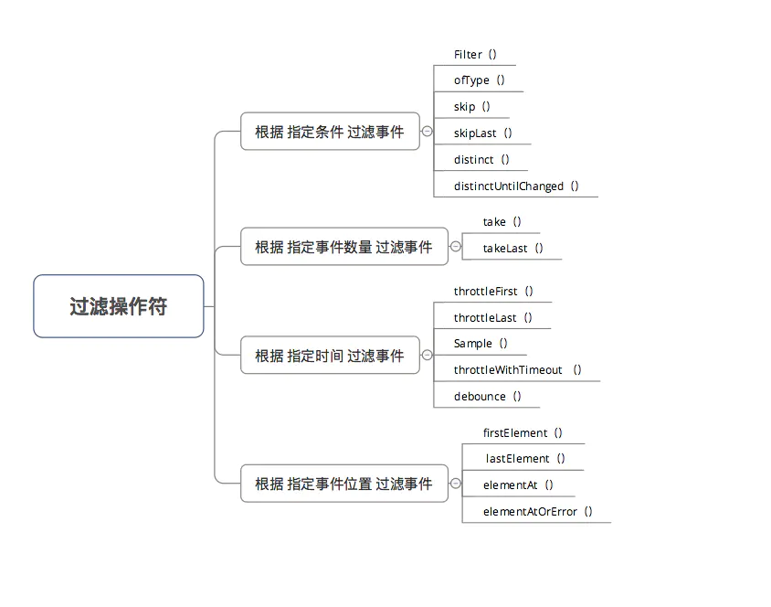
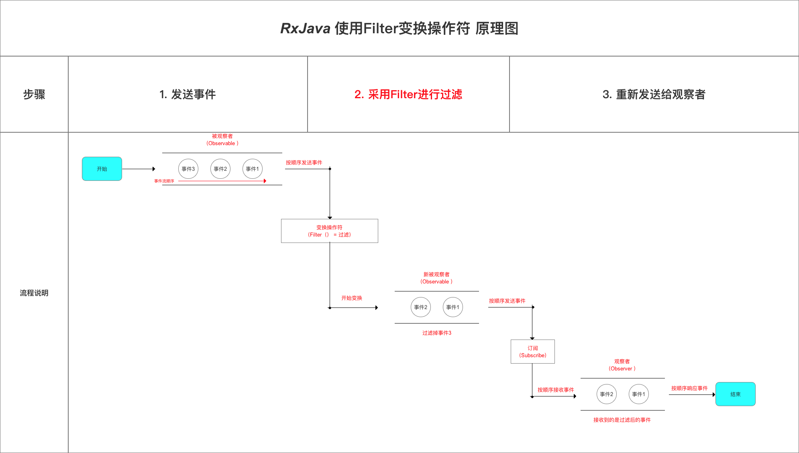
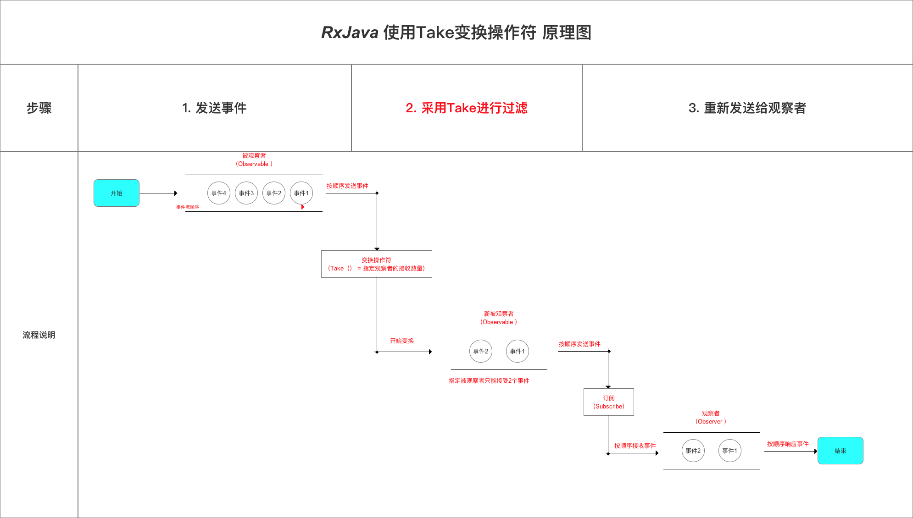
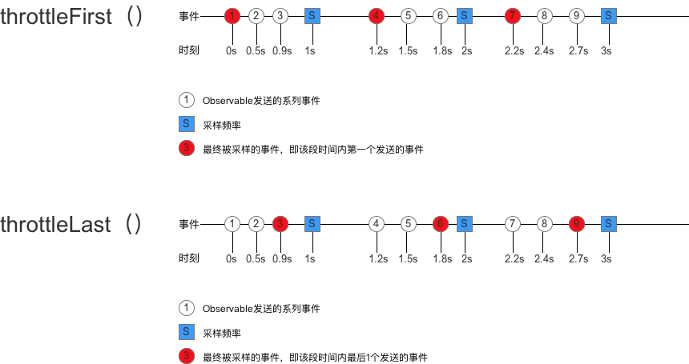
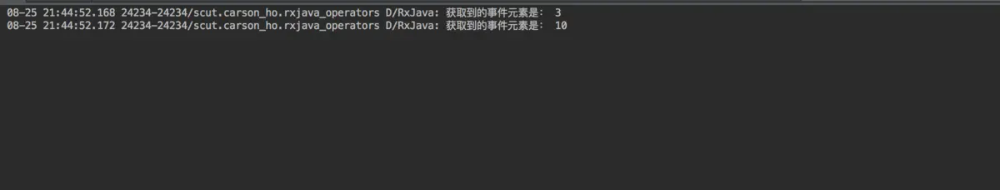
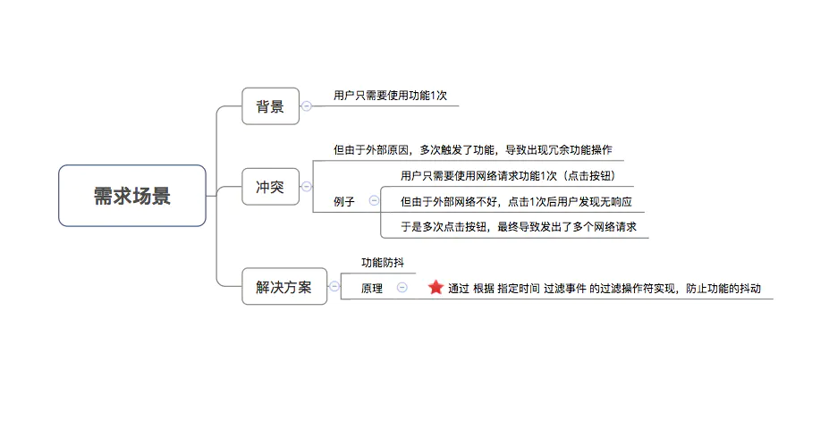
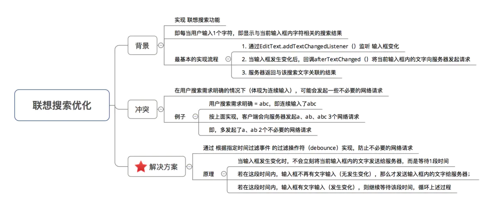

# 过滤操作符

## 作用

过滤 / 筛选 被观察者（`Observable`）发送的事件 & 观察者 （`Observer`）接收的事件

## 类型

- `RxJava2`中，过滤操作符的类型包括：



## 根据 指定条件 过滤事件

- 需求场景
  通过设置指定的过滤条件，当且仅当该事件满足条件，就将该事件过滤（不发送）
- 对应操作符类型

### Filter（）

- 作用
  过滤 特定条件的事件
- 原理



- 具体使用

  ```java
  Observable.create(new ObservableOnSubscribe<Integer>() {
              @Override
              public void subscribe(ObservableEmitter<Integer> emitter) throws Exception {
                  // 1. 发送5个事件
                  emitter.onNext(1);
                  emitter.onNext(2);
                  emitter.onNext(3);
                  emitter.onNext(4);
                  emitter.onNext(5);
              }
  
              // 2. 采用filter（）变换操作符
          }).filter(new Predicate<Integer>() {
              // 根据test()的返回值 对被观察者发送的事件进行过滤 & 筛选
                // a. 返回true，则继续发送
                // b. 返回false，则不发送（即过滤）
              @Override
              public boolean test(Integer integer) throws Exception {
                  return integer > 3;
                  // 本例子 = 过滤了整数≤3的事件
              }
          }).subscribe(new Observer<Integer>() {
  
              @Override
              public void onSubscribe(Disposable d) {
                  Log.d(TAG, "开始采用subscribe连接");
              }
  
              @Override
              public void onNext(Integer value) {
                  Log.d(TAG, "过滤后得到的事件是："+ value  );
              }
  
              @Override
              public void onError(Throwable e) {
                  Log.d(TAG, "对Error事件作出响应");
              }
  
              @Override
              public void onComplete() {
                  Log.d(TAG, "对Complete事件作出响应");
              }
          });
  ```

  

### ofType（）

- 作用
  过滤 特定数据类型的数据

- 具体使用

  ```java
  Observable.just(1, "Carson", 3, "Ho", 5)
                    .ofType(Integer.class) // 筛选出 整型数据
                    .subscribe(new Consumer<Integer>() {
                        @Override
                        public void accept( Integer integer) throws Exception {
                            Log.d(TAG,"获取到的整型事件元素是： "+ integer);
                        }
          });
  ```

  

### skip（） / skipLast（）

- 作用
  跳过某个事件

- 具体使用

  ```java
  // 使用1：根据顺序跳过数据项
          Observable.just(1, 2, 3, 4, 5)
                  .skip(1) // 跳过正序的前1项
                  .skipLast(2) // 跳过正序的后2项
                    .subscribe(new Consumer<Integer>() {
                        @Override
                        public void accept( Integer integer) throws Exception {
                            Log.d(TAG,"获取到的整型事件元素是： "+ integer);
                        }
          });
  
  // 使用2：根据时间跳过数据项
          // 发送事件特点：发送数据0-5，每隔1s发送一次，每次递增1；第1次发送延迟0s
          Observable.intervalRange(0, 5, 0, 1, TimeUnit.SECONDS)
                  .skip(1, TimeUnit.SECONDS) // 跳过第1s发送的数据
                  .skipLast(1, TimeUnit.SECONDS) // 跳过最后1s发送的数据
                  .subscribe(new Consumer<Long>() {
  
                      @Override
                      public void accept( Long along ) throws Exception {
                          Log.d(TAG,"获取到的整型事件元素是： "+ along);
                      }
                  });
  ```

  

### distinct（） / distinctUntilChanged（）

- 作用
  过滤事件序列中重复的事件 / 连续重复的事件

- 具体使用

  ```java
  // 使用1：过滤事件序列中重复的事件
          Observable.just(1, 2, 3, 1 , 2 )
                  .distinct()
                  .subscribe(new Consumer<Integer>() {
                        @Override
                        public void accept( Integer integer) throws Exception {
                            Log.d(TAG,"不重复的整型事件元素是： "+ integer);
                        }
          });
  
          // 使用2：过滤事件序列中 连续重复的事件
          // 下面序列中，连续重复的事件 = 3、4
          Observable.just(1,2,3,1,2,3,3,4,4 )
                  .distinctUntilChanged()
                  .subscribe(new Consumer<Integer>() {
                      @Override
                      public void accept( Integer integer) throws Exception {
                          Log.d(TAG,"不连续重复的整型事件元素是： "+ integer);
                      }
                  });
  ```

  

##  根据 指定事件数量 过滤事件

- 需求场景
   通过设置指定的事件数量，仅发送特定数量的事件
- 对应操作符类型
   `take（）` & `takeLast（）`
- 对应操作符使用

### take（）

- 作用
   指定观察者最多能接收到的事件数量
- 原理



- 具体使用

  ```java
  Observable.create(new ObservableOnSubscribe<Integer>() {
              @Override
              public void subscribe(ObservableEmitter<Integer> emitter) throws Exception {
                  // 1. 发送5个事件
                  emitter.onNext(1);
                  emitter.onNext(2);
                  emitter.onNext(3);
                  emitter.onNext(4);
                  emitter.onNext(5);
              }
  
              // 采用take（）变换操作符
              // 指定了观察者只能接收2个事件
          }).take(2)
          .subscribe(new Observer<Integer>() {
  
              @Override
              public void onSubscribe(Disposable d) {
                  Log.d(TAG, "开始采用subscribe连接");
              }
  
              @Override
              public void onNext(Integer value) {
                  Log.d(TAG, "过滤后得到的事件是："+ value  );
              }
  
              @Override
              public void onError(Throwable e) {
                  Log.d(TAG, "对Error事件作出响应");
              }
  
              @Override
              public void onComplete() {
                  Log.d(TAG, "对Complete事件作出响应");
              }
          });
  
  // 实际上，可理解为：被观察者还是发送了5个事件，只是因为操作符的存在拦截了3个事件，最终观察者接收到的是2个事件
  ```

  

### takeLast（）

- 作用
  指定观察者只能接收到被观察者发送的最后几个事件

- 具体使用

  ```java
  Observable.just(1, 2, 3, 4, 5)
            .takeLast(3) //指定观察者只能接受被观察者发送的3个事件
            .subscribe(new Observer<Integer>() {
              @Override
              public void onSubscribe(Disposable d) {
                  Log.d(TAG, "开始采用subscribe连接");
              }
  
              @Override
              public void onNext(Integer value) {
                  Log.d(TAG, "过滤后得到的事件是："+ value  );
              }
  
              @Override
              public void onError(Throwable e) {
                  Log.d(TAG, "对Error事件作出响应");
              }
  
              @Override
              public void onComplete() {
                  Log.d(TAG, "对Complete事件作出响应");
              }
          });
  ```

  

## 根据 指定时间 过滤事件

- 需求场景
  通过设置指定的时间，仅发送在该时间内的事件

### throttleFirst（）/ throttleLast（）

- 作用
  在某段时间内，只发送该段时间内第1次事件 / 最后1次事件

> 如，1段时间内连续点击按钮，但只执行第1次的点击操作

- 原理示意图



- 具体使用

  ```java
  <<- 在某段时间内，只发送该段时间内第1次事件 ->>
  Observable.create(new ObservableOnSubscribe<Integer>() {
              @Override
              public void subscribe(ObservableEmitter<Integer> e) throws Exception {
                  // 隔段事件发送时间
                  e.onNext(1);
                  Thread.sleep(500);
                  
                  e.onNext(2);
                  Thread.sleep(400);
                  
                  e.onNext(3);
                  Thread.sleep(300);
                  
                  e.onNext(4);
                  Thread.sleep(300);
                  
                  e.onNext(5);
                  Thread.sleep(300);
                  
                  e.onNext(6);
                  Thread.sleep(400);
                  
                  e.onNext(7);
                  Thread.sleep(300);
                  e.onNext(8);
  
                  Thread.sleep(300);
                  e.onNext(9);
  
                  Thread.sleep(300);
                  e.onComplete();
              }
          }).throttleFirst(1, TimeUnit.SECONDS)//每1秒中采用数据
                  .subscribe(new Observer<Integer>() {
                      @Override
                      public void onSubscribe(Disposable d) {
                          Log.d(TAG, "开始采用subscribe连接");
                      }
  
                      @Override
                      public void onNext(Integer value) {
                          Log.d(TAG, "接收到了事件"+ value  );
                      }
  
                      @Override
                      public void onError(Throwable e) {
                          Log.d(TAG, "对Error事件作出响应");
                      }
  
                      @Override
                      public void onComplete() {
                          Log.d(TAG, "对Complete事件作出响应");
                      }
                  });
  
  
  <<- 在某段时间内，只发送该段时间内最后1次事件 ->>
  Observable.create(new ObservableOnSubscribe<Integer>() {
              @Override
              public void subscribe(ObservableEmitter<Integer> e) throws Exception {
                  // 隔段事件发送时间
                  e.onNext(1);
                  Thread.sleep(500);
  
                  e.onNext(2);
                  Thread.sleep(400);
  
                  e.onNext(3);
                  Thread.sleep(300);
  
                  e.onNext(4);
                  Thread.sleep(300);
  
                  e.onNext(5);
                  Thread.sleep(300);
  
                  e.onNext(6);
                  Thread.sleep(400);
  
                  e.onNext(7);
                  Thread.sleep(300);
                  e.onNext(8);
  
                  Thread.sleep(300);
                  e.onNext(9);
  
                  Thread.sleep(300);
                  e.onComplete();
              }
          }).throttleLast(1, TimeUnit.SECONDS)//每1秒中采用数据
                  .subscribe(new Observer<Integer>() {
                      @Override
                      public void onSubscribe(Disposable d) {
                          Log.d(TAG, "开始采用subscribe连接");
                      }
  
                      @Override
                      public void onNext(Integer value) {
                          Log.d(TAG, "接收到了事件"+ value  );
                      }
  
                      @Override
                      public void onError(Throwable e) {
                          Log.d(TAG, "对Error事件作出响应");
                      }
  
                      @Override
                      public void onComplete() {
                          Log.d(TAG, "对Complete事件作出响应");
                      }
                  });
  
  
  ```

- 测试结果


### Sample（）

- 作用
   在某段时间内，只发送该段时间内最新（最后）1次事件

> 与 `throttleLast（）` 操作符类似

- 具体使用

仅需要把上文的 `throttleLast（）` 改成`Sample（）`操作符即可，此处不作过多描述

### throttleWithTimeout （） / debounce（）

- 作用
   发送数据事件时，若2次发送事件的间隔＜指定时间，就会丢弃前一次的数据，直到指定时间内都没有新数据发射时才会发送后一次的数据

- 具体使用

  ```java
  Observable.create(new ObservableOnSubscribe<Integer>() {
              @Override
              public void subscribe(ObservableEmitter<Integer> e) throws Exception {
                  // 隔段事件发送时间
                  e.onNext(1);
                  Thread.sleep(500);
                  e.onNext(2); // 1和2之间的间隔小于指定时间1s，所以前1次数据（1）会被抛弃，2会被保留
                  Thread.sleep(1500);  // 因为2和3之间的间隔大于指定时间1s，所以之前被保留的2事件将发出
                  e.onNext(3);
                  Thread.sleep(1500);  // 因为3和4之间的间隔大于指定时间1s，所以3事件将发出
                  e.onNext(4);
                  Thread.sleep(500); // 因为4和5之间的间隔小于指定时间1s，所以前1次数据（4）会被抛弃，5会被保留
                  e.onNext(5);
                  Thread.sleep(500); // 因为5和6之间的间隔小于指定时间1s，所以前1次数据（5）会被抛弃，6会被保留
                  e.onNext(6);
                  Thread.sleep(1500); // 因为6和Complete实践之间的间隔大于指定时间1s，所以之前被保留的6事件将发出
  
                  e.onComplete();
              }
          }).throttleWithTimeout(1, TimeUnit.SECONDS)//每1秒中采用数据
                  .subscribe(new Observer<Integer>() {
                      @Override
                      public void onSubscribe(Disposable d) {
  
                      }
  
                      @Override
                      public void onNext(Integer value) {
                          Log.d(TAG, "接收到了事件"+ value  );
                      }
  
                      @Override
                      public void onError(Throwable e) {
                          Log.d(TAG, "对Error事件作出响应");
                      }
  
                      @Override
                      public void onComplete() {
                          Log.d(TAG, "对Complete事件作出响应");
                      }
                  });
  ```

  

## 根据 指定事件位置 过滤事件

- 需求场景
  通过设置指定的位置，过滤在该位置的事件

### firstElement（） / lastElement（）

- 作用
  **仅选取**第1个元素 / 最后一个元素

- 具体使用

  ```java
  // 获取第1个元素
          Observable.just(1, 2, 3, 4, 5)
                    .firstElement()
                    .subscribe(new Consumer<Integer>() {
                        @Override
                        public void accept( Integer integer) throws Exception {
                            Log.d(TAG,"获取到的第一个事件是： "+ integer);
                        }
          });
  
  // 获取最后1个元素
          Observable.just(1, 2, 3, 4, 5)
                  .lastElement()
                  .subscribe(new Consumer<Integer>() {
                      @Override
                      public void accept( Integer integer) throws Exception {
                          Log.d(TAG,"获取到的最后1个事件是： "+ integer);
                      }
                  });
  
  ```

  

### elementAt（）

- 作用
  指定接收某个元素（通过 索引值 确定）

> 注：允许越界，即获取的位置索引 ＞ 发送事件序列长度

- 具体使用

  ```java
  // 使用1：获取位置索引 = 2的 元素
          // 位置索引从0开始
          Observable.just(1, 2, 3, 4, 5)
                    .elementAt(2)
                    .subscribe(new Consumer<Integer>() {
                        @Override
                        public void accept( Integer integer) throws Exception {
                            Log.d(TAG,"获取到的事件元素是： "+ integer);
                        }
          });
  
  // 使用2：获取的位置索引 ＞ 发送事件序列长度时，设置默认参数
          Observable.just(1, 2, 3, 4, 5)
                  .elementAt(6,10)
                  .subscribe(new Consumer<Integer>() {
                      @Override
                      public void accept( Integer integer) throws Exception {
                          Log.d(TAG,"获取到的事件元素是： "+ integer);
                      }
                  });
  ```

- 测试结果



### elementAtOrError（）

- 作用
  在`elementAt（）`的基础上，当出现越界情况（即获取的位置索引 ＞ 发送事件序列长度）时，即抛出异常

- 具体使用

  ```java
  Observable.just(1, 2, 3, 4, 5)
                  .elementAtOrError(6)
                  .subscribe(new Consumer<Integer>() {
                      @Override
                      public void accept( Integer integer) throws Exception {
                          Log.d(TAG,"获取到的事件元素是： "+ integer);
                      }
                  });
  ```

  

## 项目实例

- [功能防抖](https://www.jianshu.com/p/90d53c791c42)

  

- [联想搜索优化](https://www.jianshu.com/p/ba0e7df9b927)

  

