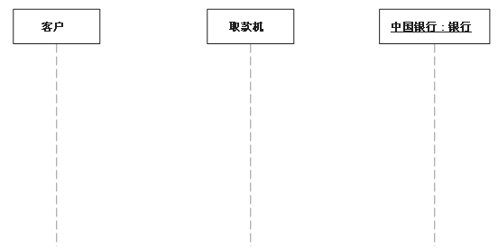
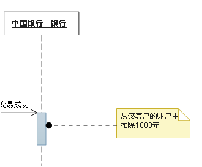

# 序列图-时序图

　 交互图的一种，描述了对象之间消息发送的先后顺序，强调时间顺序。

　　序列图的主要用途是把用例表达的需求，转化为进一步、更加正式层次的精细表达。用例常常被细化为一个或者更多的序列图。同时序列图更有效地描述如何分配各个类的职责以及各类具有相应职责的原因。

　　消息用从一个对象的生命线到另一个对象生命线的箭头表示。箭头以时间顺序在图中从上到下排列。

　　序列图中涉及的元素：

## 生命线

　　生命线名称可带下划线。当使用下划线时，意味着序列图中的生命线代表一个类的特定实例。

## 同步消息

　　　　同步等待消息

## 异步消息

　　异步发送消息，不需等待

## 注释

## 约束

## 组合　　

　　组合片段用来解决交互执行的条件及方式。它允许在序列图中直接表示逻辑组件，用于通过指定条件或子进程的应用区域，为任何生命线的任何部分定义特殊条件和子进程。常用的组合片段有：抉择、选项、循环、并行。