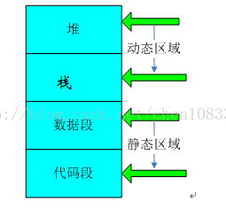

## C/C++ 内存基础知识

 一个由C/C++编译的程序占用的内存分为以下几个部分 

- **栈区（stack）：由编译器自动分配释放  ，存放函数的参数值，局部变量的值等。其  操作方式类似于数据结构中的栈。 **
- **堆区（heap）** ：一般由程序员分配释放，  若程序员不释放，程序结束时可能由OS回收。注意它与数据结构中的堆是两回事，分配方式倒是类似于链表，呵呵。 
- **全局区（静态区）（static）**：全局变量和静态变量的存储是放在一块的，初始化的全局变量和静态变量在一块区域，  未初始化的全局变量和未初始化的静态变量在相邻的另一块区域。程序结束后由系统释放。 
- **文字常量区**：常量字符串就是放在这里的程序结束后由系统释放  
- **程序代码区**：存放函数体的二进制代码。

C/C++程序经过编译连接后形成的二进制映像文件，这文件包含：

**栈，堆，数据段**（只读数据段，已经初始化读写数据段，未初始化数据段即BBS）和**代码段**组成.

