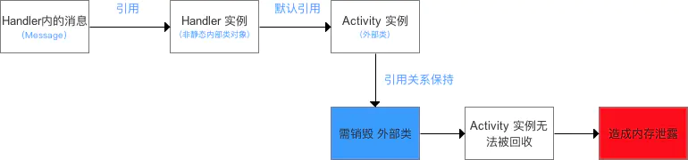

## 内存泄漏与内存溢出

内存泄漏(Memory Leak)：程序在申请内存后，**无法释放**已申请的内存空间。是造成应用程序OOM的主要原因之一。

> 内存溢出(out of memory)：指程序在申请内存时，没有足够的内存空间供其使用。

大多内存泄漏都是因为长生命周期对象持有短生命周期对象的**强引用**，导致短生命周期对象不能回收。

## 静态变量导致的内存泄漏

- **一个静态变量又是非静态内部类会一直持有对外部类的引用，会导致外部类无法被回收**
- 详情：Activity中一个静态变量的值是一个非静态内部类，静态变量会一直持有外部类Activity的引用，导致外部类Activity无法被回收。
- 解决办法：将内部类设为静态内部类或独立出来，或在onDestroy时将变量设置为null；使用`context.getApplicationContext()`。

```java
public class SecondActivity extends Activity{
    private Handler mHandler = new Handler(){
        @Override
        public void handleMessage(Message msg) {
            super.handleMessage(msg);
            SecondActivity.this.finish();
            this.removeMessages(0);
        }
    };
 
    private static Haha haha;//静态变量
    @Override
    protected void onCreate(Bundle savedInstanceState) {
        super.onCreate(savedInstanceState);
        haha = new Haha();
        mHandler.sendEmptyMessageDelayed(0,2000);
    }
 
    class Haha{ }//非静态内部类
}


    protected void onDestroy() {
        super.onDestroy();
        if(haha!=null){
            haha = null;
        }
    }
```

```java
public class MainActivity extends AppCompatActivity {

    private static TestResource mResource = null;////静态变量

    @Override
    protected void onCreate(Bundle savedInstanceState) {
        super.onCreate(savedInstanceState);
        setContentView(R.layout.activity_main);
        if(mResource == null){
            mResource = new TestResource();
        }
        //...
    }
    
    class TestResource {//非静态内部类
    //...
    }
}
```

## 单例模式导致的内存泄漏

- **长生命周期的对象（static的SingleInstance实例）引用了短生命周期对象（SecondActivity实例）导致**
  - 由于单例的静态特性使得其生命周期和应用的生命周期一样长，如果一个对象已经不再需要使用了，而单例对象还持有该对象的引用，就会使得该对象不能被正常回收，从而导致了内存泄漏
- 详情：单例传入的 context 来自Activity，单例将持有对Activity的引用，会使Activity无法被销毁
- 解决办法：传入长生命周期的 context：`context.getApplicationContext()`

```java
public class SingleInstance {
    private Context mContext;
    private static SingleInstance instance;
 
    private SingleInstance(Context context) {
        this.mContext = context;
    }
 
    public static SingleInstance getInstance(Context context) {
        if (instance == null) {
            instance = new SingleInstance(context);
        }
        return instance;
    }
}
```

## Handler导致的内存泄漏

- 详情：Message持有对Handler的引用，而非静态内部类的Handler又隐式持有对外部类Activity的引用，使得引用关系会保持至消息得到处理，从而阻止了Activity的回收。
- 解决办法：使用静态内部类+WeakReference弱引用；当外部类结束生命周期时清空消息队列。

```java
    // Handler类由于无设置为 静态类，从而导致了内存泄露

    //方式1：新建Handler子类（内部类）
    public class MainActivity extends AppCompatActivity {

            public static final String TAG = "carson：";
            private Handler showhandler;

            // 主线程创建时便自动创建Looper & 对应的MessageQueue
            // 之后执行Loop()进入消息循环
            @Override
            protected void onCreate(Bundle savedInstanceState) {
                super.onCreate(savedInstanceState);
                setContentView(R.layout.activity_main);

                //1. 实例化自定义的Handler类对象->>分析1
                //注：此处并无指定Looper，故自动绑定当前线程(主线程)的Looper、MessageQueue
                showhandler = new FHandler();

                // 2. 启动子线程1
                new Thread() {
                    @Override
                    public void run() {
                        try {
                            Thread.sleep(1000);
                        } catch (InterruptedException e) {
                            e.printStackTrace();
                        }
                        // a. 定义要发送的消息
                        Message msg = Message.obtain();
                        msg.what = 1;// 消息标识
                        msg.obj = "AA";// 消息存放
                        // b. 传入主线程的Handler & 向其MessageQueue发送消息
                        showhandler.sendMessage(msg);
                    }
                }.start();

                // 3. 启动子线程2
                new Thread() {
                    @Override
                    public void run() {
                        try {
                            Thread.sleep(5000);
                        } catch (InterruptedException e) {
                            e.printStackTrace();
                        }
                        // a. 定义要发送的消息
                        Message msg = Message.obtain();
                        msg.what = 2;// 消息标识
                        msg.obj = "BB";// 消息存放
                        // b. 传入主线程的Handler & 向其MessageQueue发送消息
                        showhandler.sendMessage(msg);
                    }
                }.start();

            }

            // 分析1：自定义Handler子类
            class FHandler extends Handler {

                // 通过复写handlerMessage() 从而确定更新UI的操作
                @Override
                public void handleMessage(Message msg) {
                    switch (msg.what) {
                        case 1:
                            Log.d(TAG, "收到线程1的消息");
                            break;
                        case 2:
                            Log.d(TAG, " 收到线程2的消息");
                            break;


                    }
                }
            }
        }

     //方式2：匿名Handler内部类
     public class MainActivity extends AppCompatActivity {

        public static final String TAG = "carson：";
        private Handler showhandler;

        // 主线程创建时便自动创建Looper & 对应的MessageQueue
        // 之后执行Loop()进入消息循环
        @Override
        protected void onCreate(Bundle savedInstanceState) {
            super.onCreate(savedInstanceState);
            setContentView(R.layout.activity_main);

            //1. 通过匿名内部类实例化的Handler类对象
            //注：此处并无指定Looper，故自动绑定当前线程(主线程)的Looper、MessageQueue
            showhandler = new  Handler(){
                // 通过复写handlerMessage()从而确定更新UI的操作
                @Override
                public void handleMessage(Message msg) {
                        switch (msg.what) {
                            case 1:
                                Log.d(TAG, "收到线程1的消息");
                                break;
                            case 2:
                                Log.d(TAG, " 收到线程2的消息");
                                break;
                        }
                    }
            };

            // 2. 启动子线程1
            new Thread() {
                @Override
                public void run() {
                    try {
                        Thread.sleep(1000);
                    } catch (InterruptedException e) {
                        e.printStackTrace();
                    }
                    // a. 定义要发送的消息
                    Message msg = Message.obtain();
                    msg.what = 1;// 消息标识
                    msg.obj = "AA";// 消息存放
                    // b. 传入主线程的Handler & 向其MessageQueue发送消息
                    showhandler.sendMessage(msg);
                }
            }.start();

            // 3. 启动子线程2
            new Thread() {
                @Override
                public void run() {
                    try {
                        Thread.sleep(5000);
                    } catch (InterruptedException e) {
                        e.printStackTrace();
                    }
                    // a. 定义要发送的消息
                    Message msg = Message.obtain();
                    msg.what = 2;// 消息标识
                    msg.obj = "BB";// 消息存放
                    // b. 传入主线程的Handler & 向其MessageQueue发送消息
                    showhandler.sendMessage(msg);
                }
            }.start();

        }
}
```

### 储备知识

- 主线程的`Looper`对象的生命周期 = 该应用程序的生命周期
- 在`Java`中，**非静态内部类** & **匿名内部类**都默认持有 外部类的引用

### 泄露原因描述

从上述示例代码可知：

- 上述的`Handler`实例的消息队列有2个分别来自线程1、2的消息（分别 为延迟`1s`、`6s`）
- **在`Handler`消息队列 还有未处理的消息 / 正在处理消息时，消息队列中的`Message`持有`Handler`实例的引用**
- 由于`Handler` = 非静态内部类 / 匿名内部类（2种使用方式），故又默认持有外部类的引用（即`MainActivity`实例），引用关系如下图

> 上述的引用关系会一直保持，直到`Handler`消息队列中的所有消息被处理完毕


- 在`Handler`消息队列 还有未处理的消息 / 正在处理消息时，此时若需销毁外部类`MainActivity`，但由于上述引用关系，垃圾回收器`（GC）`无法回收`MainActivity`，从而造成内存泄漏。如下图：



### 总结

- 当`Handler`消息队列 还有未处理的消息 / 正在处理消息时，存在引用关系： **“未被处理 / 正处理的消息 -> `Handler`实例 -> 外部类”**
- 若出现 `Handler`的生命周期 > 外部类的生命周期 时（**即 `Handler`消息队列 还有未处理的消息 / 正在处理消息 而 外部类需销毁时**），将使得外部类无法被垃圾回收器`（GC）`回收，从而造成 内存泄露

### 解决方案

从上面可看出，造成内存泄露的原因有2个关键条件：

1. 存在“未被处理 / 正处理的消息 -> `Handler`实例 -> 外部类” 的引用关系
2. `Handler`的生命周期 > 外部类的生命周期

> 即 `Handler`消息队列 还有未处理的消息 / 正在处理消息 而 外部类需销毁

**解决方案的思路 = 使得上述任1条件不成立 即可。**

#### 解决方案1：静态内部类+弱引用

- 原理
   静态内部类 不默认持有外部类的引用，从而使得 “未被处理 / 正处理的消息 -> `Handler`实例 -> 外部类” 的引用关系 的引用关系 不复存在。
- 具体方案
   将`Handler`的子类设置成 静态内部类

> - 同时，还可加上 **使用WeakReference弱引用持有Activity实例**
> - 原因：弱引用的对象拥有短暂的生命周期。在垃圾回收器线程扫描时，一旦发现了只具有弱引用的对象，不管当前内存空间足够与否，都会回收它的内存

- 解决代码

```java
public class MainActivity extends AppCompatActivity {

    public static final String TAG = "carson：";
    private Handler showhandler;

    // 主线程创建时便自动创建Looper & 对应的MessageQueue
    // 之后执行Loop()进入消息循环
    @Override
    protected void onCreate(Bundle savedInstanceState) {
        super.onCreate(savedInstanceState);
        setContentView(R.layout.activity_main);

        //1. 实例化自定义的Handler类对象->>分析1
        //注：
            // a. 此处并无指定Looper，故自动绑定当前线程(主线程)的Looper、MessageQueue；
            // b. 定义时需传入持有的Activity实例（弱引用）
        showhandler = new FHandler(this);

        // 2. 启动子线程1
        new Thread() {
            @Override
            public void run() {
                try {
                    Thread.sleep(1000);
                } catch (InterruptedException e) {
                    e.printStackTrace();
                }
                // a. 定义要发送的消息
                Message msg = Message.obtain();
                msg.what = 1;// 消息标识
                msg.obj = "AA";// 消息存放
                // b. 传入主线程的Handler & 向其MessageQueue发送消息
                showhandler.sendMessage(msg);
            }
        }.start();

        // 3. 启动子线程2
        new Thread() {
            @Override
            public void run() {
                try {
                    Thread.sleep(5000);
                } catch (InterruptedException e) {
                    e.printStackTrace();
                }
                // a. 定义要发送的消息
                Message msg = Message.obtain();
                msg.what = 2;// 消息标识
                msg.obj = "BB";// 消息存放
                // b. 传入主线程的Handler & 向其MessageQueue发送消息
                showhandler.sendMessage(msg);
            }
        }.start();

    }

    // 分析1：自定义Handler子类
    // 设置为：静态内部类
    private static class FHandler extends Handler{

        // 定义 弱引用实例
        private WeakReference<Activity> reference;

        // 在构造方法中传入需持有的Activity实例
        public FHandler(Activity activity) {
            // 使用WeakReference弱引用持有Activity实例
            reference = new WeakReference<Activity>(activity); }

        // 通过复写handlerMessage() 从而确定更新UI的操作
        @Override
        public void handleMessage(Message msg) {
            switch (msg.what) {
                case 1:
                    Log.d(TAG, "收到线程1的消息");
                    break;
                case 2:
                    Log.d(TAG, " 收到线程2的消息");
                    break;


            }
        }
    }
}
```

#### 解决方案2：当外部类结束生命周期时，清空Handler内消息队列

- 原理
   不仅使得 “未被处理 / 正处理的消息 -> `Handler`实例 -> 外部类” 的引用关系 不复存在，同时 使得  `Handler`的生命周期（即 消息存在的时期） 与 外部类的生命周期 同步
- 具体方案
   当 外部类（此处以`Activity`为例） 结束生命周期时（此时系统会调用`onDestroy（）`），清除 `Handler`消息队列里的所有消息（调用`removeCallbacksAndMessages(null)`）
- 具体代码

```java
@Override
    protected void onDestroy() {
        super.onDestroy();
        mHandler.removeCallbacksAndMessages(null);
        // 外部类Activity生命周期结束时，同时清空消息队列 & 结束Handler生命周期
    }
```

#### 使用建议

为了保证`Handler`中消息队列中的所有消息都能被执行，此处推荐使用解决方案1解决内存泄露问题，即 **静态内部类 + 弱引用的方式**

## 线程导致的内存泄漏

- 详情：[AsyncTask](https://www.jianshu.com/p/ab77a2e83c52)/Runnable以**匿名内部类**的方式存在，会隐式持有对所在Activity的引用。
- 解决办法：将AsyncTask和Runnable设为静态内部类或独立出来；[在线程内部采用弱引用保存Context引用](https://link.jianshu.com?t=http%3A%2F%2Fblog.csdn.net%2Fjdsjlzx%2Farticle%2Fdetails%2F51388847)。

```java
/**
 * 示例向我们展示了在 Activity 的配置改变时（配置的改变会导致它其下的Activity实例被销毁）
 * 此外,Activity的context也是内存泄露的一部分，因为由于线程被初始化为匿名内部，使得其持有外部
 * Activity的隐式引用，使得Activity不会被java的垃圾回收机制回收。
 */
public class MainActivity extends Activity {

    @Override
    protected void onCreate(Bundle savedInstanceState) {
        super.onCreate(savedInstanceState);
        exampleOne();
    }

    private void exampleOne() {
        new Thread() {
            @Override
            public void run() {
                while (true) {
                    SystemClock.sleep(1000);
                }
            }
        }.start();
    }
}

/**
 * 这个例子通过声明线程为私有的静态内存类的方式避免了Activity Context的内存泄露，
 * 但是所有的线程仍然在继续的运行，即时配置发生变化。因为DVM虚拟机持有这些所有正在运行
 * 的线程的引用，并且这些线程是否被垃圾回收机制回收对Activity的生命周期没有任何的
 * 影响，这些线程会一直运行直到Android系统销毁了你的应用程序的进程。
 */
public class MainActivity extends Activity {

    @Override
    protected void onCreate(Bundle savedInstanceState) {
        super.onCreate(savedInstanceState);
        exampleTwo();
    }

    private void exampleTwo() {
        new MyThread().start();
    }

    private static class MyThread extends Thread {
        @Override
        public void run() {
            while (true) {
                SystemClock.sleep(1000);
            }
        }
    }
}

/**
 * 通例二一样,除了这次我们为线程实现了一个销毁的逻辑,确保它再也不会出现内存泄露的问题。
 * OnDestroy()通常是一个很好的地方在我们退出Activity时关闭你正在运行的线程
 */
public class MainActivity extends Activity {
    private MyThread mThread;

    @Override
    protected void onCreate(Bundle savedInstanceState) {
        super.onCreate(savedInstanceState);
        exampleThree();
    }

    private void exampleThree() {
        mThread = new MyThread();
        mThread.start();
    }

    /**
     * 静态内部类将不会再隐式的持有外部类的引用，所以在配置改变时，你的Activity的实例在也不会
     * 出现内存泄露
     */
    private static class MyThread extends Thread {
        private boolean mRunning = false;

        @Override
        public void run() {
            mRunning = true;
            while (mRunning) {
                SystemClock.sleep(1000);
            }
        }

        public void close() {
            mRunning = false;
        }
    }

    @Override
    protected void onDestroy() {
        super.onDestroy();
        mThread.close();
    }
}
```

## 资源未关闭导致的内存泄漏

- 详情：未及时注销资源导致内存泄漏，如BraodcastReceiver、File、Cursor、Stream、Bitmap、Animator等。
- 解决办法：在Activity销毁的时候要及时关闭或者注销。
  - [BraodcastReceiver](https://www.jianshu.com/p/82ecfc95924f)：调用`unregisterReceiver()`注销；
  - [Cursor，Stream、File](https://www.jianshu.com/p/8d6acf45e9b7)：调用`close()`关闭；
  - [Bitmap](https://www.jianshu.com/p/aaafcd72c127)：调用`recycle()`释放内存（2.3版本后无需手动）。
  - Animator：在`Activity.onDestroy()`中调用`Animator.cancel()`停止动画。

## Adapter导致的内存泄漏

- 详情：不使用缓存而只依靠`getView()` 每次重新实例化Item，会给gc制造压力。
- 解决办法：[在构造Adapter时使用缓存的convertView](https://www.jianshu.com/p/fa69a74bf80a)。