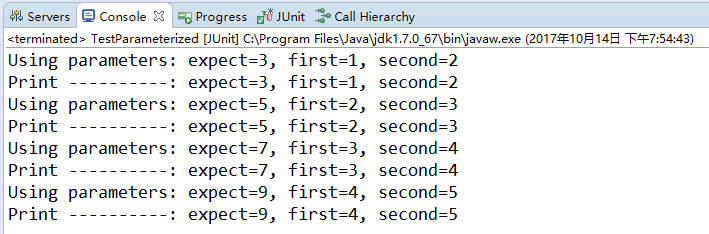
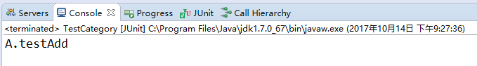
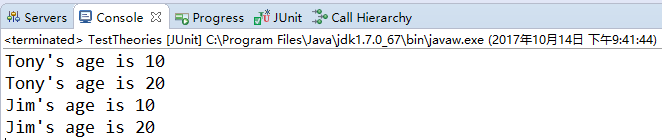

# 基础入门

单元测试又名模块测试，是对软件设计最小单元进行白盒测试验证，一般在修改代码后都需要执行一次单元测试，以确保程序功能正确。
 现在主流开源软件提交代码合入请求时都需要提供相应的单元测试代码，越来越多的大型企业对其产品的单元测试代码覆盖率有着明确的要求（常见覆盖率要求50% ~ 80%）。

## 单元测试的一般性约束

- 代码目录
   单元测试代码一般存放在项目的`src/test/java`目录下
- 命名约束：
  - 测试类命名：
     测试类名以Test结尾，例如
     `LogWriterTest.java`
  - 测试方法命名：
     测试类中的测试方法命名一般为“test” + “待测方法/功能/异常”，例如：
     `public void testWrite()`

## JUnit单元测试的方法注解

- `@Test` 表示该方法是一个测试方法，在执行`mvn test`时会被自动执行。
- `@Test(timeout = 100)` 该方法执行时间超过100毫秒时，测试将会失败。
- `@Test(expected = xxxException.class)` 该方法期望执行过程中抛出指定异常，否则测试将会失败。
- `@BeforeClass` 用于注解静态方法，方法会在测试类实例化前被调用一次，一般用于初始化资源。
- `@Before` 测试方法每次执行前，都会调用该方法一次。
- `@AfterClass` 用于注解静态方法，方法会在所有测试用例结束后被调用一次，一般用于释放资源。
- `@After` 测试方法每次执行后，都会调用该方法一次。
- `@Ignore` 忽略该测试方法（静态忽略）。如用于注解测试类，则该类中所有测试方法都不会被执行。

> 如果需在运行时动态决定是否要忽略测试方法，可借助[`Assume.assumeTrue`](https://links.jianshu.com/go?to=https%3A%2F%2Fwww.vogella.com%2Ftutorials%2FJUnit%2Farticle.html%23disabling-tests)方法实现。

## Assert断言

断言用于标识某一具体状态下程序验证与开发者预期结果是否一致，如果断言成功则测试方法可以继续执行，否则测试方法将会失败。
 JUnit提供了多种断言方法：`fail`、`assertTrue`、`assertEquals`、`assertNull`，示例如下：

```cpp
assertTrue(list.isEmpty());
```

Assert类中主要方法如下：

| 方法名            | 方法描述                               |
| ----------------- | -------------------------------------- |
| assertEquals      | 断言传入的预期值与实际值是相等的       |
| assertNotEquals   | 断言传入的预期值与实际值是不相等的     |
| assertArrayEquals | 断言传入的预期数组与实际数组是相等的   |
| assertNull        | 断言传入的对象是为空                   |
| assertNotNull     | 断言传入的对象是不为空                 |
| assertTrue        | 断言条件为真                           |
| assertFalse       | 断言条件为假                           |
| assertSame        | 断言两个对象引用同一个对象，相当于“==” |
| assertNotSame     | 断言两个对象引用不同的对象，相当于“!=” |
| assertThat        | 断言实际值是否满足指定的条件           |

上面我们所用到的一些基本的断言，如果我们没有设置失败时的输出信息，那么在断言失败时只会抛出`AssertionError`，无法知道到底是哪一部分出错。而`assertThat`就帮我们解决了这一点。它的可读性更好。

```
assertThat(T actual, Matcher<? super T> matcher);

assertThat(String reason, T actual, Matcher<? super T> matcher); 
1234
```

其中`reason`为断言失败时的输出信息，`actual`为断言的值，`matcher`为断言的匹配器。

常用的匹配器整理：

| 匹配器               | 说明                               | 例子                                              |
| -------------------- | ---------------------------------- | ------------------------------------------------- |
| is                   | 断言参数等于后面给出的匹配表达式   | assertThat(5, is (5));                            |
| not                  | 断言参数不等于后面给出的匹配表达式 | assertThat(5, not(6));                            |
| equalTo              | 断言参数相等                       | assertThat(30, equalTo(30));                      |
| equalToIgnoringCase  | 断言字符串相等忽略大小写           | assertThat(“Ab”, equalToIgnoringCase(“ab”));      |
| containsString       | 断言字符串包含某字符串             | assertThat(“abc”, containsString(“bc”));          |
| startsWith           | 断言字符串以某字符串开始           | assertThat(“abc”, startsWith(“a”));               |
| endsWith             | 断言字符串以某字符串结束           | assertThat(“abc”, endsWith(“c”));                 |
| nullValue            | 断言参数的值为null                 | assertThat(null, nullValue());                    |
| notNullValue         | 断言参数的值不为null               | assertThat(“abc”, notNullValue());                |
| greaterThan          | 断言参数大于                       | assertThat(4, greaterThan(3));                    |
| lessThan             | 断言参数小于                       | assertThat(4, lessThan(6));                       |
| greaterThanOrEqualTo | 断言参数大于等于                   | assertThat(4, greaterThanOrEqualTo(3));           |
| lessThanOrEqualTo    | 断言参数小于等于                   | assertThat(4, lessThanOrEqualTo(6));              |
| closeTo              | 断言浮点型数在某一范围内           | assertThat(4.0, closeTo(2.6, 4.3));               |
| allOf                | 断言符合所有条件，相当于&&         | assertThat(4,allOf(greaterThan(3), lessThan(6))); |
| anyOf                | 断言符合某一条件，相当于或         | assertThat(4,anyOf(greaterThan(9), lessThan(6))); |
| hasKey               | 断言Map集合含有此键                | assertThat(map, hasKey(“key”));                   |
| hasValue             | 断言Map集合含有此值                | assertThat(map, hasValue(value));                 |
| hasItem              | 断言迭代对象含有此元素             | assertThat(list, hasItem(element));               |

## JUnit 中的常用注解

| 注解名          | 含义                                                    |
| --------------- | ------------------------------------------------------- |
| @Test           | 表示此方法为测试方法                                    |
| @Before         | 在每个测试方法前执行，可做初始化操作                    |
| @After          | 在每个测试方法后执行，可做释放资源操作                  |
| @Ignore         | 忽略的测试方法                                          |
| @BeforeClass    | 在类中所有方法前运行。此注解修饰的方法必须是static void |
| @AfterClass     | 在类中最后运行。此注解修饰的方法必须是static void       |
| @RunWith        | 指定该测试类使用某个运行器                              |
| @Parameters     | 指定测试类的测试数据集合                                |
| @Rule           | 重新制定测试类中方法的行为                              |
| @FixMethodOrder | 指定测试类中方法的执行顺序                              |

------

执行顺序：@BeforeClass –> @Before –> @Test –> @After –> @AfterClas

## 示例程序

被测代码：HelloWorld.java

```java
public class HelloWorld {
    public String sayHello(String name) {
        return "hello:" + name;
    }
}
```

测试代码：HelloWorldTest.java

```java
import static org.junit.Assert.*;

import org.junit.BeforeClass;
import org.junit.Test;

public class HelloWorldTest {
    private static HelloWorld helloWorld;

    @BeforeClass
    public static void initHelloWorld() {
        helloWorld = new HelloWorld();
    }

    @Test
    public void testSayHello() {
        assertEquals("hello:world", helloWorld.sayHello("world"));
    }
}
```

使用`mvn test`命令执行测试：

```css
-------------------------------------------------------
 T E S T S
-------------------------------------------------------
Running HelloWorldTest
Tests run: 1, Failures: 0, Errors: 0, Skipped: 0, Time elapsed: 0.129 sec

Results :

Tests run: 1, Failures: 0, Errors: 0, Skipped: 0
```

---

# @RunWith注解

## **@RunWith**

关于@RunWith注解，官方文档是这么描述的：

> When a class is annotated with `@RunWith` or extends a class annotated with `@RunWith`, JUnit will invoke the class it references to run the tests in that class instead of the runner built into JUnit.

JUnit用例都是在Runner（运行器）来执行的。通过它，可以为这个测试类指定一个特定的Runner。那么大多数时候我们都没有使用@RunWith这个注解，这是为什么呢？其实，JUnit中有一个默认的Runner，它的名字叫BlockJunit4ClassRunner，但这是在JUnit4.4之后才引入的，对于4.4之前版本的JUnit，它的名字叫Junit4ClassRunner。在新版本的源代码中已经添加了注释来说明这个问题：

```java
/**
 * @deprecated Included for backwards compatibility with JUnit 4.4. Will be
 *             removed in the next major release. Please use
 *             {@link BlockJUnit4ClassRunner} in place of {@link JUnit4ClassRunner}.
 */
@Deprecated
public class JUnit4ClassRunner extends Runner implements Filterable, Sortable {
...
```

写过关于Spring项目的单元测试的同学可能见过这样的写法，就是用JUnit加载Spring的配置文件以完成Context的初始化，然后从Context中取出Bean并完成测试：

```java
import org.junit.Test;
import org.junit.runner.RunWith;
import org.springframework.beans.factory.annotation.Autowired;
import org.springframework.context.ApplicationContext;
import org.springframework.test.context.ContextConfiguration;
import org.springframework.test.context.junit4.SpringJUnit4ClassRunner;

@RunWith(SpringJUnit4ClassRunner.class)
@ContextConfiguration(locations = { "classpath:applicationContext.xml" })
public class UserManagerTest {
　　@Autowired
　　ApplicationContext ctx;

　　@Test
　　public void testAddUser() {
　　　　try {
　　　　　　UserManager userManager = ctx.getBean(UserManager.class); 
　　　　　　userManager.addUser();
　　　　} catch (Exception e) {
　　　　　　e.printStackTrace();
　　　　}
　　}
}
```

注意这里使用了@RunWith注解，表明这个类中的测试用例需要使用SpringJUnit4ClassRunner类来执行。

## **@RunWith(Suite.class)**

其作用是使用JUnit执行一个测试套件。Suite类是JUnit自带的，意为套件，顾名思义，就是一套东西。通过它，可以把多个相关的测试类看做一个测试套件一起测试。看个例子：

```java
import org.junit.runner.RunWith;
import org.junit.runners.Suite;

@RunWith(Suite.class)
@Suite.SuiteClasses({ TestA.class, TestB.class, /*Any test class you want to run*/})
public class TestSuite {
    // Please note this case won't run. It will only run cases which
    // are configured in @Suite.SuiteClasses
    @Test
    public void testPrint() {
        System.out.println("Hello");
    }
}
```

@RunWith指定了Suite类，说明这个TestSuite类是一个套件。通过@Suite.SuiteClasses指定了要执行的测试类（这些类中的所有用例都会执行）。

需要注意的是，这个TestSuite类本身用例则不会执行了（如上面的testPrint()方法）。

## **@RunWith(Parameterized.class)**

Parameterized类也是JUnit自带的，用于使用多个参数组合多次执行同一个测试用例。看下面的例子：

```java
import static org.junit.Assert.assertEquals;
import java.util.Arrays;
import java.util.List;
import org.junit.Test;
import org.junit.runner.RunWith;
import org.junit.runners.Parameterized;
import org.junit.runners.Parameterized.Parameters;

@RunWith(Parameterized.class)
public class TestParameterized {
    
    private int expected;
    private int first;
    private int second;

    public TestParameterized(int expected, int firstNumber, int secondNumber) {
        this.expected = expected;
        this.first = firstNumber;
        this.second = secondNumber;
    }
    
    /**
     * Note: @Parameters annotated method must be public static,
     * otherwise an Exception will thrown.
     */
    @Parameters
    public static List<Integer[]> parameters() {
        return Arrays.asList(new Integer[][]{{3, 1, 2}, {5, 2, 3}, {7, 3, 4}, {9, 4, 5}});
    }

    @Test
    public void testAdd() {
        String format = "Using parameters: expect=%d, first=%d, second=%d";
        System.out.println(String.format(format, expected, first, second));
        
        Feature feature = new Feature();
        assertEquals(expected, feature.add(first, second));
    }
    
    @Test
    public void testPrint() {
        String format = "Print ----------: expect=%d, first=%d, second=%d";
        System.out.println(String.format(format, expected, first, second));
    }
}

class Feature {
    public int add(int i1, int i2) {
        return i1 + i2;
    }
}
```

执行结果如下：



可以看到，虽然TestParameterized类中只有两个测试用例testAdd和testPrint，但是结果输出了8行，即每个用例都执行了4遍。

使用Parameterized注解需要注意几点：

- 该方法要有构造函数
- 有一个public static的方法被@Parameters标注，并且该方法只能返回Iterable类型或数组类型的数据（源代码是如下处理的）

```java
if (parameters instanceof Iterable) {
    return (Iterable<Object>) parameters;
} else if (parameters instanceof Object[]) {
    return Arrays.asList((Object[]) parameters);
} else {
    throw parametersMethodReturnedWrongType();
}
```

因为上面的方式使用了构造方法来初始化数据，其实也可以使用字段注入来代替构造方法，只需稍加改变TestParameterized类即可：

1. 用Parameter参数来修饰属性。注意：索引从0开始
2. 属性要用public修饰

```java
@Parameter(0)
public int expected;
@Parameter(1)
public int first;
@Parameter(2)
public int second;
```

---

### 官方示例

The custom runner `Parameterized` implements parameterized tests. When running a parameterized test class, instances are created for the cross-product of the test methods and the test data elements.

For example, to test a Fibonacci function, write:

```java
import static org.junit.Assert.assertEquals;

import java.util.Arrays;
import java.util.Collection;

import org.junit.Test;
import org.junit.runner.RunWith;
import org.junit.runners.Parameterized;
import org.junit.runners.Parameterized.Parameters;

@RunWith(Parameterized.class)
public class FibonacciTest {
    @Parameters
    public static Collection<Object[]> data() {
        return Arrays.asList(new Object[][] {     
                 { 0, 0 }, { 1, 1 }, { 2, 1 }, { 3, 2 }, { 4, 3 }, { 5, 5 }, { 6, 8 }  
           });
    }

    private int fInput;

    private int fExpected;

    public FibonacciTest(int input, int expected) {
        this.fInput = input;
        this.fExpected = expected;
    }

    @Test
    public void test() {
        assertEquals(fExpected, Fibonacci.compute(fInput));
    }
}
public class Fibonacci {
    public static int compute(int n) {
    	int result = 0;
    	
        if (n <= 1) { 
        	result = n; 
        } else { 
        	result = compute(n - 1) + compute(n - 2); 
        }
        
        return result;
    }
}
```

Each instance of FibonacciTest will be constructed using the two-argument constructor and the data values in the `@Parameters` method.

**Using @Parameter for Field injection instead of Constructor**

It is also possible to inject data values directly into fields without needing a constructor using the @Parameter annotation, like so:

```java
import static org.junit.Assert.assertEquals;

import java.util.Arrays;
import java.util.Collection;

import org.junit.Test;
import org.junit.runner.RunWith;
import org.junit.runners.Parameterized;
import org.junit.runners.Parameterized.Parameter;
import org.junit.runners.Parameterized.Parameters;

@RunWith(Parameterized.class)
public class FibonacciTest {
    @Parameters
    public static Collection<Object[]> data() {
        return Arrays.asList(new Object[][] {
                 { 0, 0 }, { 1, 1 }, { 2, 1 }, { 3, 2 }, { 4, 3 }, { 5, 5 }, { 6, 8 }  
           });
    }

    @Parameter // first data value (0) is default
    public /* NOT private */ int fInput;

    @Parameter(1)
    public /* NOT private */ int fExpected;

    @Test
    public void test() {
        assertEquals(fExpected, Fibonacci.compute(fInput));
    }
}

public class Fibonacci {
    ...
}
```

This currently only works for public fields (see https://github.com/junit-team/junit4/pull/737).

**Tests with single parameter**

(Since 4.12-beta-3)

If your test needs a single parameter only, you don't have to wrap it with an array. Instead you can provide an Iterable or an array of objects.

```java
@Parameters
public static Iterable<? extends Object> data() {
    return Arrays.asList("first test", "second test");
}
```

or

```java
@Parameters
public static Object[] data() {
    return new Object[] { "first test", "second test" };
}
```

**Identify Individual test cases**

In order to easily identify the individual test cases in a Parameterized test, you may provide a name using the @Parameters annotation. This name is allowed to contain placeholders that are replaced at runtime:

- `{index}`: the current parameter index
- `{0}, {1}, …`: the first, second, and so on, parameter value. NOTE: single quotes `'` should be escaped as two single quotes `''`.

**Example**

```java
import static org.junit.Assert.assertEquals;

import java.util.Arrays;

import org.junit.Test;
import org.junit.runner.RunWith;
import org.junit.runners.Parameterized;
import org.junit.runners.Parameterized.Parameters;

@RunWith(Parameterized.class)
public class FibonacciTest {

    @Parameters(name = "{index}: fib({0})={1}")
    public static Iterable<Object[]> data() {
        return Arrays.asList(new Object[][] { 
                 { 0, 0 }, { 1, 1 }, { 2, 1 }, { 3, 2 }, { 4, 3 }, { 5, 5 }, { 6, 8 }
           });
    }

    private int input;
    private int expected;

    public FibonacciTest(int input, int expected) {
        this.input = input;
        this.expected = expected;
    }

    @Test
    public void test() {
        assertEquals(expected, Fibonacci.compute(input));
    }
}

public class Fibonacci {
    ...
}
```

In the example given above, the Parameterized runner creates names like [3: fib(3)=2]. If you don't specify a name, the current parameter index will be used by default.

---

## **@RunWith(Categories.class)**

顾名思义，执行一个“类别”。和Suite类似，只是Suite是执行指定类中的所有用例，而Categories执行的范围更小，是在Suite的基础上只执行指定的“类别”的用例。这就需要事先在各个测试用例上用@Category标注该用例属于那些“类别”，之后便可以通过类别来选择执行某些用例。看例子：

```java
/*-----TestA.java-----*/
import org.junit.Test;
import org.junit.experimental.categories.Category;

class Feature1 {}
class Feature2 {}

public class TestA {
    @Test
    @Category(Feature1.class)
    public void testAdd() {
        System.out.println("A.testAdd");
    }
    
    @Test
    @Category(Feature2.class)
    public void testAdd2() {
        System.out.println("A.testAdd2");
    }
    
    @Test
    @Category({Feature1.class, Feature2.class})
    public void testAdd3() {
        System.out.println("A.testAdd3");
    }
}

/*-----TestCategory.java-----*/
import org.junit.experimental.categories.Categories;
import org.junit.experimental.categories.Categories.ExcludeCategory;
import org.junit.experimental.categories.Categories.IncludeCategory;
import org.junit.runner.RunWith;
import org.junit.runners.Suite;

@RunWith(Categories.class)
@IncludeCategory(Feature1.class)
@ExcludeCategory(Feature2.class)
@Suite.SuiteClasses({ TestA.class, /*Any test class you want to run*/})
public class TestCategory {
    // Do nothing
}
```

其中，Feature1和Feature2代表两个不同的“类型”，TestA类中通过@Category标注了各个用例（可以为一个用例指定多个Category，例如上方的testAdd3方法）。@IncludeCategory指明了需要执行的类型，而@ExcludeCategory指明了不希望执行的类型，这个注解对于过滤类似testAdd3这样有多个类型的用例很有效。以下是执行结果：



可以看到，只有标注了Feature1的用例执行了，而且带有Feature2的则被过滤掉了，所以只剩下testAdd这一个用例了。


## **@RunWith(Theories.class)**

提供一组参数的**排列组合值**作为待测方法的输入参数。同时注意到在使用Theories这个Runner的时候，我们的待测方法可以拥有输入参数，而这在其它的Runner中的测试方法是不行的。下面是一个例子：

```java
import org.junit.experimental.theories.DataPoint;
import org.junit.experimental.theories.Theories;
import org.junit.experimental.theories.Theory;
import org.junit.runner.RunWith;

@RunWith(Theories.class)
public class TestTheories {
    @DataPoint
    public static String nameValue1 = "Tony";
    @DataPoint
    public static String nameValue2 = "Jim";
    @DataPoint
    public static int ageValue1 = 10;
    @DataPoint
    public static int ageValue2 = 20;
    
    @Theory
    public void testMethod(String name, int age){
        System.out.println(String.format("%s's age is %s", name, age));
    }
}
```

上面的代码的意思是，将”Tony”、”Jim”、10、20四个参数以类型合法的排列组合传给待测方法。因此输出的结果必然也有2x2=4种。下面是执行结果：



不过，为了简单，我们除了可以使用@DataPoint注解来提供参数之外，还可以通过@DataPoints注解来提供参数，参照上述代码，只需要将@DataPoint注解标注的四个字段参数替换为如下的两个即可：

```java
@DataPoints
public static String[] names = {"Tony", "Jim"};
@DataPoints
public static int[] ageValue1 = {10, 20};
```


## **总结**

介绍了这么几种Runner，现在回过头来看看一开始提到的SpringJUnit4ClassRunner，其实这个类继承与JUnit默认的运行器BlockJUnit4ClassRunner，来看看源代码中的声明（[官方文档](https://docs.spring.io/spring/docs/current/javadoc-api/org/springframework/test/context/junit4/SpringJUnit4ClassRunner.html)）：

```java
public class SpringJUnit4ClassRunner extends BlockJUnit4ClassRunner {
```

继承的好处就是可以完全保留默认的功能，并且提供了一套支持Spring上下文的框架，正如官方文档所说：

> `SpringJUnit4ClassRunner` is a custom extension of JUnit's `BlockJUnit4ClassRunner` which provides functionality of the *Spring TestContext Framework* to standard JUnit tests by means of the `TestContextManager` and associated support classes and annotations.

# @Rule注解

JUnit Rule的两个注解需要用于实现了`TestRule`或`MethodRule`接口的成员变量(`@Rule`)或静态变量(`@ClassRule`)上。

- `@Rule`注解是方法级别的，每个测试方法执行时都会执行被`@Rule`注解的成员变量的方法（类似于`@Before`）。
- `@ClassRule`注解是类级别的，测试类执行时仅会执行一次被`@ClassRule`注解的静态变量的方法（类似于`@BeforeClass`）。

## JUnit Rule和@Before注解的区别

**`@Before`注解的方法只能作用于当前测试类及其子类，而实现了`TestRule`的类可以被用于多个测试类，因此JUnit Rule可以降低代码重复度并且更灵活。**
 JUnit Rule可以实现`@Before, @BeforeClass, @After, @AfterClass`的所有功能，并且会更强大：

1. 多个不同的rule对象用于同一个测试用例时，测试人员可以使用`RuleChain`来设定这些rule的执行先后顺序。
2. JUnit Rule提供了多个实用的内置Rule：
   - ExpectedException：支持在测试中指定期望抛出的异常类型，类似于`@Test(expected = xxxException.class)` 。
   - ExternalResource：支持提前建立好资源并且会在测试结束后将其销毁，这对于使用Socket、数据库链接等资源的测试来说很有用。
   - TemporaryFolder：支持创建文件与目录并且在测试运行结束后将其删除，这对于使用文件系统且独立运行的测试来说很有用。
   - TestName：支持在测试中获取当前测试方法的名称。
   - TestWatcher：提供五个触发点：`测试开始、测试完成、测试成功、测试跳过、测试失败`，允许我们在每个触发点执行自定义的逻辑。
   - Timeout：支持为测试类中的所有测试方法设置相同的超时时间，类似于`@Test(timeout = 100)`。

## 内置Rule使用示例：

- TemporaryFolder示例：

```java
// 使用系统临时目录，可在构造方法上加入路径参数来指定临时目录
@Rule  
public TemporaryFolder tempFolder = new TemporaryFolder();  
  
@Test  
public void testTempFolderRule() throws IOException {  
    // 在系统的临时目录下创建文件或者目录，当测试方法执行完毕自动删除  
    tempFolder.newFile("test.txt");  
    tempFolder.newFolder("test");  
} 
```

- Timeout示例：

```java
import org.junit.Rule;
import org.junit.Test;
import org.junit.rules.Timeout;

public class TimeoutTest {
    @Rule
    public Timeout timeout = new Timeout(1000);  

    // 测试失败
    @Test
    public void test1() throws Exception {
        Thread.sleep(1001);
    }

    // 测试成功
    @Test
    public void test2() throws Exception {
        Thread.sleep(999);
    }
}
```

## 自定义Rule

自定义的Rule只需实现TestRule接口，并实现其中apply()方法即可，该方法返回一个Statement对象。
 下面展示一个用于循环调用测试方法的Rule，该类中的`base.evaluate();`用于继续运行测试方法。

```java
import org.junit.rules.TestRule;
import org.junit.runner.Description;
import org.junit.runners.model.Statement;

public class LoopRule implements TestRule {
    private int loopCount;

    public LoopRule(int loopCount) {
        this.loopCount = loopCount;
    }

    @Override
    public Statement apply(Statement base, Description desc) {
        return new Statement() {
            @Override
            public void evaluate() throws Throwable {
                for (int i = 1; i <= loopCount; i++) {
                    System.out.println("Loop " + i + " started");
                    base.evaluate();
                    System.out.println("Loop " + i + " finished\n----------------");
                }
            }
        };
    }
}
```

测试类：

```java
import org.junit.Rule;
import org.junit.Test;

public class HelloWorldTest {
    @Rule
    public LoopRule loopRule = new LoopRule(2);

    @Test
    public void testSayHello() {
        System.out.println("helloWorld");
    }
}
```

测试输出结果：

```undefined
Loop 1 started
helloWorld
Loop 1 finished
----------------
Loop 2 started
helloWorld
Loop 2 finished
----------------
```


