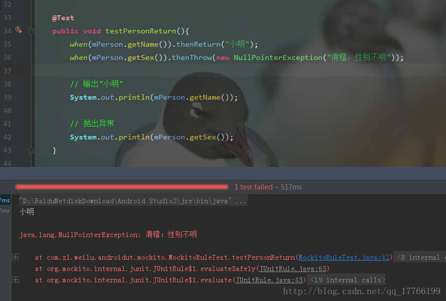
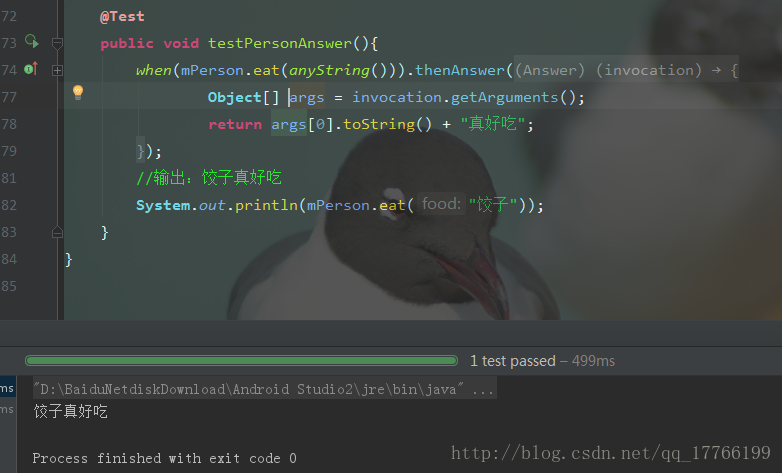
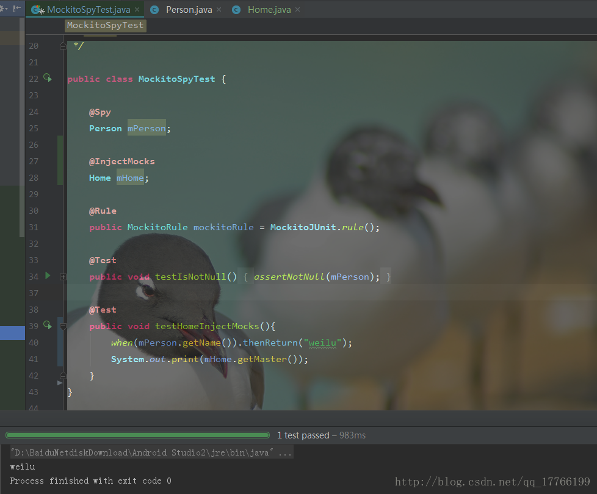

在实际的单元测试中，我们测试的类之间会有或多或少的耦合，导致我们无法顺利的进行测试，这时我们就可以使用[Mockito](https://github.com/mockito/mockito)，Mockito库能够Mock（我喜欢理解为**模拟**）对象，替换我们原先依赖的真实对象，这样我们就可以避免外部的影响，只测试本类，得到更准确的结果。当然它的功能不仅仅只是这些，例如TDD（测试驱动开发）也是一大亮点，下面我在详细说明。

## 1.Mockito介绍

使用时在build文件中添加依赖。

```
dependencies {
   testCompile "org.mockito:mockito-core:2.11.0"
}
```

### 1.四种Mock方式

- 普通方法：

```java
public class MockitoTest {

    @Test
    public void testIsNotNull(){
        Person mPerson = mock(Person.class); //<--使用mock方法

        assertNotNull(mPerson);
    }
}
```

- 注解方法：

```java
public class MockitoAnnotationsTest {

    @Mock //<--使用@Mock注解
    Person mPerson;

    @Before
    public void setup(){
        MockitoAnnotations.initMocks(this); //<--初始化
    }

    @Test
    public void testIsNotNull(){
        assertNotNull(mPerson);
    }

}
```

- 运行器方法：

```java
@RunWith(MockitoJUnitRunner.class) //<--使用MockitoJUnitRunner
public class MockitoJUnitRunnerTest {

    @Mock //<--使用@Mock注解
    Person mPerson;

    @Test
    public void testIsNotNull(){
        assertNotNull(mPerson);
    }

}
```

- MockitoRule方法

```java
public class MockitoRuleTest {

    @Mock //<--使用@Mock注解
    Person mPerson;

    @Rule //<--使用@Rule
    public MockitoRule mockitoRule = MockitoJUnit.rule();

    @Test
    public void testIsNotNull(){
        assertNotNull(mPerson);
    }

}
```

其中后两种方法是结合JUnit框架去实现的，JUnit具体可以参看我的这篇：[JUnit框架的使用](http://blog.csdn.net/qq_17766199/article/details/78243176)。四种方法根据个人习惯使用，我个人推荐使用最后一种。

### 2.常用打桩方法

因为`Mock`出的对象中非void方法都将返回默认值，比如`int`方法将返回0，对象方法将返回`null`等，而void方法将什么都不做。“打桩”顾名思义就是将我们`Mock`出的对象进行操作，比如提供模拟的返回值等，给`Mock`打基础。

| 方法名                           | 方法描述                 |
| -------------------------------- | ------------------------ |
| thenReturn(T value)              | 设置要返回的值           |
| thenThrow(Throwable… throwables) | 设置要抛出的异常         |
| thenAnswer(`Answer<?> answer`)   | 对结果进行拦截           |
| doReturn(Object toBeReturned)    | 提前设置要返回的值       |
| doThrow(Throwable… toBeThrown)   | 提前设置要抛出的异常     |
| doAnswer(Answer answer)          | 提前对结果进行拦截       |
| doCallRealMethod()               | 调用某一个方法的真实实现 |
| doNothing()                      | 设置void方法什么也不做   |

------



上图是个简单的例子，代码语义很明确，**当**执行什么方法时，**然后就**返回什么结果。当然如果我们不打桩，打印结果就是`null`和`0`了。

```java
doReturn("小小").when(mPerson).getName();
// 输出"小小"
System.out.println(mPerson.getName());
```

如果使用`doReturn`等打桩方法时，语义为：**以**什么结果返回，**当**执行什么方法时。这个两者的区别就是我们熟悉的while与do while。这类方法主要是为了应对无法使用`thenReturn`等方法的场景（比如方法为void），**可读性来说`thenReturn`这类更好。**

`thenAnswer`方法使用例子：



```java
public String eat(String food){
        return food;
}
```

eat方法很简单，吃什么吐什么。。。我们用`thenAnswer`拿到了吃进去的东西，将返回结果重新进行处理。

### 3.常用验证方法

> 前面所说的都是状态测试，但是如果不关心返回结果，而是关心方法有否被正确的参数调用过，这时候就应该使用验证方法了。从概念上讲，就是和状态测试所不同的“行为测试”了。

`verify(T mock)`验证发生的某些行为 。

| 方法名                               | 方法描述                             |
| ------------------------------------ | ------------------------------------ |
| after(long millis)                   | 在给定的时间后进行验证               |
| timeout(long millis)                 | 验证方法执行是否超时                 |
| atLeast(int minNumberOfInvocations)  | 至少进行n次验证                      |
| atMost(int maxNumberOfInvocations)   | 至多进行n次验证                      |
| description(String description)      | 验证失败时输出的内容                 |
| times(int wantedNumberOfInvocations) | 验证调用方法的次数                   |
| never()                              | 验证交互没有发生,相当于times(0)      |
| only()                               | 验证方法只被调用一次，相当于times(1) |

------

使用代码如下：

```java
 @Test
    public void testPersonVerifyAfter(){
        when(mPerson.getAge()).thenReturn(18);
        //延时1s验证
        System.out.println(mPerson.getAge());
        System.out.println(System.currentTimeMillis());
        verify(mPerson, after(1000)).getAge();
        System.out.println(System.currentTimeMillis());

        verify(mPerson, atLeast(2)).getAge();
    }

    @Test
    public void testPersonVerifyAtLeast(){
        mPerson.getAge();
        mPerson.getAge();
        //至少验证2次
        verify(mPerson, atLeast(2)).getAge();
    }

    @Test
    public void testPersonVerifyAtMost(){
        mPerson.getAge();
        //至多验证2次
        verify(mPerson, atMost(2)).getAge();
    }

    @Test
    public void testPersonVerifyTimes(){
        mPerson.getAge();
        mPerson.getAge();
        //验证方法调用2次
        verify(mPerson, times(2)).getAge();
    }

    @Test
    public void testPersonVerifyTimes(){
        mPerson.getAge();
        mPerson.getAge();
        //验证方法在100ms超时前调用2次
        verify(mPerson, timeout(100).times(2)).getAge();
    }
```

### 4.常用参数匹配器

| 方法名                                 | 方法描述                      |
| -------------------------------------- | ----------------------------- |
| anyObject()                            | 匹配任何对象                  |
| `any(Class<T> type)`                   | 与anyObject()一样             |
| any()                                  | 与anyObject()一样             |
| anyBoolean()                           | 匹配任何boolean和非空Boolean  |
| anyByte()                              | 匹配任何byte和非空Byte        |
| anyCollection()                        | 匹配任何非空Collection        |
| anyDouble()                            | 匹配任何double和非空Double    |
| anyFloat()                             | 匹配任何float和非空Float      |
| anyInt()                               | 匹配任何int和非空Integer      |
| anyList()                              | 匹配任何非空List              |
| anyLong()                              | 匹配任何long和非空Long        |
| anyMap()                               | 匹配任何非空Map               |
| anyString()                            | 匹配任何非空String            |
| contains(String substring)             | 参数包含给定的substring字符串 |
| argThat(`ArgumentMatcher <T> matcher`) | 创建自定义的参数匹配模式      |

------

示例代码：

```java
    @Test
    public void testPersonAny(){
        when(mPerson.eat(any(String.class))).thenReturn("米饭");
        //或
        //when(mPerson.eat(anyString())).thenReturn("米饭");

        //输出米饭
        System.out.println(mPerson.eat("面条"));

    }


    @Test
    public void testPersonContains(){

        when(mPerson.eat(contains("面"))).thenReturn("面条");
        //输出面条
        System.out.println(mPerson.eat("面"));

    }

    @Test
    public void testPersonArgThat(){

        //自定义输入字符长度为偶数时，输出面条。
        when(mPerson.eat(argThat(new ArgumentMatcher<String>() {
            @Override
            public boolean matches(String argument) {
                return argument.length() % 2 == 0;
            }
        }))).thenReturn("面条");
        //输出面条
        System.out.println(mPerson.eat("1234"));

    }
```

### 5.其他方法

| 方法名                     | 方法描述                         |
| -------------------------- | -------------------------------- |
| reset(T … mocks)           | 重置Mock                         |
| spy(`Class<T> classToSpy`) | 实现调用真实对象的实现           |
| inOrder(Object… mocks)     | 验证执行顺序                     |
| @InjectMocks注解           | 自动将模拟对象注入到被测试对象中 |

------

1.Spy的创建与mock一样，使用例子如下：

```java
public class MockitoSpyTest {

    @Spy
    Person mPerson;

    @Rule
    public MockitoRule mockitoRule = MockitoJUnit.rule();

    @Test
    public void testIsNotNull(){
        assertNotNull(mPerson);
    }

    @Test
    public void testPersonSpy(){
        //输出11
        System.out.print(mPerson.getAge());
    }

}
```

2.inOrder使用代码及测试结果：


3.@InjectMocks: 创建一个实例，这个实例需要的参数用@Mock（或@Spy）注解创建的注入到该实例中。

```java
public class Home {

    private Person mPerson;

    public Home(Person person) {
        mPerson = person;
    }

    public String getMaster(){
        return mPerson.getName();
    }
}
```



## 2.其他

Mockito框架不支持mock匿名类、final类、static方法、private方法。而[PowerMock](https://github.com/powermock/powermock)框架解决了这些问题。关于PowerMock，下一篇会讲到。本篇所有代码已上传至[Github](https://github.com/simplezhli/AndroidUT)。希望大家多多点赞支持！

## 3.参考

- [Mockito 中文文档](https://github.com/hehonghui/mockito-doc-zh)