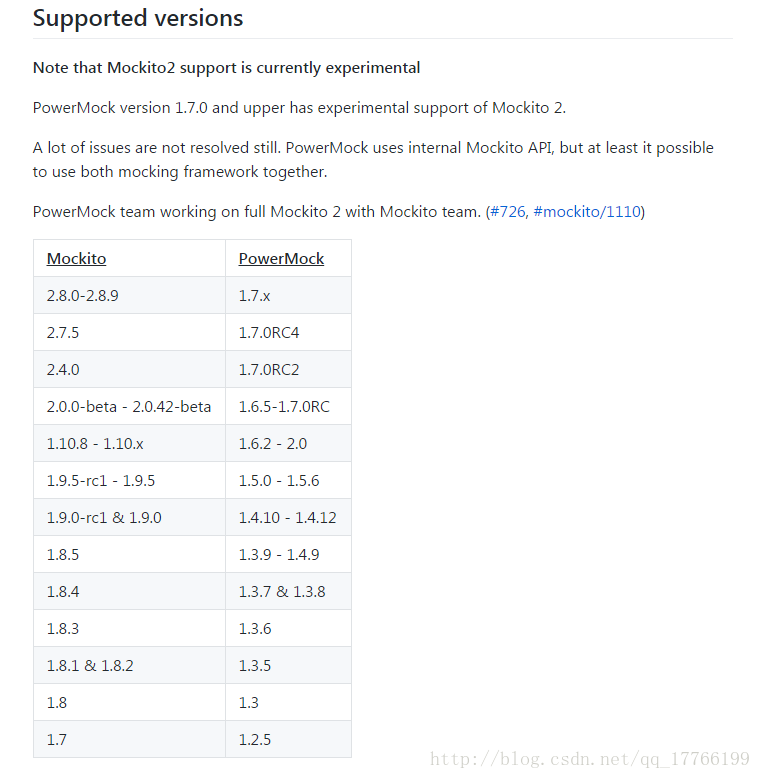

## 1.PowerMock选择

[PowerMock](https://github.com/powermock/powermock) ，它拓展了`Mockito`框架，从而支持了mock static方法、private方法、final方法与类等等。

`PowerMock` 主要围绕着 `Junit` 测试框架和 `TestNg` 测试框架，在安卓中我们常用`Junit + Mockito + PowerMock` 组合。既然`PowerMock`是拓展`Mockito`，所以使用时，我们要找到与`Mockito`对应的`PowerMock` 支持版本去使用。



这里我们使用如下对应版本：

```
testCompile "org.mockito:mockito-core:2.8.9"

testCompile "org.powermock:powermock-module-junit4:1.7.3"
testCompile "org.powermock:powermock-module-junit4-rule:1.7.3"
testCompile "org.powermock:powermock-api-mockito2:1.7.3" //注意这里是mockito2
testCompile "org.powermock:powermock-classloading-xstream:1.7.3"
```

## 2.PowerMock使用

首先我们定义一个`Fruit`类，`Banana`继承于它。其中有我们后面需要mock的static、private等方法。

```java
abstract class Fruit {

    private String fruit = "水果";

    public String getFruit() {
        return fruit;
    }
}

public class Banana extends Fruit{

    private static String COLOR = "黄色的";

    public Banana() {}

    public static String getColor() {
        return COLOR;
    }

    public String getBananaInfo() {
        return flavor() + getColor();
    }

    private String flavor() {
        return "甜甜的";
    }

    public final boolean isLike() {
        return true;
    }
}
```

### 1.mock静态方法

```java
@RunWith(PowerMockRunner.class)
public class PowerMockitoStaticMethodTest {

    @Test
    @PrepareForTest({Banana.class})
    public void testStaticMethod() { 
        PowerMockito.mockStatic(Banana.class); //<-- mock静态类
        Mockito.when(Banana.getColor()).thenReturn("绿色");
        Assert.assertEquals("绿色", Banana.getColor());
    }
}
```

首先使用`PowerMock`必须加注解`@PrepareForTest`和`@RunWith(PowerMockRunner.class)`。注解`@PrepareForTest`里写的是静态方法所在的类。

如果我们要更改类的私有static常量，比如修改`Banana`中的`COLOR`。

```java
@Test
@PrepareForTest({Banana.class})
public void testChangeColor() { 
    Whitebox.setInternalState(Banana.class, "COLOR", "红色的");
    Assert.assertEquals("红色的", Banana.getColor());
}
```

### 2.mock私有方法

```java
@RunWith(PowerMockRunner.class)
public class PowerMockitoPrivateMethodTest {

    @Test
    @PrepareForTest({Banana.class})
    public void testPrivateMethod() throws Exception {
        Banana mBanana = PowerMockito.mock(Banana.class);
        PowerMockito.when(mBanana.getBananaInfo()).thenCallRealMethod();
        PowerMockito.when(mBanana, "flavor").thenReturn("苦苦的");
        Assert.assertEquals("苦苦的黄色的", mBanana.getBananaInfo());
        //验证flavor是否调用了一次
        PowerMockito.verifyPrivate(mBanana).invoke("flavor"); 
    }
}
```

我们通过mock私有方法`flavor`，使得之前的“甜甜的”变为了“苦苦的”。当然我们也可以跳过私有方法，代码如下：

```java
    @Test
    @PrepareForTest({Banana.class})
    public void skipPrivateMethod() {
        Banana mBanana = new Banana();
        //跳过flavor方法
        PowerMockito.suppress(PowerMockito.method(Banana.class, "flavor")); 
        Assert.assertEquals("null黄色的", mBanana.getBananaInfo()); 
    }
```

因为跳过了`flavor`方法，最终输出结果为“null黄色的”。

如果我们要更改更改父类私有变量，比如修改`Fruit`中的`fruit`。

```java
    @Test
    @PrepareForTest({Banana.class})
    public void testChangeParentPrivate() throws Exception {
        Banana mBanana = new Banana();
        MemberModifier.field(Banana.class, "fruit").set(mBanana, "蔬菜");
        Assert.assertEquals("蔬菜", mBanana.getFruit());
    }
```

### 3.mock final方法

```java
@RunWith(PowerMockRunner.class)
public class PowerMockitoFinalMethodTest {

    @Test
    @PrepareForTest({Banana.class})
    public void testFinalMethod() throws Exception {
        Banana mBanana = PowerMockito.mock(Banana.class);
        PowerMockito.when(mBanana.isLike()).thenReturn(false);
        Assert.assertFalse(mBanana.isLike());
    }
}
```

使用方法和使用`mockito`一样，但是我们通过`PowerMock`，成功修改了`isLike`方法的返回值。

### 4.mock 构造方法

```java
    @Test
    @PrepareForTest({Banana.class})
    public void testNewClass() throws Exception {
        Banana mBanana = PowerMockito.mock(Banana.class);
        PowerMockito.when(mBanana.getBananaInfo()).thenReturn("大香蕉");
        //如果new新对象，则返回这个上面设置的这个对象
        PowerMockito.whenNew(Banana.class).withNoArguments().thenReturn(mBanana);
        //new新的对象
        Banana newBanana = new Banana();
        Assert.assertEquals("大香蕉", newBanana.getBananaInfo());
    }
```

`whenNew` 方法的意思是之后 new 这个对象时，返回某个被 Mock 的对象而不是让真的 new 新的对象。如果构造方法有参数，可以在`withNoArguments`方法中传入。

### 5.其他

上面我们有说到使用`PowerMock`就必须加`@RunWith(PowerMockRunner.class)`，但是我们毕竟有时会使用多个测试框架，可能`@RunWith`会占用。这时我们可以使用`@Rule`。代码如下：

```java
@Rule
public PowerMockRule rule = new PowerMockRule();
```

记住使用这种方法需要加入依赖：

```
testCompile "org.powermock:powermock-module-junit4-rule:1.7.3"
testCompile "org.powermock:powermock-classloading-xstream:1.7.3"
```

------

本篇所有代码已上传至[Github](https://github.com/simplezhli/AndroidUT)。希望大家多多点赞支持！

—2018.01.24补充：

`@PowerMockIgnore`用于忽略mock的类，常见的写法是：

```
@PowerMockIgnore({ "org.mockito.*", "org.robolectric.*", "android.*" })
```

忽略`android`的相关类，因为我们使用`Robolectric`处理了。
忽略`Mockito`和`Robolectric`的相关类，因为我们不应该mock它们自己。

## 3.参考

- [powermock文档](https://github.com/powermock/powermock/wiki/Mockito)
- [PowerMock处理特殊的单元测试](http://blog.csdn.net/j16421881/article/details/78511058)