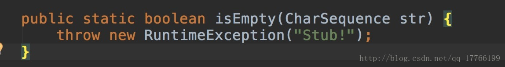
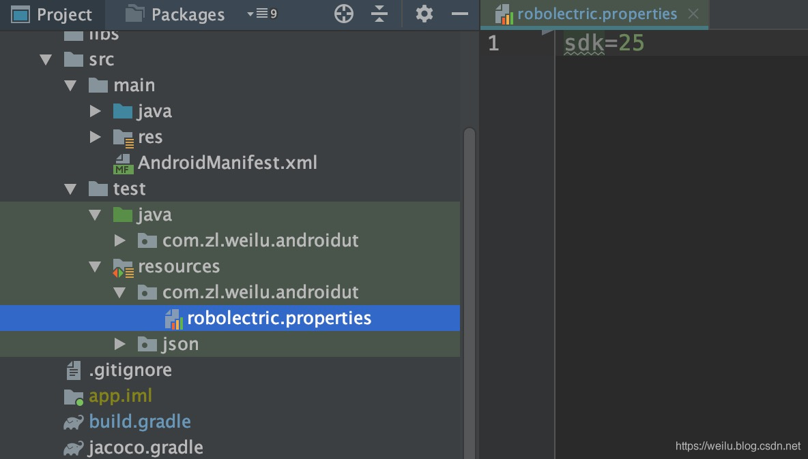
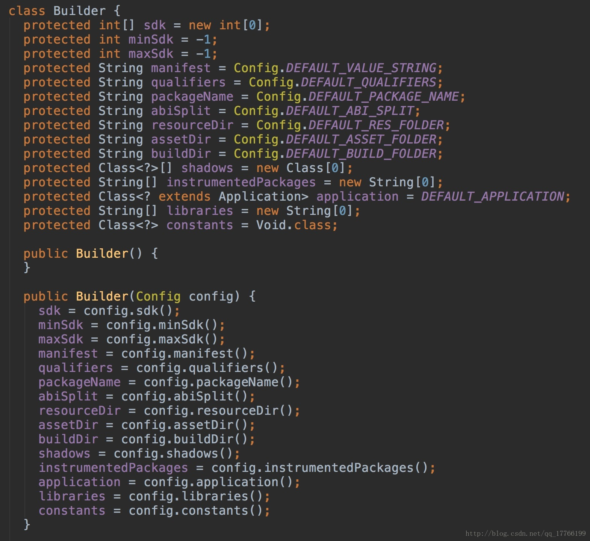
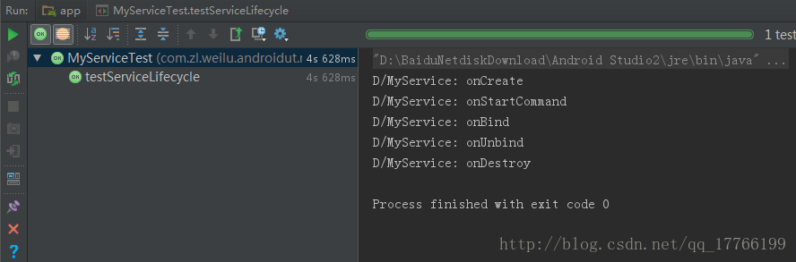
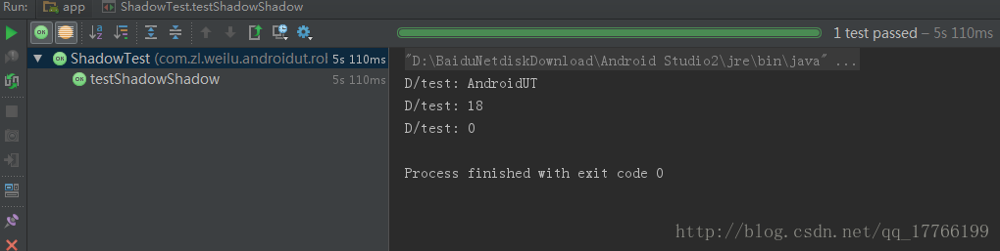

> 学习了前三篇有关单元测试的内容，你会发现好像和Android没有什么关系，都是Java。因为文章中的例子并没有使用到Android中所特有的组件和方法。之所以没有涉及，是因为我们使用的Android的方法依赖android.jar包。而这些方法都是stub的，没有具体的实现。比如常用的方法`TextUtils.isEmpty()`：



> 开发工具提供了我们开发和编译的JVM环境，要运行app需要Dalvik或ART环境。而单元测试的是一个运行过程，我们没有相应的环境，所以运行依赖android.jar包的方法时将会抛出`RuntimeException("stub!")`。那么怎么办呢？使用[Robolectric](https://github.com/robolectric/robolectric)可以解决此类问题，它通过实现一套JVM能运行的Android代码，从而做到脱离Android运行环境进行测试。

## 1.Robolectric配置

首先升级`Robolectric`的依赖至最新：

```java
testImplementation "org.robolectric:robolectric:4.3.1"
```

在根目录的`gradle.properties`文件中添加：

```java
android.enableUnitTestBinaryResources=true
```

之前的配置中，需要通过`@Config`注解指定`constants = BuildConfig.class`，也可指定sdk的版本信息：

```java
@RunWith(RobolectricTestRunner.class)
@Config(constants = BuildConfig.class, sdk = 23)
public class MainActivityTest {

}
```

在4.0开始的版本中，默认不需要指定`constants = BuildConfig.class`，`constants`配置也被移除，所以默认可以去除`@Config`的这行固定配置。

如果要指定sdk版本的话，可以在`src/test/resources`目录下创建一个名为`robolectric.properties`的文件在你所要生效的包名下。其中更深的包中的值覆盖更浅的包中的值。当测试类或方法有`@Config`注释，这些注释覆盖属性文件中的任何配置。具体如下图所示：


这样相比之前的方式确实友好很多。详细配置及其他用法可以[参看官方文档](http://robolectric.org/configuring/)。

## 2.Robolectric使用

```java
@RunWith(RobolectricTestRunner.class)
@Config(constants = BuildConfig.class, sdk = 23)
public class MainActivityTest {

}
```

指定测试运行器为`RobolectricTestRunner`。通过`@Config`指定`constants = BuildConfig.class`。这样默认的配置以我们项目中的为准，当然你可以通过`@Config`单独去设置以下配置。



**目前`Robolectric`最高支持sdk版本为23。**

### 1.日志输出

之前几篇文章中，我们的日志输出都是采用`System.out.print()`，但是在Android开发中，我们使用`Log`会更多。但是单元测试中无法输出Log信息。这时我们可以使用`ShadowLog`：

```java
    @Before
    public void setUp(){
        //输出日志
        ShadowLog.stream = System.out;
    }
```

这样 Log日志都将输出在控制面板中。

### 2.创建Activity

```java
@RunWith(RobolectricTestRunner.class)
@Config(constants = BuildConfig.class, sdk = 23)
public class MainActivityTest {

    private MainActivity mainActivity;

    @Before
    public void setUp(){
        mainActivity = Robolectric.setupActivity(MainActivity.class);
    }

    /**
     * 创建Activity测试
     */
    @Test
    public void testMainActivity() {
        assertNotNull(mainActivity);
    }
```

当 `Robolectric.setupActivity`返回的时候，默认会调用Activity的生命周期: onCreate -> onStart -> onResume。

### 3.Activity跳转验证

功能代码：

```java
    public void jump(View view){
        startActivity(new Intent(this, LoginActivity.class));
    }
```

测试代码：

```java
    @Test
    public void testJump() throws Exception {

        // 触发按钮点击
        mJumpBtn.performClick();

        // 获取对应的Shadow类
        ShadowActivity shadowActivity = Shadows.shadowOf(mainActivity);
        // 借助Shadow类获取启动下一Activity的Intent
        Intent nextIntent = shadowActivity.getNextStartedActivity();
        // 校验Intent的正确性
        assertEquals(nextIntent.getComponent().getClassName(), LoginActivity.class.getName());
    }
```

### 4.验证Toast

功能代码：

```java
    public void showToast(View view){
        Toast.makeText(this,"Hello UT!",Toast.LENGTH_LONG).show();
    }
```

测试代码：

```java
    @Test
    public void testToast() throws Exception {
        Toast toast = ShadowToast.getLatestToast();
        // 判断Toast尚未弹出
        assertNull(toast);

        mToastBtn.performClick();
        toast = ShadowToast.getLatestToast();
        // 判断Toast已经弹出
        assertNotNull(toast);
        // 获取Shadow类进行验证
        ShadowToast shadowToast = Shadows.shadowOf(toast);
        assertEquals(Toast.LENGTH_LONG, shadowToast.getDuration());
        assertEquals("Hello UT!", ShadowToast.getTextOfLatestToast());
    }
```

### 5. 验证Dialog

功能代码：

```java
    public void showDialog(View view){
        AlertDialog alertDialog = new AlertDialog.Builder(this)
                .setMessage("Hello UT！")
                .setTitle("提示")
                .create();
        alertDialog.show();
    }
```

测试代码：

```java
    @Test
    public void testDialog() throws Exception {
        AlertDialog dialog = ShadowAlertDialog.getLatestAlertDialog();
        // 判断Dialog尚未弹出
        assertNull(dialog);

        mDialogBtn.performClick();
        dialog = ShadowAlertDialog.getLatestAlertDialog();
        // 判断Dialog已经弹出
        assertNotNull(dialog);
        // 获取Shadow类进行验证
        ShadowAlertDialog shadowDialog = Shadows.shadowOf(dialog);
        assertEquals("Hello UT！", shadowDialog.getMessage());
    }
```

### 6.UI组件状态验证

功能代码：点击button改变CheckBox状态。

```java
    public void inverse(View view){
        checkbox.setChecked(!checkbox.isChecked());
    }
```

测试代码：

```java
    @Test
    public void testCheckBoxState() throws Exception {

        // 验证CheckBox初始状态
        assertFalse(checkBox.isChecked());

        // 点击按钮反转CheckBox状态
        mInverseBtn.performClick();
        // 验证状态是否正确
        assertTrue(checkBox.isChecked());

        // 点击按钮反转CheckBox状态
        mInverseBtn.performClick();
        // 验证状态是否正确
        assertFalse(checkBox.isChecked());
    }
```

### 7.验证Fragment

```java
    @Test
    public void testFragment() {
        SampleFragment sampleFragment = new SampleFragment();
        //添加Fragment到Activity中，会触发Fragment的onCreateView()
        SupportFragmentTestUtil.startFragment(sampleFragment);
        assertNotNull(sampleFragment.getView());
    }
```

### 8.访问资源文件

使用`RuntimeEnvironment.application`可以获取到`Application`，方便我们使用。比如访问资源文件。

```java
    @Test
    public void testResources() {
        Application application = RuntimeEnvironment.application;
        String appName = application.getString(R.string.app_name);
        assertEquals("AndroidUT", appName);
    }
```

### 9.Activity生命周期

利用ActivityController我们可以让Activity执行相应的生命周期方法，如：

```java
    public String getLifecycleState(){
        return lifecycle;
    }

    @Override
    protected void onStart() {
        super.onStart();
        lifecycle = "onStart";
    }

    @Override
    protected void onResume() {
        super.onResume();
        lifecycle = "onResume";
    }

    @Override
    protected void onPause() {
        super.onPause();
        lifecycle = "onPause";
    }

    @Override
    protected void onStop() {
        super.onStop();
        lifecycle = "onStop";
    }

    @Override
    protected void onRestart() {
        super.onRestart();
        lifecycle = "onRestart";
    }

    @Override
    protected void onDestroy() {
        super.onDestroy();
        lifecycle = "onDestroy";
    }
```

测试代码：

```java
    @Test
    public void testLifecycle() throws Exception {
        // 创建Activity控制器
        ActivityController<MainActivity> controller = Robolectric.buildActivity(MainActivity.class);
        MainActivity activity = controller.get();
        assertNull(activity.getLifecycleState());

        // 调用Activity的performCreate方法
        controller.create();
        assertEquals("onCreate", activity.getLifecycleState());

        // 调用Activity的performStart方法
        controller.start();
        assertEquals("onStart", activity.getLifecycleState());

        // 调用Activity的performResume方法
        controller.resume();
        assertEquals("onResume", activity.getLifecycleState());

        // 调用Activity的performPause方法
        controller.pause();
        assertEquals("onPause", activity.getLifecycleState());

        // 调用Activity的performStop方法
        controller.stop();
        assertEquals("onStop", activity.getLifecycleState());

        // 调用Activity的performRestart方法
        controller.restart();
        // 注意此处应该是onStart，因为performRestart不仅会调用restart，还会调用onStart
        assertEquals("onStart", activity.getLifecycleState());

        // 调用Activity的performDestroy方法
        controller.destroy();
        assertEquals("onDestroy", activity.getLifecycleState());
    }
```

### 10.验证BroadcastReceiver

首先是广播的实现，收到广播后我们接收`name`，并保存至`SharedPreferences`。

```java
public class MyReceiver extends BroadcastReceiver {

    public static final String NAME = "name";

    @Override
    public void onReceive(Context context, Intent intent) {
        SharedPreferences.Editor editor = PreferenceManager.getDefaultSharedPreferences(context).edit();
        String name = intent.getStringExtra(NAME);
        editor.putString(NAME, name);
        editor.apply();
    }
}
```

`AndroidManifest.xml`中注册：

```xml
     <receiver
          android:name=".broadcast.MyReceiver"
          android:enabled="true"
          android:exported="false">
          <intent-filter>
              <action android:name="com.zl.weilu.androidut" />
          </intent-filter>
     </receiver>
```

测试代码：

```java
@RunWith(RobolectricTestRunner.class)
@Config(constants = BuildConfig.class, sdk = 23)
public class MyReceiverTest{

    private final String action = "com.zl.weilu.androidut";

    @Test
    public void testRegister() throws Exception {
        ShadowApplication shadowApplication = ShadowApplication.getInstance();
        Intent intent = new Intent(action);
        // 验证是否注册了相应的Receiver
        assertTrue(shadowApplication.hasReceiverForIntent(intent));
    }

    @Test
    public void testReceive() throws Exception {
        //发送广播
        Intent intent = new Intent(action);
        intent.putExtra(MyReceiver.NAME, "AndroidUT");
        MyReceiver myReceiver = new MyReceiver();
        myReceiver.onReceive(RuntimeEnvironment.application, intent);
        //验证广播的处理逻辑是否正确
        SharedPreferences preferences = PreferenceManager.getDefaultSharedPreferences(RuntimeEnvironment.application);
        assertEquals( "AndroidUT", preferences.getString(MyReceiver.NAME, ""));
    }
}
```

### 11.Service验证

使用方式和Activity类似：

```java
public class MyService extends Service {

    private final String TAG = "MyService";

    @Nullable
    @Override
    public IBinder onBind(Intent intent) {
        Log.d(TAG, "onBind");
        return null;
    }

    @Override
    public void onCreate() {
        super.onCreate();
        Log.d(TAG, "onCreate");
    }

    @Override
    public boolean onUnbind(Intent intent) {
        Log.d(TAG, "onUnbind");
        return super.onUnbind(intent);
    }

    @Override
    public void onDestroy() {
        super.onDestroy();
        Log.d(TAG, "onDestroy");
    }

    @Override
    public int onStartCommand(Intent intent, int flags, int startId) {
        Log.d(TAG, "onStartCommand");
        return super.onStartCommand(intent, flags, startId);
    }
}
```

测试代码：

```java
@RunWith(RobolectricTestRunner.class)
@Config(constants = BuildConfig.class, sdk = 23)
public class MyServiceTest {

    private ServiceController<MyService> controller;
    private MyService mService;

    @Before
    public void setUp() throws Exception {
        ShadowLog.stream = System.out;
        controller = Robolectric.buildService(MyService.class);
        mService = controller.get();
    }

    /**
     * 控制Service生命周期进行验证
     *
     * @throws Exception
     */
    @Test
    public void testServiceLifecycle() throws Exception {
        controller.create();
        controller.startCommand(0, 0);
        controller.bind();
        controller.unbind();
        controller.destroy();
    }
}
```

测试结果：



## 3.Shadow的使用

我们一开始说过，`Robolectric`通过实现一套JVM能运行的Android代码，从而做到脱离Android运行环境进行测试。实际上使用的就是`Shadow`，比如之前例子中的`ShadowActivity`、`ShadowLog`、`ShadowAlertDialog`等。`Shadow`在实现的同时，帮我拓展了原本的Android代码，实现了许多便于测试的功能，比如例子中用到的 `getNextStartedActivity`、`ShadowToast.getTextOfLatestToast()`、`ShadowAlertDialog.getLatestAlertDialog()`。当然不止这么多，`Robolectric`提供了大量的`Shadow`方便我们的使用。

原始`Person`

```java
public class Person {

    private String name;
    private int sex;

    public String getName() {
        return name;
    }

    public void setName(String name) {
        this.name = name;
    }

    public int getSex() {
        return sex;
    }

    public void setSex(int sex) {
        this.sex = sex;
    }

    public int getAge(){
        return 11;
    }

    public String eat(String food){
        return food;
    }
}
```

创建`Person`的`Shadow`对象`ShadowPerson`，实现与原始类方法名一致的方法，`Shadow`方法需用`@Implementation`进行注解。

```java
@Implements(Person.class)
public class ShadowPerson {

    @Implementation
    public String getName() {
        return "AndroidUT";
    }

    @Implementation
    public int getSex() {
        return 0;
    }

    @Implementation
    public int getAge(){
        return 18;
    }
}
```

在`Config`注解中添加`shadows`参数，指定对应的`Shadow`

```java
@RunWith(RobolectricTestRunner.class)
@Config(constants = BuildConfig.class,
        sdk = 23,
        shadows = {ShadowPerson.class})
public class ShadowTest {

    @Before
    public void setUp() {
        ShadowLog.stream = System.out;
    }

    @Test
    public void testShadowShadow(){
        Person person = new Person();
        //实际上调用的是ShadowPerson的方法
        Log.d("test", person.getName());
        Log.d("test", String.valueOf(person.getAge()));
        Log.d("test", String.valueOf(person.getSex()));

        //获取Person对象对应的Shadow对象
        ShadowPerson shadowPerson = extract(person);
        assertEquals("AndroidUT", shadowPerson.getName());
        assertEquals(18, shadowPerson.getAge());
        assertEquals(0, person.getSex());
    }
}
```

测试结果：



本篇所有代码已上传至[Github](https://github.com/simplezhli/AndroidUT)。希望大家多多点赞支持！

## 4.参考

- [Robolectric使用教程](http://blog.hanschen.site/2016/12/10/robolectric.html)