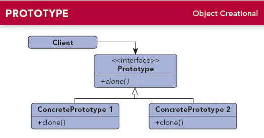
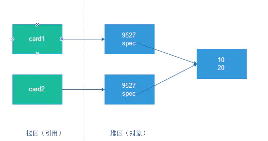
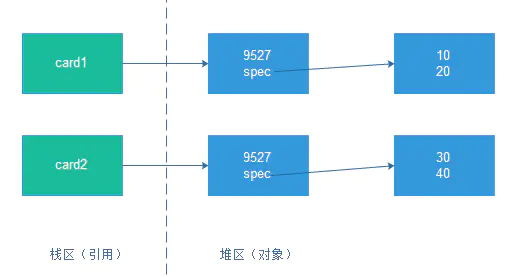

### 1.定义

用原型实例指定创建对象的种类，并**通过拷贝这些原型创建新的对象**。

### 2.介绍

- 原型模式属于创建型模式。
- 一个已存在的对象（即原型），通过复制原型的方式来创建一个内部属性跟原型都一样的新的对象，这就是原型模式。
- 原型模式的核心是clone方法，通过clone方法来实现对象的拷贝。

### 3.UML类图



#### 3.1 角色说明：

- Prototype（抽象原型类）：抽象类或者接口，用来声明clone方法。
- ConcretePrototype1、ConcretePrototype2（具体原型类）：即要被复制的对象。
- Client（客户端类）：即要使用原型模式的地方。

### 4.实现

##### 4.1 Prototype（抽象原型类）

- 通常情况下，Prototype是不需要我们去定义的。因为拷贝这个操作十分常用，Java中提供了Cloneable接口来支持拷贝操作，它就是原型模式中的Prototype。
- 当然，原型模式也未必非得去实现Cloneable接口，也有其他的实现方式。

##### 4.2 创建具体原型类

实现Cloneable接口：

```java
//具体原型类,卡片类
public class Card implements Cloneable {//实现Cloneable接口，Cloneable只是标识接口
    private int num;//卡号

    private Spec spec = new Spec();//卡规格

    public Card() {
        System.out.println("Card 执行构造函数");
    }

    public void setNum(int num) {
        this.num = num;
    }

    public void setSpec(int length, int width) {
        spec.setLength(length);
        spec.setWidth(width);
    }

    @Override
    public String toString() {
        return "Card{" +
                "num=" + num +
                ", spec=" + spec +
                '}';
    }

    @Override
    protected Card clone() throws CloneNotSupportedException {//重写clone()方法，clone()方法不是Cloneable接口里面的，而是Object里面的
            System.out.println("clone时不执行构造函数");
            return (Card) super.clone();
    }
}

//规格类，有长和宽这两个属性
public class Spec {
    private int width;
    private int length;

    public void setLength(int length) {
        this.length = length;
    }

    public void setWidth(int width) {
        this.width = width;
    }

    @Override
    public String toString() {
        return "Spec{" +
                "width=" + width +
                ", length=" + length +
                '}';
    }
}
```

##### 4.3 创建客户端类

即要使用原型模式的地方：

```java
    public class Client {
        public void test() throws CloneNotSupportedException {
        
            Card card1 = new Card();
            card1.setNum(9527);
            card1.setSpec(10, 20);
            System.out.println(card1.toString());
            System.out.println("----------------------");

            Card card2 = card1.clone();
            System.out.println(card2.toString());
            System.out.println("----------------------");
        }
    }
```

##### 输出结果：

```java
Card 执行构造函数
Card{num=9527, spec=Spec{width=20, length=10}}
----------------------
clone时不执行构造函数
Card{num=9527, spec=Spec{width=20, length=10}}
----------------------
```

##### 说明：

1. **clone对象时不会执行构造函数**
2. clone方法不是Cloneable接口中的，而是Object中的方法。Cloneable是个标识接口，表面了这个对象是可以拷贝的，如果没有实现Cloneable接口却调用clone方法则会报错。

但是，如果执行下面的代码：

```java
    Card card1 = new Card();
    card1.setNum(9527);
    card1.setSpec(10, 20);
    System.out.println(card1.toString());
    System.out.println("----------------------");

    Card card2 = card1.clone();
    System.out.println(card2.toString());
    System.out.println("----------------------");

    card2.setNum(7259);
    System.out.println(card1.toString());
    System.out.println(card2.toString());
    System.out.println("----------------------");

    card2.setSpec(30, 40);
    System.out.println(card1.toString());
    System.out.println(card2.toString());
    System.out.println("----------------------");
```

##### 其输出结果为：

```java
Card 执行构造函数
Card{num=9527, spec=Spec{width=20, length=10}}
----------------------
clone时不执行构造函数
Card{num=9527, spec=Spec{width=20, length=10}}
----------------------
Card{num=9527, spec=Spec{width=20, length=10}}
Card{num=7259, spec=Spec{width=20, length=10}}
----------------------
Card{num=9527, spec=Spec{width=40, length=30}}
Card{num=7259, spec=Spec{width=40, length=30}}
----------------------
```

我们会发现，修改了拷贝对象的引用类型（即Spec字段）时，原来的对象的值也跟着改变了；但是修改基本对象（num字段）时，原来的对象的值却不会改变。这就涉及到深拷贝和浅拷贝了。

### 5. 深拷贝和浅拷贝

#### 5.1 浅拷贝

上面的例子实际上就是一个浅拷贝，如下图所示：



由于num是基本数据类型，因此直接将整数值拷贝过来就行。但是spec是Spec类型的， 它只是一个引用，指向一个真正的Spec对象，那么对它的拷贝有两种方式：

1. 直接将源对象中的spec的引用值拷贝给新对象的spec字段，这种拷贝方式就叫浅拷贝。

#### 5.2 深拷贝

另外一种拷贝方式就是根据原Card对象中的spec指向的对象创建一个新的相同的对象，将这个新对象的引用赋给新拷贝的Card对象的spec字段。这种拷贝方式就叫深拷贝，如下图所示：



#### 5.3 原型模式改造

那么，我们对上面原型模式的例子进行改造，使其实现深拷贝，这就需要在Card的clone方法中，将源对象引用的Spec对象也clone一份。

```java
    public static class Card implements Cloneable {
        private int num;

        private Spec spec = new Spec();

        public Card() {
            System.out.println("Card 执行构造函数");
        }

        public void setNum(int num) {
            this.num = num;
        }

        public void setSpec(int length, int width) {
            spec.setLength(length);
            spec.setWidth(width);
        }

        @Override
            public String toString() {
            return "Card{" +
                "num=" + num +
                ", spec=" + spec +
                '}';
        }

        @Override
            protected Card clone() throws CloneNotSupportedException {
            System.out.println("clone时不执行构造函数");
            Card card = (Card) super.clone();
            card.spec = (Spec) spec.clone();//对spec对象也调用clone，实现深拷贝
            return card;
        }

    }

    public static class Spec implements Cloneable {//Spec也实现Cloneable接口
        private int width;
        private int length;

        public void setLength(int length) {
            this.length = length;
        }

        public void setWidth(int width) {
            this.width = width;
        }

        @Override
            public String toString() {
            return "Spec{" +
                "width=" + width +
                ", length=" + length +
                '}';
        }

        @Override
            protected Spec clone() throws CloneNotSupportedException {//重写Spec的clone方法
            return (Spec) super.clone();
        }
    }
```

测试代码：

```java
    Card card1 = new Card();
    card1.setNum(9527);
    card1.setSpec(10, 20);
    System.out.println(card1.toString());
    System.out.println("----------------------");

    Card card2 = card1.clone();
    System.out.println(card2.toString());
    System.out.println("----------------------");

    card2.setNum(7259);
    System.out.println(card1.toString());
    System.out.println(card2.toString());
    System.out.println("----------------------");

    card2.setSpec(30, 40);
    System.out.println(card1.toString());
    System.out.println(card2.toString());
    System.out.println("----------------------");
```

其输出结果为：

```java
Card 执行构造函数
Card{num=9527, spec=Spec{width=20, length=10}}
----------------------
clone时不执行构造函数
Card{num=9527, spec=Spec{width=20, length=10}}
----------------------
Card{num=9527, spec=Spec{width=20, length=10}}
Card{num=7259, spec=Spec{width=20, length=10}}
----------------------
Card{num=9527, spec=Spec{width=20, length=10}}
Card{num=7259, spec=Spec{width=40, length=30}}
----------------------
```

由此可见，card1和card2内的spec引用指向了不同的Spec对象， 也就是说在clone Card对象的同时，也拷贝了它所引用的Spec对象， 进行了深拷贝。

### 6. 应用场景

- 如果初始化一个类时需要耗费较多的资源，比如数据、硬件等等，可以使用原型拷贝来避免这些消耗。
- 通过new创建一个新对象时如果需要非常繁琐的数据准备或者访问权限，那么也可以使用原型模式。
- 一个对象需要提供给其他对象访问，而且各个调用者可能都需要修改其值时，可以拷贝多个对象供调用者使用，即保护性拷贝。

### 7. 优点

- 可以解决复杂对象创建时消耗过多的问题，在某些场景下提升创建对象的效率。
- 保护性拷贝，可以防止外部调用者对对象的修改，保证这个对象是只读的。

### 8. 缺点

- 拷贝对象时不会执行构造函数。
- 有时需要考虑深拷贝和浅拷贝的问题。

### 9. Android中的源码分析

Android中的Intent就实现了Cloneable接口，但是clone()方法中却是通过new来创建对象的。

```java
 public class Intent implements Parcelable, Cloneable {
        //其他代码略
        @Override
        public Object clone() {
            return new Intent(this);//这里没有调用super.clone()来实现拷贝，而是直接通过new来创建
        }

        public Intent(Intent o) {
            this.mAction = o.mAction;
            this.mData = o.mData;
            this.mType = o.mType;
            this.mPackage = o.mPackage;
            this.mComponent = o.mComponent;
            this.mFlags = o.mFlags;
            this.mContentUserHint = o.mContentUserHint;
            if (o.mCategories != null) {
                this.mCategories = new ArraySet<String>(o.mCategories);
            }
            if (o.mExtras != null) {
                this.mExtras = new Bundle(o.mExtras);
            }
            if (o.mSourceBounds != null) {
                this.mSourceBounds = new Rect(o.mSourceBounds);
            }
            if (o.mSelector != null) {
                this.mSelector = new Intent(o.mSelector);
            }
            if (o.mClipData != null) {
                this.mClipData = new ClipData(o.mClipData);
            }
        }
    }
```

总结 ：

- 实际上，调用clone()构造对象时并不一定比new快，使用clone()还是new来创建对象需要根据构造对象的成本来决定，如果对象的构造成本比较高或者构造比较麻烦，那么使用clone()的效率比较高，否则使用new。

