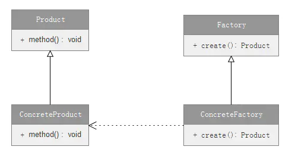

#### 1.定义

定义一个用于创建对象的接口，让子类决定实例化哪个类。

#### 2.介绍

- 工厂方法模式属于创建型模式。
- 工厂方法模式主要用来创建复杂的对象，简单对象能够使用new来创建就不用工厂方法模式来创建了。

#### 3.UML类图



工厂方法模式UML类图.png

##### 角色说明：

- Product（抽象产品类）：要创建的复杂对象，定义对象的公共接口。
- ConcreteProduct（具体产品类）：实现Product接口。
- Factory（抽象工厂类）：该方法返回一个Product类型的对象。
- ConcreteFactory（具体工厂类）：返回ConcreteProduct实例。

#### 4.实现

##### 4.1 创建抽象产品类，定义公共接口：

```java
    //抽象产品类
    public abstract class Product {
        public abstract void show();
    }
```

##### 4.2 创建具体产品类，继承Product类：

```java
    //具体产品类A 
    public class ProductA extends Product {
        @Override
        public void show() {
            System.out.println("product A");
        }
    }
    //具体产品类B
    public class ProductB extends Product {
        @Override
        public void show() {
            System.out.println("product B");
        }
    }
```

##### 4.3 创建抽象工厂类，定义公共接口：

```java
    //抽象工厂类
    public abstract class Factory {
        public abstract Product create();
    }
```

##### 4.4 创建具体工厂类，继承抽象工厂类，实现创建具体的产品：

```java
    //具体工厂类A
    public class FactoryA extends Factory {
        @Override
        public Product create() {
            return new ProductA();//创建ProductA
        }
    }
    //具体工厂类B
    public class FactoryB extends Factory {
        @Override
        public Product create() {
            return new ProductB();//创建ProductB
        }
    }
```

##### 4.5 测试方法：

```java
 public void test() {
        //产品A
        Factory factoryA = new FactoryA();
        Product productA = factoryA.create();
        productA.show();
        //产品B
        Factory factoryB = new FactoryB();
        Product productB = factoryB.create();
        productB.show();
    }
```

#### 5.应用场景

- 生成复杂对象时，无需知道具体类名，只需知道相应的工厂方法即可。

#### 6.优点

- 符合**开放封闭原则**。新增产品时，只需增加相应的具体产品类和相应的工厂子类即可。
- 符合**单一职责原则**。每个具体工厂类只负责创建对应的产品。

#### 7.缺点

- 一个具体工厂只能创建一种具体产品。
- 增加新产品时，还需增加相应的工厂类，系统类的个数将成对增加，增加了系统的复杂度和性能开销。
- 引入的抽象类也会导致类结构的复杂化。

#### 8.Android中的源码分析

Android中的ThreadFactory就是使用了工厂方法模式来生成线程的，线程就是ThreadFactory的产品。

##### 8.1 ThreadFactory相关源码分析

```java
    //抽象产品:Runnable
    public interface Runnable {
        public abstract void run();
    }
    
    //具体产品:Thread
    public class Thread implements Runnable {
        //构造方法
        public Thread(Runnable target, String name) {
            init(null, target, name, 0);
        }
        
        @Override
        //实现抽象产品的抽象方法
        public void run() {
            if (target != null) {
                target.run();
            }
        }
        
        //其他代码略
    }
    
    
    //抽象工厂：ThreadFactory
    public interface ThreadFactory {
        Thread newThread(Runnable r);
    }
    
    //具体工厂：AsyncTask中的实现
    private static final ThreadFactory sThreadFactory = new ThreadFactory() {
        private final AtomicInteger mCount = new AtomicInteger(1);
        
        //实现抽象工厂的抽象方法
        public Thread newThread(Runnable r) {
            return new Thread(r, "AsyncTask #" + mCount.getAndIncrement());//返回Thread这个产品
        }
    };
```

##### 8.2 总结：

- 这里只要是介绍Android系统中工厂方法模式的应用，线程和AsyncTask的原理就不说了。
- 通过ThreadFactory，我们可以创建出不同的Thread来。
- 同样，我们可以创建另外类似的工厂，生产某种专门的线程，非常容易扩展。

