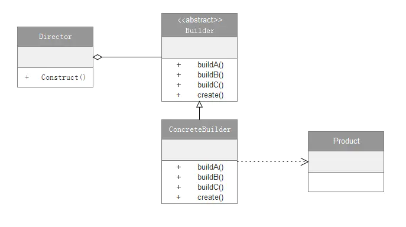

#### 1.定义

将一个复杂对象的构建与它的表示分离，使得同样的构建过程可以创建不同的表示。

#### 2.介绍

- 建造者模式属于创建型模式。
- 建造者模式主要用来创建复杂的对象，用户可以不用关心其建造过程和细节。
- 例如：当要组装一台电脑时，我们选择好CPU、内存、硬盘等等，然后交给装机师傅，装机师傅就把电脑给组装起来，我们不需要关心是怎么拼装起来的。

#### 3.UML类图



##### 角色说明：

- Product（产品类）：要创建的复杂对象。在本类图中，产品类是一个具体的类，而非抽象类。实际编程中，产品类可以是由一个抽象类与它的不同实现组成，也可以是由多个抽象类与他们的实现组成。
- Builder（抽象建造者）：创建产品的抽象接口，一般至少有一个创建产品的抽象方法和一个返回产品的抽象方法。引入抽象类，是为了更容易扩展。
- ConcreteBuilder（实际的建造者）：继承Builder类，实现抽象类的所有抽象方法。实现具体的建造过程和细节。
- Director（指挥者类）：分配不同的建造者来创建产品，统一组装流程。

#### 4.实现

##### 4.1 定义具体的产品类（Product）：电脑

```java
public class Computer {
    private String mCPU;
    private String mMemory;
    private String mHD;

    public void setCPU(String CPU) {
        mCPU = CPU;
    }

    public void setMemory(String memory) {
        mMemory = memory;
    }

    public void setHD(String HD) {
        mHD = HD;
    }
}
```

##### 4.2 定义抽象建造者（Builder）：组装电脑的过程

```java
public abstract class Builder {
    public abstract void buildCPU(String cpu);//组装CPU

    public abstract void buildMemory(String memory);//组装内存

    public abstract void buildHD(String hd);//组装硬盘

    public abstract Computer create();//返回组装好的电脑
}
```

##### 4.3 创建具体的建造者（ConcreteBuilder）:装机人员

```java
public class ConcreteBuilder extends Builder {
    //创建产品实例
    private Computer mComputer = new Computer();

    @Override
    public void buildCPU(String cpu) {//组装CPU
        mComputer.setCPU(cpu);
    }

    @Override
    public void buildMemory(String memory) {//组装内存
        mComputer.setMemory(memory);
    }

    @Override
    public void buildHD(String hd) {//组装硬盘
        mComputer.setHD(hd);
    }

    @Override
    public Computer create() {//返回组装好的电脑
        return mComputer;
    }
}
```

##### 4.4 定义指挥者类（Director）：老板委派任务给装机人员

```java
public class Director {
    private Builder mBuild = null;

    public Director(Builder build) {
        this.mBuild = build;
    }

    //指挥装机人员组装电脑
    public void Construct(String cpu, String memory, String hd) {
        mBuild.buildCPU(cpu);
        mBuild.buildMemory(memory);
        mBuild.buildHD(hd);
    }
}
```

##### 4.5 测试方法

```java
   public void CreatComputer() {
        Builder builder = new ConcreteBuilder();//创建建造者实例，（装机人员）
        Director direcror = new Director(builder);//创建指挥者实例，并分配相应的建造者，（老板分配任务）
        direcror.Construct("i7-6700", "三星DDR4", "希捷1T");//组装电脑
    }
```

#### 5.应用场景

- 创建一些复杂的对象时,对象内部的构建过程存在复杂变化。
- 相同的构建过程，不同的执行顺序，产生不同结果时。
- 不同配置的构建对象，产生不同结果时。

#### 6.优点

- 封装性良好，隐藏内部构建细节。
- 易于解耦，将产品本身与产品创建过程进行解耦，可以使用相同的创建过程来得到不同的产品。也就说细节依赖抽象。
- 易于扩展，具体的建造者类之间相互独立，增加新的具体建造者无需修改原有类库的代码。
- 易于精确控制对象的创建，由于具体的建造者是独立的，因此可以对建造过程逐步细化，而不对其他的模块产生任何影响。

#### 7.缺点

- 产生多余的Build对象以及Dirextor类。
- 建造者模式所创建的产品一般具有较多的共同点，其组成部分相似；如果产品之间的差异性很大，则不适合使用建造者模式，因此其使用范围受到一定的限制。
- 如果产品的内部变化复杂，可能会导致需要定义很多具体建造者类来实现这种变化，导致系统变得很庞大。

#### 8.Android中的源码分析

Android中的AlertDialog.Builder就是使用了Builder模式来构建AlertDialog的。

##### 8.1 AlertDialog.Builder的简单用法

```java
        AlertDialog.Builder builder = new AlertDialog.Builder(activity);//创建一个Builder对象
        builder.setIcon(R.drawable.icon);
        builder.setTitle("标题");
        builder.setMessage("信息");
        builder.setPositiveButton("确定",
                new DialogInterface.OnClickListener() {
                    @Override
                    public void onClick(DialogInterface dialog, int which) {

                    }
                });
        AlertDialog alertDialog = builder.create();//创建AlertDialog对象
        alertDialog.show();//展示AlertDialog
```

通过Builder对象来构建Icon、Title、Message等，将AlertDialog的构建过程和细节隐藏了起来。

##### 8.2 AlertDialog相关源码分析

```java
//AlertDialog源码
public class AlertDialog extends Dialog implements DialogInterface {
    private AlertController mAlert;//接受Builder成员变量P的参数

    AlertDialog(Context context, @StyleRes int themeResId, boolean createContextThemeWrapper) {
        super(context, createContextThemeWrapper ? resolveDialogTheme(context, themeResId) : 0, createContextThemeWrapper);
        mWindow.alwaysReadCloseOnTouchAttr();
        mAlert = AlertController.create(getContext(), this, getWindow());//创建AlertController对象
    }

    @Override
    public void setTitle(CharSequence title) {//设置Title
        super.setTitle(title);
        mAlert.setTitle(title);//保存在AlertController对象中
    }

    public void setMessage(CharSequence message) {//设置Message
        mAlert.setMessage(message);//保存在AlertController对象中
    }

    public void setIcon(@DrawableRes int resId) {//设置Icon
        mAlert.setIcon(resId);//保存在AlertController对象中
    }


    @Override
    protected void onCreate(Bundle savedInstanceState) {
        super.onCreate(savedInstanceState);
        mAlert.installContent();//安装AlertDialog的内容
    }

    //AlertDialog其他代码略

    public static class Builder {
        private final AlertController.AlertParams P;//构建AlertDialog对象所需要的参数都存放在P中

        public Builder(Context context) {
            this(context, resolveDialogTheme(context, 0));
        }

        public Builder(Context context, int themeResId) {
            P = new AlertController.AlertParams(new ContextThemeWrapper(
                    context, resolveDialogTheme(context, themeResId)));//初始化AlertParams对象
        }

        public Context getContext() {
            return P.mContext;
        }

        public android.app.AlertDialog.Builder setTitle(CharSequence title) {
            P.mTitle = title;//保存title到P中
            return this;
        }

        public android.app.AlertDialog.Builder setMessage(CharSequence message) {
            P.mMessage = message;//保存message
            return this;
        }


        public android.app.AlertDialog.Builder setIcon(@DrawableRes int iconId) {
            P.mIconId = iconId;//保存IconId
            return this;
        }

        //Builder其他代码略

        public android.app.AlertDialog create() {//构建AlertDialog
            final android.app.AlertDialog dialog = new android.app.AlertDialog(P.mContext, 0, false);//创建一个AlertDialog对象
            P.apply(dialog.mAlert);//将P中的参数设置到AlertController中
            //其他设置代码略
            return dialog;
        }
    }
}
```

```java
//Dialog源码
 public class Dialog implements DialogInterface, Window.Callback, KeyEvent.Callback, View.OnCreateContextMenuListener, Window.OnWindowDismissedCallback {
        //其他代码略
        public void show() {
            //前面代码略
            if (!mCreated) {
                dispatchOnCreate(null);//分发onCreate
            } else {
                final Configuration config = mContext.getResources().getConfiguration();
                mWindow.getDecorView().dispatchConfigurationChanged(config);
            }

            onStart();//调用onStart()
            mDecor = mWindow.getDecorView();
            
            //设置参布局参数略
           
            mWindowManager.addView(mDecor, l);//添加到WindowManager
            mShowing = true;

            sendShowMessage();
        }
        
        void dispatchOnCreate(Bundle savedInstanceState) {//分发onCreate
            if (!mCreated) {
                onCreate(savedInstanceState);//调用AlertDialog的onCreate方法，创建AlertDialog视图
                mCreated = true;
            }
        }
    }
```

```java
//AlertController源码
public class AlertController {
        //其他代码略

        public void installContent() {//安装内容
            int contentView = selectContentView();//选择合适的布局
            mWindow.setContentView(contentView);//布局添加到Window中
            setupView();//把dialog.mAlert对象中需要构建的元素逐个添加设置到Window上,即构建我们设置的布局发生在这一步中
        }
    }
```

##### 8.3 简单流程说明：

1. 通过`AlertDialog.Builder`设置各种属性后（如：`setTitle()`），这些属性信息会保存在P变量中，P变量的类型为`AlertController.AlertParams`。
2. 调用`builder.create()`即可返回一个`AlertDialog`对象。
    2.1 `builder.create()`方法中首先会创建一个`AlertDialog`对象，`AlertDialog`对象构造时会初始化`WindowManager`和`Window`。
    2.2 `builder.create()`创建完`AlertDialog`对象后，会调用 `P.apply(dialog.mAlert)`；即把P变量中所存储的用来构建`AlertDialog`对象的元素设置到了`dialog.mAlert`中，`dialog.mAlert`的类型为`AlertController`。
3. 调用`AlertDialog`的`show()`方法，展示界面。
    3.1 `show()`方法中会调用 `dispatchOnCreate(null)`，`dispatchOnCreate(null)`调起`onCreate()`,`onCreate()`会调起`mAlert.installContent()`；即安装`AlertDialog`的内容。
    3.2 `installContent()`中会调用`mWindow.setContentView(mAlertDialogLayout)`;即把`mAlertDialogLayout`这个布局加到`Window`中去。
    3.3 调完`mWindow.setContentView(mAlertDialogLayout)`后会调用`setupView()`，`setupView()`中会把`dialog.mAlert`对象中需要构建的元素逐个添加设置到`mWindow`上。
    3.4 最后通过把view添加到`mWindowManager`上展示出来。

##### 8.4 总结：

- `builder`模式隐藏了这种复杂的构建过程，只需几行简单的代码就把`AlertDialog`给展示出来了。
- `AlertDialog`的`builder`中并没有抽象建造者（`Builder`）、`Director`（指挥者类）等角色。`AlertDialog.Builder`同时扮演了`Builder`、`ConcreteBuilder`、`Director`等角色，这是Android中的一种简化，也值得我们去学习使用。

