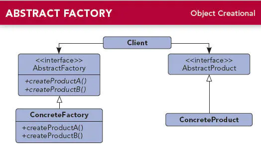

### 1.定义

为创建一组相关或者相互依赖的对象提供一个接口，而无需指定它们的具体类。

### 2.介绍

- 抽象工厂模式属于创建型模式。
- 工厂方法模式每个工厂只能创建一种类型的产品，而抽象工厂模式则能够创建多种类型的产品。
- 例如：硬盘工厂只生产硬盘这种产品，而电脑工厂则组合不同的硬盘、内存、CPU等生产出电脑来。

### 3.UML类图



#### 3.1 角色说明：

- AbstractProduct（抽象产品类）：定义产品的公共接口。
- ConcreteProduct（具体产品类）：定义产品的具体对象，实现抽象产品类中的接口。
- AbstractFactory（抽象工厂类）：定义工厂中用来创建不同产品的方法。
- ConcreteFactory（具体工厂类）：实现抽象工厂中定义的创建产品的方。

### 4.实现

##### 4.1 创建抽象产品类

定义公共接口：

```java
    //抽象产品类-- CPU
    public abstract class CPU {
        public abstract void showCPU();
    }
    //抽象产品类-- 内存
    public abstract class Memory {
        public abstract void showMemory();
    }
    //抽象产品类-- 硬盘
    public abstract class HD {
        public abstract void showHD();
    }
```

##### 4.2 创建具体产品类

继承Product类：

```java
    //具体产品类-- Intet CPU
    public class IntelCPU extends CPU {

        @Override
        public void showCPU() {
            System.out.println("Intet CPU");
        }
    }
    
    //具体产品类-- AMD CPU
    public class AmdCPU extends CPU {

        @Override
        public void showCPU() {
            System.out.println("AMD CPU");
        }
    }

    //具体产品类-- 三星 内存
    public class SamsungMemory extends Memory {

        @Override
        public void showMemory() {
            System.out.println("三星 内存");
        }
    }
    
    //具体产品类-- 金士顿 内存
    public class KingstonMemory extends Memory {

        @Override
        public void showMemory() {
            System.out.println("金士顿 内存");
        }
    }

    //具体产品类-- 希捷 硬盘
    public class SeagateHD extends HD {

        @Override
        public void showHD() {
            System.out.println("希捷 硬盘");
        }
    }

    //具体产品类-- 西部数据 硬盘
    public class WdHD extends HD {

        @Override
        public void showHD() {
            System.out.println("西部数据 硬盘");
        }
    }
```

##### 4.3 创建抽象工厂类

定义工厂中用来创建不同产品的方法：

```java
    //抽象工厂类，电脑工厂类
    public abstract class ComputerFactory {
        public abstract CPU createCPU();

        public abstract Memory createMemory();

        public abstract HD createHD();
    }
```

##### 4.4 创建具体工厂类

继承Factory类：

```java
    //具体工厂类--联想电脑
    public class LenovoComputerFactory extends ComputerFactory {

        @Override
        public CPU createCPU() {
            return new IntelCPU();
        }

        @Override
        public Memory createMemory() {
            return new SamsungMemory();
        }

        @Override
        public HD createHD() {
            return new SeagateHD();
        }
    }
    
    //具体工厂类--华硕电脑
    public class AsusComputerFactory extends ComputerFactory {

        @Override
        public CPU createCPU() {
            return new AmdCPU();
        }

        @Override
        public Memory createMemory() {
            return new KingstonMemory();
        }

        @Override
        public HD createHD() {
            return new WdHD();
        }
    }
    
    //具体工厂类--惠普电脑
    public class HpComputerFactory extends ComputerFactory {

        @Override
        public CPU createCPU() {
            return new IntelCPU();
        }

        @Override
        public Memory createMemory() {
            return new KingstonMemory();
        }

        @Override
        public HD createHD() {
            return new WdHD();
        }
    }
```

##### 4.5 测试方法

```java
    public void test() {
        System.out.println("--------------------生产联想电脑-----------------------");
        ComputerFactory lenovoComputerFactory = new LenovoComputerFactory();
        lenovoComputerFactory.createCPU().showCPU();
        lenovoComputerFactory.createMemory().showMemory();
        lenovoComputerFactory.createHD().showHD();

        System.out.println("--------------------生产华硕电脑-----------------------");
        ComputerFactory asusComputerFactory = new AsusComputerFactory();
        asusComputerFactory.createCPU().showCPU();
        asusComputerFactory.createMemory().showMemory();
        asusComputerFactory.createHD().showHD();
        
        System.out.println("--------------------生产惠普电脑-----------------------");
        ComputerFactory hpComputerFactory = new HpComputerFactory();
        hpComputerFactory.createCPU().showCPU();
        hpComputerFactory.createMemory().showMemory();
        hpComputerFactory.createHD().showHD();
    }
```

##### 输出结果为：

```java
--------------------生产联想电脑-----------------------
Intet CPU
三星 内存
希捷 硬盘
--------------------生产华硕电脑-----------------------
AMD CPU
金士顿 内存
西部数据 硬盘
--------------------生产惠普电脑-----------------------
Intet CPU
金士顿 内存
西部数据 硬盘
```

### 5.应用场景

- **生产多个产品组合的对象**时。

### 6.优点

- 代码解耦，创建实例的工作与使用实例的工作分开，使用者不必关心类对象如何创建。

### 7.缺点

- 如果增加新的产品,则修改抽象工厂和所有的具体工厂,违反了[开放封闭原则](https://www.jianshu.com/p/e6c02a54f447)

### 8.工厂方法模式与抽象工厂模式比较

- 在工厂方法模式中具体工厂负责生产具体的产品，每一个具体工厂对应一种具体产品，工厂方法具有唯一性。
- 抽象工厂模式则可以提供多个产品对象，而不是单一的产品对象。

