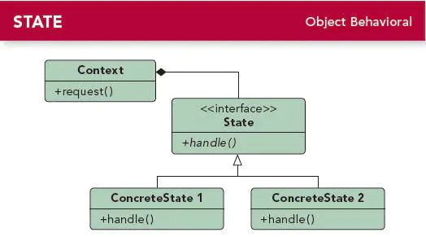

## 状态模式

### 1.定义

当一个对象的内在状态改变时允许改变其行为，这个对象看起来像是改变了其类。

### 2.介绍

- 状态模式属于行为型模式
- 状态模式中的行为是由状态来决定的，即不同状态下的行为也不同。
- 状态模式的结构跟策略模式的几乎一样，但其本质是不一样的。策略模式中的行为是彼此独立，能够相互替换的；而状态模式的行为是平行的，，不同状态下其行为也是不一样的，具有不可替换性。

### 3.UML类图



#### 3.1 角色说明：

- State（抽象状态角色）：抽象类或者接口，定义对象的各种状态和行为。
- ConcreteState（具体状态角色）：实现抽象角色类，定义了本状态下的行为，即要做的事情。
- Context（环境角色）：定义客户端需要的接口，并且负责具体状态的切换。

### 4.实现

继续以举追妹纸为例，单身狗状态下与恋爱状态下的行为是不一致的。

##### 4.1 创建抽象状态类

定义公共接口，比如定义一个人的行为有看电影和逛街：

```java
    public interface PersonState {
        void movies();//看电影

        void shopping();//逛街
    }
```

##### 4.2 创建具体状态类

实现抽象状态类的接口，比如人有单身狗和恋爱这两种状态：

```java
    public class DogState implements PersonState {//单身狗状态

        @Override
        public void movies() {
            System.out.println("一个人偷偷看岛国大片");
        }

        @Override
        public void shopping() {
            //单身狗逛条毛街啊
            //空实现
        }
    }

    public class LoveState implements PersonState {//恋爱状态

        @Override
        public void movies() {
            System.out.println("一起上电影院看大片~");
        }

        @Override
        public void shopping() {
            System.out.println("一起愉快的逛街去~");
        }
    }
```

##### 4.3 创建环境类

定义客户端需要的接口，以及负责状态的切换：

```java
    public class Context {
        private PersonState mPersonState;

        public void setPersonState(PersonState personState) {
            mPersonState = personState;
        }

        public void fallInLove() {
            System.out.println("恋爱了,陷入热恋状态:");
            setPersonState(new LoveState());
        }

        public void disappointmentInLove() {
            System.out.println("失恋了,变成单身狗状态:");
            setPersonState(new DogState());
        }

        public void movies() {
            mPersonState.movies();
        }

        public void shopping() {
            mPersonState.shopping();
        }
    }
```

##### 4.4 测试方法

```java
    public void test() {
        Context context = new Context();
        context.fallInLove();
        context.shopping();
        context.movies();
        context.disappointmentInLove();
        context.shopping();
        context.movies();
    }
```

##### 输出结果：

```java
恋爱了,陷入热恋状态:
一起愉快的逛街去~
一起上电影院看大片~
失恋了,变成单身狗状态:
一个人偷偷看岛国大片
```

### 5. 应用场景

- 对象的行为取决于其状态，随着状态改变时其行为也需改变
- 包含大量的与状态相关的条件判断语句时

### 6. 优点

- 每个状态都是一个子类，易于扩展和维护。
- 避免过多的条件语句，使得结构更清晰，提高代码的可维护性。

### 7. 缺点

- 可能会导致状态子类会过多