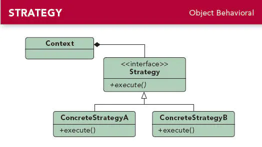

## 策略模式

### 1.定义

定义一系列的算法，把每一个算法封装起来,并且使它们可相互替换。策略模式模式使得算法可独立于使用它的客户而独立变化。

### 2.介绍

- 策略模式属于行为型模式。
- 策略模式提供了一组算法给客户端调用，使得客户端能够根据不同的条件来选择不同的策略来解决不同的问题。
- 如排序算法，可以使用冒泡排序、快速排序等等。

### 3.UML类图



#### 3.1 角色说明：

- Stragety(抽象策略类)：抽象类或接口，提供具体策略类需要实现的接口。
- ConcreteStragetyA、ConcreteStragetyB（具体策略类）：具体的策略实现，封装了相关的算法实现。
- Context（环境类）：用来操作策略的上下文环境。

### 4.实现

以追妹纸为例，遇到不同的妹纸追求的套路（策略）是不一样的。

##### 4.1 创建抽象策略类

定义公共接口，也就是追妹纸的过程：

```java
    public interface ChaseStragety {//追求策略
         void chase();//抽象追求方法
    }
```

##### 4.2 创建具体策略类

实现抽象策略类的接口，即具体的追求套路：

```java
    public class ShoppingStrategy implements ChaseStragety {

        @Override
        public void chase() {
            System.out.println("一起逛街咯~");
        }
    }

    public class MoviesStrategy implements ChaseStragety {

        @Override
        public void chase() {
            System.out.println("一起看电影咯~");
        }
    }

    public class EattingStrategy implements ChaseStragety {

        @Override
        public void chase() {
            System.out.println("一起吃饭咯~");
        }
    }
```

##### 4.3 创建环境类

用来操作不同的策略，不同的妹纸使用不同的策略，随机应变：

```java
    public class Context {
        
        private ChaseStragety chaseStragety;//定义抽象策略类
        
        public Context(ChaseStragety chaseStragety) {//构造方法传递具体策略对象过来
            this.chaseStragety = chaseStragety;
        }
        
        public void chase(){//执行具体策略对象的策略
            chaseStragety.chase();
        }
    }
```

##### 4.4 测试方法

```java
    public void test(){
        
        Context context;
        
        System.out.println("遇到爱逛街的妹子:");
        context=new Context(new ShoppingStrategy());
        context.chase();

        System.out.println("遇到爱看电影的妹子:");
        context=new Context(new MoviesStrategy());
        context.chase();

        System.out.println("遇到吃货妹子:");
        context=new Context(new EattingStrategy());
        context.chase();
        
    }
```

##### 输出结果：

```java
遇到爱逛街的妹子:
一起逛街咯~
遇到爱看电影的妹子:
一起看电影咯~
遇到吃货妹子:
一起吃饭咯~
```

策略模式就是这么简单了，但是追妹子可没这么简单哈~~

### 5. 应用场景

- 同一个问题具有不同算法时，即仅仅是具体的实现细节不同时，如各种排序算法等等。
- 对客户隐藏具体策略(算法)的实现细节，彼此完全独立；提高算法的保密性与安全性。
- 一个类拥有很多行为，而又需要使用if-else或者switch语句来选择具体行为时。使用策略模式把这些行为独立到具体的策略类中，可以避免多重选择的结构。

### 6. 优点

- 策略类可以互相替换
   由于策略类都实现同一个接口，因此他们能够互相替换。
- 耦合度低，方便扩展
   增加一个新的策略只需要添加一个具体的策略类即可，基本不需要改变原有的代码，符合**开闭原则**。
- 避免使用多重条件选择语句（if-else或者switch）。

### 7. 缺点

- 策略的增多会导致子类的也会变多
- 客户端必须知道所有的策略类，并自行决定使用哪一个策略类。

### 8. Android中的源码分析

之前我们用的`ListView`时都需要设置一个`Adapter`，而这个`Adapter`根据我们实际的需求可以用`ArrayAdapter`、`SimpleAdapter`等等，这里就运用到策略模式。

#### 8.1 ListView的简单用法

```java
    listView = (ListView)findViewById(R.id.list_view);
    
    //使用ArrayAdapter
    listView.setAdapter(new ArrayAdapter<String>(this,R.id.item,new String[] {"one","two"}));
    
     //使用BaseAdapter
    listView.setAdapter(new BaseAdapter() {
        @Override
        public int getCount() {
            return 0;
        }

        @Override
        public Object getItem(int position) {
            return null;
        }

        @Override
        public long getItemId(int position) {
            return 0;
        }

        @Override
        public View getView(int position, View convertView, ViewGroup parent) {
            return null;
        }
    });
```

#### 8.2 相关源码分析

```java
  public class ListView extends AbsListView {//相当于环境类
        @Override
        public void setAdapter(ListAdapter adapter) {//设置策略，即adapter
            //其他代码略
        }
    }

    public interface ListAdapter extends Adapter {//抽象策略接口
        
    }
    public abstract class BaseAdapter implements ListAdapter, SpinnerAdapter {//具体策略类BaseAdapter，实现ListAdapter接口
        
    }
    public class ArrayAdapter<T> extends BaseAdapter implements Filterable, ThemedSpinnerAdapter {//具体策略类ArrayAdapter，继承BaseAdapter，即实现ListAdapter接口
        
    }
```

#### 8.3 总结

- 通过设置不同的`Adapter`（即不同的策略），我们就可以写出符合我们需求的`ListView`布局。
- 另外，动画中的插值器（`ValueAnimator` 的 `setInterpolator` 方法）也是有运用到策略模式，有兴趣的可以去看下。