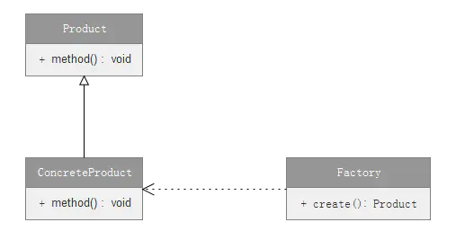

### 1.定义

定义一个用于创建对象的接口，让子类决定实例化哪个类。

### 2.介绍

- 简单工厂模式属于创建型模式。
- 简单工厂模式又叫做静态工厂方法模式。

### 3.UML类图



#### 3.1 角色说明：

- Product（抽象产品类）：要创建的复杂对象，定义对象的公共接口。
- ConcreteProduct（具体产品类）：实现Product接口。
- Factory（工厂类）：返回ConcreteProduct实例。

### 4.实现

##### 4.1 创建抽象产品类，定义公共接口：

```java
    //抽象产品类 
    public abstract class Product {
        public abstract void show();
    }
```

##### 4.2 创建具体产品类，继承Product类：

```java
    //具体产品类A 
    public class ProductA extends Product {
        @Override
        public void show() {
            System.out.println("product A");
        }
    }
    //具体产品类B
    public class ProductB extends Product {
        @Override
        public void show() {
            System.out.println("product B");
        }
    }
```

##### 4.3 创建工厂类，创建具体的产品：

```java
public class Factory {
    
    public static Product create(String productName) {
        Product product = null;
        //通过switch语句控制生产哪种商品
        switch (productName) {
            case "A":
                product = new ProductA();
                break;
            case "B":
                product = new ProductB();
                break;
        }
        return product;
    }
}
```

##### 4.4 测试方法：

```java
   public void test() {
        Factory.create("A").show();//生产ProductA
        Factory.create("B").show();//生产ProductB
        try {
            Factory.create("C").show();//生产ProductC
        } catch (NullPointerException e) {
            System.out.println("没有ProductC");//没有ProductC,会报错
        }
    }
```

### 5.应用场景

- 生成复杂对象时，确定只有一个工厂类，可以使用简单工厂模式。否则有多个工厂类的话，使用[工厂方法模式](https://www.jianshu.com/p/e6c02a54f447)。

### 6.优点

- 代码解耦，创建实例的工作与使用实例的工作分开，使用者不必关心类对象如何创建。

### 7.缺点

- 违背[开放封闭原则](https://www.jianshu.com/p/e6c02a54f447)，若需添加新产品则必须修改工厂类逻辑，会造成工厂逻辑过于复杂。
- 简单工厂模式使用了静态工厂方法，因此静态方法不能被继承和重写。
- 工厂类包含了所有实例（产品）的创建逻辑，若工厂类出错，则会造成整个系统都会会受到影响。

### 8.工厂方法模式与简单工厂模式比较

- 工厂方法模式有抽象工厂类，简单工厂模式没有抽象工厂类且其工厂类的工厂方法是静态的。
- 工厂方法模式新增产品时只需新建一个工厂类即可，符合**开放封闭原则**；而简单工厂模式需要直接修改工厂类，违反了**开放封闭原则**。

### 9.简单工厂模式的优化

由于简单工厂模式新增产品时需要直接修改工厂类，违反了开放封闭原则。因此可以使用反射来创建实例对象，确保能够遵循**开放封闭原则**。

##### 9.1 反射实现工厂类

```java
public class Factory {

    public static <T extends Product> T create(Class<T> clz) {
        Product product = null;
        try {
            product = (Product) Class.forName(clz.getName()).newInstance();//反射出实例
        } catch (Exception e) {
            e.printStackTrace();
        }
        return (T) product;
    }
}
```

##### 9.2 测试方法

```java
    public void test() {
        Factory.create(ProductA.class).show();//生产ProductA
        Factory.create(ProductB.class).show();//生产ProductB
    }
```

##### 9.3 总结

使用反射来实现工厂类，新增产品时无需修改工厂类，但是使用反射来创建实例对象的话会比正常使用new来创建的要慢。

