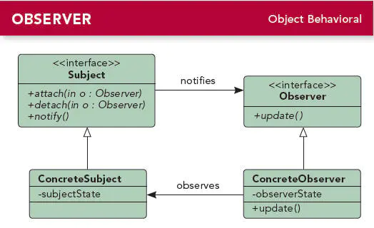

#### 1.定义

定义对象间的一种一个对多的依赖关系，当一个对象的状态发送改变时，所以依赖于它的对象都得到通知并被自动更新。

#### 2.介绍

- 观察者属于行为型模式。
- 观察者模式又被称作发布/订阅模式。
- 观察者模式主要用来解耦，将被观察者和观察者解耦，让他们之间没有没有依赖或者依赖关系很小。

#### 3.UML类图



##### 角色说明：

- Subject（抽象主题）：又叫抽象被观察者，把所有观察者对象的引用保存到一个集合里，每个主题都可以有任何数量的观察者。抽象主题提供一个接口，可以增加和删除观察者对象。
- ConcreteSubject（具体主题）：又叫具体被观察者，将有关状态存入具体观察者对象；在具体主题内部状态改变时，给所有登记过的观察者发出通知。
- Observer (抽象观察者):为所有的具体观察者定义一个接口，在得到主题通知时更新自己。
- ConcrereObserver（具体观察者）：实现抽象观察者定义的更新接口，当得到主题更改通知时更新自身的状态。

#### 4.实现

继续以送快递为例，快递员有时只是把快递拉到楼下，然后就通知收件人下楼去取快递。

##### 4.1 创建抽象观察者

定义一个接到通知的更新方法，即收件人收到通知后的反应：

```java
    public interface Observer {//抽象观察者
        public void update(String message);//更新方法
    }
```

##### 4.2 创建具体观察者

实现抽象观察者中的方法，这里创建两个类，一个男孩类和一个女孩类，定义他们收到通知后的反应：

```java
    public class Boy implements Observer {

        private String name;//名字
        public Boy(String name) {
            this.name = name;
        }
        @Override
        public void update(String message) {//男孩的具体反应
            System.out.println(name + ",收到了信息:" + message+"屁颠颠的去取快递.");
        }
    }

    public class Girl implements Observer {

        private String name;//名字
        public Girl(String name) {
            this.name = name;
        }
        @Override
        public void update(String message) {//女孩的具体反应
            System.out.println(name + ",收到了信息:" + message+"让男朋友去取快递~");
        }
    }
```

##### 4.3  创建抽象主题

即抽象被观察者，定义添加，删除，通知等方法：

```java
    public interface  Observable {//抽象被观察者
         void add(Observer observer);//添加观察者
 
         void remove(Observer observer);//删除观察者
    
         void notify(String message);//通知观察者
    }
```

##### 4.4 创建具体主题

即具体被观察者，也就是快递员，派送快递时根据快递信息来通知收件人让其来取件：

```java
    public class Postman implements  Observable{//快递员
        
        private List<Observer> personList = new ArrayList<Observer>();//保存收件人（观察者）的信息
        @Override
        public void add(Observer observer) {//添加收件人
            personList.add(observer);
        }

        @Override
        public void remove(Observer observer) {//移除收件人
            personList.remove(observer);

        }

        @Override
        public void notify(String message) {//逐一通知收件人（观察者）
            for (Observer observer : personList) {
                observer.update(message);
            }
        }
    }
```

##### 4.5 客户端测试

```java
    public void test(){
        Observable postman=new Postman();
        
        Observer boy1=new Boy("路飞");
        Observer boy2=new Boy("乔巴");
        Observer girl1=new Girl("娜美");

        postman.add(boy1);
        postman.add(boy2);
        postman.add(girl1);
        
        postman.notify("快递到了,请下楼领取.");
    }
```

##### 输出结果：

```java
路飞,收到了信息:快递到了,请下楼领取.屁颠颠的去取快递.
乔巴,收到了信息:快递到了,请下楼领取.屁颠颠的去取快递.
娜美,收到了信息:快递到了,请下楼领取.让男朋友去取快递~
```

##### 4.6 说明：

实际上，JDK内部也内置了Observable（抽象被观察者），Observer（抽象观察者）这两个类，我们也可以直接拿来用，其代码如下：

```java
public interface Observer {//（抽象观察者
    //只定义了一个update方法
    void update(Observable o, Object arg);
}

public class Observable {//抽象被观察者
    private boolean changed = false;//定义改变状态，默认为false
    private final ArrayList<Observer> observers;//定义一个观察者list

    public Observable() {//构造函数，初始化一个观察者list来保存观察者
        observers = new ArrayList<>();
    }
    //添加观察者，带同步字段的，所以是线程安全的
    public synchronized void addObserver(Observer o) {
        if (o == null)
            throw new NullPointerException();
        if (!observers.contains(o)) {
            observers.add(o);
        }
    }

    //删除观察者
    public synchronized void deleteObserver(Observer o) {
        observers.remove(o);
    }

    //通知所以观察者，无参数
    public void notifyObservers() {
        notifyObservers(null);
    }

     //通知所有观察者，带参数
    public void notifyObservers(Object arg) {

        Observer[] arrLocal;
        //加synchronized字段，保证多线程下操作没有问题
        synchronized (this) {
            if (!hasChanged())//这里做了是否发生改变的判断，是为了防止出现无意义的更新
                return;

            arrLocal = observers.toArray(new Observer[observers.size()]);//ArrayList转换成一个临时的数组，这样就防止了通知，添加，移除同时发生可能导致的异常
            clearChanged();///清除改变状态，设置为false
        }
        //遍历逐一通知
        for (int i = arrLocal.length-1; i>=0; i--)
            arrLocal[i].update(this, arg);
    }

    //清楚所有观察者
    public synchronized void deleteObservers() {
        observers.clear();
    }

    //设置被观察者为改变状态，设置为true
    protected synchronized void setChanged() {
        changed = true;
    }

    //清除改变状态，设置为false
    protected synchronized void clearChanged() {
        changed = false;
    }

    //返回当前的改变状态
    public synchronized boolean hasChanged() {
        return changed;
    }

    //观察者数量
    public synchronized int countObservers() {
        return observers.size();
    }
}
```

### 5. 应用场景

- 当一个对象的改变需要通知其它对象改变时，而且它不知道具体有多少个对象有待改变时。
- 当一个对象必须通知其它对象，而它又不能假定其它对象是谁
- 跨系统的消息交换场景，如消息队列、事件总线的处理机制。

### 6. 优点

- 解除观察者与主题之间的耦合。让耦合的双方都依赖于抽象，而不是依赖具体。从而使得各自的变化都不会影响另一边的变化。
- 易于扩展，对同一主题新增观察者时无需修改原有代码。

### 7. 缺点

- 依赖关系并未完全解除，抽象主题仍然依赖抽象观察者。
- 使用观察者模式时需要考虑一下开发效率和运行效率的问题，程序中包括一个被观察者、多个观察者，开发、调试等内容会比较复杂，而且在Java中消息的通知一般是顺序执行，那么一个观察者卡顿，会影响整体的执行效率，在这种情况下，一般会采用异步实现。
- 可能会引起多余的数据通知。

### 8. Android中的源码分析

#### 8.1 控件中Listener监听方式

Android中我们遇到的最常用的观察者模式就是各种控件的监听,如下:

```java
        Button button = (Button) findViewById(R.id.button);
        //注册观察者
        button.setOnClickListener(new View.OnClickListener() {
            //观察者实现
            @Override
            public void onClick(View arg0) {
                Log.d("test", "Click button ");
            }
        });
```

上面代码中，`button`就是具体的主题，也就是被观察者；`new`出来的`View.OnClickListenerd`对象就是具体的观察者;`OnClickListener`实际上就是个接口，也就是抽象观察者；通过`setOnClickListener`把观察者注册到被观察者中。

一旦`button`捕获的点击事件，即状态发生变化的时候，就会通过回调注册的`OnClickListener`观察者的`onClick`方法会来通知观察者，`Button`状态发生变化。。

相关源码分析：

```java
    public interface OnClickListener {//抽象观察者

        void onClick(View v);//只有onClick这个方法
    }

    //注册观察者
    public void setOnClickListener(@Nullable View.OnClickListener l) {
        if (!isClickable()) {
            setClickable(true);//设置为可点击
        }
        getListenerInfo().mOnClickListener = l;//把传入的 OnClickListener 对象赋值给了 getListenerInfo().mOnClickListener,即mListenerInfo的mOnClickListener持有OnClickListener对象的引用
    }

    ListenerInfo getListenerInfo() {//返回ListenerInfo对象,这里是一个单例模式
        if (mListenerInfo != null) {
            return mListenerInfo;
        }
        mListenerInfo = new ListenerInfo();
        return mListenerInfo;
    }

    public boolean performClick() {//执行点击事件
        final boolean result;
        final ListenerInfo li = mListenerInfo;
        if (li != null && li.mOnClickListener != null) {
            playSoundEffect(SoundEffectConstants.CLICK);
            li.mOnClickListener.onClick(this);//执行onClick方法,li.mOnClickListener即OnClickListener对象
            result = true;
        } else {
            result = false;
        }

        sendAccessibilityEvent(AccessibilityEvent.TYPE_VIEW_CLICKED);
        return result;
    }
```

#### 8.2 Adapter的notifyDataSetChanged()方法

当我们使用`ListView`时，需要更新数据时我们就会调用`Adapter`的`notifyDataSetChanged()`方法，那么我们来看看`notifyDataSetChanged()`的实现原理，这个方法是定义在`BaseAdaper`中，具体代码如下：

```java
public abstract class BaseAdapter implements ListAdapter, SpinnerAdapter {
     //数据集被观察者
    private final DataSetObservable mDataSetObservable = new DataSetObservable();

    //注册观察者
    public void registerDataSetObserver(DataSetObserver observer) {
        mDataSetObservable.registerObserver(observer);
    }
    //注销观察者
    public void unregisterDataSetObserver(DataSetObserver observer) {
        mDataSetObservable.unregisterObserver(observer);
    }
    //数据集改变时，通知所有观察者
    public void notifyDataSetChanged() {
        mDataSetObservable.notifyChanged();
    }
}
    //其他代码略
```

由上面的代码可以看出`BaseAdapter`实际上就是使用了观察者模式，`BaseAdapter`就是具体的被观察者。接下来看看 `mDataSetObservable.notifyChanged()`的实现：

```java
//数据集被观察者
public class DataSetObservable extends Observable<DataSetObserver> {
   
    public void notifyChanged() {
        synchronized(mObservers) {
            //遍历所有观察者，并调用他们的onChanged()方法
            for (int i = mObservers.size() - 1; i >= 0; i--) {
                mObservers.get(i).onChanged();
            }
        }
    }

    //其他代码略
}
```

现在我们看到了有观察者的影子，那么这些观察者是从哪里来的呢？实际上这些观察者是在`ListView`通过`setAdaper()`设置Adaper时产生的：

```java
public class ListView extends AbsListView {
    //其他代码略
    
    public void setAdapter(ListAdapter adapter) {
        //如果已存在Adapter，先注销该Adapter的观察者
        if (mAdapter != null && mDataSetObserver != null) {
            mAdapter.unregisterDataSetObserver(mDataSetObserver);
        }
        
        //其他代码略
        
        super.setAdapter(adapter);

        if (mAdapter != null) {
            mAreAllItemsSelectable = mAdapter.areAllItemsEnabled();
            mOldItemCount = mItemCount;
            mItemCount = mAdapter.getCount();//获取Adapter中的数据的数量
            checkFocus();

            mDataSetObserver = new AdapterDataSetObserver();//创建一个数据集观察者
            mAdapter.registerDataSetObserver(mDataSetObserver);//注册观察者

           //其他代码略
        } 
    }
}
```

从上面的代码可以看到，观察者有了，那么这个观察者主要是干什么的呢？

```java
class AdapterDataSetObserver extends AdapterView<ListAdapter>.AdapterDataSetObserver {
        @Override
        public void onChanged() {
            super.onChanged();//调用父类的onChanged()方法
            if (mFastScroller != null) {
                mFastScroller.onSectionsChanged();
            }
        }

       //其他代码略
    }
```

`AdapterDataSetObserver`类中的`onChanged()`方法没看出啥，继续看他父类的`onChanged()`方法：

```java
class AdapterDataSetObserver extends DataSetObserver {
        private Parcelable mInstanceState = null;
        //观察者的核心实现
        @Override
        public void onChanged() {
            mDataChanged = true;
            mOldItemCount = mItemCount;
            mItemCount = getAdapter().getCount();//获取Adapter中的数据的数量
            if (AdapterView.this.getAdapter().hasStableIds() && mInstanceState != null
                    && mOldItemCount == 0 && mItemCount > 0) {
                AdapterView.this.onRestoreInstanceState(mInstanceState);
                mInstanceState = null;
            } else {
                rememberSyncState();
            }
            checkFocus();
            //重新布局
            requestLayout();
        }

       //其他代码略
    }
```

最终就是在`AdapterDataSetObserver`这个类里面的`onChanged()`方法中实现了布局的更新。

简单总结：

- 当`ListView`的数据发生变化时，我们调用`Adapter`的`notifyDataSetChanged()`方法，这个方法又会调用所有观察者（`AdapterDataSetObserver`）的`onChanged()`方法，`onChanged()`方法又会调用`requestLayout()`方法来重新进行布局。

#### 8.3 BroadcastReceiver

`BroadcastReceiver`作为Android的四大组件之一,实际上也是一个典型的观察者模式.通过`sendBroadcast`发送广播时,只有注册了相应的`IntentFilter`的`BroadcastReceiver`对象才会收到这个广播信息,其`onReceive`方法才会被调起.`BroadcastReceiver`的代码比较复杂,这里就不展开了.先挖个坑,后面也会出`BroadcastReceiver`的相关源码分析.

#### 8.4 其他

另外,一些著名的第三方事件总线库,比如RxJava、RxAndroid、EventBus、otto等等,也是使用了观察者模式.有兴趣的可以去看下他们的源码.