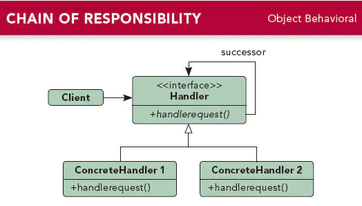

#### 1.定义

一个请求沿着一条“链”传递，直到该“链”上的某个处理者处理它为止。

#### 2.介绍

- 责任链模式属于行为型模式。
- 多个对象中，每个对象都持有下一个对象的引用，这就构成了链这种结构。
- 一个请求通过链的头部，一直往下传递到链上的每一个结点，直到有某个结点对这个请求做出处理为止，这就是责任链模式。
- 责任链模式一般分为处理者与请求者。具体的处理者分别处理请求者的行为。

#### 3.UML类图



##### 角色说明：

- Handler（抽象处理者）：抽象类或者接口,定义处理请求的方法以及持有下一个Handler的引用.
- ConcreteHandler1,ConcreteHandler2（具体处理者）：实现抽象处理类,对请求进行处理,如果不处理则转发给下一个处理者.
- Client (客户端):即要使用责任链模式的地方。

#### 4.实现

以送快递为例，单个快递员只负责某个片区的快递，若某个快递目的地不属于当前的片区，则交给下一个快递员来处理，直到有人处理为止。

##### 4.1 创建抽象处理者类

定义处理请求的方法以及持有下一个Handler的引用：

```java
    public abstract class Postman {//快递员抽象类
        protected Postman nextPostman;//下一个快递员

        public abstract void handleCourier(String address);//派送快递
    }
```

##### 4.2 创建具体处理者类

实现抽象处理者类中的方法：

```java
    public class BeijingPostman extends Postman {//北京快递员

        @Override
        public void handleCourier(String address) {
            if (address.equals("Beijing")) {//北京地区的则派送
                System.out.println("派送到北京");
                return;
            } else {//否则交给下一个快递员去处理
                nextPostman.handleCourier(address);
            }
        }
    }

    public class ShanghaiPostman extends Postman {//上海快递员

        @Override
        public void handleCourier(String address) {
            if (address.equals("Shanghai")) {
                System.out.println("派送到上海");
                return;
            } else {
                nextPostman.handleCourier(address);
            }
        }
    }

    public class GuangzhouPostman extends Postman {//广州快递员

        @Override
        public void handleCourier(String address) {
            if (address.equals("Guangzhou")) {
                System.out.println("派送到广州");
                return;
            } else {
                if (nextPostman != null)
                    nextPostman.handleCourier(address);
            }
        }
    }
```

##### 4.3 客户端测试

```java
    public void test() {
        //创建不同的快递员对象
        Postman beijingPostman = new BeijingPostman();
        Postman shanghaiPostman = new ShanghaiPostman();
        Postman guangzhouPostman = new GuangzhouPostman();
        
        //创建下一个结点
        beijingPostman.nextPostman=shanghaiPostman;
        shanghaiPostman.nextPostman=guangzhouPostman;

        //处理不同地区的快递，都是从首结点北京快递员开始
        System.out.println("有一个上海快递需要派送:");
        beijingPostman.handleCourier("Shanghai");
        System.out.println("有一个广州快递需要派送:");
        beijingPostman.handleCourier("Guangzhou");
        System.out.println("有一个美国快递需要派送:");
        beijingPostman.handleCourier("America");
        
    }
```

##### 输出结果：

```java
有一个上海快递需要派送:
派送到上海
有一个广州快递需要派送:
派送到广州
有一个美国快递需要派送:
```

##### 4.4 说明：

- 上面的请求只是一个简单的地址字符串，如果是一些复杂的请求，可以封装成独立的对象。如：普通快递和生鲜快递，生鲜快递还需快递员做冷链处理等等。
- 请求实际上可以从责任链中的任意结点开始，即可以从上海快递员开始处理也行；
- 责任链中的结点顺序实际也可以调整，即北京->广州->上海的顺序也行；
- 责任链也可以越过某些结点去处理请求，如北京->广州，越过了上海。
- 对于请求，只有两种结果：一是某个结点对其进行了处理，如上面例子的上海、广州快递，这种叫纯的责任链；另一个则是所有结点都不进行处理，如美国的快递，这种叫不纯的责任链。我们所见到的基本都是不纯的责任链。

### 5. 应用场景

- 多个对象处理同一请求时，但是具体由哪个对象去处理需要运行时做判断。
- 具体处理者不明确的情况下，向这组对象提交了一个请求。

### 6. 优点

- 代码的解耦，请求者与处理者的隔离分开。
- 易于扩展，新增处理者往链上加结点即可。

### 7. 缺点

- 责任链过长的话，或者链上的结点判断处理时间太长的话会影响性能，特别是递归循环的时候。
- 请求有可能遍历完链都得不到处理。

### 8. Android中的源码分析

- Android中的事件分发机制就是类似于责任链模式，关于事件分发机制，这里先不详述了，先占个坑，后面另起文章说明。
- 另外，OKhttp中对请求的处理也是用到了责任链模式，有兴趣的可以去看下OKhttp的源码。后面有时间也会对OKhttp的源码进行分析。