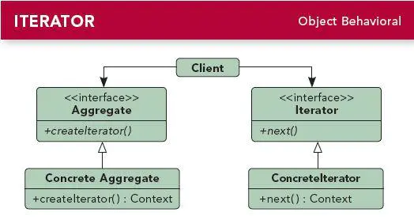

### 1.定义

提供一种方法访问一个容器对象中各个元素，而又不需暴露该对象的内部细节。

### 2.介绍

- 迭代器模式属于行为型模式。
- 迭代器（Iterator）模式，又叫做游标（Cursor）模式。
- Java中的Map、List等等容器，都使用到了迭代器模式。

### 3.UML类图



迭代器模式UML类图.jpg

角色说明：

- Iterator（迭代器接口）：负责定义、访问和遍历元素的接口。
- ConcreteIterator（具体迭代器类）:实现迭代器接口。
- Aggregate（容器接口）：定义容器的基本功能以及提供创建迭代器的接口。
- ConcreteAggregate（具体容器类）：实现容器接口中的功能。
- Client（客户端类）：即要使用迭代器模式的地方。

### 4.实现

继续以快递举例子，货架上有很多快递包，取快递时我们报出手机号，然后快递小哥就遍历货架上所有的快递信息，直到找出快递包为止：

#### 4.1 创建迭代器接口

```java
    public interface Iterator {

        boolean hasNext();    //是否存在下一条记录

        Object next();        //返回当前记录并移到下一条记录
    }
```

#### 4.2 创建容器接口

定义容器的基本功能以及提供创建迭代器的接口：

```java
     public interface Aggregate {
      
        int size();//容器大小

        String get(int location);//获取获取中指定位置的号码

        void add(String tel);//添加号码到容器中

        void remove(String tel);//从容器中移除号码
        
        Iterator iterator();//返回容器的迭代器
    }
```

#### 4.3 创建具体迭代器类

实现迭代器接口：

```java
    //快递迭代类
    public class DeliveryIterator implements Iterator {
        private Aggregate aggregate;//容器对象
        private int index;//当前索引

        public DeliveryIterator(Aggregate aggregate) {
            this.aggregate = aggregate;//初始化容器对象
        }

        @Override
        public boolean hasNext() {//是否存在下一条记录
            if (index < aggregate.size()) {
                return true;
            } else {
                return false;
            }
        }

        @Override
        public Object next() {//返回当前记录并移到下一条记录
            return aggregate.get(index++);
        }
    }
```

#### 4.4 创建具体容器类

实现容器接口中的功能：

```java
    //快递容器类
    public class DeliveryAggregate implements Aggregate {
        private List<String> list = new ArrayList<>();//内部使用list来存储数据

        public int size() {//容器大小
            return list.size();
        }

        public String get(int location) {
            return list.get(location);
        }

        public void add(String tel) {
            list.add(tel);
        }

        public void remove(String tel) {
            list.remove(tel);
        }

        @Override
        public Iterator iterator() {////返回迭代器
            return new DeliveryIterator(this);
        }
    }
```

#### 4.5 客户端测试

```java
     public void test() {
        Aggregate aggregate=new DeliveryAggregate();
        aggregate.add("1111");
        aggregate.add("2222");
        aggregate.add("3333");
        aggregate.add("9527");

        Iterator iterator = aggregate.iterator();
        while (iterator.hasNext()){
            String tel = (String) iterator.next();
            System.out.println("当前号码为："+tel);
        }
        System.out.println("后面没有了");
    }
```

#### 输出结果：

```java
当前号码为：1111
当前号码为：2222
当前号码为：3333
当前号码为：9527
后面没有了
```

### 5. 应用场景

- 遍历一个容器对象时。
- 实际我们开发中很少使用到迭代器模式。虽然不怎么用得到，但是了解其原理能够让我们在看到相关的源码（如Java中的Map、List等等容器）时能够更容易了解源码的相关思想。

### 6. 优点

- 可以支持以不同的方式去遍历容器对象，如顺序遍历，逆序遍历等等。
- 符合单一职责原则，容器类与遍历算法的分离，不同类负责不同的功能。

### 7. 缺点

- 会产生多余的对象，消耗内存。
- 会增多类文件。
- 遍历过程是一个单向且不可逆的遍历。
- 遍历过程需要注意容器是否改变，若期间改变了，可能会抛出异常。

### 8. Android中的源码分析

除了Java中的Map、List等有用到迭代器模式之外，Android中使用数据库查询时返回的Cursor游标对象，实际上就是使用了迭代器模式来实现，首先先让我们来看下怎么使用Cursor：

#### 8.1 使用Cursor

```java
        Cursor cursor = sqLiteDatabase.query("table", null, null, null, null, null, null);//各种参数请自行查询用法，这里就不说明了
        if (cursor.moveToFirst()) {//游标指向第一行
            do {
                cursor.getInt(0);//获得第一列数据
                cursor.getString(1);//获得第二列数据
            } while (cursor.moveToNext());//移到下一行
        }
```

#### 8.2 Cursor源码

```java
//Cursor是一个接口，实际上就是迭代器接口
public interface Cursor extends Closeable {
    //其他代码略
    boolean moveToFirst();
    int getInt(int columnIndex);
    String getString(int columnIndex);
    boolean moveToNext();
}
```

从上面代码可以看出Cursor游标实际上就是个迭代器。

#### 8.3 其他

有兴趣的可以去看下Java中的Map、List等的源码，那个更直观简单。